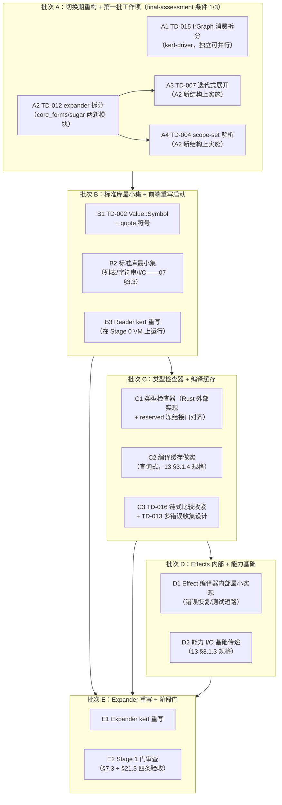

# Stage 1 阶段计划（自举验证启动）

> **Author**: Super Z（PM-A/ARCH-A/PL-A 联合）
> **Date**: 2026-09-10
> **Version**: v0.2.0
> **Status**: Active
> **输入**: sop.md §21（阶段推进规划）、§17（任务规划排版图）、§18（依赖审查）、§13.1（设计对齐）、§4（MUV）；[12-roadmap §1.2/§2.5](../../lang-design/12-roadmap.md)；[07-自举策略 §3.3](../../lang-design/07-bootstrap-strategy.md)；[stage-0/final-assessment](../stage-0/final-assessment.md)（GO 判定 + 四条件）
> **上游**: Stage 0 r3（297 测试基线 / Gate R2 PASS / 外循环 100% / §14.6 GO）

---

## 1. §21 阶段规划确认

| 项 | 裁定 | 依据 |
|---|---|---|
| 核心目标 | **自举验证**：目标语言子集表达编译器前端 + 类型检查器 | sop.md §21.1 / 12-roadmap §1.2 |
| 实现语言 | Rust ~70% + kerf ~30%（VM/工具链/类型检查器保持 Rust；Reader/Expander/基础宏定义用 kerf 重写） | §21.4 / 07 §3.2 混合期构成 |
| 后端策略 | Stage 0 VM 承载（MAX_FRAMES 10^5 / GC 冷却 / 堆栈追踪复用）；LLVM 永不进自举链 | §21.2 核心约束 1 |
| 代码量 | ~8000 行（本计划分五批次交付） | §21.1 |
| 工程节奏 | 4-8 周估算；前半程重写 + 后半程类型检查器（12-roadmap §2.5.3 时间线） | §21.8 双口径 |

**§21.3 Stage 1 验收标准**（阶段门，全部满足才可进入 Stage 2）：
1. 目标语言子集能表达编译器前端（07 §3.3 信号：新语言子集能表达所有编译器前端逻辑）
2. 在 Stage 0 VM 上正确运行
3. 标准库最小集可用（列表操作/字符串处理/基本 I/O）
4. 增量编译基础设施可用

**阻塞项与缓解**（§21.6）：类型检查循环依赖 → **外部 Rust 实现类型检查器，Stage 2+ 再迁移**（本计划批次 C 直接采用）。

**§21.5 切换信号核对**（Stage 0→1，全部满足——07 §3.3 四项 + final-assessment §4 GO）：
9 原语语义稳定（297 测试/R1-R9/T1 双路径）✅ / 编译器正确编译全部测试用例（Gate R2 PASS）✅ / 宏展开器正常（卫生 P1 + 宏调宏）✅ / ≥100 测试（297 ≫ 100）✅

## 2. §13.1 设计对齐（lang-design → Stage 1 需求映射）

| lang-design 文档（v5.2） | Stage 1 消费点 | 对齐结论 |
|---|---|---|
| 12-roadmap §1.2 + §2.5 演进矩阵 | 本计划 §3 排版图的能力列直接来源 | 逐行核对（见 §3 Step 1） |
| 07-bootstrap §3.2 混合期构成 | 批次 B 的重写范围边界（Reader/Expander/基础宏 = kerf；VM/构建/测试运行器/基准/调试 = Rust） | 边界明确无歧义 |
| 07-bootstrap §3.3 切换信号 | 阶段门判据（上文 §1） | 4+4 信号双清单就位 |
| 02-syntax-model | TD-004（scope-set）语义锚——`ScopeSet` 全程携带已就位 | 数据结构就绪，解析侧待升级 |
| 03-macro-system §2.2 | TD-007（MAX_EXPANSION_DEPTH=128 校准注记）+ §2.4 卫生契约 | 展开深度解除的契约边界 |
| 03-macro-system §1.1 | TD-012 拆分的职责边界（核心形式/糖推导/相位驱动） | 三模块拆分方案已冻结于登记册 |
| 04-bytecode-vm | TD-015（compile_source 消费拆分）双路径互查链 | 消费方：`ir`/`code` 子命令 |
| 09-stdlib | 批次 B 标准库最小集（24 内置对账基线） | 基线就绪 |
| 13-capability-matrix §3.1.3 | 能力模型 I/O 基础传递（批次 D）行为规格 | P2 规格完整可直接实现 |
| 13-capability-matrix §3.1.4 | 编译缓存做实（批次 C）get/store/invalidate 规格 | 同上 |

**对齐结论**：lang-design v5.2 对 Stage 1 需求**无缺口阻塞**——TD-004/007/012/015 均有显式契约锚点；能力演进矩阵 Stage 1 列 12 行全部有设计依据。

## 3. §17 任务规划排版图（七步流程）

### Step 1 扫描结果（§17.2 强制扫描）

- **设计意图摘要**：Stage 1 用 kerf 子集重写编译器前端（Reader/Expander/基础宏），在 Stage 0 VM 上运行，验证"语言能表达自身前端"的自举命题；类型检查器按风险缓解用 Rust 外部实现；四个预留能力中 Effects 做实到编译器内部、编译缓存做实查询式、能力 I/O 做实基础传递。
- **技术债状态**：TD-002~018 开放 16 项——本阶段绑定偿还 5 项（004/007/012/013/015）+联动 2 项（016 类型检查器联动、017 eval 深度对齐）；其余按登记册目标阶段分布。
- **校准基线**：L3 轮次按「问题簇」计轮（calibration-data §2）；单人 Agent 会话 L3 全量偏高 → 本阶段按批次推进，每批次独立内循环。
- **能力边界**（v0.1-capability-boundaries）：支持 9 原语 + 10 糖 + syntax-rules + 20 内置 + 闭包 + 递归 + module；显式不支持（报错）：quote 符号/向量、TCO、字符串序、闭包序对元素、非头 define、非 bool 条件。**Stage 1 需扩展**：TD-002（quote 符号 → Value::Symbol，批次 B 顺带——std 符号操作前置）。
- **测试矩阵**：297:0:1（130 单元 + 167 集成 + 审计 41 case）；正负比 ≈1:3.2。
- **上一阶段输出**：final-assessment GO（四条件绑定批次 A/B/C——见 §5 处置映射）。
- **路线图对齐**：v0.5-roadmap 第 2 行（Stage 1 自举验证，本计划即该行的展开）。

### Step 2-4 任务依赖图 + 节点流（DAG 拓扑排序）

**拓扑序**：A1 ∥ A2 → (A3 ∥ A4) → B1 → B2 → B3 → C1 → C2 → C3 → D1 → D2 → E1 → E2。
批次 A/B 主线串行、批次 A 内部可并行；批次 C/D 依赖 B 的标准库（类型检查器消费 kerf 程序）；批次 E 收口。

### Step 5 设计-开发-测试节点流（每 MUV 三位一体）

每个任务节点内固定三层递进（§9.4）：
`设计锚（lang-design §）→ 开发（crate/模块 + §10 命名 + §11 隔离）→ 测试（正例 ≥1 + 负例 ≥3 + 集成锚点）`。

### Step 6 缺陷纳入（修复任务节点）

- Stage 0 遗留绑定项即批次 A 的 A1-A4（缺陷→修复任务直接转化，无额外扫描缺陷）。
- TD-017（eval 深度不对称）：批次 C 顺带裁定（类型检查器引入后重新评估 eval 路径角色——12-roadmap §2.5 矩阵行 3：eval 在 Stage 2 被编译器替换）。
- 执行中新发现缺陷 → 当轮内循环修复（§5.2），P3 记登记册。

### Step 7 审查结论

排版图 DAG 无环（拓扑序存在）；能力矩阵 12 行 Stage 1 列全部映射到批次节点；GO 四条件全部落位（条件 1 → A3/A4；条件 2 → C3；条件 3 → A1/A2；条件 4 → C3）。**审查通过，进入阶段执行。**

## 4. §18 依赖与基础设施审查

| # | 审查项 | 结论 |
|---|---|---|
| 1 | 基础设施能力 | Stage 0 VM（MAX_FRAMES 10^5）/GC/诊断/Span 全管线就绪，可承载 kerf 子集前端重写 ✅；SymbolTable/ScopeSet 数据结构全程携带（TD-004 前置就绪）✅ |
| 2 | 前置项完整性 | Stage 0 九 crate DAG（24+9+1dev 边无环，architecture-review §D1）+ 40 操作码冻结 + 双路径 T1 一致——前置设计/开发/测试三要素完备 ✅ |
| 3 | 其他依赖问题 | ① 测试线程栈 2MiB 约束（A3 迭代式展开的深度验收须在默认线程栈内通过——TD-017 关联）；② kerf 子集表达力边界（B3 前须确认 VM 值模型支持 Reader 所需数据结构——序对/字符串/整数即足）③ reserved 冻结接口与批次 C/D 的签名一致性（13 §3.1 规格） |
| 4 | 全面审查 | 上述三项均非阻塞：①为验收环境约束（工作表化后天然解除）；②经 02-syntax-model §6 Reader 框架核对，值模型（Pair/Str/Int/Float/Bool/Nil + 闭包）满足前端重写表达需求；③reserved.rs 签名已回填 v5.2（deep-review R1 偏差 #13 修复） |

**结论**：依赖完整，无缺失项——批次 A 可立即执行。

## 5. §4 MUV 拆分（六字段）

### 批次 A（本会话执行——切换期重构 + 第一批工作项）

| 字段 | A1（TD-015） | A2（TD-012） | A3（TD-007） | A4（TD-004） |
|---|---|---|---|---|
| 输入条件 | Task 19 本计划 | Task 19 本计划 | A2 完成 | A2 完成 |
| 输出物 | kerf-driver 编译入口分流（`compile_source` 按消费方拆分） | kerf-expander 三模块（expander 主控 + core_forms + sugar） | 展开工作表化 + 深度上限 128→文档口径 10_000 | 编译器/展开器 (name, scopes⊆) 绑定解析 + 卫生回退降级为回退路径 |
| 验收标准 | `ir`/`code` 子命令输出字节级不变；run/eval 不再旁路计算 IrGraph；297 基线等价通过 | 拆分前后 297 测试逐一等价（零断言修改）；单文件 ≤700 行 | 10_000 深嵌套宏实测通过（默认 2MiB 线程栈）；超限负例报 E 错非栈溢出 | Racket 式语义锚点测试 ≥6（含 3 负例）；宏卫生簇全绿；双路径一致 |
| 集成验证用例 | `kerf ir`/`kerf code`/`kerf run` 三命令端到端 | expander 全套件回归即集成验证 | 深嵌套宏→编译→VM 执行端到端（200 层链双路径） | —（重排） |
| 责任 Agent | DEV-A | DEV-A | DEV-A | —（重排） |
| Task ID | 20-b | 20-a | 20-c | —（重排） |

**A4 重排注记**（2026-09-10 执行中裁定，依据 §1.2.1 复杂度只升不降 + §12 最优>最小）：
执行中确认 TD-004 完整实现 = 绑定形式 scope 注入基建 + `CoreExpr::VarRef` 携带 ScopeSet（中枢类型变更，波及 expander/compiler/eval/CodeValue/IR 全链）+ 双路径（VM slot 解析与 eval Env 查找）解析体系切换——保守 ≥800 LOC 跨 5+ crate，超出单 MUV 容量（§4.2 L3 MUV 指导上限）。替代方案（无行为变化的平行 scope 匹配解析器）违背 §11 接口隔离与 §12 最优>最小（死代码 + 双体系漂移风险）。**裁定移批次 B 头部**：与 TD-002 符号值、标准库最小集同批（绑定表基建与符号类型同为解析体系前置），完整交付于批次 E Expander 重写时收口。

### 批次 B-E（后续会话推进，本会话不实现）

| 批次 | MUV 序列 | 关键验收 | Task ID 起 |
|---|---|---|---|
| B | **TD-004 scope-set 解析（A4 重排——绑定表基建 + VarRef scope 桥 + 双路径解析切换）** → TD-002 符号值 ✅（22-a，r5）→ 标准库最小集（列表/字符串/I/O 各 ≥8 函数 + 测试 1:3）✅（22-c，r5）→ Reader kerf 重写（token 化 + parse 全程 VM 运行）✅（24-a/b/c，r6——B3 交付：生产读路径切换 + parity 28 函数正 87/负 307 case 全绿；TD-004 重排批次 E 收口；hof 用户面注入 TD-021） | 07 §3.3 B 组信号逐项（**Reader 部分 ✅**；Expander/增量编译部分批次 C/E） | 22-x/24-x |
| C | 类型检查器（Rust 外部 + 循环依赖缓解落地）✅（25-a，r7：kerf-compiler/typecheck.rs 保守静态检查 R1-R8 + 多错误收集 + check CLI/API）→ 编译缓存（13 §3.1.4 三方法规格直落地）✅（25-b，r7：cache.rs + SHA-256 内容寻址 + 管线富入口 + 408 全绿）→ TD-016 收紧 ✅（25-c：比较族前置全参校验双侧）+ TD-013 设计批 ✅（25-d：multi-error-recovery-design.md 冻结） | §21.3 条件 4 增量编译可用 ✅（内存内容寻址缓存 + 确定性证明） | 25-x（plan 预排 23-x 已被 r5 闭环节点占用，按 §8.6 唯一性顺延） |
| D | Effect 内部最小实现（编译器错误恢复用）+ 能力 I/O 基础传递（13 §3.1.3 规格）✅（27-x，r8：effects.rs 一次性逃逸层 + InternalEffectSystem；capability.rs require/R9-E0006/IoGrant + builtins 能力参数化 + kerf test 用例运行器——476 测试全绿） | §21.9 矩阵 Stage 1 列做实行不倒挂 ✅（Effect 编译器内部 + 能力 I/O 基础传递两项均兑现，sop.md v11.1 现状对账注记） | 27-x |
| 吸收/审计轮（跨批次） | 测试入口架构重构 ✅（28-x，r9：tests/runner.rs 单一总入口 mod 树 + 根 Cargo.toml [[test]] 18 块清零 + common 单实例化——476 保持全绿，组织收敛零语义变化）→ next3 七轮双层吸收 ✅（29-x，r10：upload/stage0.md v6.0（§6.9-§6.12/§7.3/§7.4/附录 F）+ lang-design 19 文件 v6.0（12 维度审查六类缺陷修复）+ sop v11.3（§2.2 原则 29-31 + 蓝图存档登记）+ 架构合规审计 4 测试（十变体穷尽 match 冻结证明 / Reader-Stx 类型隔离 / Expander 唯一桥 / 同源同核）——480:0:0） | 语义核心冻结零变动 ✅（stage0 §6.12.6 收敛裁定：Stage 0-1 九原语不变，8 原语形态 = Stage 2 迁移映射登记）+ 核心原语相关变动三面同步（docs / web / 打包） | 28-x/29-x/30-x |
| E | Expander kerf 重写 → Stage 1 门审查（§7.3 审计 ≥30 case + §21.3 四条） | 07 §3.3 全部 + §21.5 全部 | 25-x |

## 6. 量化验收标准（本会话批次 A）

- §3.2 全绿：`cargo clean && build --release && check && fmt --check && clippy --all-targets -D warnings && test --release` 实测 0/0/0
- 测试基数 297 → ≥310（A3/A4 新增正负例；A1/A2 行为不变零新增）
- 行为不变性（A1/A2）：297 项逐一等价、零断言修改
- 审计集 41 case 复跑 EXIT 0
- 文档：tech-debt-register 状态更新（4 项 → 已解决/部分解决）+ matrix 计数对账 + 03/04 lang-design 回写（TD 解除注记）+ 断链 0
- web 同步 + §19 打包 r4（包内自举验证）

---

*遵循条款：§21（阶段规划先行）、§17.2（强制扫描——8 文档全查）、§18.1（四项依赖审查）、§13.1（设计对齐 10 文档映射）、§4.1（MUV 六字段齐全）、§8.4.5（决策附条款号）。*
