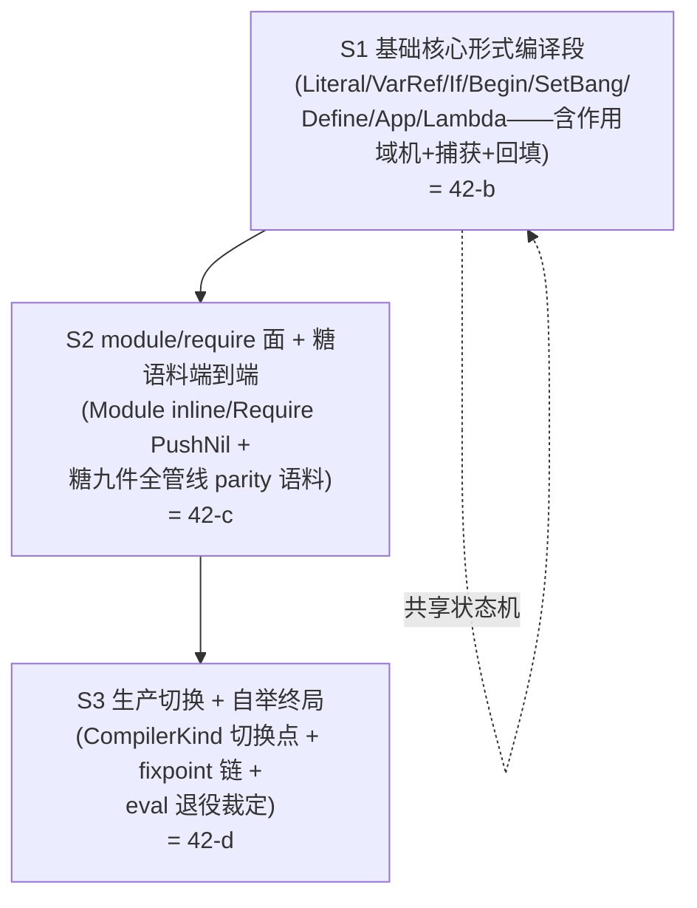

# I1 切口评估与迁移设计（编译器本体 kerf 化——切口 / 段序 / parity oracle / 切换点）

> **Author**: Super Z（ARCH-A 主导 + DEV-A 实现盘点——L3 多角色会话）
> **Date**: 2026-09-11（批次 I 执行启动 r20 / MUV 42-a）
> **Version**: v1.1
> **Status**: Active（切口裁定 + 段序 + parity 三门 + 切换点设计——42-b/c/d 执行蓝图；**r21/42-b 已执行 S1 段**：compiler.krf 八臂 + 桥 + 门 A parity 19 测试全绿（基础组 ≥8 超额）——INC4 实现期修订见 §2 注记；42-c/42-d 待续）
> **输入**: plan.md §5a（42-x 八 MUV）；[12-roadmap §2.5 演进矩阵](../../lang-design/12-roadmap.md)（行 299 元循环求值器「重写升级 + 被编译器替换（I1 范围）」/ 行 309 类型检查器「迁移评估」）；[07-bootstrap §3.2/§3.3](../../lang-design/07-bootstrap-strategy.md)（混合期构成 + 阶段切换信号）；[15-architecture-layers §5.3](../../lang-design/15-architecture-layers.md)（五正交轴）；sop.md §21.3（四条件——条件 1/2 为 I1 对象）；r6/r14/r15 三件套先例（reader/expander 自举）；r18 TCO（尾位穿线——parity 必含面）
> **上游**: r19 批间插入轮（41-a~c——批次 I 细化 + 638:0:0 基线）

---

## 0. 设计轮定位声明（§1.2「写文档」路由）

本文件是 plan §5a **42-a 的交付物**：compiler 本体盘点（段×行数×依赖图
——代码实锚）+ 分段迁移方案（段序 + parity oracle 扩展设计 + 切换点）。
回答三个问题：**(1) I1 的刀口切在哪里**（哪些逻辑迁 kerf、哪些留
Rust——~80/20 口径的精确化）？**(2) 以什么顺序迁**（段切分依赖无环 +
每段验收可量化）？**(3) 用什么门证明迁移正确**（parity oracle 从前段
两段扩展到全编译器——§21.3 条件 2 的可执行判据）？

**一句话结论**：切口 = **compile 段整体 kerf 化**（compile.rs 798 行 →
`compiler.krf` + `bootstrap_compiler.rs` 桥——三件套第三实例），数据边界
沿用 expander.krf 的 **tag 节点值树契约**（输入直接复用 expander 输出
格式）；analyzing 段（typecheck/hm）裁定**不在 I1 自举关键路径**（代码
实锚：生产 run/compile 管线不调用 check——见 §1 B6）；判定基准 =
`BcProgram::bytecode_equal`（bytecode.rs:145——为 §21.3 两次一致**现成
设计**的 API）。

## 1. 现状基线（代码实锚——非文档记忆）

### 1.1 生产管线实测（driver.rs:266-470）

```
compile_front(source):
  1.  bootstrap::read_source          ← reader.krf（VM）✅ 自举
  1.5 resolve_prelude_imports         ← Rust（forms 级 prelude 注入）
  2.  bootstrap_expander::expand_program ← expander.krf（VM）✅ 自举
  2.5 verify_io_capabilities          ← Rust（R9/E0006——capability.rs）
  3.  ModuleRegistry declare/visit    ← Rust（phase.rs:54）
  4.  compile_module                  ← Rust（compile.rs:229）★ I1 迁移对象
  [5.  VM run / eval / check——消费面]
```

| # | 实况 | 代码锚 | 对 I1 的含义 |
|---|------|--------|--------------|
| B1 | **compile 段单一入口**：`compile_module(exprs) -> Result<BcProgram, CompileError>`——CoreExpr 列表进、字节码程序出 | compile.rs:229 | 迁移面收敛为一个函数 + 其私有状态机（`CompileCtxt`）——切口天然干净 |
| B2 | **十大臂齐备**：Literal 287 / VarRef 310 / App 327 / Define 378 / Begin 401 / Module 416 / Require 433 / Lambda（compile_lambda）/ If（跳转回填）/ SetBang | compile.rs:287-436 | 臂集合 = CoreExpr 全变体（kerf-core/src/expr.rs:99 起 11 变体）——段内再切分见 §4 |
| B3 | **作用域解析机**：`match_bindings`（同名 + `binder.scopes ⊆ ref_scopes` 子集匹配 + max-cardinality）+ `VarSource::{Local,Captured,Global}` + 闭包捕获（binder_scopes 注入内层帧） | compile.rs:68-120 | **最难段**——TD-004 作用域集算法的编译期消费面；kerf 侧须逐语义镜像（含并列先注册优先） |
| B4 | **字节码域类型是宿主契约**：`BcProgram/BcProto/BcConst/CaptureSource/Op`（~39 操作码）+ `bytecode_equal`（:145——注释明示「同结果测试：两次编译输出必须一致，§21.3」）+ `disassemble_program` | bytecode.rs / opcode.rs | VM 消费面 = Rust 契约（15 §5.3 轴 2/轴 3 边界）；**比较判据现成**——`bytecode_equal` 即 §21.3 条件 2 的机器判据 |
| B5 | **三件套先例×2 已验证**：reader（reader.krf 471 + bootstrap.rs 桥 534 + 种子 kerf-reader 1092——r6）+ expander（expander.krf 1477 + bootstrap_expander.rs 桥 589 + 种子 kerf-expander 2952——r14/r15 E1-β 生产切换） | bootstrap*.rs/krf | 模式可复制：krf 源（值树契约）+ 桥（call_closure + 类型互转）+ 种子（oracle + 引导）；契约格式 = tag 节点（`('tag s e 字段...)`） |
| B6 | **analyzing 段不在生产编译路径**：`check_program` 仅被 `check_source`(:497)/`check_source_recover`(:536) 消费；`front_from_core`(:353) 主链**无 check 调用**；hm.rs 为旗标 PoC（r18 40-e） | driver.rs:353-445 / typecheck.rs | §21.3 条件 1/2 的自举命题**不依赖 typecheck**——「用自身编译自身」只需 read+expand+compile；typecheck 迁移是独立评估（12 §2.5 行 309「迁移评估」口径） |
| B7 | **eval 参考路径独立**：`eval_source`(:673) 走 `kerf_vm::eval_program`（元循环求值器 391 行——T1 双路径互查）+ `resolve_eval_hygiene_fallbacks` 专属回退 | driver.rs:673 / eval.rs:1 | 12 §2.5 行 299：eval「被编译器替换（I1 范围）」——退役裁定排 42-d（终态 = VM 单路径 + eval 删除或存档） |
| B8 | **确定性纪律已实证**：`lexp-expand-program` 入口 `(set! SCOPE-NEXT 1)`（expander.krf:1471）——卫生计数器**逐调用复位**；parity 测试同线程多调用逐字节全过 | expander.krf:1471 | fixpoint（§21.3 条件 2）的先决纪律已在位——compiler.krf 须继承同款「入口复位」约定 |
| B9 | **TCO 尾位穿线在生产语义内**：`compile_expr(ctx, e, tail)`——Lambda 体/If 两臂/Begin 末项传递 tail；App 尾位 → `Op::TailCall` | compile.rs:327-376（r18 40-c） | parity 语料必须含深尾递归（tco_tests 语料复用）——否则迁移漏掉帧复用语义 |
| B10 | **全局符号卫生回退**：LOAD_GLOBAL 未命中按 `$hyg$N` 后缀剥离（compile.rs:9-11）+ driver 侧 `resolve_hygiene_fallbacks` | compile.rs 头注 / driver.rs:722 | 迁移后两处须协同保持（桥侧 intern 名单一致） |
| B11 | **缓存键未含能力面**（D7 前置——capability-model-design §7 M2/D7：磁盘化前置） | cache.rs:362 | compile 段切换点须显式「缓存失效口径」：CompilerKind 切换 = 缓存键新维度（否则种子/自举产物混享缓存——**迁移期必须禁用或键分桶**，见 §6 切换点 P4） |
| B12 | **`bytecode_equal` = 全结构比较**（`self == other`——含 protos/consts/global_refs/debug_spans 的 derive PartialEq 全等） | bytecode.rs:145-147 | 比较口径**强于**操作码级：Span 逐条全等——parity 门直接可用，无「语义等价但字节不同」灰区 |

### 1.2 本体盘点表（段 × 文件 × 行数 × 职责 × 依赖）

| 段 | 文件 | 行数 | 职责 | 上游依赖 | 下游消费 | I1 裁定 |
|----|------|------|------|----------|----------|---------|
| **S0 已自举** | reader.krf / expander.krf / preamble.krf | 471 / 1477 / 42 | 读 + 展开两段全自举（E1-β 生产） | VM 内置 | 桥 → Stx/CoreExpr | ✅ 保持（I1 输入面） |
| **S0 种子** | kerf-reader（lexer 584 + parser 322 + token 158）/ kerf-expander（core_forms 604 + expander 636 + macro_sys 774 + sugar 426 + phase 238 + recover 224） | 1092 / 2952 | oracle + 引导 | — | bootstrap 加载 / parity | ✅ 保持（oracle 角色不变） |
| **S1 compile（迁移主体）** | kerf-compiler/compile.rs | 798 | CoreExpr → BcProgram（作用域解析/捕获/回填/常量池/debug 表） | kerf-core(CoreExpr)/kerf-syntax(ScopeSet,Symbol)/bytecode/opcode | driver front_from_core:4 | **→ compiler.krf（42-b/c）** |
| **S2 字节码域（宿主契约）** | bytecode.rs / opcode.rs | 273 / 261 | BcProgram 域类型 + Op 枚举 + 比较判据 + 反汇编 | kerf-span(Span) | VM vm.rs / backend / 桥 | **留 Rust**（VM 契约——INC2） |
| **S3 组合根（Rust 面）** | driver.rs（compile_front 266 / front_from_forms 315 / front_from_core 353 / prelude 233 / check 497/536 / run 650 / eval 673 / test 872） | 1152 | 管线编排 + prelude 注入 + R9 + registry 簿记 + CLI | 全部段 | main.rs/测试 | **留 Rust**（INC3——编排非编译逻辑） |
| **S3 桥** | bootstrap.rs / bootstrap_expander.rs | 534 / 589 | call_closure + 值树 ↔ 类型互转 | VM/krf 契约 | driver | 保持 + **新增 bootstrap_compiler.rs**（42-b） |
| **S4 analyzing** | typecheck.rs / hm.rs | 669 / 1040 | E0005 静态检查（R1-R8）/ HM PoC（旗标） | CoreExpr | check_source 两入口 | **不在 I1 关键路径**（INC6——迁移评估绑 42-f） |
| **S5 运行时基座** | kerf-vm（vm 1643 + eval 391 + value 259）/ kerf-runtime / builtins.rs | 2321+ / 1473 | VM / GC / 内置注册 | BcProgram | 一切 | **留 Rust**（INC2——~20% 主体）；**eval.rs 退役裁定排 42-d**（INC7） |
| **S6 能力/缓存/效应** | capability.rs / cache.rs / effects.rs | 603 / 362 / 422 | R9 验证 + Grant + 缓存 + 效应 PoC | CoreExpr | front/driver | **留 Rust**（INC3——组合根属域；M2 泛化排 42-f 同轮） |

**行数口径**：迁移主体 = compile.rs 798 行（→ compiler.krf 预估
~1000-1400 行——序章高阶函数 + 十臂 + 状态机；expander.krf/种子
2952 比例 0.5 的先例推算）。生产逻辑覆盖：读 471 + 展开 1477 +
编译 ~1200 = **~3150 行 kerf**（源→字节码全链）；Rust 保持 =
VM/运行时/桥/组合根/analyzing ≈ **~8600 行**。生产**编译器逻辑**
（source→bytecode）在迁移后 100% kerf；仓库整体口径 kerf:Rust ≈
3150:8600 ≈ 27%——**~80% 指编译器本体的语言占比而非仓库占比**
（12 §1.3 原文「完整 kerf 编译器」；§3.4 07-bootstrap Stage 2 宿主
≈20% 指构建引导 + 后端 FFI + 测试基建）——本设计将口径精确化为
**「前端+编译段 = 100% kerf；运行时/工具/测试 = Rust」**（INC8）。

## 2. 切口裁定（INC1-INC8）

| # | 裁定 | 依据 |
|---|------|------|
| **INC1** | **切口位置 = compile_module 单点**：生产管线第 4 步整体替换为 `bootstrap_compiler::compile_module`（值树桥——三件套第三实例）；输入 = CoreExpr（桥转 expander.krf 输出同款 tag 节点），输出 = BcProgram 值树（桥转类型） | B1（单一入口）+ B5（先例×2）；§11 接口隔离（管线各段以数据契约交互） |
| **INC2** | **字节码域留 Rust**：BcProgram/Op/BcConst 是 VM 与 backend 的宿主契约（15 §5.3 轴位）——kerf 侧以 tag 节点表达，桥重建类型；**VM 永不迁移**（项目一行：Stage 0-1 自建 VM） | B4 + 08-backend（后端消费同一域）；原则 27（契约冻结） |
| **INC3** | **组合根留 Rust**：prelude 注入 / R9 验证 / registry declare/visit / 缓存 / CLI = driver 编排职责（§8.4.6 组合根）——不是「编译逻辑」；compiler.krf 的输入约定 = **已过 R9 + 已声明 registry 的 CoreExpr 列表**（与种子 compile_module 完全同输入） | B6/S3 表；§13.4 J3（子模块零依赖先例——capability_model 同款裁定） |
| **INC4** | **值树契约复用**：输入节点格式 = expander.krf 输出格式同形态（`('lit s e 值) ('var s e 名 scopes) ('app ...) ('lambda s e (名)(作用域集) 体) ('set ...) ('define ...) ('begin ...) ('module s e 名 (导)(导) 体) ('require s e 能力...)`）；输出节点格式（新设计）：`('prog (proto...) (const...) (glob...))` + `('proto 名形 (参数名) nlocals (捕获名) (捕获源) (指令) (span 三元组...) 自由变量)` + `('op 码int 操作数...)` + `('const 类型tag 值)` + 符号一律 str 携带（桥回 intern——r6/r15 同纪律）。**r21/42-b 实现期修订**（实测发现，登记于本注记）：①字面量值为**消歧标记形态**（`('int v)('float v)('str s)('sym 名)('pair l r)('true)('false)('nil)`——Str/Symbol/Float 在 VM 值面无区分谓词（krf 谓词族仅 int?/bool?/null?/pair?/procedure?），桥侧定型传递——「expander 输出格式原样」精确化为「节点四头形态同构 + 字面量标记化」；②span 携带 **(s e exp) 三元组**（原文「span对」修正——bytecode_equal 判据含 debug_spans 全字段，expansion_id 必传）；③原型名形三态 `'main/'anon/'name`（魔法符号 u32::MAX-1/2 桥侧重建）+ 操作码码表 0..=40 = opcode.rs 声明序 | B5（expander.krf 契约头）；桥侧类型重建单一化（CoreExpr 契约不变）；实测约束（谓词面缺失 + 判据字段） |
| **INC5** | **比较判据 = `BcProgram::bytecode_equal`**（全结构 derive PartialEq——含 debug_spans）；**无弱化灰区**：B12 证明判据强于操作码级 | B4/B12；§21.3 条件 2（「字节一致」的机器口径） |
| **INC6** | **analyzing 段不迁**（I1 范围内）：typecheck/hm 不在自举关键路径（B6 代码实锚——生产 run/compile/check 三入口中仅 check 消费，而 check 不产字节码、不参与自举链）；迁移评估按 12 §2.5 行 309 绑定 **42-f 窗口**（HM 生产切换评估同轮——D8 演进轨道），Stage 2 内保持 Rust 实现 + oracle 角色 | B6 + 12 §2.5 行 309 + 15 §5.3（轴 2 独立推导不回流 CoreExpr——typecheck 迁移与否不影响自举命题） |
| **INC7** | **eval 退役裁定排 42-d**：12 §2.5 行 299「重写升级（eval 自举迁移）+ 被编译器替换（I1 范围）」——终态 = 自举编译器（compile 段）+ VM 执行成为唯一生产路径，eval.rs 参考路径退役（删除或存档——终验 TD-017 口径）；42-d 回写 12 §2.4/§2.5 行 + T1 双路径测试面收口（eval 侧断言迁移为「编译器 parity 断言」） | B7 + 12 §2.5 行 299 + plan §5a 42-d 行 |
| **INC8** | **~80% 口径精确化**：§21.3 条件 1「完整 kerf 编译器用 kerf 编写」= **读+展开+编译三段 100% kerf**（迁移后 source→bytecode 全链无 Rust 逻辑参与）；「Rust ~20%」= VM/运行时/GC/桥/组合根/后端 FFI/测试基建（07 §3.4 Stage 2 宿主角色） | §1.2 行数口径 + 07 §3.3/§3.4 |

## 3. 段切分与依赖图（DAG 无环证明）



- **S1 → S2 依赖**：Module 臂是 inline 编译（compile.rs:416——体逐项
  compile_expr），依赖 S1 的 compile_expr 完整性；Require 臂零字节码
  （PushNil——零语义面）。
- **S2 → S3 依赖**：生产切换要求全臂 parity（切换守护以 parity 全绿
  为前置）；fixpoint 要求自举链可跑通 compiler.krf 自身（其源码含
  module/require 面——preamble.krf 是 require 消费者）。
- **无环证明**：S1 ⊂ S2 ⊂ S3 严格包含序（臂集单调增 + 切换后置）；
  compiler.krf 自身源码在 S1/S2 阶段由**种子管线**编译引导（B5 先例：
  bootstrap init 恒走 compile_front_seed——无递归）。

## 4. 分段迁移方案（六字段——映射 plan §5a 42-b/c/d）

### S1（= 42-b）基础核心形式 kerf 化

| 字段 | 内容 |
|---|---|
| 输入条件 | 本设计 GO + 638 基线 |
| 输出物 | `bootstrap/compiler.krf` 骨架 + 八臂（Literal/VarRef/If/Begin/SetBang/Define/App/Lambda）+ `bootstrap_compiler.rs` 桥（CoreExpr→节点 + BcProgram 节点→类型）+ parity 测试 `tests/v0/stage2/plan/bootstrap_compiler_tests.rs` |
| 关键实现 | 状态机镜像：`CompileCtxt` → krf 顶层 mutable 状态（protos/常量池（**关联列表**——插入序即索引，镜像 Rust interning 确定性）/全局登记/回填队列）；`match_bindings` 子集匹配逐语义镜像（含 max-cardinality + 并列先注册优先）；闭包捕获（binder_scopes 注入）；尾位穿线（tail 参数——B9）；`$hyg$N` 回退剥离（B10）；入口复位纪律（B8——krf 侧全部计数器/状态入口归零） |
| 验收标准 | **parity 门 A（基础组 ≥8 case）**：种子 compile_module vs bootstrap compile——`bytecode_equal` 全绿；含深尾递归 case（TailCall 位）+ 嵌套闭包捕获 case + 引号点对递归 case；**638 零回归**（种子路径不动——生产未切换） |
| 集成验证 | examples/usage 基础件（fib/closures/higher_order）经自举编译段产物 VM 执行 = 种子路径结果 |

### S2（= 42-c）module/require 面 + 糖全管线 parity

| 字段 | 内容 |
|---|---|
| 输入条件 | S1 parity 全绿 |
| 输出物 | Module/Require 两臂（inline/PushNil）+ 糖九件 + module 边界语料端到端 parity（**front 全链 parity**：源（含糖+module+require）→ 双路径 → bytecode_equal）+ 宏语料（宏产物 CoreExpr → 编译 parity） |
| 验收标准 | **parity 门 A（扩展组 ≥12 case）**：糖九件 + module/require + 宏 + prelude 注入序（preamble.krf 经 require 门控——r8 路径）；638 零回归 |
| 集成验证 | examples/usage 全六件（含 macros.krf/io.krf/gc_stress.krf）双路径 bytecode_equal + 自举链端到端（bootstrap 加载三 krf → 运行） |

### S3（= 42-d）生产切换 + 自举终局

| 字段 | 内容 |
|---|---|
| 输入条件 | S2 parity 全绿（全臂） |
| 输出物 | `CompilerKind::{Seed,Bootstrap}` 切换（镜像 ExpanderKind）+ `front_from_core` 第 4 步分派 + 守护 `production_compiler_is_bootstrap` + **fixpoint 测试**（§5 门 B）+ eval 退役终态裁定 + 12 §2.4/§2.5 回写 |
| 验收标准 | **门 B（§21.3 条件 2）**：自举链两次编译自身 SHA/bytecode_equal 一致；**门 C**：全套件零回归 + T1 收口 + CLI 四冒烟；缓存口径生效（B11——键分桶或迁移期禁用） |
| 集成验证 | 双审计集 EXIT 0 + 自举链端到端（生产路径编译三 krf → 产物再编译 → 一致） |

## 5. parity oracle 扩展设计（三层门——§21.3 条件 2 的可执行判据）

**oracle 语义**（07 §3.2 自举种子经典角色——双向印证）：
种子 `compile_module`（Rust）在生产切换后保留为**唯一 parity 基准与
bootstrap 引导编译器**（`compile_front_seed` 路径——与 reader/expander
种子同构）。

| 门 | 判据 | 语料 | 触发时机 |
|----|------|------|---------|
| **门 A（段 parity）** | 同一 CoreExpr 输入：`bytecode_equal(seed_out, bootstrap_out)`（B12——全结构含 debug_spans） | 基础组 ≥8（S1）→ 扩展组 ≥12（S2）→ 合计 ≥20 + 既有 tco_tests/expander parity 语料复用（双实现同跑） | 每次自举编译段改动（内循环） |
| **门 B（自举一致性 = §21.3 条件 2）** | 自举链：`front_self(三krf+preamble)` → 字节码集 **B₁**；以 B₁ 为新 bootstrap 程序再跑 `front_self` → **B₂**；判据：`bytecode_equal(B₁[i], B₂[i])` 逐程序成立（四程序：reader/expander/**compiler**/preamble）；**加强判据**（非硬门）：`bytecode_equal(B₀[i], B₁[i])`（B₀ = 种子管线产物——种子-自举全链 parity 在编译器自身源上的终验） | 语料 = 编译器本体三 krf 源（唯一且充分——自举命题的对象） | 42-d 终局 + 任何生产切换后回归 |
| **门 C（回归门）** | 全套件 638+ 零回归 + 双审计集 EXIT 0 + T1 双路径收口（eval 退役后 = 编译 parity 断言）+ CLI 四冒烟 | 全套件 | 每收尾轮（§3.2） |

**实现落位**：`tests/v0/stage2/plan/bootstrap_compiler_tests.rs`（新）
——镜像 bootstrap_expander_tests.rs 结构（正负成对 §9.4.3：正例 =
bytecode_equal；负例 = CompileError 消息 + Span 逐字 parity——
krf 侧 `('err 消息 s e)` 契约）。

## 6. 切换点设计（CompilerKind + 守护 + 回退 + 缓存口径）

| # | 项 | 设计 |
|---|---|--------|
| P1 | 分派位 | `front_from_core` 第 4 步：`match compiler_kind { Seed => compile_module(&core), Bootstrap => bootstrap_compiler::compile_module(&core, ...) }`——镜像 `ExpanderKind`（driver.rs:299-306 先例）；`compile_front`（生产）= Bootstrap，`compile_front_seed` = Seed（**bootstrap init 恒种子**——无递归，B5 纪律） |
| P2 | 守护 | `production_compiler_is_bootstrap`（编译产物经 bytecode_equal 判别或调用路径断言——镜像 `production_expander_is_bootstrap`）；测试断言生产路径实际经过自举编译段 |
| P3 | 回退 | 切换前 parity 门 A 全绿为硬前置（GATE 2——无 parity 不切换）；切换后发现问题 → 单点回退（分派改 Seed——桥与 krf 保留，不删代码） |
| P4 | 缓存口径（B11） | 迁移期（42-b/c——未切换）：生产仍种子路径，缓存不受影响；切换点（42-d）：缓存键增 CompilerKind 维度或切换时清空——**种子与自举产物不得混享缓存条目**（INC 前置：capability-model D7 同型——缓存键加能力面的先例纪律） |
| P5 | eval 退役（INC7） | 42-d 终局：`eval_source` 从生产路径退役（12 §2.5 行 299 终态「移除」的前一步）；T1 双路径测试面改口径：eval 侧对拍断言 → 自举编译 parity 断言（门 A 语料扩展）；TD-017 终验（256 深度裁定维持的域注销） |

## 7. 确定性纪律（fixpoint 先决——B8 实证延伸）

1. **入口复位**：`lexc-compile-program` 入口归零全部可变全局
   （常量池/全局登记/回填队列/原型表）——镜像 `lexp-expand-program`
   的 `(set! SCOPE-NEXT 1)`（expander.krf:1471）；**桥侧持久堆**（B5
   堆契约——GC 跨调用安全）不承载影响输出的跨调用状态。
2. **插入序即索引**：常量池/全局引用索引由**首次插入序**决定（Rust
   `intern` 查后插——插入序确定性；krf 侧关联列表同序镜像）；**禁用**
   任何哈希序依赖（krf 无 HashMap——天然满足）。
3. **符号 str 携带 + 桥回 intern**：节点符号以名字 str 传输，桥在
   driver 侧 SymbolTable intern（r6/r15 同纪律——两实现各自 intern 序
   不保证一致，名字是唯一稳定口径；bytecode_equal 的 Symbol 比较经
   同表 resolve 后成立——测试侧统一 resolve 口径，镜像
   bootstrap_expander_tests 的 `core_equiv` 表参数化）。
4. **fixpoint 隔离运行**：门 B 的 B₁/B₂ 两次自举链运行在**独立
   bootstrap 状态**下执行（fresh 桥实例或新线程——B8 复位纪律已使
   同线程复跑安全；测试实现取「fresh 状态」最保守形态）。

## 8. 风险与缓解

| 风险 | 等级 | 缓解 |
|------|------|------|
| `match_bindings` 子集匹配语义漂移（max-cardinality/并列序/捕获注入——B3 最难段） | 高 | S1 parity 语料特化：同名多层遮蔽 + 捕获链 + 遮蔽回退逐 case；实现前先写 parity 负例（消息逐字） |
| krf 侧栈深（compile_expr 递归深度——深嵌套程序） | 中 | 深度上限镜像（Rust 侧无显式上限但 VM 帧护栏在——krf 侧展开深度 10_000 先例 + gc_stress 语料实测；超限报错非栈溢出——TD-007 H2 同款纪律） |
| parity 全绿但生产切换后自举链死锁/发散（bootstrap init 递归） | 中 | bootstrap init 恒种子路径（P1 硬约定）+ 门 B 独立测试先行（切换前置非后置） |
| 缓存混享（B11/P4） | 中 | 切换点键分桶/清空——显式测试（种子命中后自举路径不得返回种子产物） |
| eval 退役引发 T1 测试面大面积重写 | 低 | 42-d 单 MUV 内收口（P5 口径先行——断言迁移非删除测试）；TD-017/TD-009 联动注销清单 |
| compiler.krf 体量超预估（~1400 行）导致 42-b/c 跨 session 超期 | 中 | plan §5a 排程注 (1) 已预留（按段内形式分批交付，parity 增量每批 ≥8）——S1 内部可再切 S1a（无捕获基础臂）/S1b（作用域机+捕获） |

## 9. 回写义务清单（本 MUV 执行 / 后续 MUV 绑定）

1. **本 MUV（42-a）**：plan.md Status 行更新（r20 / 42-a 交付）+
   RELEASE_NOTES r20 头部 + matrix r20 行（设计轮零测试增量注记）；
2. **42-b/c/d 执行锚**：本文件 §4 六字段表为三 MUV 的验收合同
   （plan §5a 行引用本文件）；
3. **42-d 回写**（INC7/P5）：12-roadmap §2.4 演进矩阵行 299 终态 +
   §2.5 对账 + T1 测试面口径收口 + TD-017 终验；
4. **42-f 评估锚**（INC6）：typecheck/hm 迁移评估输入 = 本文件
   B6/INC6 裁定 + HM D8 演进轨道。

## 附录：与 plan §5a 42-b/c/d 逐行对照（验收面）

| plan §5a 行 | 本设计对应 | 增量裁定 |
|-------------|-----------|---------|
| 42-b「基础核心形式段迁移 + parity 增量 ≥8」 | §4 S1 表 | 语料具体化（尾递归/捕获/点对/遮蔽四特化 case 组）；桥与测试文件落位 |
| 42-c「糖形式 + module/require 段迁移 + parity ≥12」 | §4 S2 表 | 「糖全管线 parity」精确化：糖在展开段已消——compile 段糖语料 = **端到端口径**（含糖源 → 双路径 bytecode_equal） |
| 42-d「两次编译自身字节一致 + eval 退役终态裁定」 | §4 S3 + §5 门 B + §6 P5 | fixpoint 链定义（B₁/B₂ 隔离运行 + 四程序逐一判据）；缓存口径 P4；T1 收口口径 |
