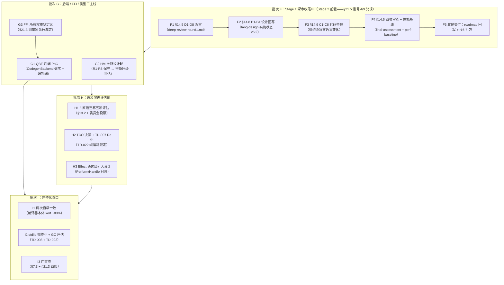

# Stage 2 阶段计划（完整语言 · 规划轮）

> **Author**: Super Z（PM-A/ARCH-A/PL-A 联合）
> **Date**: 2026-09-11
> **Version**: v0.4.0-plan
> **Status**: Active（批次 F r16 交付闭环；批次 G r17 交付（38-a~g：605:0:0）；**批次 H r18 交付**（40-a~g：634:0:0）；**批间插入轮 r19 交付**（41-a~c：能力模型泛化设计——模型层骨架 capability_model.rs P3 冻结 + 化学反应矩阵 6 条；**批次 I 细化完成**（42-x 八 MUV 分解——本文件 §5a）；**批次 I 执行启动 r20 交付**（42-a：I1 切口评估与迁移设计——[i1-incision-migration-design.md](./i1-incision-migration-design.md) 切口裁定 INC1-INC8 + 段序 S1-S3 + parity 三门 + CompilerKind 切换点；42-b 执行待续）；Effect 实现窗口 D12 = I 后段（42-f，与能力管线泛化 M2 同轮协调））
> **输入**: sop.md §21（阶段推进规划）、§17（任务规划排版图）、§18（依赖审查）、§13.1（设计对齐）、§14（深度审查协议——阶段末环）、§4（MUV）、§19（打包）；[12-roadmap §1.3/§2.5](../../lang-design/12-roadmap.md)；[08-后端策略](../../lang-design/08-backend-evolution.md)；[13-能力矩阵 §3.3-§3.5](../../lang-design/13-capability-matrix.md)；[stage-1/plan](../stage-1/plan.md)（批次 A-E 交付实录 + 批次 F 注记）；r15 门审查（Task 34-d APPROVED + §6.3 五角色全票 GO）；r16 批次 F 深审环（deep-review-round1 + 偏差清单 17 项 + TD-023 新登记）
> **上游**: Stage 1 r15（553:0:0 全绿 / 读+展开两段全自举 / stage1_gate_audit_r1 50 case APPROVED）

---

## 0. 规划轮定位声明（§1.2「进入新阶段」路由产物）

本计划是 Stage 2 的**阶段规划先行文档**（依据 §1.2「进入新阶段」：§21 阶段规划 → §13.1 设计对齐 → §17/§4 → §7.3/§14.6）。**核心发现**：§21.5 切换信号九条中七条满足、一条部分满足（性能基线）、一条未执行（§14.6 阶段间深度验证——连带 §14.5/§14.8/§14.9 阶段末环）。因此本计划将 **批次 F（Stage 1 深审收尾环）定为 Stage 2 正式执行的前置批次**——先收尾 Stage 1 的 L3 阶段末协议，再进入 Stage 2 主体批次。

## 1. §21 阶段规划确认

| 项 | 裁定 | 依据 |
|---|---|---|
| 核心目标 | **完整语言**：完整 kerf 编译器（kerf ~80%）+ HM 类型推断 + 完整卫生宏 + FFI + 至少一个非 VM 后端 | §21.1 / 12-roadmap §1.3 |
| 实现语言 | kerf ~80% + Rust ~20%（构建引导 + 后端 FFI + 测试基建保持 Rust） | §21.4 |
| 后端策略 | **QBE 首选**（10% 代码 ≈ 70% 性能）+ C 转译并行评估（最大可移植性）+ Cranelift 备选；LLVM 仅 Stage 3+ 发布构建——**永不入自举链** | 08 §2 混合演进表 + §21.2 约束 1-4 |
| 代码量 | ~20000-50000 行 | §21.1 |
| 工程节奏 | 8-16 周估算；批次 F 收尾环先行（1 轮）→ G（后端/FFI/类型主线）→ H（语义演进评估）→ I（完整化收口） | §21.8 双口径 |

**§21.3 Stage 2 验收标准**（阶段门，全部满足才可进入 Stage 3）：
1. 完整 kerf 编译器用 kerf 编写（kerf ~80%——编译器本体迁移完成）
2. 两次编译自身结果一致（自举确定性——现有 parity 基建扩展到全编译器）
3. 至少一个非 VM 后端工作（QBE PoC → fib/gc_stress 端到端本地码执行）
4. FFI 可用（ExternalType/FfiCall/FfiBoundary 按冻结契约做实）

**阻塞项与缓解**（§21.3）：FFI 所有权模型未定义 → **批次 G3 先行定义**（GC pin/unpin 边界 + 线性令牌跨 FFI 边界的语义裁定——13 §3.3.4 冻结规格的行为补全），实现随后。

### §21.5 切换信号核对（Stage 1 → Stage 2，逐项实测对账）

| # | 信号 | 状态 | 证据 |
|---|---|---|---|
| 1 | 语义稳定 | ✅ | 553:0:0（R1-R9 归约 + T1 双路径一致 + r13 作用域集解析收口 + E1-β 宏收口零回归） |
| 2 | 自举验证 | ✅ | r15 读+展开两段全自举（compile_front 经 reader.krf + expander.krf 含宏）；parity 逐字节等价（r6 87/307 case + r15 宏 parity 17 + 消息逐字） |
| 3 | 测试覆盖 ≥95% | ✅ | 553 测试函数 + 双审计集 91 case；正负比 ≈1:3.15（≥1:3，§9.4.3）；七类负向矩阵 7/7 |
| 4 | 性能基线 | ⚠️ | Stage 0 基线存在（performance-baseline.md）；**Stage 1 自举管线性能基线未单独建立**（VM 1/10-1/30 区间实测 + 自举 vs 种子编译开销对比缺失）→ 批次 F4 补录 |
| 5 | 文档同步 | ✅ | r15 六处对账（matrix 553 / plan 批次 E 收口行 / RELEASE_NOTES / 03 宏系统 E1-β 边界 / 07 自举 Expander 交付标记 / 测试计划三篇） |
| 6 | 能力处理程度与 §21.9 一致 | ✅ | v11.1 对账注记（四项做实无倒挂）；类型检查器提前引入偏差已登记（§21.6 缓解路径显式裁定） |
| 7 | 技术债 P0/P1 清零 | ✅ | 登记册 TD-002~022：P0/P1 开放 = 0；开放项 = TD-007 P2 残留（10_000 完整口径）+ P3 若干（TD-003/005/008/009/010/011/014/022） |
| 8 | 外循环投票 ≥95% | ✅ | 34-d §6.3 五角色全票 GO（PM/ARCH/DEV/QA/REC——553 全绿 + 双审计 APPROVED + §21.3 四条件锚定 + TD 对账） |
| 9 | 阶段间深度验证 §14.6 | ❌ | **未执行**——Stage 1 仅完成 §7.3 门审 + §6.3 投票；§14.5 D1-D8 深审 / §14.8 B1-B4 回写 / §14.9 C1-C6 整理 / §14.6 四项审查均无产出（Stage 0 对照物：六篇深审文档 + final-assessment） |

**核对结论**：9 条中 7✅ + 1⚠️ + 1❌。信号 9（及 4 的补录部分）为批次 F 的全部内容——**Stage 2 主体批次不可在批次 F 完成前启动**（依据 §21.5「全部满足」语义 + §1.3 L3 流程图 Commit → Deep → Writeback → CodeClean → CrossStage → GO 的既定次序）。

## 2. §13.1 设计对齐（lang-design → Stage 2 需求映射）

| lang-design 文档（v6.2） | Stage 2 消费点 | 对齐结论 |
|---|---|---|
| 08-backend-evolution §1-§3 | 批次 G 后端策略的完整论证（Cone 实测：LLVM 小程序迭代慢 100-150×；QBE 70% 性能；PyPy 数据）+ CodegenBackend 契约 | 规格完备可直接实现；WasmBackend 属 Stage 2+ 可选项 |
| 13-capability-matrix §3.3.4/§3.3.7 | FFI（ExternalType/FfiCall/FfiBoundary——P1 冻结）与多目标后端（CodegenBackend/WasmBackend——P1 冻结）按契约做实 | P1 trait 签名 + 行为规格完整（含 GC pin/unpin 隔离协议）；仅缺所有权模型语义裁定（G3） |
| 13-capability-matrix §3.3.2/§3.3.5 | LSP 基础服务器（P0 预留 LanguageService/IncrementalAst）与查询系统（P0 QuerySystem）——Stage 2 做实候选 | 位置对账六项 ✓（r12 断言测试锁存）；做实顺序待批次 G/H 优先级裁定（LSP 列 12-roadmap Stage 3 侧，本阶段最小面） |
| 01-core-forms §7.3/§8.3 + stage0 §6.12.6 | 8 原语迁移五项语义层评估清单（Let/Perform·Handle/de Bruijn/continuation/语义化命名）——批次 H 主题 | 全部五项已登记且绑定 §13.2 切换期重构 + 委员会投票（核心冻结原则 9 精确化裁定） |
| 06-operational-semantics | Perform/Handle 原语化对照（现有元层效应路径 vs 原语级）+ continuation 三要素 | 语义锚就位；效应语言级引入（12 §2.4 表 Stage 2 行） |
| 02-syntax-model §1 | 多语法可插拔 Reader（S-expr 皮肤可替换——Rust/Go 风格目标语法切换评估） | 12-roadmap §2.3 v5.5 量化背书（两语法 CoreExpr 全等）；Stage 2 评估项（非承诺项） |
| 07-bootstrap §3.3 | 自举策略 Stage 2 完全自举（编译器全本体 kerf 化 + 两次一致） | 信号清单已就位；两次一致验证基建 = parity 框架扩展 |
| 09-stdlib | 标准库完整化（48 → 完整集） | 基线就绪（列表/字符串/I/O 三族） |
| 05-runtime §4 | TD-008 分代 GC / 堆压缩（Stage 2 既定推迟路径的到期） | 排批次 I（收口期）评估（+ TD-023 回归同轮——r16 绑定） |
| 12-roadmap §2.5 演进矩阵 Stage 2 列 | 12 行逐行对账 | 全部行有批次落位（见 §3 排版图）——无缺口阻塞 |

**对齐结论**：lang-design v6.2 对 Stage 2 需求**无缺口阻塞**——FFI/后端 P1 契约完整（仅所有权语义待 G3 裁定）；8 原语演进评估有显式清单与流程绑定；演进矩阵 12 行全部映射到批次节点。

## 3. §17 任务规划排版图（七步流程）

### Step 1 扫描结果（§17.2 强制扫描）

- **设计意图摘要**：Stage 2 交付完整语言——编译器本体 kerf ~80% 化 + HM 推断 + FFI + QBE 首个非 VM 后端；两处语义层演进（8 原语迁移 / Effect 语言级）走 §13.2 切换期重构 + 投票；14 项预留中 P1 三组（FFI/后端/服务化）+ P2 两组进入做实窗口。
- **技术债状态**：TD-002~023 开放 14 项——TD-007（P2 残留：10_000 口径，受 Stx 值语义深树 clone/drop 递归约束——Rc 化解除排批次 H2 与 de Bruijn 评估合并）+ **TD-023（P2：gc_stress 根扫描回归，r16 深审新登记——排批次 I2 与 TD-008 同轮）** + TD-013（P2：多错误恢复实现，r16 改判绑定 G2）+ P3 十一项（TD-003/005/008/009/010/011/014/015/017/018/022）。
- **校准基线**：L3 轮次按「问题簇」计轮；单人 Agent 会话按批次推进 + 每批次独立内循环（沿 stage-1 惯例）。
- **能力边界**（v0.1-capability-boundaries + r15 后现状）：支持 9 原语 + 10 糖 + syntax-rules 完整模式面 + 48 内置 + prelude 四函数 + 模块/导入 + 能力门控 I/O + 编译缓存。**Stage 2 需扩展**：TCO（或分块驱动——TD-022 裁定）、quote 符号向量边界、字符串序、FFI 面、非 VM 后端目标。
- **测试矩阵**：553:0:0（单元 184 + 集成 369 + 双审计 91 case）；正负比 ≈1:3.15。
- **上一阶段输出**：r15 门审查 APPROVED + §6.3 全票 GO（发现项 2 已当场修复——P2 诊断质量）；**批次 F 深审环（r16）= 信号 4/9 的兑现轮**。
- **路线图对齐**：v0.5-roadmap 第 3 行（Stage 2 完整语言，本计划即该行的展开）。

### Step 2-4 任务依赖图 + 节点流（DAG 拓扑排序）

**拓扑序**：F1 → F2 → F3 → F4 → F5 → G3 → (G1 ∥ G2) → (H1 ∥ H2 ∥ H3) → I1 → I2 → I3。
G3 先于 G1（FFI 所有权模型是后端 FFI 交互面的前置裁定）；批次 H 三项相互独立可并行；批次 I 收口。

### Step 5 设计-开发-测试节点流（每 MUV 三位一体）

`设计锚（lang-design § / 登记册 TD）→ 开发（crate/模块 + §10 命名 + §11 隔离）→ 测试（正例 ≥1 + 负例 ≥3 + 集成锚点 + 端到端）`——批次 F 的开发位为审查产出文档/整理，测试位为复跑全套件回归。

### Step 6 缺陷纳入（修复任务节点）

- 深审环（F1-F4）发现项 → 当轮内循环修复（§5.2）；P2/P3 记登记册并绑定批次 G-I 节点。
- §14.6.1.4 强制修复项：复杂度增长 ≥2× 的隐藏问题必须在批次 F 内修复（否则 NO-GO 升级）。

### Step 7 审查结论

排版图 DAG 无环（拓扑序存在）；§21.9 演进矩阵 Stage 2 列 12 行全部映射到批次 G/H/I 节点；§21.3 四条件全部落位（条件 1 → I1；条件 2 → I1；条件 3 → G1；条件 4 → G3+G1）；§21.5 信号 4/9 兑现路径 = 批次 F。**审查通过，进入批次 F 执行（§6.3 已于 r16 批准——5.5/5.5）。**

## 4. §18 依赖与基础设施审查

| # | 审查项 | 结论 |
|---|---|---|
| 1 | 基础设施能力 | parity 框架（逐字节等价比对）/ 编译缓存 / 双审计集 / 553 基线全绿——深审环复跑基建完备 ✅ |
| 2 | 前置项完整性 | §14.5 模板 / §14.6 四项协议 / §14.8 B1-B4 / §14.9 C1-C6 均已冻结于 sop v12.0；Stage 0 六篇深审产物为格式范本 ✅ |
| 3 | 其他依赖问题 | ① QBE 二进制属外部工具——按 §3.1 查 `scripts/`→`tools/`→`docs/tools/` 再安装记录（不阻塞批次 F）；② 性能基线测量需基准程序集（现有 examples/gc_stress + fib 足够起步）；③ HM 推断设计轮需 16-reference-analysis 参照分析复核 |
| 4 | 全面审查 | 三项均非阻塞：①批次 G 前落位即可；②③属设计输入完备性问题，已有文档锚 |

**结论**：依赖完整无缺失项——批次 F 可立即执行（F1 唯一输入 = r15 全量基线 + 本计划）。

## 5. §4 MUV 拆分（六字段）

### 批次 F（Stage 1 深审收尾环——首个执行批次，Task ID 36-x）

| 字段 | F1（§14.5 深审） | F2（§14.8 回写） | F3（§14.9 整理） | F4（§14.6 验证 + 基线） | F5（收尾交付） |
|---|---|---|---|---|---|
| 输入条件 | 本计划批准 + r15 基线 | F1 报告产出 | F2 完成 | F3 全绿复跑 | F4 GO 判定 |
| 输出物 | stage-1/deep-review-round1.md（D1-D8 三段式 + 委员会投票节） | lang-design 实施状态回写（v6.1→v6.2 状态注记；B1-B4 偏差分类表） | C1-C6 六维度整理（如发现；零语义变化约束） | architecture-review / design-impl-test-coverage / hidden-problems / performance-baseline + final-assessment.md（Stage 1 版） | v0.5-roadmap Stage 1 行 ✅ + 12-roadmap §2.5 注记 + matrix 对账 + RELEASE_NOTES r16 + tar.gz（§19.4）+ web 同步 |
| 验收标准 | D1-D8 全维度三段式结论 + 阻塞项分级清点（P0/P1 = 0 维持） | B1-B4 全偏差分类 + 每项附条款号（GATE 3） | 行为不变：553 逐一等价零断言修改 + §3.2 全绿 | 四项审查各 ≥1 产出文档 + 性能基线含自举 vs 种子开销实测数字 + 复杂度 ≥2× 隐藏问题清零 | §3.2 六命令全绿 + 包内自举验证 553:0:0 + E2E |
| 集成验证用例 | 深审报告交叉引用 worklog Task 20-35 全链 | —（文档） | 全套件回归即集成验证 | 基准程序实测（fib/gc_stress/stress 展开） | 双审计集 EXIT 0 |
| 责任 Agent | ARCH-A（D1/D5）+ QA-A（D3/D6/D8）+ REV-A（D2/D7）+ PM-A（D4） | REC-A | DEV-A | ARCH-A + QA-A | QA-A/REC-A |
| Task ID | 36-a | 36-b | 36-c | 36-d | 36-e |

### 批次 G-I（Stage 2 主体，批次 F 交付后逐批细化）

| 批次 | MUV 序列（概排） | 关键验收 | Task ID 起 |
|---|---|---|---|
| G | G3 FFI 所有权模型定义（GC pin/unpin 跨边界语义 + 线性令牌裁定——13 §3.3.4 行为补全）→ G1 QBE 后端 PoC（CodegenBackend trait 做实 + AnnotatedANF 入参验证 + fib 端到端本地码）→ G2 HM 推断设计轮（保守 R1-R8 → HM 升级评估 + 16 参照复核）+ **TD-013 多错误恢复实现（r16 深审改判绑定——expander 恢复展开与推断升级同为前端诊断主线）** | §21.3 条件 3（首个非 VM 后端）+ 条件 4 前半（FFI 契约做实）+ 阻塞项解除 + TD-013 偿还 | 38-x |
| **G 执行注记（r17）** | 38-a G3 ✅（ffi-ownership-model.md 216 行——pin/unpin 形式化 + 线性令牌 + 13 边界 case + 19 决策；回写义务 4 处登记批次 I）/ 38-b·c G1 ✅（QBE 1.3 落位 tools/qbe + kerf-backend 第 10 crate：契约迁移（原则 27 re-export）+ AnnotatedANF 实化 + phi 合成 + QbeBackend + aot 编排；CLI +2 命令（anf/native）；**fib(12) ⇒ exit 144 本地码端到端 + VM 一致**；TD-024 PoC 边界 B1 登记）/ 38-d G2 ✅（hm-inference-design.md 303 行——约束三段式裁定 + GO 有条件：PoC 排批次 H 新增 MUV H4）/ 38-e TD-013 ✅ **resolved**（双路径恢复 + check_source_recover 合并报告 + CLI check 切换）/ 38-f ✅（605:0:0 + §3.2 全绿 + 对账 + tar.gz + web） | 全验收过 + 605 基线 | 38-x |
| H | H1 8 原语迁移五项评估（Let/Perform·Handle/de Bruijn/continuation/语义化命名——§13.2 切换期重构流程 + §6.3 投票逐项）∥ H2 TCO 决策（TD-022 帧消耗 + TD-007 Rc 化 10_000 口径同轮 + TD-017 eval 深度裁定随 eval 重写评估——r16 改判注记）∥ H3 Effect 语言级设计（Perform/Handle 原语化对照 06 现行语义） | §6.3 逐项投票记录 + 语义变更零静默（GATE 3） | 40-x |
| **H 执行注记（r18）** | 40-a ✅（38-g 终验补记 + r17 终态包刷新复验——上会话落账缺口 P2 清偿）/ 40-b H1 ✅（primitive-migration-evaluation.md——五项三段式 + J1-J6 30 点 + 投票 20 票全票：E1 DEFER-STAGE3 / E2 GO-DESIGN / E3 分层 / E4 SPEC / E5 REJECT；**总裁定 Stage 2 原语集零变更**）/ 40-c H2 ✅（**TCO 落地**：TailCall 帧复用 + 尾位穿线 + 指令预算护栏；**TD-007 resolved**（Rc + 均匀标记 + 迭代 retag + 扁平 Drop——10_000 口径 0.02s）；TD-017 裁定维持 256；TD-023 P2→P3（gc_stress -70% 实测）+ TD-025 登记（自举侧包装链 O(N²)））/ 40-d H3 ✅（effect-language-design.md 12 裁定——实现窗口 D12 = 批次 I 后段）/ 40-e H4 ✅（hm.rs 约束三段式 PoC——**双门全过**（超集 29 + 零误报）+ 四类缺口检出 + fib : (num→num)）/ 40-g ✅（用户指令插入：reserved/ 标准化拆分——mod.rs 344→66 行 + 4 能力族独立文件 + reserved_ext_tests 零改动兼容实证）/ 40-f ✅（634:0:0 + §3.2 全绿 + 对账六面 + r18 tar.gz + web + E2E + git） | 全验收过 + 634 基线 | 40-x |
| I | I1 编译器 kerf ~80% 迁移收口（compiler 本体 kerf 化 + 两次编译自身字节一致）→ I2 标准库完整化 + TD-008 分代 GC 评估（**+ TD-023 gc_stress 回归根扫描对症——r16 深审新登记绑定本节点**）+ TD-009/010/011 P3 批量清偿 + TD-014/018 消息质量批 → I 后段 Effect 实现（D12 窗口）+ 能力管线泛化 M2（同轮）→ I3 Stage 2 门审查（§7.3 ≥30 新 case + §21.3 四条锚定） | §21.3 条件 1/2 + Stage 3 切换信号就位 + TD-023 偿还 | 42-x 起（细化见 §5a） |

### §5a 批次 I 细化（r19 / 41-b——42-x 八 MUV 分解，仿批次 F 六字段）

> **细化依据**：拓扑序 I1 → I2 → I 后段（D12/M2 同轮）→ I3 维持（12 §2.5.1 演进矩阵 + effect-language-design D12 + capability-model-design D12/M2 双同轮协调裁定）；每 MUV 一个 Task ID，批次内逐 session 交付，末 MUV 收尾（同 38-f/40-f 惯例）。

| 字段 | 42-a I1 切口评估与迁移设计 | 42-b I1 前段：基础核心形式 kerf 化 | 42-c I1 中段：糖/module/require 面 | 42-d I1 收口：两次编译自身一致 |
|---|---|---|---|---|
| 输入条件 | 41-a~c 交付 + 634 基线 | 42-a 方案 GO | 42-b parity 增量全绿 | 42-c 全绿 |
| 输出物 | compiler 本体盘点文档（compile/desugar/sugar/analyzing 各段行数与依赖图）+ 分段迁移方案（段序 + parity oracle 扩展设计 + 切换点）| 基础形式段迁移（quote/if/lambda/app/set!/define/begin——kerf 源 + 种子编译对照）+ parity 增量 ≥8 case | 糖形式 + module/require 段迁移 + parity 增量 ≥12 case（糖九件 + module 边界） | **自举终局**：kerf 编译器编译自身 → 产物编译自身 → 字节一致（§21.3 条件 2）+ eval 退役终态裁定（TD-017 终验 + 12 §2.4 演进矩阵行回写）|
| 验收标准 | 方案六字段齐 + 段切分依赖无环 + 每段验收可量化 | 双路径产物一致（逐字节）+ 零回归 634 基线 | 同左 + 展开/编译全管线 parity | 两次编译产物 SHA-256 一致 + 全套件零回归 |
| 集成验证 | —（设计轮） | 基础形式 parity 组 | 全管线 parity 组 + 自举管线端到端 | 自举链端到端 + 双审计集 EXIT 0 |
| 责任 Agent | ARCH-A/PM-A | DEV-A/QA-A | DEV-A/QA-A | DEV-A/ARCH-A |

| 字段 | 42-e I2：stdlib/GC/TD 批 | 42-f I 后段：Effect 实现 + 能力 M2 同轮 | 42-g I3 门审查 | 42-h 收尾交付 |
|---|---|---|---|---|
| 输入条件 | 42-d 收口 | 42-e 全绿 + effect-language-design 冻结面 | 42-f 全绿 | 42-g APPROVED |
| 输出物 | stdlib 完整化（缺口盘点→补齐）+ TD-008 分代 GC 评估裁定（GO/DEFER + 依据）+ TD-023 根扫描对症 + TD-009/010/011 P3 批量清偿 + TD-014/018 消息质量批 | **Effect M1-M5**（VM ext1 激活 + perform/handle 编译 + E0007-E0009 诊断族 + parity 迁移路径按 effect-language-design §迁移）+ **能力管线泛化 M2**（IoGrant→族无关形态别名兼容 + 门控表 net 增行评估——capability-model-design §7） | stage2_gate_audit（≥30 新 case + 7 类覆盖 + 上轮修复边界 case）+ §21.3 四条件终验 + §14 阶段末环（D1-D8 深审 + B1-B4 回写 + C1-C6 整理）+ §6.3 投票 | §3.2 六命令 + 对账六面 + r20 tar.gz 包内自举 + web 同步 + git + 树压实 |
| 验收标准 | TD 批量 resolved/裁定注记齐 + gc_stress 回归 ≤5% + stdlib 缺口清单清零 | effect 五 MUV 验收（设计文档测试锚正 6 负 6）+ 能力 M2 零破坏（既有测试零改动）+ 全绿零回归 | 门审计 APPROVED + 投票 ≥4/5 + 四条件逐条证据链 | §3.2 全绿 + 包内自举验证 + E2E |
| 集成验证 | gc_stress/stress 全组 | effect 端到端（VM run + native）+ require 门控全路径 | 双审计集 + 全套件 | 双审计集 EXIT 0 |
| 责任 Agent | DEV-A/QA-A | DEV-A/ARCH-A/QA-A | QA-A/REV-A + 全角色 | QA-A/REC-A |

**批次 I 排程注**：(1) 42-b/c/d 每 MUV 可能跨 session（段迁移体量大——按段内形式分批交付，parity 增量每批 ≥8）；(2) 42-f 为双主题同轮（Effect D12 + 能力 M2——driver 组合根双接触面显式协调，worklog 交叉引用）；(3) TD-025 已于 r18 根治（resolved）——不在本批清单；(4) HM 旗标期切换（D8 演进轨道阶段 2）随 42-d 后评估排入。

## 6. 量化验收标准（本规划轮）

- 规划文档落位：`docs/develop/v0/stage-2/plan.md`（本文件）+ stage-1/plan.md 补登记（r15 后批次 F 前置注记）
- §21.5 逐项核对表：9 条 × 证据列全填充（上表——7✅ 1⚠️ 1❌ 诚实登记）
- 批次 F 五 MUV 六字段齐全 + Task ID 唯一性（36-x 未与历史冲突）
- worklog 追加（Task 35-x / 36-x）+ 树 `l` 路由行更新
- web：Stage 2 状态行「规划中（§21 阶段规划）」+ 切换信号核对结果对账

---

*遵循条款：§21（阶段规划先行——§21.1 确认/§21.3 验收/§21.5 逐项核对/§21.9 矩阵对账）、§1.2（「进入新阶段」路由全章）、§13.1（设计对齐 10 文档映射）、§17.2（强制扫描 8 项）、§18.1（四项依赖审查）、§4.1（MUV 六字段）、§14.1-§14.6（深审环四协议缺口识别与本计划核心发现）、§8.4.5（决策附条款号）、§2.3-4（显式失败——深审缺口不静默带过）。*
