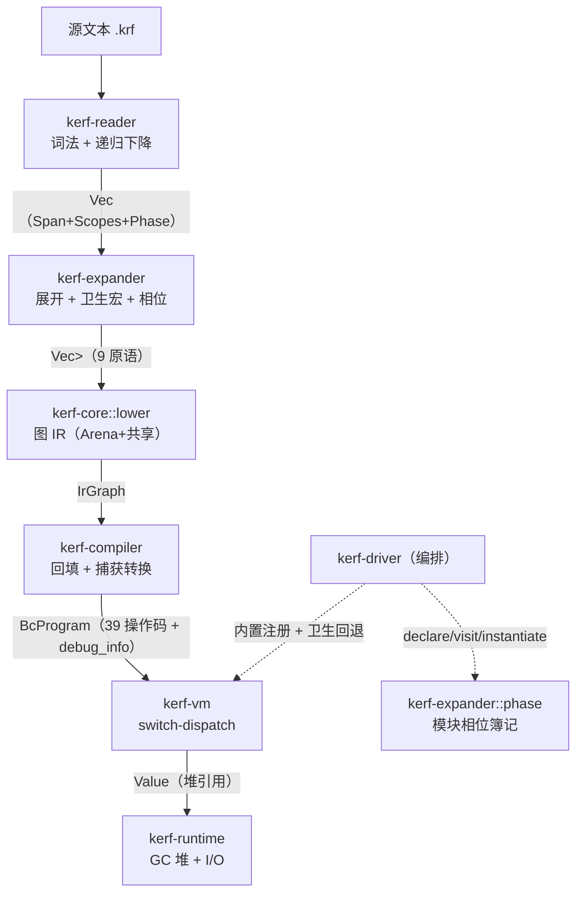
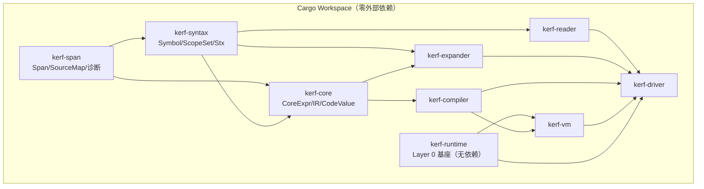

# 管线数据流图（§15 项目图）

> **Author**: kerf-dev-agent
> **Date**: 2026-09-09
> **Version**: v0.1.0
> **Status**: Active

## 编译管线数据流

## 依赖图（Cargo Workspace，§18.5 的定向裁定）

**定向裁定**（worklog Task 2）：§18.5 图的 L6→L7（vm→runtime）边按
§2.4.5「Layer 0 = 最小 I/O Runtime（无依赖）」裁定为 **kerf-vm 依赖
kerf-runtime**（运行时为 VM 提供对象模型与 GC 基座）；Op 定义于
kerf-compiler（字节码为编译产物、VM 为消费者——可替换性原则 4）。
