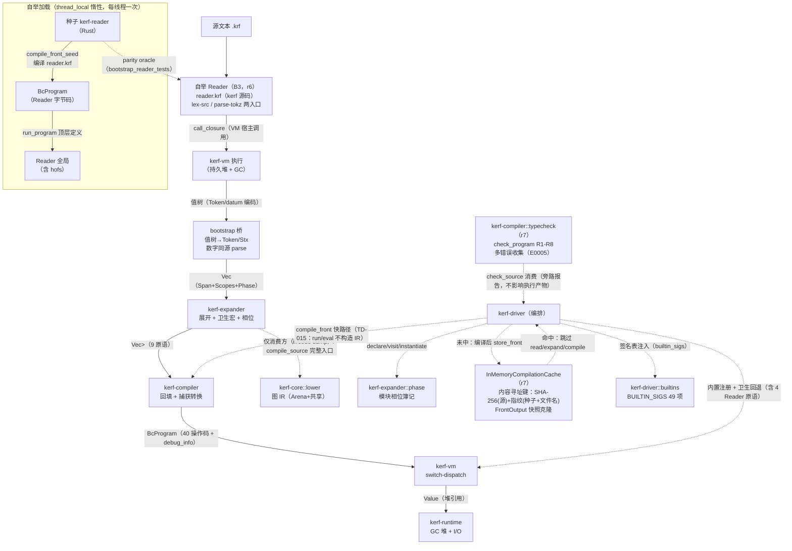
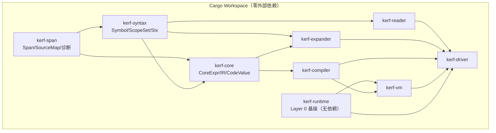

# 管线数据流图（§15 项目图）

> **Author**: kerf-dev-agent
> **Date**: 2026-09-10（r7：批次 C——编译缓存旁路（compile_front_cached 内容寻址键命中返回前端快照）+ 静态检查器旁路（check_program）+ check 消费面；r6：B3 自举 Reader 读路径——生产 read 经 kerf 源码 Reader（VM 上运行），种子保留为引导 + oracle）
> **Version**: v0.1.1
> **Status**: Active

## 编译管线数据流

> **B3 读路径注记（r6）**：生产 read（`compile_front`/`dump_tokens`/
> `dump_stx`）全部经自举 Reader；种子（kerf-reader）承担两职责——①
> 引导：编译 reader.krf 本身（无递归——种子编译自举实现）；② oracle：
> parity 套件逐字节对照（正 87 / 负 307 case）。错误经 ('err 消息 起 止)
> 值编码返回（不依赖异常）；VM 级内部错误防御路径经 reader.krf 源映射渲染。

## 依赖图（Cargo Workspace，§18.5 的定向裁定）

**定向裁定**（worklog Task 2）：§18.5 图的 L6→L7（vm→runtime）边按
§2.4.5「Layer 0 = 最小 I/O Runtime（无依赖）」裁定为 **kerf-vm 依赖
kerf-runtime**（运行时为 VM 提供对象模型与 GC 基座）；Op 定义于
kerf-compiler（字节码为编译产物、VM 为消费者——可替换性原则 4）。
