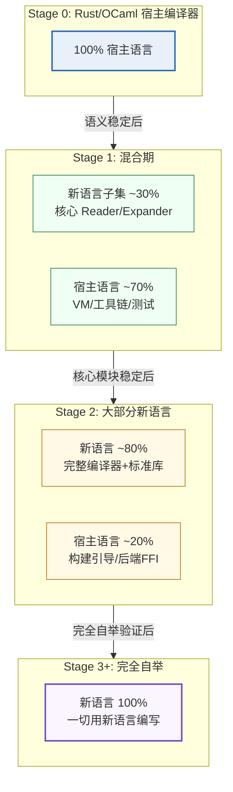

# 自举策略：理论基础、陷阱与演化路径

> **Author**: kerf-doc-agent
> **Date**: 2026-09-10（v5.2：补四项接口预留契约位置指引（#26））
> **Version**: v6.2
> **Status**: Active

> 本文件收录自举进程的核心策略：自举的数学本质与通用自举流水线模式（原 §2.1）、自举流水线的三个常见陷阱（原 §2.3）、以及 Stage 1+ 语言演化策略全文（原 §18：从宿主语言到完全自举，含混合期构成、阶段切换信号、宿主语言角色变化与完全自举的核心收益）。历史案例参考（Rust/Guix/Racket/Julia/C）见 [00-总览 §4](./00-overview.md)；实施节奏与周级任务见 [12-路线图](./12-roadmap.md)；能力引入时机的进程视角见同文件 §2。
>
> **接口预留契约位置指引（v5.2 补，deep-review R1 偏差 #26）**：四项接口预留（Effect Handlers / 多阶段编程 / 能力模型 I/O / 编译缓存）的**冻结签名与行为规格不在本文件**——规范副本在 [13-能力矩阵 §3.1](./13-capability-matrix.md)，冻结实现在 `kerf-driver/src/reserved.rs`（v5.2 已以可编译签名回填）。本文件的阶段切换信号（§3.3）仅引用其存在性，不重复契约内容。

---

## 1. 自举的数学本质（原 §2.1）

自举是打破"用语言自身实现的语言特性，其实现又依赖于这些特性"循环依赖的过程。形式上，它是从外部种子到自描述核心的渐进管线。

**通用自举流水线模式**：

```text
Stage 0: 外部种子（宿主语言编写）    ↓ 编译
Stage 1: 最小自举核心（目标语言子集）
    ↓ 自举
Stage 2: 完整自举核心（完整目标语言）
    ↓ 验证
Stage 3: 自验证（同结果测试：两次编译输出必须字节一致）
```

## 2. 自举流水线的三个常见陷阱（原 §2.3）

| 陷阱 | 症状 | 对策 |
|------|------|------|
| **类型检查器循环依赖** | 检查器无法通过自身类型检查 | 三阶段策略 + `cfg(bootstrap)` 条件编译 |
| **GC 引导依赖** | GC 需要分配器，分配器需要 GC | 将 GC 剥离到运行时层，Stage 0 用最简单的标记-清除 |
| **性能悬崖** | 元解释器 10-100 倍减速 | 渐进式流水线（字节码 VM → QBE → LLVM） |

## 3. Stage 1+ 语言演化策略：从宿主语言到完全自举（原 §18）

### 3.1 演化总览（原 §18.1）

**Stage 0 完成后，Stage 1 确实开始用已构建的新语言编写代码，但完整的"用新语言开发新语言"是一个渐进过程。**



### 3.2 混合期（Stage 1）的具体构成（原 §18.2）

```text
新语言编写的部分（在 Stage 0 VM 上运行）：
├── Reader（新语言子集）       ← r6 已交付（B3）：reader.krf 全 kerf 源码，
│                                 生产读路径切换（compile_front 经自举 Reader）；
│                                 种子 Rust Reader 保留为引导实现 + parity oracle
├── Expander（新语言子集）     ← E1-β 已交付（r15：expander.krf 宏收口——syntax-rules 全模式面（单层省略号边界内——v6.2 限定：嵌套省略号/syntax-parse 按 TD-005 推迟 Stage 2）+ 卫生 α + 深度 500 + Span 代次守卫；生产切换——读+展开两段全自举（r14 E1-α 影子路径先行，r15 收口））
└── 基础宏定义                 ← E1-β（随宏收口与模块系统，TD-021 联动）

宿主语言编写的部分（原生执行）：
├── Stage 0 VM 的 C/Rust 实现
├── 构建系统
├── 测试运行器
├── 基准测试框架
└── 调试工具
```

> **B3 交付注记（r6）**：Reader 已以 kerf 源码重写（`kerf-driver/src/bootstrap/
> reader.krf`，471 行（v6.2 更正：原文 ~430 为 r6 时点口径，r15 序章扩展后实测 471；词法 + 语法 + 高阶函数序章），经种子管线编译为字节码后
> 在 Stage 0 VM 上运行——`lex-src`/`parse-tokz` 两入口（与种子 `lex_source`/
> `parse_tokens` 接口形状对齐，§11）。宿主桥（`kerf-driver/src/bootstrap.rs`）：
> VM 宿主调用（`call_closure`）+ 值树 ↔ Token/Stx 转换 + 数字文本同源 parse
> （i64/f64 语义转换是宿主类型边界——正确舍入的十进制→二进制转换不可在语言
> 算术中可靠重实现；扫描序内的溢出前置校验经 `str-int-valid?` 原语维持首错
> 位置 parity）。**验收**：356 测试全套件（含全部既有负向消息断言）经自举
> Reader 执行 + parity 套件 28 函数（正 87 / 负 307 case，Stx 树与错误消息/Span
> 逐字节等价）。已知边界：VM 帧消耗 O(源字符数)（TCO 未实现——TD-022，
> Stage 2 决策点）。

### 3.3 阶段切换信号（原 §18.3）

**Stage 0 → Stage 1**：
- [ ] 9 个核心原语语义稳定且通过测试
- [ ] Stage 0 编译器能正确编译新语言子集的所有测试用例
- [ ] 宏展开器工作正常
- [ ] 至少 100 个测试用例全部通过

**Stage 1 → Stage 2**：
- [ ] 新语言子集能表达所有编译器前端逻辑
- [ ] 标准库已包含：列表操作、字符串处理、基本 I/O
- [ ] 增量编译基础设施已在新语言中可用

**Stage 2 → Stage 3**：
- [ ] 新语言能实现自身的完整编译器
- [ ] 两次编译自身的结果字节一致
- [ ] 构建系统可用新语言重写

### 3.4 Rust 在整个生命周期中的角色变化（原 §18.4）

```text
Stage 0:  Rust/OCaml = 100%（所有代码）
Stage 1:  宿主语言 ≈ 70%，新语言 ≈ 30%
Stage 2:  宿主语言 ≈ 20%，新语言 ≈ 80%
Stage 3:  宿主语言 = 0%，新语言 = 100%
Stage 3+: 新语言自我演化，宿主语言仅作为历史遗迹
```

### 3.5 完全自举的核心收益（原 §18.5）

- **非平凡用例的测试**：编译器本身是极复杂的程序，自举是语言的终极测试
- **改进的循环收益**：编译器优化不仅改善用户程序，也改善编译器自身
- **开发者只需掌握一种语言**
- **完全一致性检查**：编译器能重现自身的对象码
