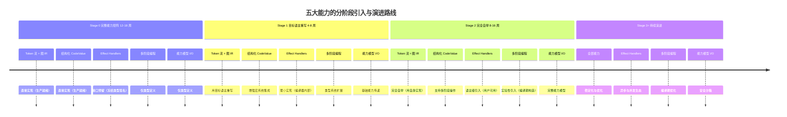
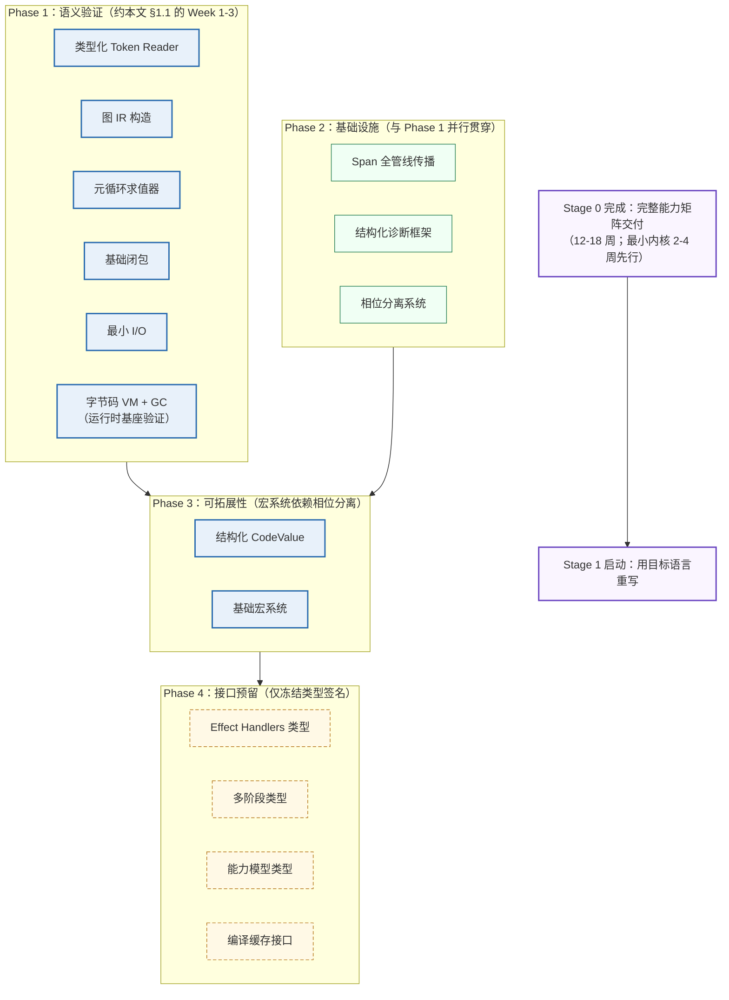
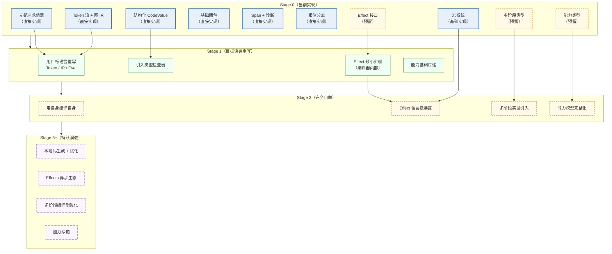
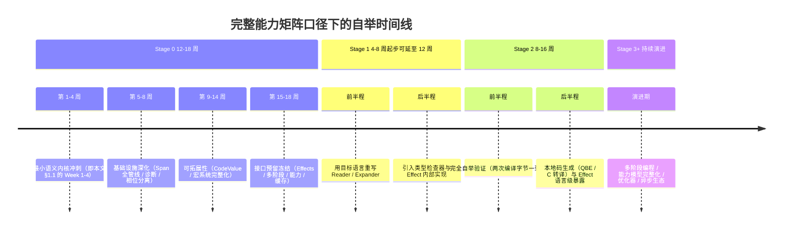

# 实施路线图与进程推进规划

> **Author**: kerf-doc-agent
> **Date**: 2026-09-10（v6.0：§2.5.1 增补「原语演进评估清单注记」——01 §7.3/§8.3 所指登记落位（v5.5 吸收时悬空引用修复）；v5.4：r8 批次 D 交付注记）
> **Version**: v6.0
> **Status**: Active

> 本文件收录原文 Part V「实施与启动」的全部内容：实施路线图与具体任务分解（原 §20，含周级任务表与双时间口径说明）、能力引入时机与自举进程推进规划（原 §21 全文：成熟度分级、处理程度五级标度 P0-P4、三维度影响矩阵、自举管线 Phase 划分、五大能力分阶段演进、完整演进矩阵、三个关键决策点、进程风险与缓解、净影响评估——含 4 张 mermaid 图）、以及实现启动指南（原 §22：环境准备/目录结构/里程碑验证清单）。原 §21 位于原文 Part V 且与 §20 周表、§22 启动指南构成「实施与启动」整体，故全文收录于本文件。阶段切换信号见 [07-自举策略 §3.3](./07-bootstrap-strategy.md)；能力矩阵本体见 [13-能力矩阵](./13-capability-matrix.md)。

---

## 1. 实施路线图与具体任务分解（原 §20）

### 1.1 Stage 0（2-4 周，约 7000 行代码）（原 §20.1）

> **时间口径说明（v5.0）**：本节的"2-4 周"指**最小语义内核**——Week 1-4 冲刺交付 Reader / Expander / Compiler / VM / GC 及其测试，目标是尽早验证 9 个核心原语语义并为 Stage 1 启动提供基础。**完整 Stage 0 能力矩阵**（含 Span 全管线、结构化诊断、相位分离与卫生宏的完整深度、以及 [13-能力矩阵 §3.1](./13-capability-matrix.md) 全部接口预留冻结）按本文 §2.3 的 Phase 视角估算为 12-18 周。两个口径并不矛盾：前者是后者的 Phase 1 加速子集，本文 §2.3.2 给出二者的映射关系。

**Week 1**：基础数据结构 + Reader（类型定义、词法器、语法器、测试）
**Week 2**：Expander + 核心形式（展开器骨架、宏机制、相位分离）
**Week 3**：Compiler + VM（字节码生成、VM 执行循环、GC）
**Week 4**：测试 + 调试工具（测试框架、IR dump、性能基准）

**周级任务分解（v4.0 新增）**：

| 周次 | 核心任务 | 交付物 | 验证标准 | 关联章节 |
|------|---------|--------|---------|---------|
| Week 1 | 类型定义 / 词法器 / 语法器 | `token.rs`、`lexer.rs`、`parser.rs` | Token 流无损覆盖输入；词法/语法错误全部携带 Span；≥20 个 Reader 快照测试通过 | [02-语法模型](./02-syntax-model.md) |
| Week 2 | 展开器骨架 / 宏机制 / 相位分离 | `expander.rs`、`phase.rs` | 9 个核心形式展开正确；卫生宏测试（宏内外同名不串扰）通过；展开深度上限生效 | [03-宏系统](./03-macro-system.md) |
| Week 3 | 字节码生成 / VM 循环 / GC | `compiler.rs`、`vm.c`、`gc.c` | fib(25) 在 VM 上执行正确；跳转回填零占位残留；GC 回收测试（分配 10^6 临时对象堆稳定）通过 | [04-字节码 VM](./04-bytecode-vm.md)、[05-运行时](./05-runtime.md) |
| Week 4 | 测试框架 / IR dump / 性能基准 | `tests/`、`bench/`、`dump.rs` | ≥50 个快照测试全绿；Span 全管线传播抽检；基线数据入库（编译速度 / 执行速度 / 自举预留） | [11-测试](./11-testing.md)、[10-工具链](./10-toolchain.md) |

> **GC 验收双轨口径（v5.2 注，deep-review R1 偏差 #2）**：上表 Week 3 的「10^6」**权威载体是 gc_tests 的 10^6 有界分配测试**（tests/v0/stage0/plan/gc_tests.rs，实测通过）；`examples/usage/gc_stress.krf` 为 3×10^5 量级的可运行示例（用户侧演示口径，单轮 ~0.17s）。两轨并存非矛盾：前者是验收判据，后者是示例载体——状态报告与基准文档须分别标注口径。

**每周通用验收闸门**：接口冻结项（[13-能力矩阵 §2](./13-capability-matrix.md) 各"接口契约"）一旦在当周定义，次周不得变更签名，只允许追加——这是 [15-架构分层 §1.3](./15-architecture-layers.md) 依赖规则在工程节奏上的落地。

### 1.2 Stage 1（4-8 周，约 8000 行目标语言代码）（原 §20.2）

用目标语言子集重写编译器前端，在 Stage 0 VM 上运行。

### 1.3 Stage 2（8-16 周，约 20000-50000 行）（原 §20.3）

引入 QBE/C 转译后端、Hindley-Milner 类型推断、完整卫生宏、FFI。

### 1.4 Stage 3（持续）（原 §20.4）

引入 LLVM 可选后端、JIT、分代 GC、完整 IDE、包管理。

每个阶段切换的**进入条件**与**退出判据**必须在启动该阶段前显式评审（阶段切换信号清单见 [07-自举策略 §3.3](./07-bootstrap-strategy.md)），避免"时间到了就切阶段"的伪进度。

---

## 2. 能力引入时机与自举进程推进规划（原 §21）

> **本章回答一个此前各章都部分触及但从未正面统合的问题：每个能力模型应该在哪个阶段引入、引入到什么处理程度、以及为什么是那个时机。** [13-能力矩阵 §1](./13-capability-matrix.md) 的三层分类矩阵回答"是什么"（哪些能力属于哪一层），本文 §1 的周级任务表回答"何时做"（工程节奏），[07-自举策略 §3.3](./07-bootstrap-strategy.md) 的切换信号回答"何时进入下一阶段"；本章则是三者的"过程视角"统合——用生态成熟度、自举链依赖、风险回报三个判据，把 [13-能力矩阵 §1.1](./13-capability-matrix.md) 矩阵中的每一行沿时间轴展开为 Stage 0 → Stage 3+ 的演进规划。本章内容整合自 v5.0 合并的三份外部能力模型分析文档，其中与 v4.0 已有章节重叠的部分（能力矩阵、12 个模型的详细设计、架构分层）已分别收口在 [13-能力矩阵](./13-capability-matrix.md) 与 [15-架构分层](./15-architecture-layers.md)，此处仅保留进程推进视角的增量内容。

### 2.1 2026 年能力成熟度分级与处理程度标度（原 §21.1）

#### 2.1.1 三档成熟度分级（原 §21.1.1）

引入时机的第一判据是**生态成熟度**——不是"技术是否存在"，而是"技术是否已在生产环境中被足够规模的实践验证"。2026 年的五大推荐能力恰好覆盖三个成熟度档次，这一分层直接决定了每个能力的处理程度上限：

| 成熟度档次 | 判定标准 | 2026 年代表能力 | 生态证据 |
|-----------|---------|---------------|---------|
| **生产就绪** | 10 年以上生产环境验证，失败模式已知 | Token 流 + 图 IR、结构化 CodeValue、Span 系统 | Rust proc-macro（10 年生产验证）；LLVM/GCC 图 IR（30 年验证）；rustc Span 系统 |
| **早期实践** | 主流语言已发布稳定实现，但大规模应用案例仍集中于工具链与基础设施 | Effect Handlers、编译缓存 | OCaml 5.2+ 效应系统已在 Forester 6.0 等项目中实践；rustc 增量编译验证了查询式缓存 |
| **研究前沿** | 理论成熟但实现依赖启发式方法，或语言级应用生态尚未建立 | 多阶段编程、能力模型 + 线性类型 | MetaOCaml 理论完备但实现使用启发式方法；Rust 所有权验证了线性类型，但 I/O 能力模型的语言级应用仍在探索（Austral 等） |

这个分级本身携带一个重要推论：**成熟度是时间函数而非静态标签**。早期实践层的能力（如 Effect Handlers）正在以工具链 → 语言核心的路径扩散；研究前沿层的能力（如多阶段编程）可能在 Stage 2 执行期间跨入早期实践档。因此本文 §2.5 的演进矩阵把每个阶段的引入决策都设计为"可依据当时成熟度重新评估"的结构，而不是一次性锁死。

#### 2.1.2 处理程度的五级标度（原 §21.1.2）

"引入到什么程度"需要一个比"实现/推迟"更细的标度。v4.0 的三层分类（必须实现 / 接口预留 / 完全推迟）是 v5.0 五级标度的骨架，后者在前两层内部再做细分：

| 级别 | 名称 | 处理深度 | 冻结内容 | Stage 0 例子 |
|------|------|---------|---------|-------------|
| **P0** | 完整实现 | 生产深度：全部行为 + 错误路径 + 测试 | 接口契约 + 语义 | Token Reader、图 IR、Span、诊断、GC、VM |
| **P1** | 基础实现 | 核心路径可用，边界特性显式推迟 | 接口契约 | 宏系统（卫生保证完整，展开调试工具推迟）、最小 I/O |
| **P2** | 接口预留 | 冻结类型签名与行为规格，无实现 | trait 签名 + 语义约定 | 编译缓存、能力模型 I/O（v5.2 修订，原 P3——reserved.rs 已附完整行为规格，[13-能力矩阵 §3.1.3](./13-capability-matrix.md)） |
| **P3** | 类型定义 | 仅类型声明，行为规格部分留白 | 类型形状 | Effect Handlers、多阶段编程 |
| **P4** | 完全推迟 | 不设计、不预留 | 无（重新评估时机已约定） | LSP、类型检查器、本地码生成、优化器、FFI、并发 |

五级标度的价值在于让"处理程度"成为可审计的工程承诺：P2 与 P3 的区别不是术语游戏——P2 的 trait 签名附带完整的行为规格（[13-能力矩阵 §3.1.4](./13-capability-matrix.md) 编译缓存的 get/store/invalidate 三方法的语义约定），Stage 1 可以直接按规格实现；P3 只承诺类型形状（[13-能力矩阵 §3.1.1](./13-capability-matrix.md) 的 Effect/Handler/Continuation 三个关联类型），具体行为语义留给引入时的实践数据来定。**成熟度与处理程度的匹配规则（三级成熟度匹配原则，见 [17-设计原则 §1 原则 26](./17-principles.md)）**：生产就绪 → P0/P1；早期实践 → P2（可加最小验证）；研究前沿 → P3；其余 → P4。

#### 2.1.3 五大能力的分阶段引入路线（原 §21.1.3）

下表把五大推荐能力沿 Stage 0 → Stage 3+ 展开为引入路线（能力 × 阶段的处理程度快照，完整矩阵见本文 §2.5）：



*上图：五大能力在各阶段引入动作与处理程度快照，与 [13-能力矩阵 §1.1](./13-capability-matrix.md) 三层分类、本文 §2.5 演进矩阵互为参照。*

### 2.2 能力选择对自举进程的三维度影响（原 §21.2）

能力模型的选择不只影响"能做什么"，更通过三条正交的路径影响自举进程本身。**语义层的选择（元循环求值器、闭包）决定自举的下限与启动速度；基础设施层的选择（类型化 Token 流、Span 系统）决定自举的质量与可维护性；接口预留层的决策（Effects、多阶段、能力模型）决定自举的上限与演进空间。** 三层之间存在明确的相互制约：任何一层的过度设计都会延迟自举达成时间，而任何一层的投入不足都会在后期引入不可逆的架构债务。

#### 2.2.1 三维度影响矩阵（原 §21.2.1）

下表把 [13-能力矩阵 §1.1](./13-capability-matrix.md) 矩阵中的能力（含 2 个运行时基座）逐行映射到三个影响维度。"对自举速度的影响"以最简方案（仅元循环求值器 + 闭包 + 基础 I/O）为基线——其达成时间即本文 §2.3.2 的最小语义内核口径（2-4 周冲刺，含完整测试收尾约 4-6 周）：

| 能力模型 | 对自举速度 | 对自举质量 | 对演进空间 | 处理程度 |
|---------|-----------|-----------|-----------|---------|
| 元循环求值器（传统） | 加速（2 周可验证 9 原语语义） | 中等（无类型保证） | 为 Effects 预留升级路径 | P0 |
| 类型化 Token 流 | 延迟（+1-2 周） | 显著提升（Span/Scope/类型信息内置） | 为 Stage 1 类型检查器与 LSP 预留数据基础 | P0 |
| 图 IR + 共享节点 | 延迟（+1-2 周） | 显著提升（CSE 预备 / 调试信息保留） | 为 Stage 2+ 优化器预留表示基础 | P0 |
| 结构化 CodeValue | 中性 | 提升（类型/位置/作用域信息随值流动） | 为多阶段编程预留组合接口 | P0 |
| 基础闭包（传统） | 加速（最简实现） | 基础 | 为 Effects 预留控制流升级路径 | P0 |
| Span 全管线传播 | 延迟（+3-5 天） | **极显著**（错误定位 / 调试 / 增量编译的前提） | 为 Stage 1 增量编译预留 | P0 |
| 结构化诊断框架 | 延迟（+1 周） | 显著（开发体验与错误恢复质量） | 为 Stage 2 IDE 集成预留 | P0 |
| 最小 I/O（传统） | 加速（1 天） | 基础 | 为能力模型 I/O 预留替换点 | P1 |
| 相位分离系统 | 延迟（+1-2 周） | **关键**（宏系统正确性的前提） | 为编译时 DSL 预留相位空间 | P0 |
| 基础宏系统 | 延迟（+2-3 周） | **核心**（可拓展性引擎） | 极高（Stage 2+ 新特性可不改编译器核心） | P1 |
| 标记-清除 GC + 字节码 VM | 加速语义验证（eval 与 VM 双执行路径互查） | 基础（运行时基座） | 为分代 GC 与本地码生成预留接口 | P0 |
| Effect Handlers（预留） | 零延迟（仅类型） | 中性 | **极高**（异步 / 并发 / 错误恢复的统一机制） | P3 |
| 多阶段编程（预留） | 零延迟（仅类型） | 中性 | 高（编译期计算与代码生成） | P3 |
| 能力模型 I/O（预留） | 零延迟（仅类型 + 行为规格） | 中性 | 高（安全模型与最小权限） | P2（v5.2：签名 + 4 条完整行为规格已冻结） |

#### 2.2.2 净影响估算（原 §21.2.2）

推荐方案比最简方案多花费约 6-10 周开发时间（这正是本文 §2.3 完整能力矩阵口径 12-18 周与最小内核口径 4-6/2-4 周的差距来源），其回报是将后期重构成本从"不可行"（架构级返工）降低到"可控"（按冻结接口替换实现）。矩阵中值得特别注意的三行：Span 全管线传播以 3-5 天的代价换取"极显著"的质量影响，是全部能力中投资回报率最高的一项——rustc 的实践反复验证了"错误消息质量决定编译器可用性"；相位分离与宏系统合计 3-5 周的投入则是可拓展性目标的必要条件，跳过它们等于放弃 [00-总览 §3.1](./00-overview.md) 确立的"强大可拓展性和可塑性"设计目标本身。

### 2.3 自举管线的阶段划分与能力引入（原 §21.3）

#### 2.3.1 四个 Phase 的定义与依赖（原 §21.3.1）

完整 Stage 0 能力矩阵的构建过程按能力引入的依赖关系划分为四个 Phase（注意与本文 §1.1 的 Week 1-4 不是同一坐标系，映射关系见本文 §2.3.2）：

- **Phase 1 语义验证**：Token Reader → 图 IR → 元循环求值器 → 闭包 → 最小 I/O，加上字节码 VM 与 GC 构成运行时基座。目标是用双执行路径（eval 与 VM 互查，见 [11-测试 §2.4](./11-testing.md)）验证 9 个核心原语的语义正确性
- **Phase 2 基础设施**：Span 全管线传播、结构化诊断框架、相位分离系统。与 Phase 1 并行贯穿——Span 与诊断从第一天起就要进入数据结构（"横切关注点必须早期内置"原则，见 [17-设计原则 §1 原则 6](./17-principles.md) 与 [15-架构分层 §2](./15-architecture-layers.md) 的展开论述），而不是事后补丁
- **Phase 3 可拓展性**：结构化 CodeValue 与基础宏系统。硬依赖相位分离（没有 Phase 0/1 隔离的宏展开无法保证正确性），软依赖 Span（展开错误的定位）
- **Phase 4 接口预留**：冻结四个预留接口的类型签名。依赖前面的类型系统定型（接口形状要引用 Value、CodeValue、Span 等已定型类型）



*上图：四个 Phase 的能力构成与依赖走向，配色与全文统一——蓝色为语义与编译期能力，绿色为基础设施，黄虚线为接口预留，紫色为阶段里程碑。*

#### 2.3.2 双时间口径的调和（原 §21.3.2）

本文 §1.1 的"Stage 0（2-4 周，约 7000 行代码）"与本章的"完整能力矩阵 12-18 周"是同一进程的两个口径，必须显式调和以免误读：**2-4 周是最小语义内核口径**——即 Phase 1 的加速交付（对应本文 §1.1 周表的 Week 1-4 冲刺：Reader/Expander/Compiler/VM/GC 及其测试），其价值是尽早验证核心语义并允许 Stage 1 的准备工作提前启动；**12-18 周是完整能力矩阵口径**——在最小内核之上继续把基础设施做到全管线深度（Span 贯穿 Reader → Expander → Compiler → VM 的每一处）、把宏系统做到完整卫生保证、并完成全部四个接口预留的冻结。两个口径的映射关系如下：

| Phase（能力视角） | Week（工程视角，本文 §1.1 周表） | 说明 |
|-----------------|---------------------------|------|
| Phase 1 语义验证 | ≈ Week 1-3 | 周表的 Week 3（Compiler + VM + GC）即 Phase 1 的运行时基座部分 |
| Phase 2 基础设施 | 并行贯穿 Week 1-4 及其后的深化期 | Span/诊断的数据结构从 Week 1 内置，全管线深度在最小内核后继续补齐 |
| Phase 3 可拓展性 | ≈ Week 2 启动（宏机制）+ 深化期完整化 | 周表 Week 2 的展开器骨架是 Phase 3 的启动点 |
| Phase 4 接口预留 | ≈ Week 4 启动 + 冻结收尾 | 周表 Week 4 的测试期同步冻结接口签名 |

需要强调的是：**Phase 视角服务架构决策（能力依赖决定顺序），Week 视图服务工程执行（人力与节奏决定排期）**。若团队规模允许，Phase 2 与 Phase 1 完全并行推进可以压缩总时长；若追求最快语义验证，也可以先完成 Phase 1 的最小版本（即 2-4 周口径），再回头补足基础设施深度。这个弹性正是本文 §2.7 风险表前两行（Token 流设计过度 / 图 IR 过于复杂）这类基础设施深化风险的缓冲空间。

### 2.4 五大能力模型的分阶段演进设计（原 §21.4）

五个核心能力各自的演进路径差异很大：两个生产就绪能力的主题是"重写与自举"，三个预留能力的主题是"逐级做实"。每张演进表之后给出引入时机的决策依据。

#### 2.4.1 Token 流 + 图 IR：重写与自举的主题（原 §21.4.1）

| 阶段 | 实现语言 | 功能范围 | 关键决策 |
|------|---------|---------|---------|
| Stage 0 | Rust（或 OCaml） | Token 流 + 图 IR + Span + Scope + 完整解析 | Arena 分配；节点共享（CSE 预备） |
| Stage 1 | 目标语言子集 | 用目标语言重写 Reader/Parser | 保持运行在 Stage 0 VM 上 |
| Stage 2 | 完整目标语言 | 完全自举（用自身解析自身） | 接受暂时的性能回退 |
| Stage 3+ | 完整目标语言 | 增量解析 / 并行解析 | 引入查询式缓存 |

**时机依据**：生产就绪成熟度允许 Stage 0 直接实现到 P0 深度；Stage 1 重写是自举链的强制环节而非可选优化——重写过程本身是对语言表达力的第一轮真实测试。数据结构的具体形态（Token 结构体、GraphIR 定义、Reader trait）已在 [13-能力矩阵 §2.1/§2.2](./13-capability-matrix.md) 冻结（Reader 实现框架另见 [02-语法模型 §6](./02-syntax-model.md)），此处不重复。


> **v5.5 量化背书（next2.md 第 5 轮吸收——S 表达式表面语法决策）**：Stage 0 采用 S 表达式的**量化论证**——Reader ~300 行 vs 中缀语法 ~3000 行（Pratt parser + 递归下降 + 错误恢复）；脱糖近恒等变换（vs 完整脱糖管线每步皆 bug 源）；宏系统直接基于同像性（vs 语法桥接层）。**S 表达式是工程脚手架而非设计终点**（"皮肤非骨架"——五目标无影响论）。分阶段语法策略：Stage 0 S-expr（宿主实现）→ Stage 1 S-expr（VM 上 kerf 源码——**r6 已兑现 B3**）→ Stage 2 切换目标语法（Rust/Go 风格 Reader ~3000 行，两语法编译后 CoreExpr 全等——Racket `#lang`（Rhombus/Hackett）先例）→ Stage 2+ 多语法共存（可插拔 Reader）。本设计 02-语法模型 §1 的「表面语法层可替换」蓝图与此完全一致。
#### 2.4.2 结构化 CodeValue：逐级增强的主题（原 §21.4.2）

| 阶段 | 功能范围 | 关键能力 |
|------|---------|---------|
| Stage 0 | 基础 CodeValue（类型/位置/作用域随值流动） | substitute / alpha_rename |
| Stage 1 | 与宏系统集成（宏输出 CodeValue） | 宏可以构造和变换代码值 |
| Stage 2 | 多阶段操作（quote / splice） | 编译期构造新代码 |
| Stage 3+ | 优化（缓存 / 并行构造） | 增量代码生成 |

**时机依据**：CodeValue 的接口在 Stage 0 已包含 compose_with 等多阶段预留位（[13-能力矩阵 §2.3](./13-capability-matrix.md)），但真正的多阶段操作依赖宏系统与类型系统的成熟——在它们稳定之前实现 quote/splice 只会制造返工。

#### 2.4.3 Effect Handlers：四级做实的主题（原 §21.4.3）

| 阶段 | 实现范围 | 具体功能 |
|------|---------|---------|
| Stage 0 | 仅类型定义（P3） | Effect/Handler/Continuation 关联类型 |
| Stage 1 | 编译器内部最小实现 | 用效应处理编译器错误恢复与测试短路 **✅ r8 做实（一次性逃逸层 + InternalEffectSystem，语言面保持 P3）** |
| Stage 2 | 语言级引入 | 用户可定义/处理效应 |
| Stage 3+ | 异步/并发生态 | 用效应实现 async/await |

**时机依据与口径说明**：Effects 的引入是"类型定义 → 编译器内部 → 语言级 → 生态"四级递进，这与 [13-能力矩阵 §1.1](./13-capability-matrix.md) 矩阵中"推迟到 Stage 2"的表述并不矛盾——矩阵中的 Stage 2 指**语言级引入**（用户可用）这一级；编译器内部使用（Stage 1）属于实现策略，不进入语言语义，因此不计入矩阵。之所以不跳级：OCaml 5 的效应已在工具链与基础设施项目中实践，但作为语言核心求值器仍属前沿——先用低风险的内部场景（错误恢复）积累实现经验，再决定语言级语义，是成熟度匹配原则的直接应用。

> **r8 交付注记（2026-09-10，批次 D）**：第二级已兑现——`kerf-driver/src/effects.rs` 类型化一次性逃逸层（`handle_escape`/`perform_escape`，任意嵌套深度零签名污染）+ 冻结契约真实现 `InternalEffectSystem`；消费面 = `kerf test` 用例短路与错误恢复（[11-测试 §4](./11-testing.md)）。编译期错误恢复（展开器形式级，TD-013 设计）经 §4 联动裁定为**控制流而非效应**——两级机制边界清晰，Stage 2 复核。详见 [13-能力矩阵 §3.1.1](./13-capability-matrix.md) r8 注记。

#### 2.4.4 多阶段编程：依赖链最长的主题（原 §21.4.4）

| 阶段 | 功能范围 | 依赖条件 |
|------|---------|---------|
| Stage 0 | 仅 Code/quote/splice 类型定义（P3） | 无 |
| Stage 1 | 编译期常量折叠 | 类型检查器稳定 |
| Stage 2 | 编译期代码构造（宏展开的一部分） | 宏系统 + CodeValue 成熟 |
| Stage 3+ | 运行时代码生成（JIT） | 本地码生成 + 安全模型 |

**时机依据**：多阶段编程是五大能力中依赖链最长的一个——每个阶段的功能都以上一阶段的其他能力为前提，跳过任何一环都会把问题转移到运行时。MetaOCaml 的经验（理论完备但实现依赖启发式方法）进一步提示：在类型系统稳定前引入，风险无法评估。

#### 2.4.5 能力模型 + 线性类型：与效应系统协调的主题（原 §21.4.5）

| 阶段 | 功能范围 | 依赖条件 |
|------|---------|---------|
| Stage 0 | 仅 Capability 类型定义 + 完整行为规格（**P2**，v5.2 修订——偏离早期「P3 仅类型」记法：reserved.rs 已冻结 4 条行为规格，[13-能力矩阵 §3.1.3](./13-capability-matrix.md)） | 无 |
| Stage 1 | 文件 I/O 基础能力（读写需授权） | 类型系统支持线性约束 **✅ r8 做实基础传递（require + R9/E0006 + 令牌门控）** |
| Stage 2 | 网络能力、进程能力（完整能力模型） | 效应系统（能力可视为不可撤销的效应） |
| Stage 3+ | 完整沙箱（最小权限） | 库生态支持能力传递 |

**时机依据与口径说明**：与 Effects 类似，能力模型存在"基础能力（Stage 1）→ 完整模型（Stage 2）"的两级做实节奏，[13-能力矩阵 §3.1.3](./13-capability-matrix.md) 的"Stage 1+ 实现"指基础能力这一级。Rust 所有权系统已在线性类型的生产可行性上给出证明，但语言级 I/O 能力模型的生态仍在早期；更关键的是**能力模型需要与效应系统协调**（"能力可以视为不可撤销的效应"）——在效应语义定型之前实现完整能力模型，两个系统大概率要返工其一。

### 2.5 Stage 0 → Stage 3+ 完整演进矩阵（原 §21.5）

#### 2.5.1 处理程度沿阶段的展开（原 §21.5.1）

下表是全文档的进程总表：每个能力模型在每个阶段的处理程度状态。状态用语与本文 §2.1.2 的五级标度衔接：**实现中**（P0/P1）、**重写升级**（P0 状态保持，实现语言替换）、**预留定义**（P2/P3）、**做实引入**（从预留转为实现）、**移除**（退役）。注意两个特殊行：元循环求值器是唯一规划了退役路径的能力（Stage 2 起被编译器替换，Stage 3+ 移除）；Span 与诊断是唯二"实现后永续保持"的能力（它们的质量属性随阶段只增不减）：

| 能力 | Stage 0<br>（完整 12-18 周） | Stage 1<br>（4-8 周） | Stage 2<br>（8-16 周） | Stage 3+<br>（持续） |
|------|--------------------------|---------------------|---------------------|---------------------|
| Token 流 + 图 IR | 实现中（P0） | 重写升级（目标语言） | 完全自举 | 优化（增量/并行） |
| 结构化 CodeValue | 实现中（P0） | 增强（宏集成） | 升级（多阶段支持） | 优化（JIT 预备） |
| 元循环求值器 | 实现中（P0） | 重写升级 | 被编译器替换 | 移除 |
| 基础闭包 | 实现中（P0） | 保持 | 升级（Effects 引入后语义协调） | Effects 生态 |
| Effect Handlers | 预留定义（P3） | 做实引入（编译器内部） | 做实引入（语言级） | 异步生态 |
| 多阶段编程 | 预留定义（P3） | 预留保持（类型扩展） | 做实引入（实验） | 编译期优化 |
| 能力模型 I/O | 预留定义（P2，v5.2 修订） | 做实引入（基础传递）**✅ r8 做实（require/R9-E0006/IoGrant 令牌门控）** | 做实引入（完整模型） | 安全沙箱 |
| Span 系统 | 实现中（P0） | 保持 | 保持 | 保持（永续增强） |
| 诊断框架 | 实现中（P0） | 保持 | 保持 | IDE 集成 |
| 宏系统 | 实现中（P1） | 增强（调试工具） | 完整化 | DSL 生态 |
| 编译缓存 | 预留定义（P2） | 做实引入（查询式）**✅ r7 做实（内存内容寻址 + 三方法 + 管线复用）** | 深化（增量编译） | 并行查询 |
| 字节码 VM + GC | 实现中（P0） | 保持 | 升级（本地码后端并存） | 分代 GC / JIT |
| **（附加）类型检查器** | 完全推迟（P4） | **✅ r7 提前引入（保守静态 R1-R8 + 多错误 E0005——循环依赖风险缓解「外部 Rust 实现」路径落地）** | 迁移评估（自举内迁） | 类型生态 |

**矩阵的解读要点**：处理程度沿时间轴应当单调深化（预留 → 做实 → 优化），任何"先实现再降级回预留"的倒挂都意味着引入时机判断失误，应触发本文 §2.7 的风险评审；而"预留长期不做实"是允许的——接口预留的成本只有类型维护，没有实现债务。

> **v6.0 原语演进评估清单注记（[01-核心原语 §7.3/§8.3](./01-core-forms.md) 所指的登记落位——v5.5 吸收时为悬空引用，本版补齐）**：Stage 2「目标语言完整化」门审查的**语义层评估清单**——① `Let`（ANF 绑定引入，[15 §5.2](./15-architecture-layers.md) IR 演进行）；② `Perform`/`Handle`（效应执行/处理原语化——与当前元层效应路径的对照裁定）；③ de Bruijn 索引（Expander 重写与 ANF 层共同评估主题）；④ continuation 类型安全（Handle 携带 resumption 三要素 + 线性唯一性）；⑤ 语义化命名迁移映射（[01 §8.3](./01-core-forms.md) 十二行表——`Fn/Let/Apply/Const/Var/Branch/Perform/Handle` 形态）。全部五项属语义层变更，须经 §13.2 切换期重构流程 + 委员会投票（核心冻结原则 9 精确化裁定：语义原语集冻结 + 声明变体可追加）。前四项自 next2 讨论引入（v5.5），第五项自 next3 第七轮增补（v6.0）。

#### 2.5.2 跨阶段能力依赖（原 §21.5.2）



*上图：跨阶段能力依赖——节点边框样式随阶段推进逐渐虚化，隐喻确定性递减：越晚的规划越依赖届时实践数据。*

#### 2.5.3 完整自举时间线（原 §21.5.3）



*上图：完整能力矩阵口径下的阶段内节奏——Stage 0 的第 1-4 周即本文 §1.1 周表的最小内核冲刺，两个口径的关系见本文 §2.3.2。*

### 2.6 三个关键决策点（原 §21.6）

本节的三个决策点与 [13-能力矩阵 §4](./13-capability-matrix.md) 的三个待定决策是不同层面的问题：后者处理**运行时语义的未决项**（并发内存模型 / 错误语义 / FFI 所有权——它们有明确的前置架构约束与解决时机）；本节处理**能力模型选型的权衡**（在传统方案与 2026 前沿方案之间选择——它们已被 [14-替代设计 §3](./14-design-alternatives.md) 的推荐与 [13-能力矩阵 §1.1](./13-capability-matrix.md) 的矩阵裁定，此处保留对比分析作为决策依据的完整记录）。每个决策点都以"先快速验证语义，再引入高级机制"收敛，共同理由是：语义正确性错误在传统方案中 2 周内即可暴露，而在引入前沿方案的复杂度之后再修正，成本会乘上效应系统/多阶段系统本身的实现规模。

| 维度 | 决策点 1：元循环求值器 vs 多阶段编程 | 决策点 2：传统闭包 vs Effect Handlers | 决策点 3：传统 I/O vs 能力模型 I/O |
|------|----------------------------------|--------------------------------------|-----------------------------------|
| 选择传统方案 | 自举快 3-4 周；Stage 1 重写简单；无类型保证；风险低 | 自举快 1-2 周；异步/并发需额外机制；生态成熟 | 自举快 0.5-1 周；无权限控制；生态成熟 |
| 选择前沿方案 | 自举慢 3-4 周；重写复杂（需实现多阶段原语）；有类型保证；风险高（实现依赖启发式） | 自举慢 1-2 周；原生支持异步/并发；生态新兴 | 自举慢 1-2 周（线性类型实现）；编译期权限验证；生态新兴 |
| **Stage 0 裁定** | 元循环求值器（多阶段 Stage 2+ 替换） | 传统闭包（Effects Stage 2 语言级引入） | 传统 I/O（能力模型 Stage 1 基础 / Stage 2 完整） |
| 与既有章节的追溯 | [14-替代设计 §3.1](./14-design-alternatives.md) 推荐依据；[13-能力矩阵 §2.4](./13-capability-matrix.md) 实现；本文 §2.4.4 替换时机 | [14-替代设计 §3.4](./14-design-alternatives.md) 推荐依据；[13-能力矩阵 §2.5](./13-capability-matrix.md) 实现；本文 §2.4.3 四级做实 | [14-替代设计 §3.5](./14-design-alternatives.md) 推荐依据；[13-能力矩阵 §2.8](./13-capability-matrix.md) 实现；本文 §2.4.5 两级做实 |

### 2.7 进程风险与缓解（原 §21.7）

规划的价值不在于预测准确，而在于**预先约定偏差的应对方式**。下表覆盖六类进程风险，每项附触发信号——当信号出现时按既定缓解策略行动，而不是重新展开决策：

| 风险 | 概率 | 影响 | 触发信号 | 缓解策略 |
|------|------|------|---------|---------|
| 类型化 Token 流设计过度 | 中 | 延迟 2-3 周 | Token 结构字段超出 [02-语法模型 §1](./02-syntax-model.md) 契约仍在增加 | 回退最简 Token，增强项推迟 Stage 1 |
| 图 IR 实现过于复杂 | 中 | 延迟 2-3 周 | 共享查找/哈希逻辑侵入正常构造路径 | 先用树 AST 承载，图结构 Stage 2 迁移 |
| 宏系统开发延期 | 高 | 延迟 3-4 周 | Week 2 结束时展开器骨架未通过核心形式测试 | 先落非卫生宏撑起管线，卫生保证 Stage 1 补齐 |
| 相位分离设计错误 | 中 | **不可逆**（核心重构） | 宏代码与运行时代码出现隐式值传递 | 严格执行 [03-宏系统 §1](./03-macro-system.md) 边界；参考 Racket 相位语义 |
| 接口预留过多 | 低 | 维护负担 | 预留 trait 数量超出 [13-能力矩阵 §3.1](./13-capability-matrix.md) 的四项清单 | 裁剪回四项核心预留 |
| 接口预留不足 | 中 | Stage 2 重构困难 | Stage 1 期间出现绕过接口直改内部类型的冲动 | 至少保持 Effects / 多阶段 / 能力模型三项预留不动摇 |

风险表的阅读方式与 [07-自举策略 §3.3](./07-bootstrap-strategy.md) 的切换信号一致：左列是规划假设失效的形态，右列是失效后的降级路径。其中"相位分离设计错误"是唯一标为不可逆的风险——这正是 [03-宏系统 §3](./03-macro-system.md) 把相位分离列为"必须早期内置"的横切关注点的原因。

### 2.8 净影响评估与最终判断（原 §21.8）

#### 2.8.1 短中长期净影响（原 §21.8.1）

| 时间维度 | 影响描述 | 量化估算 |
|---------|---------|---------|
| 短期（Stage 0 完整口径，12-18 周） | 比最简方案多花 6-10 周 | +50-80% 开发时间 |
| 中期（Stage 1-2，12-24 周） | Span / 诊断 / 相位分离节省大量调试与重写时间 | -30-50% 重写时间 |
| 长期（Stage 3+，持续） | 接口预留使前沿技术可平滑引入 | 避免"重写编译器"级返工 |

#### 2.8.2 最终判断（原 §21.8.2）

两条路径的分叉点在项目启动前就必须明确：如果目标是**快速验证一个想法**，最简方案（元循环 + 闭包 + 基础 I/O，4-6 周）是正确选择，它不欠任何架构债——因为它从未承诺长期演化；如果目标是**构建一门可持续演化的系统级语言**（[00-总览 §3.1](./00-overview.md) 确立的目标），则推荐方案的前期投资是必要的且回报率极高的——它把"Stage 3+ 每次引入新特性可能需要重构整个编译器"的风险，降低为"仅需要实现已冻结接口"。

本章至此完成从 [13-能力矩阵](./13-capability-matrix.md)（是什么）经本文 §1（何时做）到"引入到什么程度、为什么"的闭环：本文 §2.1 的成熟度分级与处理程度标度提供裁决框架，本文 §2.5 的演进矩阵是框架的展开结果，本文 §2.6-§2.7 保留决策依据与偏差应对。三条新增设计原则（[17-设计原则 §1 原则 26-28](./17-principles.md)）将本章的裁决规则提炼为与既有原则并列的编号条目。

---

## 3. 实现启动指南（原 §22）

### 3.1 环境准备（原 §22.1）

```bash
# OCaml 方案
opam init && opam install dune ocaml-lsp-server
# Rust 方案
curl --proto '=https' --tlsv1.2 -sSf https://sh.rustup.rs | sh
```

### 3.2 项目目录结构（原 §22.2）

目录结构与 [15-架构分层 §1.5](./15-architecture-layers.md) 的七层依赖规则（Layer 0-6）一一对应，依赖方向自上而下单向：

```text
my-language/
├── src/
│   ├── layer0/               # 最小 I/O Runtime（无依赖）
│   │   └── io.rs
│   ├── layer1/               # Span 系统 + 诊断框架（依赖 L0 输出）
│   │   ├── span.rs           # 见 02-语法模型
│   │   └── diagnostic.rs     # 见 02-语法模型
│   ├── layer2/               # Token / Reader（依赖 L1 的 Span）
│   │   ├── token.rs          # 见 02-语法模型
│   │   ├── lexer.rs          # 见 02-语法模型
│   │   └── parser.rs         # 见 02-语法模型
│   ├── layer3/               # Graph IR（依赖 L2 构造）
│   │   └── ir.rs             # 见 13-能力矩阵
│   ├── layer4/               # CodeValue + 宏系统（依赖 L3）
│   │   ├── codevalue.rs      # 见 13-能力矩阵
│   │   └── expander.rs       # 见 03-宏系统
│   ├── layer5/               # 元循环求值器 + Compiler（依赖 L4）
│   │   ├── eval.rs           # 见 13-能力矩阵
│   │   └── compiler.rs       # 见 04-字节码 VM
│   ├── layer6/               # 相位分离协调（依赖 L4-L5）
│   │   └── phase.rs          # 见 03-宏系统
│   └── reserved/             # 接口预留层（仅类型签名，见 13-能力矩阵 §3.1）
│       ├── effects.rs        # Effect Handlers（Stage 2 实现）
│       ├── multistage.rs     # 多阶段编程（Stage 2 实现）
│       ├── capability_io.rs  # 能力模型 I/O（Stage 1 实现）
│       └── cache.rs          # 编译缓存（Stage 1 实现）
├── vm/                       # 运行时基座（C 实现，对应 05-运行态 / 04-字节码 VM）
│   ├── vm.c                  # 执行循环，见 04-字节码 VM
│   ├── gc.c                  # 标记-清除，见 05-运行时
│   └── debug_info.c          # pc → Span 反查表
├── tests/                    # 快照 / 黄金文件 / 自举同结果测试（11-测试）
├── benchmarks/               # 性能基准（10-工具链；v5.2 注：实际载体为 CLI `bench` 子命令 + examples/usage/ 基准程序——见 [04 §4 测试锚点](./04-bytecode-vm.md)）
└── docs/                     # Scribble 风格语言规范（09-标准库）
```

**规则**：`layerN/` 内的模块禁止 import 同层或更高层的模块；`reserved/` 是唯一允许"只有类型没有实现"的目录；`vm/` 与 `src/` 的边界即宿主语言（OCaml/Rust）与 C 的边界。

### 3.3 第一个里程碑验证清单（原 §22.3）

- [ ] Reader 能正确解析所有 9 个核心原语的语法
- [ ] Expander 能正确展开所有核心形式
- [ ] Compiler 能正确生成字节码（含 debug_info）
- [ ] VM 能正确执行所有操作码
- [ ] GC 能正确回收未引用对象
- [ ] 至少 50 个快照测试通过
- [ ] Span 在所有阶段正确传播
- [ ] 性能基准已建立基线数据
- [ ] Effect Handlers 接口已定义（实现可为空，v3.0 起要求）
- [ ] 多阶段编程接口已定义（实现可为空，v3.0 起要求）
- [ ] 能力模型 I/O 类型已定义（实现可为空，v3.0 起要求）
- [ ] 编译缓存接口已定义（实现可为空，v3.0 起要求）
