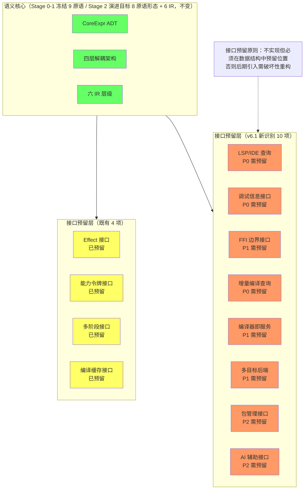

# Stage 0 能力矩阵与 12 个能力模型完整设计

> **Author**: kerf-doc-agent
> **Date**: 2026-09-11（v6.1：next4.md 第八轮吸收——接口预留完整性审查 §3.3-§3.5 新增（10 个新识别关键接口 + 完整矩阵 + P0-P3 策略）+ LSP/FFI 重分类 + 矩阵 4→14 项；v5.5：v6.0 审查修正；v5.4：r8 批次 D——Effect 编译器内部做实与能力模型 I/O 基础传递做实注记；v5.3：r7 批次 C——编译缓存 P2 做实注记 + 类型检查器 Stage 1 引入交付注记；v5.2：§3.1 四项预留接口以 reserved.rs 冻结签名回填（#16）+ 能力模型 I/O P3→P2（#21））
> **Version**: v6.3（v6.2 r33 三义消歧指针 + 语言能力架构接线；**v6.3 K2/r36 大阶段末深审回写——§14.8 B2-4：§3.1.1 Effect 节态由 r8 口径升 r25/r28 终态（语言面 P0：M1-M5 + 静态收敛；ext1 已激活；continuation 四要素）**）
> **Status**: Active

> 本文件是 12 个能力模型详细设计（原 §8）的**唯一完整副本**，同时收录 Stage 0 能力矩阵与职责边界（原 §7：三层分类矩阵与架构原则）、接口预留与完全推迟的能力（原 §9 全文）、以及三个待定决策的前置架构约束（原 §15）。其中 §8.1/§8.6/§8.7、§8.9/§8.10、§8.12、§8.8/§8.11 的正文同时收录于对应主题文件（[02-语法模型](./02-syntax-model.md) / [03-宏系统](./03-macro-system.md) / [04-字节码 VM](./04-bytecode-vm.md) / [05-运行时](./05-runtime.md)）以保证自包含；关键算法伪代码收口于 02-05 的「实现框架」章节。能力选型的批判性审视与 2026 现代方案见 [14-替代设计](./14-design-alternatives.md)；能力引入时机与处理程度（P0-P4）的进程视角见 [12-路线图 §2](./12-roadmap.md)。
>
> **术语消歧指针（v6.2 r33 / 54-a）**：本文件的「能力」= **工程能力**（Engineering Capability——构建编译器所需技术，三层分类）；**语言能力**（运行时能力域 L0-L3 四层四要素）owner = [21-能力架构](./21-capability-architecture.md)；**授权**（ocap 安全语义——require 门控/FFI 令牌，本文件 §3.1.3「能力模型 I/O」在此坐标系下 = L3 授权层的 io 族实施）owner = [21 §4](./21-capability-architecture.md)。三义禁互换（[21 §1 定锚表](./21-capability-architecture.md)）。

---

## 1. Stage 0 能力矩阵与职责边界（原 §7）

> **截至 2026 年，Stage 0 应采用"混合务实"策略——核心语义层使用经过验证的传统方案（元循环求值器、闭包、基础同像性），基础设施层采用 2026 年已成熟的现代方案（类型化 Token 流、Span 追踪、结构化诊断），而高级 2026 方案（Effect Handlers、多阶段编程、能力模型 I/O）应仅设计接口预留而不实现——因为它们要么生态尚未完全成熟（如 Mojo 的"内存安全模型尚未完成"），要么仍主要处于研究阶段（如 MetaOCaml 的"实际实现往往使用启发式方法"）。**

### 1.1 能力矩阵 v4.0：三层分类（必须实现 / 接口预留 / 完全推迟）（原 §7.1）

#### 1.1.1 完整三层分类矩阵（原 §7.1.1）

| 能力模型 | 分类 | 2026 技术选择 | 成熟度评估 | 推迟到 |
|---------|------|-------------|-----------|--------|
| **类型化 Token 流 Reader** | ✅ 必须实现 | Rust proc-macro 风格 | ✅ 成熟（Rust 生产验证） | - |
| **图 IR（含共享）** | ✅ 必须实现 | 类型化节点 + 共享边 | ⚠️ 新兴（LLVM/GCC 生产验证） | - |
| **结构化 CodeValue** | ✅ 必须实现 | 携带类型/Span/Scope 的代码值 | ✅ 成熟（Rust + MetaOCaml 验证） | - |
| **元循环求值器（简化版）** | ✅ 必须实现 | 传统 eval/apply（不用 Effects） | ✅ 极成熟（60 年验证） | - |
| **基础闭包** | ✅ 必须实现 | 传统词法闭包 | ✅ 极成熟 | - |
| **Span 全管线传播** | ✅ 必须实现 | rustc 风格 Span 系统 | ✅ 成熟 | - |
| **结构化诊断框架** | ✅ 必须实现 | rustc diagnostic 风格 | ✅ 成熟 | - |
| **最小 I/O（传统）** | ✅ 必须实现 | 单 syscall / stdin/stdout | ✅ 极成熟 | - |
| **相位分离系统** | ✅ 必须实现 | Racket 风格 Phase 0/1 | ✅ 成熟 | - |
| **基础宏系统** | ✅ 必须实现 | 卫生宏 + SyntaxObject | ✅ 成熟（Racket 验证） | - |
| **标记-清除 GC** | ✅ 必须实现 | bump-pointer + 递归标记 | ✅ 成熟 | - |
| **字节码 VM** | ✅ 必须实现 | switch-dispatch，约 35 操作码 | ✅ 成熟 | - |
| **Effect Handlers** | ⚠️ 接口预留 | OCaml 5 风格（仅类型定义） | ⚠️ 新兴（正在用于 Forester 6.0） | Stage 2 |
| **多阶段编程** | ⚠️ 接口预留 | MetaOCaml 风格（仅类型定义） | ⚠️ 研究（实际实现使用启发式） | Stage 2 |
| **能力模型 I/O** | ⚠️ 接口预留 | 线性类型 + capability | ⚠️ 新兴（Rust 所有权验证） | Stage 1 |
| **编译缓存** | ✅ 做实（r7，P2 最小体） | 查询式缓存（内存内容寻址：SHA-256 截断键 + 三方法 + 管线富入口；salsa 依赖图 Stage 2 深化） | ✅ 成熟（rustc 增量验证） | Stage 2 深化 |
| **LSP/IDE 查询**（v6.1 重分类） | ⚠️ 接口预留 | LanguageService + IncrementalAst trait | ✅ 成熟（LSP 协议生态） | Stage 2 实现 / Stage 0 预留位置 |
| **调试信息生成**（v6.1 新增） | ⚠️ 接口预留 | DebugInfoGenerator + DebugTraceable trait | ✅ 成熟（DWARF 标准） | Stage 2 实现 / Stage 0 预留位置 |
| **FFI 边界**（v6.1 重分类） | ⚠️ 接口预留 | ExternalType + FfiBoundary trait | ✅ 成熟（C ABI） | Stage 2 实现 / Stage 0 预留位置 |
| **增量编译查询**（v6.1 新增） | ⚠️ 接口预留 | QuerySystem + Query trait（salsa 风格） | ✅ 成熟（rustc/salsa 验证） | Stage 2 深化 / Stage 0 预留架构 |
| **编译器即服务**（v6.1 新增） | ⚠️ 接口预留 | CompilerService + 可序列化状态 | ✅ 成熟（2026 服务化趋势） | Stage 2 实现 / Stage 0 预留可序列化边界 |
| **多目标后端**（v6.1 新增） | ⚠️ 接口预留 | CodegenBackend trait（WASM/QBE/LLVM） | ✅ 成熟（QBE 验证） | Stage 2 实现 / Stage 0 预留 trait |
| **包管理**（v6.1 新增） | ⚠️ 接口预留 | PackageManager + ExternalModule trait | ✅ 成熟（Cargo 实证） | Stage 1 基础 / Stage 0 预留模块边界 |
| **AI 辅助接口**（v6.1 新增） | ⚠️ 接口预留 | AiAssistant 语义 API trait | ⚠️ 新兴（2026 AI 生态） | Stage 1 基础 / Stage 0 预留语义查询 |
| **本地码生成** | ❌ 完全推迟 | QBE/LLVM/C 转译 | ✅ 成熟（非 Stage 0 目标） | Stage 2 |
| **类型检查器** | ✅ Stage 1 已引入（r7，外部 Rust 实现） | 保守静态检查（R1-R8 确定性规则 + 多错误收集；Hindley-Milner 完全体 Stage 2+） | ✅ 成熟（循环依赖经外部实现缓解） | Stage 2 完全体 |
| **优化器** | ❌ 完全推迟 | 分代/增量 | ✅ 成熟（非 Stage 0 目标） | Stage 3+ |
| **GC（高级）** | ❌ 完全推迟 | 分代/增量/并发 | ✅ 成熟 | Stage 2+ |
| **JIT** | ❌ 完全推迟 | 元追踪 | ✅ 成熟 | Stage 3 |
| **并发/线程** | ❌ 完全推迟 | Actor / CSP / STM | ✅ 成熟 | Stage 3 |

> **v6.1 增补**：接口预留层由 4 项扩至 14 项（上表 ⚠️ 行）——完整性与优先级依据见本文 [§3.3-§3.5](#33-2026-接口预留完整性审查v61-新增)（next4.md 第八轮：2026 接口预留完整性审查）。「LSP 集成」与「FFI」自完全推迟层重分类：实现仍推迟，但 Stage 0 必须预留数据结构位置（否则后期破坏性重构）。

#### 1.1.2 三层分类的设计哲学（原 §7.1.2）

**为何采用三层分类而非二元"实现/推迟"**：

1. **必须实现层** = Stage 0 的核心交付物。语义引擎用最成熟的传统方案，避免技术风险；基础设施用 2026 年已成熟的现代方案，提升工程质量
2. **接口预留层** = 为 2026 年前沿技术留好位置。仅定义类型签名和 trait/模块接口，不写实现。Stage 1+ 可以无缝替换为前沿方案的实现，而无需破坏现有调用方
3. **完全推迟层** = 不在 Stage 0 设计范围内。要么存在循环依赖（类型检查器），要么非 Stage 0 目标（优化器、JIT），要么会破坏自举闭环（FFI）

### 1.2 2026 年架构原则总结（原 §7.2）

**Stage 0 的设计哲学是"用经过验证的成熟技术构建语义引擎，用 2026 年已成熟的基础设施技术（类型化 Token 流、Span 系统、结构化诊断）提升工程质量，为 2026 年的前沿技术（Effect Handlers、多阶段编程、能力模型）预留演进空间"。**

这不是保守主义，而是工程务实——2026 年的技术前沿（如 Mojo 的"内存安全模型尚未完成"、MetaOCaml 的"实际实现使用启发式"）表明，直接采用最前沿方案存在风险。**正确策略是：在数据结构和接口层面为前沿技术留好位置，在实现层面使用成熟方案，在 Stage 2+ 逐步替换为前沿方案的实现。**

**四个核心架构原则**：
1. **成熟技术优先原则**：Stage 0 的每个组件都使用至少在生产环境验证过的技术
2. **接口先行原则**：为 2026 前沿技术（Effects、多阶段、能力 I/O）与工具链生态接口（LSP 查询、调试信息、增量查询、FFI、服务化、包管理、AI 辅助——v6.1 完整清单见本文 §3.4）预留接口但不实现
3. **传统+现代混合原则**：核心语义用传统方案（60 年验证），基础设施用现代方案（Rust 生态验证）
4. **渐进演进原则**：Stage 1+ 可以替换 Stage 0 的实现，但接口契约不变

本章确立的"混合务实"策略（成熟语义方案 + 现代基础设施 + 前沿技术接口预留）是后续所有架构决策的裁决标准：本文 §2 按「能力模型 → 职责边界 → 接口契约」三段式展开 12 个必须实现的能力，本文 §3 锁定接口预留与完全推迟的边界，[15-架构分层](./15-architecture-layers.md) 给出分层与调用关系的总览。当任何新设计诉求与三层分类冲突时，回到本文 §1.1.2 的三条设计哲学重新裁决。v6.1 增补：接口预留层的完整性以本文 §3.4 矩阵为准（4 项既有预留 + 10 项新识别预留），其裁决基线是第 32 条原则——预留的本质是「为未来留出空间」而非「提前实现」（[17-设计原则 §1](./17-principles.md)）。

---

## 2. 必须实现的 12 个能力模型详细设计（原 §8）

> 本章覆盖本文 §1.1 矩阵中「必须实现」层的全部 12 个能力模型 = **10 个语义与编译期能力**（Reader、图 IR、CodeValue、元循环求值器、闭包、Span、诊断、最小 I/O、相位分离、宏系统）+ **2 个运行时基座**（标记-清除 GC、字节码 VM）。原 v3.0 将其表述为"10+2"，v4.0 起统一为"12 个能力模型（10 + 2）"。每个能力按「能力模型 → 职责边界 → 接口契约」三段式组织；关键算法的完整可落地伪代码统一收口在「实现框架」系列文档：[02-语法模型 §6（Reader）](./02-syntax-model.md)、[03-宏系统 §4（Expander）](./03-macro-system.md)、[04-字节码 VM §2/§3（Compiler/VM）](./04-bytecode-vm.md)、[05-运行时 §4（GC）](./05-runtime.md)。

### 2.1 类型化 Token 流 Reader（原 §8.1）

**能力模型**：

```rust
// 2026 成熟方案：Rust proc-macro 风格的类型化 Token
#[derive(Debug, Clone)]
pub struct Token {
    pub kind: TokenKind,      // 类型化的 Token 种类
    pub span: Span,           // 源位置（file, start_line, start_col, end_line, end_col）
    pub scope_id: ScopeId,   // 作用域标识
}

#[derive(Debug, Clone)]
pub enum TokenKind {
    // 字面量
    IntLiteral(i64), FloatLiteral(f64), 
    StringLiteral(Rc<str>), BoolLiteral(bool),
    
    // 标识符
    Identifier(Symbol),         // interned string
    TypeIdentifier(Symbol),
    
    // 关键字
    Keyword(Keyword),           // fn, let, if, match, ...
    
    // 运算符（携带优先级信息）
    Operator(Operator),
    
    // 分隔符
    Delimiter(Delimiter),       // (, ), {, }, [, ]
    
    // 宏扩展点
    MacroInvocation(Symbol),
    
    Eof,
}
```

**职责边界**：
- **做什么**：将字符流转为类型化 Token 流；附带 Span 和 Scope 信息
- **不做什么**：不做语法分析；不执行宏展开；不判断类型正确性

**接口契约**：

```rust
pub trait Reader {
    fn tokenize(&mut self, source: &str) -> Result<Vec<Token>, LexError>;
    // 保证：输出的 Token 流覆盖整个输入（无损）
    // 保证：每个 Token 携带精确的 Span
    // 保证：词法错误返回结构化的 LexError（含位置信息）
}
```

### 2.2 图 IR（含共享节点）（原 §8.2）

**能力模型**：

```rust
pub struct GraphIR {
    pub nodes: Arena<IRNode>,     // arena 分配，NodeId 索引
    pub edges: Vec<IEdge>,
    pub node_map: FxHashMap<IRNodeHash, Vec<NodeId>>,  // 哈希 → 节点（支持共享查找）
}

pub enum IRNode {
    // 操作节点
    BinOp { op: Operator, lhs: NodeId, rhs: NodeId },
    Call { callee: NodeId, args: Vec<NodeId> },
    Lambda { params: Vec<Symbol>, body: NodeId },
    
    // 数据节点
    Literal(LiteralValue),
    Variable(Symbol),
    
    // 控制流
    If { cond: NodeId, then_branch: NodeId, else_branch: NodeId },
    
    // 每个节点都携带 Span 和类型信息
    // (在 Arena 中通过辅助表存储)
}

pub struct NodeMetadata {
    pub span: Span,
    pub type_info: Option<TypeInfo>,
    pub scope: ScopeSet,
}
```

**职责边界**：
- **做什么**：表示程序的结构化形式；支持节点共享（公共子表达式）；携带完整的元信息
- **不做什么**：不执行求值；不做类型推断；不处理控制流执行顺序

**接口契约**：

```rust
pub trait IR {
    type NodeId;
    
    // 构造
    fn add_node(&mut self, node: IRNode, meta: NodeMetadata) -> NodeId;
    fn add_edge(&mut self, from: NodeId, to: NodeId, kind: EdgeKind);
    
    // 查询
    fn get_node(&self, id: NodeId) -> &IRNode;
    fn get_metadata(&self, id: NodeId) -> &NodeMetadata;
    fn find_shared(&self, node: &IRNode) -> Vec<NodeId>;  // 查找共享节点
    
    // 变换（不可变，返回新 IR）
    fn map_nodes(&self, f: impl Fn(NodeId, &IRNode) -> IRNode) -> Self;
    fn substitute(&self, var: Symbol, replacement: NodeId) -> Self;
}
```

### 2.3 结构化 CodeValue（原 §8.3）

**能力模型**：

```rust
pub struct CodeValue {
    pub ir: GraphIR,             // 完整的图 IR
    pub span: Span,              // 源位置
    pub scope: ScopeSet,         // 作用域
    pub type_info: Option<TypeInfo>,  // 类型信息（如果已知）
    pub free_vars: Vec<Symbol>,  // 自由变量列表
    pub stage: Stage,            // 阶段信息（为多阶段编程预留）
}
```

**接口契约**：

```rust
pub trait CodeValue {
    // 检查
    fn is_well_formed(&self) -> bool;
    fn free_variables(&self) -> Vec<Symbol>;
    
    // 变换（不可变）
    fn substitute(&self, var: Symbol, val: &CodeValue) -> Self;
    fn alpha_rename(&self, from: Symbol, to: Symbol) -> Self;
    
    // 多阶段编程的接口预留（Stage 2 实现）
    fn compose_with(&self, other: &Self) -> Result<Self, CompositionError>;
    
    // 职责边界：仅作为代码的值表示，不执行隐式编译
}
```

### 2.4 元循环求值器（简化版）（原 §8.4）

**为什么用传统方案而非 Effect Handlers**：OCaml 5 的效应系统虽然"正在 Forester 6.0 中实际使用"，但主要用于工具和基础设施，而非作为语言核心的求值器。Stage 0 用传统的 eval/apply 相互递归更安全。

**能力模型**：

```rust
// 简化的元循环求值器（不用 Effects）
pub enum Value {
    Closure { params: Vec<Symbol>, body: NodeId, env: Env },
    Literal(LiteralValue),
    Unit,
}

pub type Env = Rc<RefCell<HashMap<Symbol, Value>>>;

pub fn eval(ir: &GraphIR, node: NodeId, env: &Env) -> Result<Value, EvalError> {
    match ir.get_node(node) {
        IRNode::Literal(v) => Ok(Value::Literal(v.clone())),
        
        IRNode::Variable(name) => {
            env.borrow().get(name).cloned()
                .ok_or(EvalError::UnboundVariable(name.clone()))
        }
        
        IRNode::Lambda { params, body } => {
            Ok(Value::Closure { 
                params: params.clone(), 
                body: *body, 
                env: env.clone() 
            })
        }
        
        IRNode::Call { callee, args } => {
            let f = eval(ir, *callee, env)?;
            let mut arg_vals = Vec::new();
            for arg in args {
                arg_vals.push(eval(ir, *arg, env)?);
            }
            apply(f, arg_vals, ir)
        }
        
        IRNode::If { cond, then_b, else_b } => {
            let c = eval(ir, *cond, env)?;
            match c {
                Value::Literal(LiteralValue::Bool(true)) => 
                    eval(ir, *then_b, env),
                Value::Literal(LiteralValue::Bool(false)) => 
                    eval(ir, *else_b, env),
                _ => Err(EvalError::TypeMismatch)
            }
        }
        
        // ... 其他节点类型
    }
}

pub fn apply(f: Value, args: Vec<Value>, ir: &GraphIR) -> Result<Value, EvalError> {
    match f {
        Value::Closure { params, body, env } => {
            let mut new_env = env.as_ref().clone();
            for (param, arg) in params.iter().zip(args) {
                new_env.borrow_mut().insert(param.clone(), arg);
            }
            eval(ir, body, &Rc::new(new_env))
        }
        _ => Err(EvalError::NotCallable)
    }
}
```

### 2.5 基础闭包（原 §8.5）

传统词法作用域闭包，不做任何花哨的扩展。具体而言：
- **环境捕获**：捕获定义时的词法作用域
- **不可变捕获**：捕获的环境通过 `Rc<RefCell<...>>` 共享，允许可变状态但禁止逃逸
- **不引入 Effect 系统**：保持纯词法闭包，避免 Stage 0 的复杂度爆炸

### 2.6 Span 全管线传播（原 §8.6）

rustc 风格，每个 Token / AST 节点 / IR 节点 / 字节码指令都携带 Span：

```rust
pub struct Span {
    pub file_id: FileId,
    pub start: ByteOffset,
    pub end: ByteOffset,
    pub expansion_id: ExpansionId,  // 宏展开代次
}
```

Span 在每个数据结构中作为不可变字段存在，使得：
- 任何错误都能精确定位到源码
- 调试器可以反查字节码 → IR → 源码
- 增量编译可以基于 Span 进行细粒度失效

### 2.7 结构化诊断框架（原 §8.7）

借鉴 rustc 的 Diagnostic 结构：

```rust
pub struct Diagnostic {
    pub severity: Severity,         // Error / Warning / Note / Help
    pub code: Option<DiagnosticCode>,
    pub message: String,
    pub primary_span: Span,
    pub children: Vec<SubDiagnostic>,  // 关联的次要诊断
    pub suggestions: Vec<Suggestion>,  // 修复建议
}
```

**架构原则**：错误是数据而非异常；支持错误恢复策略；多阶段错误关联。

### 2.8 最小 I/O（传统）（原 §8.8）

仅 `read_line()` 和 `write_line()`，通过全局函数（非能力模型）。Stage 0 不引入能力模型 I/O，但 VM 栈帧和分配器接口必须预留 `register_foreign_ref` 等接口（Stage 0 可为 no-op），以便 Stage 1+ 升级到能力模型时无需破坏接口。

### 2.9 相位分离系统（原 §8.9）

Phase 0（运行时）/ Phase 1（宏展开时）的严格分离，参考 Racket 设计。

**三个关键规则**：
1. Phase 1 代码只能产生 Phase 0 代码，不能直接执行 Phase 0 代码
2. 区分"实例化"（执行模块体）和"访问"（仅执行 Phase 1 部分）
3. 传递依赖的相位传播

模块生命周期通过 **declare / instantiate / visit** 三种操作管理：declare 登记模块与其相位声明，instantiate 执行模块体（Phase 0 实例化），visit 仅执行 Phase 1 部分（宏变换器加载）。该模型的完整架构约束论述见 [03-宏系统 §3（模块相位分离系统）](./03-macro-system.md)。

### 2.10 基础宏系统（原 §8.10）

卫生宏 + SyntaxObject，参考 Racket 但简化实现。Stage 0 的宏系统是"骨架"——支持宏定义、宏展开、卫生性保证，但不支持复杂的宏组合（如 `syntax-parse`）。

### 2.11 标记-清除 GC（最小实现）（原 §8.11）

Bump-pointer 分配 + 递归标记 + 堆遍历清除。根集包括 VM 栈、调用栈局部变量、全局环境和 C 栈显式根。Stage 0 用最简单的 mark-sweep，避免分代/增量/并发的复杂度。

**实现指引**：分配、标记、清除三个阶段的完整伪代码与栈溢出对策见 [05-运行时 §4](./05-runtime.md)。

### 2.12 字节码 VM（原 §8.12）

switch-dispatch 循环，处理约 35 个操作码。完整操作码定义涵盖：
- **栈操作**：PUSH, POP, DUP, SWAP
- **函数操作**：CALL, RET, CLOSURE
- **控制流**：JUMP, JUMP_IF_FALSE
- **数据构造**：MAKE_PAIR, CAR, CDR
- **变量访问**：LOAD_LOCAL, STORE_LOCAL, LOAD_GLOBAL, STORE_GLOBAL
- **算术**：ADD, SUB, MUL, DIV
- **终止**：HALT

**VM 状态包含**：代码、数据栈、调用栈、全局环境、常量池和调试信息表。

**调用栈帧包含三个扩展槽**（Stage 0 可以为空，但格式必须保留）：
- `ext1`：为 continuation/effect handler 预留
- `ext2`：为异常处理表预留  
- `ext3`：为调试帧信息预留

**Forth 语言的线程码技术展示了 VM 极简设计的极限**：整个 VM 的核心仅由 NEXT、DOCOL、EXIT、LIT 四个原语构成。

**实现指引**：跳转回填的字节码生成与 switch-dispatch 执行循环的完整伪代码见 [04-字节码 VM §2 与 §3](./04-bytecode-vm.md)。原 v3.0 §8.6「字节码 VM 设计」与本节内容重复，v4.0 已合并至此。

---

## 3. 接口预留与完全推迟的能力（原 §9）

> **接口预留层与完全推迟层共同构成 Stage 0 的"未来边界"。** 二者的区别是本质性的：接口预留层**已确定将被采用**，仅推迟实现（Stage 1-2 落地，Stage 0 冻结类型签名）；完全推迟层**尚未承诺采用**（存在明确的推迟理由，Stage 1+ 重新评估）。这一区分直接决定了本章两类内容的阅读方式——前者是"必须兑现的期票"，后者是"保留的选择权"。

> **v6.1 增补（next4.md 第八轮）**：本章从「4 项预留 + 8 项推迟」扩展为「14 项预留 + 6 项推迟」——本文 [§3.3-§3.5](#33-2026-接口预留完整性审查v61-新增) 是 2026 接口预留完整性审查的完整吸收：既有预留（效应系统、能力模型、多阶段编程、编译缓存、类型系统、IR 层级六类）覆盖约 70% 的已知需求，缺失的 30% 关键接口（LSP/IDE 查询、调试信息、FFI 边界、增量编译查询、编译器即服务、多目标后端、包管理、AI 辅助等 10 项）在 §3.3 逐项设计、§3.4 汇成矩阵、§3.5 给出 P0-P3 优先级与预留原则。这些接口的共同特征是：**不需要在 Stage 0 实现，但必须在 Stage 0 的数据结构中预留位置，否则后期引入时需要破坏性重构。**

### 3.1 接口预留的 4 个语言能力（原 §9.1）

> **v7.0 术语消歧注（r19 / 41-a——capability-model-design.md D1/D2）**：本节
> 标题原称「4 个能力模型」存在术语双义——本节语境指**语言能力**（feature
> 项：Effect/多阶段/能力门控/编译缓存），而「能力模型」此后专指**权限
> 安全模型**（capability security model——令牌/授权/验证/演算）。
> 为消除歧义，本节标题改称「语言能力」；§3.1.3 内部进一步拆出**模型层
> 骨架**（reserved/capability_model.rs——r19 冻结 P3）与**族实例层**
> （capability_io.rs），不计入预留项计数（14 项不变）。

> **v5.2 签名权威声明（deep-review R1 偏差 #16）**：本节四项预留接口的**冻结签名权威是 `kerf-driver/src/reserved.rs`**（冻结性经 Probe 实现测试 `reserved_signatures_are_frozen` 证明——「测试实现体编译通过 = 契约冻结」）。早期版本的伪签名（如 `Self::Effect::Result` 关联类型路径、`splice(code) -> Self::Code::Inner` 等不可编译形态）仅为设计草稿，以下全部回填为可编译的真实冻结签名。

#### 3.1.1 Effect Handlers（P0 语言面已做实——r25 全量 + r28 静态收敛；历史：r8 编译器内部做实）（原 §9.1.1）

> **r8 交付注记（2026-09-10，批次 D）**：[12-路线图 §2.5.1](./12-roadmap.md) 演进矩阵
> Stage 1 行「做实引入（**编译器内部**）」已兑现——`kerf-driver/src/effects.rs`
> 双层做实：(1) **类型化一次性逃逸层**（`handle_escape<R,T>`/`perform_escape<T>`）：
> 载荷从任意嵌套深度上展开至最近同类型边界，零签名污染（「任意流程节点
> 能力」的机械实现）；线程局部深度计数 + `catch_unwind`/`resume_unwind`
> std-only 载荷逃逸 + 私有载荷类型判别的 panic hook 过滤（效应控制流零
> 噪声，真实 panic 照常报告）；(2) **冻结契约层**（`InternalEffectSystem`）：
> 本节 trait 的真实现（与 Probe 测试构成契约可编译/可承载双证）。**语言面
> 保持 P3**（D1 裁定：语言级 perform/handle 语义仍留 Stage 2——多次恢复
> continuation 不实现，`Continuation` 维持 unit 形状留白）；消费面 =
> `kerf test` 用例短路 + 错误恢复（[11-测试 §4](./11-testing.md)）。
> VM 帧 `ext1` 槽位不激活（Stage 2 语言级效应时启用）。
>
> **r25/r28 终态注记（v6.3/K2-r36 补——本节原停 r8 口径，代码侧早已演进）**：
> 语言级效应 **M1-M5 全量交付（r25/42-f）**：原语集 9→11（perform/handle）
> + resume 脱糖（D4）+ VM `ext1` 具体化为 `Option<Rc<HandlerFrame>>`
> （INSTALL_HANDLER/PERFORM 两指令，三原型帧编排 T/H/B + trampoline
> 惰性单例）+ continuation 值四要素（帧链/数据栈快照/恢复点/线性唯一
> ——多次恢复已实现，E0008 二次恢复检出）+ E0007-E0009 诊断族 + GC
> 第六来源（活跃 continuation 帧链，05 §3.2 v6.3 同步）+ 自举双侧 parity。
> **静态收敛面（r28/49-a）**：typecheck.rs/hm.rs Perform 效应值入 R1-R8/
> HM 检查域 + Handle 两体入检出域（双面检出超集纪律——tc+hm）。
> 语言面 P0 口径；行多态/效应行属 Stage 3（typecheck.rs:362 注记锚）。

**预留接口（Stage 0 冻结，P3——仅类型形状）**：

```rust
// reserved.rs 冻结签名（可编译）
pub trait EffectFamily {
    /// 执行该效应后的结果值（P3 形状：以 Value 具体化——Stage 2 可细化为泛型关联）。
    type Result;
}

pub trait Effect {
    /// 所属效应族。
    type Family: EffectFamily<Result = Value>;
}

pub trait EffectSystem {
    type Effect: Effect;
    type Handler;
    type Continuation;

    /// 执行效应：挂起并向上传递（Stage 2 实现；P3 形状：结果经 Value）。
    fn perform(&self, effect: Self::Effect) -> Value;

    /// 安装效应处理器并执行计算（Stage 2 实现）。
    fn handle(&self, handler: Self::Handler, computation: impl FnOnce() -> Value) -> Value;
}
```

**行为规格**（完整语义见 stage0.md §6.4）：`perform` 挂起当前计算，向上查找匹配的 handler；`handle` 安装 handler 并执行计算——效应触发时以 continuation 恢复。Stage 0 裁定：传统闭包（§21.10 决策点 2）；Effects 于 Stage 2 语言级引入。

**预留原因**：OCaml 5 的效应系统正在"实际使用于编译器基础设施"，但作为语言核心的求值器仍属前沿。

#### 3.1.2 多阶段编程（接口预留）（原 §9.1.2）

**预留接口（Stage 0 冻结，P3——仅类型形状）**：

```rust
// reserved.rs 冻结签名（可编译）
pub trait MultiStage {
    /// 代码值类型（Stage 2 具体化为 `CodeValue`）。
    type Code;

    /// 引号：表达式 → 代码值（Stage 2 实现）。
    fn quote(&self, expr: &CoreExpr) -> Self::Code;

    /// 拼接：代码值 → 当前阶段代码（Stage 2 实现）。
    fn splice(&self, code: &Self::Code) -> Result<CoreExpr, RuntimeError>;

    /// 执行代码值（Stage 2 实现）。
    fn run(&self, code: &Self::Code) -> Result<Value, RuntimeError>;
}
```

**行为规格**（MetaOCaml 语义，stage0.md §6.1）：`quote` 将表达式提升为代码值（良构/良作用域保证）；`splice` 将代码值拼接进当前阶段语法；`run` 执行未来阶段代码（Stage 2 做实为编译期计算）。Stage 0 裁定：元循环求值器（§21.10 决策点 1）；多阶段于 Stage 2+ 替换。

**预留原因**：MetaOCaml 虽然理论上成熟（"良构的、良类型的和良作用域的"），但"实际实现往往使用启发式方法"。

#### 3.1.3 能力模型 I/O（P2 做实基础传递——r8 批次 D 交付注记）（原 §9.1.3）

> **r8 交付注记（2026-09-10，批次 D）**：「Stage 1 基础传递」已兑现——三层
> 分工落地（interface-contract-review F2 修复裁定）：`reserved.rs` 冻结契约
> （签名权威）+ `kerf-driver/src/capability.rs` 铸造/实现/验证 + `builtins.rs`
> 消费。程序侧声明面 = 新声明形式 `(require io read|write)`（[01-核心原语
> §6](./01-core-forms.md)——零运行时语义，幂等集合）；R9 保守静态权限验证
> （下述条款 3：门控内置名任意位置引用未声明 → **编译期错误 E0006**，
> front 管线 run/eval/check/compile 全路径单一验证点；用户接管豁免 +
> 卫生回退基名判定防误报）；`IoGrant` 令牌铸造（pub(crate) 构造面——
> 不可伪造）+ `StdCapabilityIO`（stdio 实现）+ I/O 内置能力参数化（条款 4：
> `register_globals` 按授权面注册门控内置——未声明即不注册，fail-closed）。
> 令牌线性语义以 `Rc<RefCell<>>` 承载（借用期互斥 = 线性近似，Stage 2
> 令牌值化时消除）。

> **v7.0 模型层/族层分离注（r19 / 41-a）**：本节经
> [capability-model-design.md](../../develop/v0/stage-2/capability-model-design.md)
> D3-D4 裁定后形成三层形态——**模型层骨架**（`reserved/capability_model.rs`
> 新增：`CapabilityModelFamily` 族形状 + `TokenCalculus` 演算位
> （attenuate/revoke——Stage 2/3 窗口），P3 冻结 + Probe 四测试）、
> **族实例层**（本节既有 io 族契约——签名零变化，原则 27）、**管线层**
> （`crate::capability` 授权管线——M2 泛化命名迁移窗口 = 批次 I 后段）。
> 设计动机：IO 是能力模型的第一实例（FFI 线性令牌 `CPointer` 是第二
> 实例——§3.3.4/G3 设计）；模型层锚位使 net/process 等族（12 §2.4.5
> Stage 2 行）引入从「五点手术」收敛为「三点加法」（设计 D11）。
> 化学反应矩阵（×效应 ×多阶段 ×缓存 ×FFI ×HM ×工具链——正交可组合
> 不合并）见设计文档 §5。**本注不改变本节 P2 处理程度与四条款规格。**

**处理程度（v5.2 修订，deep-review R1 偏差 #21）**：**P2**（原记 P3）——reserved.rs 的 `CapabilityIO` 冻结签名附带**完整行为规格**（下述 4 条），满足 P2 判据「冻结类型签名与行为规格，无实现」（[12-路线图 §2.1.2](./12-roadmap.md) 五级标度）——与 [17-设计原则 §1 原则 26](./17-principles.md) 三级成熟度匹配规则的「研究前沿 → P3」裁定并不冲突：规则给出的是**上限**，实现策略上为Stage 1 直达预留了完整规格（超规格交付）。

**预留接口（Stage 0 冻结，P2）**：

```rust
// reserved.rs 冻结签名（可编译）
/// 读能力令牌（不可伪造——私有构造，经权限传递获得）。
pub struct ReadCapability { _private: () }

/// 写能力令牌（不可伪造）。
pub struct WriteCapability { _private: () }

/// 能力模型 I/O 错误。
#[derive(Debug, Clone, PartialEq, Eq)]
pub struct IOError { pub message: String }

pub trait CapabilityIO {
    /// 读一行（需要读能力，Stage 1+ 实现）。
    fn read_line(cap: &mut ReadCapability) -> Result<String, IOError>;

    /// 写一行（需要写能力，Stage 1+ 实现）。
    fn write_line(cap: &mut WriteCapability, s: &str) -> Result<(), IOError>;
}
```

**完整行为规格**（P2——Stage 1 可直接按规格实现）：
1. `read_line` 仅在持有 `ReadCapability` 时可调用——令牌经线性传递，不可复制、不可伪造；
2. `write_line` 同理（`WriteCapability`）；
3. 无令牌的 I/O 调用为**编译期错误**（权限验证，非运行时检查）；
4. 与 Stage 0 传统 I/O（kerf-runtime::io 全局函数）的替换关系：渐进替换原则 §28——driver 注册的内置函数改为能力参数化形态，全局函数逐步退役。

Stage 0 裁定：传统 I/O（§21.10 决策点 3）；能力模型于 Stage 1 基础 / Stage 2 完整引入。

#### 3.1.4 编译缓存（P2 做实——r7 批次 C 交付注记）

> **r7 交付注记（2026-09-10，批次 C）**：三方法规格已按原文落地——
> `kerf-driver/src/cache.rs` 的 `InMemoryCompilationCache` 实现本节冻结
> trait（`get_cached`/`store`/`invalidate` 行为规格 1/2/3 逐条测试锁定），
> 另增管线富入口（`lookup_front`/`store_front` 携带完整前端输出——run/eval/check
> 路径复用）与 SHA-256 内容寻址键（源哈希截断 u64 + 配置指纹=阶段种子+文件名，
> `kerf-driver/src/hash.rs` 零依赖自实现，NIST 向量锚定）。
> §21.3 Stage 1 条件 4「增量编译基础设施可用」就位；Stage 2 salsa
> 依赖图深化时三方法签名不变（规格条款 4）。

**预留接口（Stage 0 冻结，P2）**：

```rust
// reserved.rs 冻结签名（可编译）
/// 缓存键（源哈希 + 编译配置指纹——确定性编译的键）。
#[derive(Debug, Clone, PartialEq, Eq, Hash)]
pub struct CacheKey {
    pub source_hash: u64,        // 源文本内容哈希（Stage 1：SHA-256 内容寻址）
    pub config_fingerprint: u64, // 编译配置指纹（阶段版本 + 选项）
}

/// 缓存结果（编译产物——字节码 + 核心表达式 + 代码值）。
#[derive(Debug, Clone)]
pub struct CachedResult {
    pub program: BcProgram,
    pub core: Vec<Rc<CoreExpr>>,
    pub code_value: Option<CodeValue>,
}

pub trait CompilationCache {
    /// 查询缓存。
    fn get_cached(&self, key: &CacheKey) -> Option<CachedResult>;

    /// 写入缓存。
    fn store(&mut self, key: CacheKey, result: CachedResult);

    /// 失效缓存项。
    fn invalidate(&mut self, key: &CacheKey);
}
```

**完整行为规格**（P2——Stage 1 可直接按规格实现）：
1. `get_cached`：键命中返回产物（内容寻址——源不变 + 配置不变 → 产物必然等价，可直接复用）；
2. `store`：写入缓存（幂等——同键覆盖）；
3. `invalidate`：显式失效（源变更由键哈希自然区分；此方法用于编译器升级等全量失效场景）；
4. Stage 2 深化：查询式增量编译（salsa 风格依赖图），本三方法保持签名不变（渐进替换原则 §28）。

> 既有四项预留的覆盖度评估与缺失需求清单见本文 [§3.3.1](#331-已预留接口的覆盖度评估)——其中「分布式效应」「能力委托与组合」「跨阶段持久化」「跨会话缓存」等缺失需求由 §3.3.10 的边界增补与后续阶段演进承接。

### 3.2 完全推迟的能力（原 §9.2）

> **v6.1 边界调和**：原列于本层的「LSP 集成」与「FFI」重分类至接口预留层（本文 [§3.3.2](#332-lspide-集成接口p0) / [§3.3.4](#334-ffi外部函数接口p1)）——二者的**实现**仍分别推迟至 Stage 2，但 Stage 0 必须预留其数据结构位置（AST 增量与绑定查询接口 / ExternalType 与 FfiBoundary trait），否则后期引入需破坏性重构。「完全推迟」的语义由此更精确：指**尚未承诺采用**的能力（保留选择权），而非「已承诺采用但实现推迟」的期票（接口预留层语义——见本章首的区分）。

| 能力 | 推迟到 | 理由 |
|------|--------|------|
| 本地码生成 | Stage 2 | Stage 0 只需字节码 VM（后端 trait 已预留，见本文 §3.3.7） |
| 类型检查器 | **Stage 1（r7 已引入——外部 Rust 保守静态检查，循环依赖缓解落地；HM 完全体 Stage 2+）** | 循环依赖问题（需先有稳定的核心；[12-路线图 §2.6](./12-roadmap.md) 缓解：外部实现） |
| 高级 GC | Stage 2+ | Stage 0 用最简单的 mark-sweep |
| 优化器 | Stage 3 | 需要性能基准数据 |
| 并发 | Stage 3 | 语义复杂（效应系统为其预留演进口径，见本文 §3.1.1） |
| JIT | Stage 3 | 依赖 profiling 数据 |

### 3.3 2026 接口预留完整性审查（v6.1 新增）

> **本节完整吸收 next4.md 第八轮讨论**：在「具备强大可拓展性和可塑性的最小自举单元」的能力与边界设计前提下，对截至 2026 年推荐设计中的接口预留做完整性审查。核心结论：**当前设计预留了约 70% 的关键接口，但缺失了 30%——特别是 LSP/IDE、调试信息、增量编译查询这三个 P0 级接口，它们的不预留将导致后期破坏性重构。**


> **测试锚点（v6.1）**：本节全部预留 trait 的冻结性验证沿用 §3.1 的先例——签名以「测试实现体编译通过」证明契约冻结（reserved.rs Probe 模式，`reserved_signatures_are_frozen`）；新接口的 Probe 冻结测试于 r12 批次（worklog Task 31-d）交付。

#### 3.3.1 已预留接口的覆盖度评估

| 接口类别 | 具体接口 | 预留状态 | 覆盖的需求 | 缺失的需求（承接落位） |
|---------|---------|---------|-----------|-----------|
| **效应系统** | EffectKind、HandlerClause、Continuation（本文 §3.1.1） | ✅ 已预留 | 异步、并发、异常、状态 | 分布式效应、跨网络效应传播（→ §3.3.10） |
| **能力模型** | Capability、LinearType（本文 §3.1.3） | ✅ 已预留 | I/O 安全、资源管理 | 能力委托、能力组合、动态能力获取（→ §3.3.10） |
| **多阶段编程** | Code、quote/splice（本文 §3.1.2） | ✅ 已预留 | 编译期计算、代码生成 | 跨阶段持久化、运行时代码生成 |
| **编译缓存** | Cache 接口（本文 §3.1.4） | ✅ 已预留 | 增量编译（数据面） | 查询式架构（架构面 → §3.3.5）、跨会话持久化、分布式缓存 |
| **类型系统** | Row、Union、Linear | ✅ 已预留 | 渐进类型、行多态 | 依赖类型、refinement types |
| **IR 层级** | 6 层 IR 定义 | ✅ 已预留 | 渐进优化 | 后端可插拔接口（→ §3.3.7） |
| **工具链生态** | —— | ❌ 整体缺失（本版补齐） | —— | LSP/IDE 查询、调试信息、FFI、服务化、包管理、AI 辅助（→ §3.3.2-§3.3.9） |

**评估结论**：语义内核维度（效应/能力/多阶段/缓存/类型/IR）的预留基本完备；**工具链生态维度整体缺失**——而这正是 2026 年语言竞争力（IDE 体验、源级调试、生态集成、AI 协作）的基础设施，也是本节补齐的目标。

#### 3.3.2 LSP/IDE 集成接口（P0）

**为什么必须预留**：现代语言的开发体验依赖 IDE 支持，而 LSP 集成要求编译器暴露「语法/语义查询接口」——这必须在 AST 设计中预留（呼应 [17-设计原则 §1](./17-principles.md) 第 14 条原则「工具即编译器」：LSP 消费与编译器相同的语法树）。

**预留接口（不实现）**：

```rust
// ============ LSP/IDE 查询接口（Stage 0 冻结形状） ============ //

/// 编译器作为语言服务器的接口（Stage 2 实现基础 LSP 服务器）
pub trait LanguageService {
    // 语法查询
    fn syntax_tree_at(&self, file: FileId, pos: Position) -> SyntaxNode;
    fn completion_items(&self, file: FileId, pos: Position) -> Vec<CompletionItem>;
    fn document_symbols(&self, file: FileId) -> Vec<Symbol>;

    // 语义查询
    fn definition_of(&self, file: FileId, pos: Position) -> Option<Location>;
    fn references_to(&self, file: FileId, pos: Position) -> Vec<Location>;
    fn type_at(&self, file: FileId, pos: Position) -> Option<TypeInfo>;

    // 诊断
    fn diagnostics(&self, file: FileId) -> Vec<Diagnostic>;
    fn quick_fixes(&self, file: FileId, pos: Position) -> Vec<CodeAction>;

    // 重构
    fn rename_symbol(
        &mut self,
        file: FileId,
        pos: Position,
        new_name: String,
    ) -> Result<WorkspaceEdit, RenameError>;
}

/// AST 增量更新接口（LSP 的按需重析依赖于此）
pub trait IncrementalAst {
    fn apply_edit(&mut self, edit: TextEdit) -> Result<(), EditError>;
    fn invalidate_range(&mut self, range: Span);
    fn reuse_unchanged(&self, other: &Self) -> ReusePlan;
}
```

**Stage 0 必须在 AST 中预留的数据结构位置**：
1. 每个节点必须可追溯 Span（**已实现**——见本文 §2.6 Span 全管线传播）
2. 每个绑定必须可查询其作用域（需预留——作用域表支持外部遍历）
3. AST 必须可增量更新（需预留——`IncrementalAst` trait 位置）

#### 3.3.3 调试信息生成接口（P0）

**为什么必须预留**：源级调试（断点、堆栈追踪、变量查看）要求编译器在生成代码时保留「源码 ↔ 目标码」的映射——这必须在 IR 设计中预留。

**预留接口（不实现）**：

```rust
// ============ 调试信息生成接口（Stage 0 冻结形状） ============ //

/// 调试信息生成器（Stage 2 生成源映射，Stage 2+ 生成 DWARF）
pub trait DebugInfoGenerator {
    /// 将 IR 节点映射到源码位置
    fn source_location_of(&self, ir_node: NodeId) -> Option<Span>;

    /// 将目标码地址映射回 IR 节点
    fn ir_node_at(&self, code_addr: Address) -> Option<NodeId>;

    /// 变量的位置信息（在哪个寄存器/栈槽）
    fn variable_location(&self, var: VarId, at_pc: Address) -> Option<Location>;

    /// 生成 DWARF / 源映射
    fn generate_dwarf(&self) -> DwarfSections;
    fn generate_source_map(&self) -> SourceMap;
}

/// IR 节点的调试可回溯性（每个 IR 节点实现）
pub trait DebugTraceable {
    /// AST → IR 的映射（用于从 IR 回溯到源码）
    fn ast_node_id(&self) -> AstNodeId;
    /// 变量的调试名称（而非仅 de Bruijn 索引）
    fn debug_name(&self) -> Option<Symbol>;
}
```

**Stage 0 必须在 IR 中预留的数据结构位置**：
1. 每个 IR 节点保留指向 AST 节点的反向链接
2. 变量在 IR 中有稳定的 ID（而非仅 de Bruijn 索引）
3. 函数边界和调用点有唯一标识

#### 3.3.4 FFI（外部函数接口）（P1）

**为什么必须预留**：系统级语言必须与 C/系统 API 交互，这要求类型系统预留「外部类型」表示。

**预留接口（不实现）**：

```rust
// ============ FFI 边界接口（Stage 0 冻结形状） ============ //

/// 外部函数调用的类型表示
pub enum ExternalType {
    CInt(CIntSize),
    CPointer(PointeeType),
    CStruct(Vec<ExternalType>),
    CFunction {
        param: Box<ExternalType>,
        result: Box<ExternalType>,
    },
    Opaque(String), // 不透明的外部类型
}

/// FFI 调用的核心原语
pub enum FfiCall {
    /// 调用外部函数
    CallExternal {
        symbol: Symbol,
        args: Vec<CoreExpr>,
        return_type: ExternalType,
    },
    /// 分配外部内存（不经过 GC）
    AllocExternal { size: usize },
    /// 释放外部内存
    FreeExternal { ptr: CoreExpr },
}

/// FFI 边界（GC 与外部内存的隔离协议）
pub trait FfiBoundary {
    /// 外部指针的包装类型
    type ExternalPointer;

    /// 标记对象被外部代码引用（GC 不可回收）
    fn pin_object(&mut self, obj: Value);
    fn unpin_object(&mut self, obj: Value);
}
```

**Stage 0 必须预留的数据结构位置**：
1. 核心表达式必须能表示「外部调用」
2. 类型系统必须能表示「外部类型」
3. GC 必须能识别「外部引用」（不被回收——pin/unpin 协议）

**自举合规注记**：FFI 的**实现**推迟至 Stage 2（破坏自举闭环——见 本文 §3.2）；本预留仅为类型形状与 GC 边界协议，不引入对宿主 C ABI 的编译期依赖，不触碰自举链（[12-路线图 §2](./12-roadmap.md) 后端策略同口径）。

**行为规格与实现锚（r30/48-d 做实）**：行为语义 = [stage-2/ffi-ownership-model](../develop/v0/stage-2/ffi-ownership-model.md)（G3 冻结——三原语所有权责任矩阵 + GC pin/unpin 跨边界语义 + 线性令牌 + 13 边界 case）；VM 执行面已落地：操作码三指令（`CALL_EXTERNAL`/`ALLOC_EXTERNAL`/`FREE_EXTERNAL`——[04-字节码 VM §1](./04-bytecode-vm.md) 第十组，43→46）+ `FfiBoundary` 真实实现（`kerf-driver/src/ffi.rs`——P/U 规则经 Heap Φ 计数簿）+ extern 符号表（符号解析 fail-closed = E0012）+ E0010-E0012 诊断族（[18-术语 §6](./18-terminology.md)）；**语言面形式 = Stage 3**（编译臂不发射——IR/VM 面做实即 Stage 2 验收条件 4 兑现）。**§21.3 条件 4 状态：✅**。

#### 3.3.5 增量编译查询接口（P0）

**为什么必须预留**：查询式架构（[15-架构分层 §3.1](./15-architecture-layers.md)）要求所有编译中间结果通过统一接口访问——这必须在编译器架构中预留（参考 rustc 查询系统与 Salsa 框架）。

**预留接口（不实现）**：

```rust
// ============ 增量编译查询接口（Stage 0 冻结形状） ============ //

/// 查询系统：所有编译操作通过查询执行
pub trait QuerySystem {
    /// 输入：源文件（的内容寻址键）
    type Input;

    /// 执行查询（带缓存 + 依赖追踪）
    fn query(&self, descriptor: &QueryDescriptor) -> QueryResult;

    /// 输入变化时失效相关缓存
    fn invalidate(&mut self, input: Self::Input);

    /// 依赖追踪：查询 Q 依赖哪些其他查询
    fn dependencies_of(&self, descriptor: &QueryDescriptor) -> Vec<QueryDescriptor>;
}

/// 单个查询（编译器的每个 pass 必须建模为查询）
pub trait Query {
    type Input;
    type Output;

    /// 此查询依赖的其他查询（依赖必须完整声明）
    fn dependencies(&self) -> Vec<QueryDescriptor>;

    /// 执行查询（纯函数）
    fn execute(&self, db: &dyn QuerySystem) -> Self::Output;
}
```

**Stage 0 必须预留的架构位置**：
1. 编译器的每个 pass 必须建模为「查询」
2. 查询之间必须能声明依赖
3. 查询结果必须可缓存/可失效

**与 本文 §3.1.4 的关系**：编译缓存预留的是**数据面**（缓存三方法），本接口预留的是**架构面**（查询/依赖/失效协议）——二者构成 salsa 式增量编译的完整骨架；[15-架构分层 §3.1](./15-architecture-layers.md) 查询式增量编译架构是其正文展开，Stage 1+ 实现应同时落地这两个 trait。

#### 3.3.6 编译器即服务接口（P1）

**为什么必须预留**：2026 年的趋势是将编译器作为服务（浏览器中的 Playground、AI 辅助编程的 API）——这要求编译器可远程调用。

**预留接口（不实现）**：

```rust
// ============ 编译器即服务接口（Stage 0 冻结形状） ============ //

/// 编译器作为可远程调用的服务
pub trait CompilerService {
    /// 提交编译请求
    fn submit(&self, request: CompileRequest) -> CompileJobId;

    /// 查询编译状态
    fn status(&self, job: CompileJobId) -> CompileStatus;

    /// 获取编译结果
    fn result(&self, job: CompileJobId) -> Option<CompileResult>;

    /// 流式获取诊断信息
    fn diagnostics_stream(&self, job: CompileJobId) -> Vec<Diagnostic>;

    /// 取消编译
    fn cancel(&mut self, job: CompileJobId);
}

/// 编译请求（支持增量）
pub struct CompileRequest {
    /// 完整或增量的源码
    pub source: SourceInput,
    /// 编译目标（本地码/字节码/WASM）
    pub target: CompileTarget,
    /// 优化级别
    pub opt_level: OptLevel,
    /// 调试信息需求
    pub debug_info: DebugInfoRequest,
}

/// 可序列化边界（编译器状态可传输的前提）
pub trait Serializable {
    fn serialize(&self) -> Vec<u8>;
    fn deserialize(data: &[u8]) -> Result<Self, DeserializeError>
    where
        Self: Sized;
}
```

**Stage 0 必须预留的架构位置**：
1. 编译器必须是可序列化的（状态可传输）
2. 编译过程必须可中断/可恢复
3. 诊断信息必须可流式输出

**实证注记**：本项目 web Playground（`/api/playground` 编译即服务端点）即此接口的宿主侧雏形——预留 `CompilerService` 形状可让宿主侧服务化无需反向适配编译器内部结构。

#### 3.3.7 多目标后端接口（P1）

> **r17 做实迁移注记（批次 G / 38-b）**：本节冻结的契约类型（`CodegenBackend`/`WasmBackend`/`AnnotatedANF` 等）已自预留层（kerf-driver/reserved/codegen）迁入正式家 `kerf-backend/src/codegen.rs`——**签名零变化**（§2.2 原则 27），`AnnotatedANF` 从指纹占位**实化**为携带函数定义集的块式 ANF IR（fingerprint 字段保留——内容寻址口径不变）；预留层改薄 re-export（历史引用路径继续可用）。**首个做实实现**：`QbeBackend`（G1 PoC——fib 端到端本地码；详见 [10-toolchain §CLI](./10-toolchain.md) 与 RELEASE_NOTES r17）。

**为什么必须预留**：后端可插拔（IR 层级缺失需求之一）——目标中立性原则（[17-设计原则 §1](./17-principles.md) 第 13 条）的接口化落地；WebAssembly 是 2026 年的关键目标。

**预留接口（不实现）**：

```rust
// ============ 多目标后端接口（Stage 0 冻结形状） ============ //

/// 目标描述与代码生成后端
pub trait CodegenBackend {
    /// 后端支持的目标
    fn supported_targets(&self) -> Vec<TargetTriple>;

    /// 将 IR 编译为目标码
    fn compile(
        &self,
        ir: &AnnotatedANF,
        target: &TargetTriple,
    ) -> Result<CompiledModule, CodegenError>;

    /// 后端特有的优化
    fn backend_optimizations(&self) -> Vec<PassDescriptor>;
}

/// WebAssembly 后端（2026 年的关键需求：组件模型 + 接口类型 + WASM GC）
pub trait WasmBackend {
    /// 编译到 WASM 组件模型
    fn compile_component(&self, ir: &AnnotatedANF) -> Result<WasmComponent, CodegenError>;
}
```

**与 §11 后端策略的关系**：Stage 0 不引入 LLVM（[08-后端演化 §1](./08-backend-evolution.md)）、字节码 VM 为唯一执行后端（本文 §2.12）——本 trait 预留的是**未来后端的插槽**（Stage 2 QBE → Stage 2+ WASM/LLVM 可选），LLVM 永不进入自举链的裁定不变（§21）。

#### 3.3.8 包管理/依赖解析接口（P2）

**为什么必须预留**：模块系统必须支持「外部模块」（来自其他包）——导入路径与包依赖的表示能力必须在 Stage 0 的模块边界中预留。

**预留接口（不实现）**：

```rust
// ============ 包管理接口（Stage 0 冻结形状） ============ //

/// 包管理器与编译器的接口
pub trait PackageManager {
    /// 解析依赖图
    fn resolve_dependencies(
        &self,
        manifest: &PackageManifest,
    ) -> Result<DependencyGraph, ResolveError>;

    /// 获取包的编译产物
    fn get_package(
        &self,
        name: &PackageName,
        version: &Version,
    ) -> Result<PackageArtifact, FetchError>;

    /// 锁定依赖版本
    fn lock(&self, graph: &DependencyGraph) -> LockFile;
}

/// 外部模块（模块系统的包边界预留）
pub trait ExternalModule {
    /// 外部模块的来源（包名+路径）
    fn source(&self) -> ModuleSource;
    /// 外部模块的编译产物（可能是预编译的）
    fn compiled(&self) -> Option<CompiledModule>;
}
```

**Stage 0 必须预留的数据结构位置**：
1. 模块系统必须支持「外部模块」（来自其他包）
2. 导入路径必须能表示包依赖
3. 编译器必须能增量编译单个包

#### 3.3.9 AI 辅助编程接口（P2）

**2026 年的关键需求**：AI 编程助手需要编译器提供「语义级 API」而非仅文本级——语义摘要、签名查询、快速类型检查、重构建议。

**预留接口（不实现）**：

```rust
// ============ AI 辅助编程接口（Stage 0 冻结形状） ============ //

/// 为 AI 编程助手提供的语义 API
pub trait AiAssistant {
    /// 获取代码的语义摘要（用于上下文理解）
    fn semantic_summary(&self, file: FileId) -> SemanticSummary;

    /// 获取函数的输入/输出类型和效应（用于补全建议）
    fn function_signature(&self, symbol: &Symbol) -> FunctionSignature;

    /// 验证 AI 生成的代码是否类型安全（快速检查）
    fn quick_typecheck(&self, snippet: &str) -> Result<TypeCheckResult, TypeError>;

    /// 提供重构建议（AI 辅助重构）
    fn refactoring_suggestions(&self, selection: &Span) -> Vec<Refactoring>;

    /// 生成代码的文档注释
    fn generate_doc_comment(&self, item: &Symbol) -> String;
}
```

**与 LanguageService 的关系**：`AiAssistant` 复用 `LanguageService`（§3.3.2）的查询基建（符号表、类型表、诊断流），是其上的语义封装层——预留前者时后者的大部分查询形状已被冻结，成本边际递减。

#### 3.3.10 效应扩展与能力委托（既有预留的边界增补）

既有 本文 §3.1.1（Effect Handlers）与 本文 §3.1.3（能力模型 I/O）的覆盖度评估暴露两类缺失需求（§3.3.1 表），按「不新增接口、只注明既有形状的扩展方向」处理：

- **分布式效应 / 跨网络效应传播**：`EffectSystem` trait 的 `Effect` 关联类型已可承载自定义效应族——Stage 2 效应 DSL、Stage 3+ 分布式效应在此基础上扩展，不要求 Stage 0 追加数据结构位置（效应描述本身已正交于执行位置）
- **能力委托 / 能力组合 / 动态能力获取**：`ReadCapability`/`WriteCapability` 令牌的线性传递语义（不可复制、不可伪造）已预留委托的语义地基——能力组合（`And` 能力积类型）与受限委托（attenuation）在 Stage 1+ 以库形态叠加于令牌类型之上，无需修改既有签名

此二项在 §3.4 矩阵中以 P1/P3 登记其演进方向（效应扩展 P3、能力委托 P1——后者因安全模型的完整性依赖早期令牌语义冻结）。

### 3.4 完整接口预留矩阵

> 下表是 v6.1 后接口预留层的**唯一完整清单**（4 项既有 + 10 项新识别 = 14 项）——任何「某接口是否已预留」的争议以此表为准。

| 接口 | Stage 0 预留内容 | Stage 1 实现 | Stage 2+ 实现 | 预留成本 | 不预留的代价 |
|------|----------------|-------------|-------------|---------|------------|
| **Effect Handlers**（既有） | EffectSystem trait 形状（本文 §3.1.1） | —— | 效应 DSL | 已预留 | 效应系统封闭 |
| **多阶段编程**（既有） | MultiStage trait 形状（本文 §3.1.2） | —— | quote/splice/run 实现 | 已预留 | 元编程受限 |
| **能力模型 I/O**（既有） | 令牌类型 + CapabilityIO（本文 §3.1.3） | 基础能力传递 | 完整安全模型 | 已预留 | 安全模型受限 |
| **编译缓存**（既有） | CompilationCache 三方法（本文 §3.1.4） | 内存内容寻址做实 | salsa 依赖图深化 | 已预留 | 增量编译无从谈起 |
| **LSP/IDE 查询** | AST 增量接口、绑定查询接口（§3.3.2） | 基础 LSP 服务器 | 完整 IDE 支持 | 2 天 | 需重构 AST（破坏性） |
| **调试信息** | AST↔IR 反向链接、变量稳定 ID（§3.3.3） | 源映射生成 | DWARF 生成 | 3 天 | 需重构 IR（破坏性） |
| **FFI 边界** | ExternalType、外部调用原语（§3.3.4） | C FFI | 完整 FFI | 5 天 | 需重构类型系统 |
| **增量编译查询** | 查询系统架构（§3.3.5） | 查询缓存 | 完整增量 | 1 周 | 需重构编译器架构（破坏性） |
| **编译器即服务** | 可序列化状态（§3.3.6） | REST API | Web Playground | 3 天 | 需重构编译器 |
| **多目标后端** | 后端 trait 定义（§3.3.7） | QBE 后端 | WASM/LLVM（可选，不入自举链） | 2 天 | 需重构代码生成 |
| **包管理** | 外部模块支持（§3.3.8） | 基础包解析 | 完整生态 | 3 天 | 需重构模块系统 |
| **AI 辅助** | 语义 API 预留（§3.3.9） | 基础补全 | 完整 AI 集成 | 2 天 | 失去 AI 生态 |
| **效应扩展**（增补） | 自定义效应类型位置（§3.3.10） | 效应 DSL | 分布式效应 | 1 天 | 效应系统封闭 |
| **能力委托**（增补） | 能力传递接口（§3.3.10） | 基础委托 | 完整安全模型 | 1 天 | 安全模型受限 |

### 3.5 优先级策略与预留原则

#### 3.5.1 按「不预留的破坏性代价」排序

| 优先级 | 接口 | 不预留的代价 | 预留成本 | 建议行动 |
|--------|------|------------|---------|---------|
| **P0** | LSP/IDE 查询 | 需重构 AST（破坏性） | 2 天 | ✅ 必须在 Stage 0 数据结构中预留位置 |
| **P0** | 调试信息 | 需重构 IR（破坏性） | 3 天 | ✅ 必须在 Stage 0 数据结构中预留位置 |
| **P0** | 增量编译查询 | 需重构编译器架构（破坏性） | 1 周 | ✅ 必须在 Stage 0 架构中预留 |
| **P1** | FFI 边界 | 需重构类型系统 | 5 天 | ✅ 强烈建议在 Stage 0 预留 trait 定义 |
| **P1** | 多目标后端 | 需重构代码生成 | 2 天 | ✅ 强烈建议在 Stage 0 预留 trait 定义 |
| **P1** | 编译器即服务 | 需重构编译器 | 3 天 | ✅ 强烈建议在 Stage 0 预留 trait 定义 |
| **P2** | 包管理 | 需重构模块系统 | 3 天 | ⚠️ 建议在 Stage 1 预留 |
| **P2** | AI 辅助 | 失去 AI 生态 | 2 天 | ⚠️ 建议在 Stage 1 预留 |
| **P3** | 分布式效应 | 效应系统封闭 | 1 天 | 💡 可在 Stage 3+ 添加 |

#### 3.5.2 预留总成本核算

补充 10 个接口预留后，总预留成本约为 **3 周**（在 Stage 0 的 12-18 周中占比 17-25%，与 [12-路线图 §2.8.1](./12-roadmap.md) 短期净影响「+6-10 周」口径相容——预留是其中回报率最高的部分）；不预留的代价是后期需要**数月级的破坏性重构**（P0 三项均为「重构 AST/IR/编译器架构」级）。

**最终接口预留策略**：
1. **P0 接口**（LSP、调试、增量）必须在 Stage 0 的数据结构中预留位置
2. **P1 接口**（FFI、后端、服务化）强烈建议在 Stage 0 预留 trait 定义
3. **P2 接口**（包管理、AI）建议在 Stage 1 预留
4. **P3 接口**（分布式效应）可在 Stage 3+ 添加

**核心原则（[17-设计原则 §1](./17-principles.md) 第 32 条「预留留白原则」的裁定表述）**：**接口预留的本质是「为未来留出空间」而非「提前实现」——它要求的是数据结构和类型定义的兼容性，而非功能的完整性。**

#### 3.5.3 接口预留层全景图（v6.1）



> 图中语义核心标注采用 [01-核心原语 §8](./01-core-forms.md) 收敛裁定口径（Stage 0-1 冻结 9 原语；8 原语形态为 Stage 2 演进目标）；E 组新增接口的优先级与成本明细见 §3.4/§3.5.1。

---


---

---

## 4. 三个待定决策的前置架构约束（原 §15）

| 决策 | 前置架构约束 | 预期解决时机 |
|------|-------------|-------------|
| **并发内存模型** | IR 中共享内存访问必须显式标记为 `SharedLoad/SharedStore`，Stage 0 保守视为 SeqCst | Stage 3 |
| **错误运行时语义** | VM 栈帧必须预留 3 个扩展槽（continuation/异常/调试） | Stage 2 |
| **FFI 所有权模型** | 分配器必须包含 `register_foreign_ref` 等接口（Stage 0 可为 no-op） | Stage 2 |

> 本节的三个待定决策（运行时语义的未决项）与 [12-路线图 §2.6](./12-roadmap.md) 的三个关键决策点（能力模型选型的权衡）是不同层面的问题，二者的区别详见该文件。


---

## 附：next2 前沿整合对照注记（v5.5）

next2 讨论的整合决策矩阵与 [12-路线图 §2.1.1](./12-roadmap.md) 三档成熟度逐项一致（行多态/效应安全 Stage 2、线性类型 Stage 1 **已兑现 r8 基础传递**、多阶段 Stage 2+ 实验 P3 一致、依赖类型/会话类型/Cubical 忽略一致）。**唯一增量**：编译期求值（comptime，Zig/Mojo 生产就绪档）——登记为批次 E 后的 Stage 1+ 引入主题（常量折叠/宏展开编译期执行的演进方向），是多阶段编程 P3 预留的**务实前身**（comptime 证明「用语言自身写元编程」可行后再评估 MetaOCaml 式类型化多阶段）。核心原语层的效应原语化（Perform/Handle）对照见 [01-核心原语 §7.3](./01-core-forms.md)。
