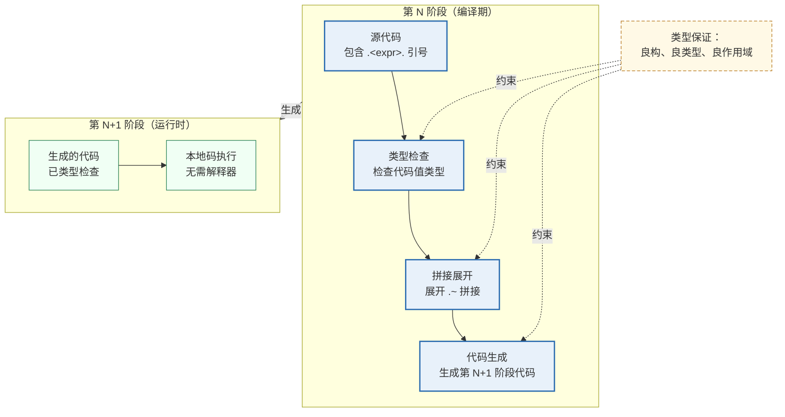
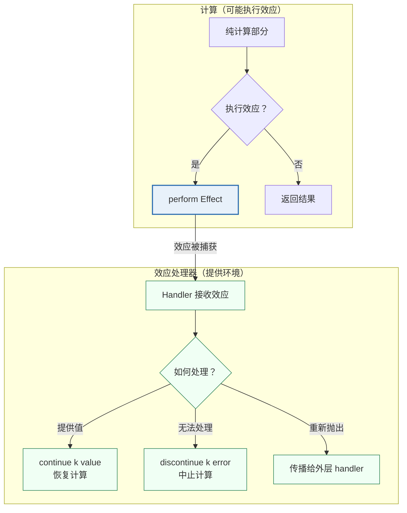
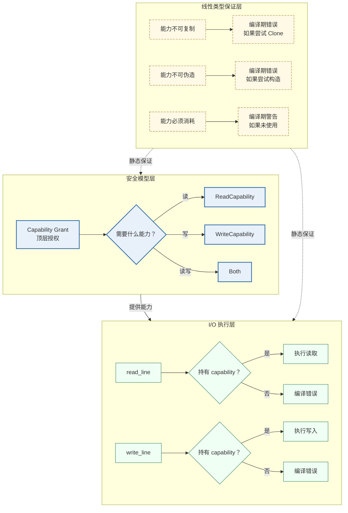
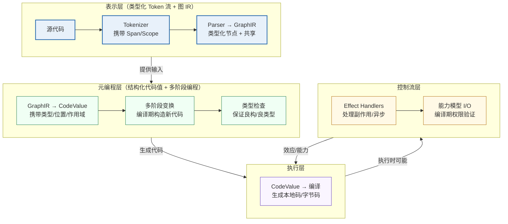

# 替代设计与现代方案：超越 Lisp 范式

> **Author**: kerf-doc-agent
> **Date**: 2026-09-09
> **Version**: v5.0（源自 stage0.md v5.0 拆分）
> **Status**: Active

> 本文件收录 stage0.md Part II 的全文：超越 Lisp 范式——最小自举单元的替代设计可能性（原 §4，含数组语言/Prolog 项/Forth/图结构/PEG/Rust proc-macro/MetaOCaml/Esterel 八种替代路径）、五大核心能力的术语起源与历史脉络（原 §5）、以及 2026 年五大能力现代方案：推荐与深度设计（原 §6 全文，含 §6.6 整合架构、§6.7 方案对照与 §6.8 相关链接）。这三个章节构成对 [01-核心原语](./01-core-forms.md) 能力骨架的批判性审视；Stage 0 的最终裁决（三层分类矩阵）见 [13-能力矩阵](./13-capability-matrix.md)；术语的详细源流考见 [18-术语文档](./18-terminology.md)。

---

## 1. 超越 Lisp 范式：最小自举单元的替代设计可能性（原 §4）

> **本节是对前文 Lisp 范式偏向的批判性反思。** 同像性远非只有 S 表达式一种实现，元循环求值器和"代码即数据"的原语也有完全不同的设计方案，且这些替代方案在理论上和工程上都有坚实的探索；更深层的问题是：S 表达式式的同像性本身可能不是"最小自举单元"的必要条件，而只是众多"AST 可编程性"实现路径中的一种历史选择。

### 1.1 诚实的反思：为什么之前的讨论偏向 Lisp 范式（原 §4.1）

之前的讨论确实过度聚焦于 Racket/Lisp 的设计路径，这有几个原因——既有历史惯性，也有其合理性，但更多的是认知偏差。

Racket 的 `racket/kernel` 和 Lisp 的元循环求值器之所以被反复引用，是因为它们是**工程上最成熟的"极小核心+强大可拓展性"实践**——有完整的文档、实现和二十年的验证。但这不意味着它们是唯一的或最优的方案。

**Lisp 范式的历史根源**：Lisp 诞生于 1958 年，S 表达式最初是作为"中间表示"设计的——McCarthy 原本计划使用 M 表达式（类似传统数学符号），但 S 表达式作为 IR 被保留了下来，因为人们发现直接操作 S 表达式更方便。**这意味着 S 表达式本身就是一个历史偶然，而非深思熟虑的设计选择。**（详见 [18-术语文档 附录 D.2](./18-terminology.md)）

### 1.2 同像性的真实含义：一个被误解的概念（原 §4.2）

**"同像性"（homoiconicity）是一个被广泛误解的术语——它的严格定义不是"代码看起来像数据"，而是"程序的抽象语法树（AST）可以用语言本身的数据结构表示"。**

Joel Kuiper 在其同像性专论（http://joelkuiper.eu/homoiconicity）中分析指出："典型的定义仅仅是'代码即数据'，这指向程序结构与语法之间的关系，但这个概念本身是模糊的、难以定义的，更多是一种干扰而非帮助。"

**Hacker News 上的讨论进一步澄清了关键点**："同像性是程序的具体语法（表面语法）与抽象语法树（AST）以及语言内置数据结构之间的关系。真正的问题不是表面语法看起来像什么，而是 AST 是否可以用语言的数据结构表示。"

**Stack Overflow 上的讨论揭示了同像性是一个谱系**："同像性不是一种离散属性，语言要么有要么没有——它是一个谱系，而 Lisp 并不处于最前沿。"

### 1.3 超越 S 表达式：同像性的替代实现方案（原 §4.3）

#### 1.3.1 数组语言（APL/J/K）：向量作为代码表示（原 §4.3.1）

**APL 及其后继（J、K、Q）展示了完全不同的同像性范式——程序表示为对数组的操作，而非对树的遍历。** APL 使用自己的符号系统（⌈*○≡⍬），其核心数据结构是**数组**而非列表。

```text
APL 中的"代码即数据"：
  程序 := 数组操作的序列
  代码 := 数组本身
  
  一个 APL 程序：
  (+/÷⍴) 5 6 7 8 9    ← 计算数组的平均值
  
  这个程序的 AST 可以表示为：
  [ +/ , ÷, ⍴, [5,6,7,8,9] ]    ← 一个数组
  
  操纵这个程序 = 操纵数组
```

**数组范式的优势**：
- 对数值计算极其简洁（一个符号表示一个复杂操作）
- 天然支持并行（数组操作可并行执行）
- 程序变换基于数组代数，与树变换完全不同

**数组范式的劣势**：
- 字符集需要特殊键盘或 Unicode 输入
- 与传统编程思维差异巨大
- 元编程工具链（debug、profiler）不成熟

**J 语言（Iverson 1990）证明了这一范式的可行性**——它从 APL 演化而来，使用 ASCII 字符，但其底层仍是数组操作的同像性。

#### 1.3.2 Prolog 项与一阶项（原 §4.3.2）

**Prolog 的"项"（term）是另一种同像性实现——程序表示为一阶项，而一阶项也是 Prolog 的核心数据结构。**

```prolog
% Prolog 程序就是项
parent(tom, bob).       % 这是一个事实，也是一个项
% 项的构造：parent(tom, bob)

% 查询也是项
?- parent(tom, X).      % 查询 = 调用 = 项

% 项的操纵（使用 =.. 操作符，"univ"）
T = parent(tom, bob),
T =.. [parent, tom, bob]   % 将项转为列表
```

**Prolog 同像性的独特性**：
- 程序 = 一阶谓词逻辑公式
- 元编程 = 项的操纵（通过 `=..`、`assert`、`retract`）
- 优势：天然支持逻辑编程、模式匹配、回溯

**Prolog 的元编程能力**通过 `assert/1` 和 `retract/1` 实现——程序可以在运行时修改自身的规则数据库。这种"代码即数据库"的范式与"代码即列表"完全不同。

#### 1.3.3 Forth 与基于栈的语言（原 §4.3.3）

**Forth 展示了"代码即字典条目"的范式——程序是一系列字典中定义的"字"（word），执行就是顺序调用这些字。**

```forth
: square dup * ;          \ 定义一个字
5 square .                \ 使用这个字，输出 25

\ Forth 的元编程：立即字（immediate words）和 postpone
: if  postpone 0branch ; immediate
: then swap 1+ swap ! ; immediate
```

**Forth 的"同像性"**：
- 程序 = 字典中的字 + 栈操作
- 元编程 = 定义新字、操纵编译过程
- 极度简洁：核心 VM 仅需 NEXT、DOCOL、EXIT、LIT 四个原语

**Forth 启示**：同像性可以基于栈和字典，而非树。这种范式特别适合资源受限环境（如嵌入式系统），且其元编程能力（immediate words）允许在编译时执行任意代码。

#### 1.3.4 图结构的程序表示（原 §4.3.4）

**SEA（Graph-based intermediate representation）和 Cranelift 的 IR 展示了"程序即图"的范式——节点是操作，边是数据流和控制流，而非树形嵌套。**

```text
图结构 IR：
  节点 := 操作 + 类型信息
  边   := 数据流 / 控制流
  
  优势：
  - 公共子表达式自然共享（同一节点多个引用）
  - SSA 形式天然支持（每个值只赋值一次）
  - 优化基于图重写
  
  挑战：
  - 打印和调试更复杂
  - 用户级元编程 API 不直观
```

**为什么图结构不是主流的"用户级"同像性**：
- 图比树更难序列化和打印
- 用户元编程（macro）习惯于树形结构
- 但作为编译器内部 IR，图结构已被 LLVM、GCC、Cranelift 广泛采用

#### 1.3.5 PEG 与解析表达式文法（原 §4.3.5）

**PEG（Parsing Expression Grammar）展示了一种"程序即文法"的范式——程序的语法和程序的执行可以统一在 PEG 框架下。**

```text
PEG 的同像性：
  程序 := 一组 PEG 规则
  执行 := 用 PEG 规则匹配输入
  
  优势：
  - 语法 = 语义（PEs 是可执行的文法）
  - 元编程 = 修改文法规则
  
  劣势：
  - 表达能力受限（不适合通用编程）
  - 但作为"语言骨架"足够简洁
```

**PEG 范式的实践案例**：LPeg（Lua 的 PEG 库）展示了 PEG 作为可嵌入"语言"的强大能力。

#### 1.3.6 Rust proc-macro：非同像的元编程（原 §4.3.6）

**Rust 的过程宏（procedural macro）展示了一种完全不同的路径——语言本身不同像，但通过"Token 流"作为外部 API 实现强大的元编程。**

```rust
// Rust 的 proc-macro：操纵 TokenStream
#[proc_macro]
pub fn make_answer(_item: TokenStream) -> TokenStream {
    "fn answer() -> u32 { 42 }".parse().unwrap()
}
```

**Rust proc-macro 的范式**：
- 语言本身不同像（Rust 的 AST 不是 Rust 的数据结构）
- 元编程 = Token 流 → Token 流的函数
- Token 流是"语言无关"的中间表示

**优势**：
- 语法自由（不受 S 表达式限制）
- 类型安全（通过 `syn` 库解析为类型化 AST）
- 编译期执行（无运行时开销）

**劣势**：
- 元编程代码与普通代码语法差异大
- 编译时间增加（proc-macro 在编译期执行）
- 调试困难

#### 1.3.7 MetaOCaml：多阶段编程（原 §4.3.7）

**MetaOCaml 展示了"代码即数据"的类型化版本——代码值 `'a code` 是类型化的、可拼接的、可执行的。**

```ocaml
(* MetaOCaml 的多阶段编程 *)
let make_adder n = .<fun x -> x + .~n>.

(* .<e>. 是引号（构造代码值）*)
(* .~e 是拼接（将代码值嵌入更大的代码值）*)
(* .!e  是执行（编译并运行代码值）*)
```

**MetaOCaml 的范式**：
- 代码是类型化的一等值（`'a code`）
- 元编程 = 拼接代码值
- **静态保证**：生成的代码是良构的、良类型的、良作用域的

**优势**：
- 类型安全（vs Lisp 元循环求值器的运行时检查）
- 编译期执行（vs 元循环的运行时解释）
- 早期错误发现

**劣势**：
- 实现复杂（"实际实现往往使用启发式方法"）
- 生态较小众
- 跨阶段类型推断困难

#### 1.3.8 Esterel：同步语言（原 §4.3.8）

**Esterel 等同步语言展示了"程序作为信号流图"的完全不同范式**：

```text
Esterel 的"代码即数据"：
  程序 := 信号流图
  代码 := 图 + 信号约束
  
  emit A;          ← 发射信号 A
  present A then   ← 检测信号 A
    ...
  end
```

**这种范式特别适合嵌入式/实时系统**，但自举过程完全不同。Esterel 编译器将程序编译为有限状态机（FSM），其元编程能力来自"信号流图的可组合性"。

### 1.4 诚实的结论：什么是真正必要的（原 §4.4）

**经过深入分析，以下是"最小自举单元"的真正必要条件与可替换选项：**

| 能力 | 真正必要吗？ | 替代方案 | 权衡 |
|------|-----------|---------|------|
| **元循环求值器** | ❌ 不是 | 多阶段编程、编译期求值 | 元循环更简单但类型不安全 |
| **S 表达式同像性** | ❌ 不是 | Token 流、项、图、PEG | S 表达式最简单但语法受限 |
| **quote 原语** | ✅ 是（某种形式） | 任何"构造 AST"的 API | 必须有，但形式可变 |
| **闭包** | ✅ 是（某种形式） | 对象、continuation | 必须有，但形式可变 |
| **最小 I/O** | ✅ 是 | Syscall 或直接内存 | 必须有，但形式可变 |

**真正不可替代的核心是**：
1. **某种形式的"AST 可编程性"**——无论 AST 是树、图还是其他结构
2. **某种形式的"编译期/运行期分离"**——相位分离不是 Lisp 专有
3. **某种形式的"环境捕获"**——闭包、对象、continuation 皆可
4. **某种形式的"副作用边界"**——最小 I/O 是自举的必需

**S 表达式是历史的选择，不是理论的必然。** 但它恰好是"最简单的、最经过验证的"实现路径——这就是为什么前文的讨论聚焦于此。

**如果你想探索非 S 表达式的路径，最有前景的方向是**：
1. **Rust 式的 Token 流元编程**——语法自由但类型安全
2. **MetaOCaml 式的多阶段编程**——类型安全但实现复杂
3. **图结构的程序表示**——理论优雅但工程不成熟
4. **PEG 或数组式**——特定领域最优

**最诚实的建议**：如果你追求"工程上最短路径"，S 表达式仍然是首选；如果你追求"理论上的探索"，以上替代方案都值得研究；如果你追求"传统语法 + 强元编程"，Rust 的 proc-macro 模式是最成熟的参考。

### 1.5 相关链接与拓展阅读（原 §4.5）

- **同像性定义讨论**：http://joelkuiper.eu/homoiconicity （Joel Kuiper 对同像性的系统分析）
- **Hacker News 同像性讨论**：https://news.ycombinator.com/item?id=7418055
- **Stack Overflow: What is homoiconicity?**：https://stackoverflow.com/questions/267862/what-is-homoiconicity
- **APL/J/K 资源**：
  - APL Wiki：https://aplwiki.com/
  - J 语言官网：https://www.jsoftware.com/
  - K/Q 语言（KX Systems）：https://kx.com/
- **Prolog 项操纵**：SWI-Prolog 文档 https://www.swi-prolog.org/pldoc/man?section=manipulate
- **Forth 标准**：https://forth-standard.org/
- **Rust proc-macro**：https://doc.rust-lang.org/reference/procedural-macros.html
- **MetaOCaml**：http://okmij.org/ftp/ML/MetaOCaml.html
- **Esterel**：https://www-sop.inria.fr/members/Gerard.Berry/Esterel.html

---

## 2. 五大核心能力的术语起源与历史脉络（原 §5）

> **本节考据五大核心能力的命名起源，并提炼每个能力的构建创新原则。** 这五个术语——元循环求值器、同像性、引号、闭包、最小 I/O——每一个都有其特定的历史起源和理论根基，它们并非"唯一正确的答案"而是"特定历史时刻的最优解"。

### 2.1 元循环求值器（Metacircular Evaluator）（原 §5.1）

**命名起源**：这个术语由 John McCarthy 在 1960 年的开创性论文《Recursive Functions of Symbolic Expressions and Their Computation by Machine, Part I》中隐式引入。McCarthy 的论文是"LISP 的原始论文"，其中首次描述了用 LISP 自身实现的 `eval` 函数。

**"元循环"的含义**：
- **Meta**（元）：超越、关于自身的
- **Circular**（循环）：求值器用被求值的语言编写，形成自我指涉的循环

**为什么叫这个名字**：因为求值器（evaluator）和被求值的语言是同一个语言——求值器在"元层"（meta-level）操作"对象层"（object-level）的代码，而这两层使用相同的结构，形成循环。

**构建创新原则**：

| 原则 | 含义 | 实践体现 |
|------|------|---------|
| **自描述性** | 语言的语义可以用语言自身完整描述 | McCarthy 的 eval/apply 相互递归 |
| **最小惊讶** | 求值器的行为应该与语言规范完全一致 | SICP 的元循环求值器与 Scheme 语义一致 |
| **教学透明性** | 通过阅读求值器可以理解语言 | SICP 用元循环求值器教授语言语义 |

### 2.2 同像性（Homoiconicity）（原 §5.2）

**命名起源**：这个词来自希腊语：
- **Homo**（ὁμός）：相同的
- **Icon**（εἰκών）：图像、表示

该术语最早出现在 Calvin Mooers 开发的 TRAC 语言的语境中。Mooers 的设计目标之一是"TRAC 的输入脚本（用户键入的内容）应该与指导内部动作的文本相同"。

**为什么叫这个名字**：因为程序的**表示**和程序操作的**数据**使用同一种结构——代码的"图像"与数据的"图像"是同一个。

**构建创新原则**：

| 原则 | 含义 | 替代实现 |
|------|------|---------|
| **表示统一** | 程序的 AST 与语言的数据结构是同一类型 | S 表达式、Prolog 项、图结构 |
| **可编程 AST** | 用户可以编写操纵程序结构的程序 | Rust proc-macro、Swift 宏 |
| **语法-语义分离** | 表面语法可以变化，但 AST 表示固定 | Racket 的 #lang 机制 |

### 2.3 引号与代码即数据（Quote）（原 §5.3）

**命名起源**：引号操作符可追溯至 Alonzo Church 的 Lambda 演算。Church 使用希腊字母 λ（lambda）作为"绑定运算符"，而引号作为一种"阻止求值"的机制，在 McCarthy 的 LISP 中被形式化为 `quote`。

**为什么这个概念存在**：在 Lambda 演算中，所有表达式都会被求值（β-归约）。但要操作"代码本身"，需要一种方式"引用"代码而不求值它——这就是引号的语义功能。

**构建创新原则**：

| 原则 | 含义 | 替代方案 |
|------|------|---------|
| **求值控制** | 提供一种方式"引用"代码而不求值 | MetaOCaml 的 `.<>.` 语法 |
| **代码作为一等公民** | 代码片段可以作为值传递和操作 | Rust 的 TokenStream |
| **结构保持** | 引号保留代码的完整结构信息 | 图表示的节点 |

### 2.4 闭包（Closure）（原 §5.4）

**命名起源**：由 Peter Landin 在 1964 年的论文《The Mechanical Evaluation of Expressions》中定义。Landin 的 SECD 机器中，闭包被定义为"包含环境部分和控制部分"的结构。

**为什么叫这个名字**：数学中的"闭包"（closure）指一个集合在某个操作下"闭合"——即操作的结果仍在集合内。Landin 借用这个概念：函数加上其捕获的环境，形成了一个"闭合"的计算单元——它携带了求值所需的全部信息。

**构建创新原则**：

| 原则 | 含义 | 替代实现 |
|------|------|---------|
| **环境捕获** | 函数携带其定义时的环境 | OCaml 的词法作用域 |
| **延迟绑定** | 变量查找发生在调用时而非定义时 | Scheme 的词法地址 |
| **组合性** | 闭包可以组合成更复杂的抽象 | Haskell 的函数组合 |

### 2.5 最小 I/O 副作用通道（Minimal I/O Side Channel）（原 §5.5）

**命名起源**：这不是一个有特定"发明者"的术语，而是自举理论的自然产物——从 Guix 的 357 字节 hex0 种子到 Turing 机的基本读写操作，任何自举系统都需要一个"与外部世界交互的最小接口"。

**为什么这个概念存在**：纯粹的计算（Lambda 演算、SKI 组合子）是封闭的，但自举需要读取源码、输出结果——必须有一个"副作用"的边界。

**构建创新原则**：

| 原则 | 含义 | 实践方案 |
|------|------|---------|
| **副作用最小化** | 仅暴露绝对必要的副作用 | 单一 syscall 或内存写入 |
| **纯函数核心** | 计算部分保持纯函数 | Haskell 的 IO Monad |
| **可测试性** | 副作用可以被模拟和测试 | Rust 的 trait 抽象 |

### 2.6 批判性评估：这些真的是"最小能力"吗（原 §5.6）

**诚实回答：部分是，部分不是。** 以下是逐项评估：

| 能力 | 是否真的"必要"？ | 批判性分析 |
|------|----------------|-----------|
| **元循环求值器** | ❌ **不是必要的** | 它是"语言描述自身"的一种方式，但不是唯一方式——编译器也可以描述语言 |
| **同像性** | ❌ **不是必要的** | 真正必要的是"AST 可编程性"——无论 AST 用什么表示 |
| **引号** | ✅ **某种形式是必要的** | 必须有"代码作为值"的机制，但不一定是 `quote` 这个名字或形式 |
| **闭包** | ✅ **某种形式是必要的** | 必须有"捕获环境的可调用实体"，但形式可变 |
| **最小 I/O** | ✅ **绝对必要** | 没有任何方式可以避免这个边界 |

**更准确的"最小能力"应该是**：
1. **AST 构造能力**——能将程序片段作为数据构造（无论数据是树、图还是其他结构）
2. **AST 操纵能力**——能对程序片段进行变换（合并、删除、重命名等）
3. **AST 执行能力**——能将构造的程序片段执行（编译或解释）
4. **环境绑定机制**——能将标识符关联到值（闭包是其中一种实现）
5. **外部交互边界**——能从外界接收输入并向外界发送输出

以上批判性评估与本文 §1.4 的"真正必要条件"分析互为印证——术语层面的"必要"与设计层面的"必要"是两个正交问题。而这五个能力在 2026 年的重新定义与推荐技术方案，见本文 §3.7 的方案对照表。

---

## 3. 2026 年五大能力现代方案：推荐与深度设计（原 §6）

> **本章合并了 v3.0 的「技术方案推荐」（原 §6）与「现代方案深度设计」（原 §7）两章。** 五个 2026 年推荐方案——MetaOCaml 多阶段编程、类型化 Token 流 + 图 IR、结构化代码值、OCaml 5 Effect Handlers、能力模型 + 线性类型——构成一个完整的、类型安全的、编译期验证的自举能力体系；每个方案都在传统方案的"表达力"基础上增加了"类型安全"和"编译期保证"，这是 2026 年编程语言理论与工程的根本性进步。本章每个方案按「推荐理由 → 传统对比 → 能力模型 → 架构原则 → 接口契约 → 职责边界」的顺序组织，最后给出整合架构与设计原则总结。

### 3.1 方案一：元循环求值器 → MetaOCaml 多阶段编程（原 §6.1）

**2026 年推荐方案**：基于 MetaOCaml 或 OCaml 5 的 Effects 系统的**多阶段编程**。

#### 3.1.1 推荐理由与论证（原 §6.1.1）

- MetaOCaml 提供了"静态保证：生成的代码是良构的、良类型的和良作用域的"
- OCaml 5 的 Effect Handlers 引入了"模块化编程与用户定义效应"的机制，Anil Madhavpeddy 的工作展示了"基于效应的调度用于 OCaml 编译器管线"——"效应应该允许我们将管线分成阶段，在需要新类型信息时挂起编译"
- **多阶段编程比元循环求值器更安全**（类型保证）且更高效（编译期构造而非运行时解释）

**具体方案**：

```ocaml
(* 2026 年推荐：MetaOCaml 风格的多阶段编程 *)
let make_adder n = .<fun x -> x + .~n>.

(* 替代传统的元循环求值器：
   (define (make-adder n) (lambda (x) (+ x n)))
   
   MetaOCaml 的优势：
   1. 类型安全：生成的代码保证良类型
   2. 编译期优化：代码生成发生在编译期
   3. 错误提前：问题在生成时被捕获，不是运行时
*)
```

#### 3.1.2 传统方案 vs 2026 推荐方案（原 §6.1.2）

| 维度 | 传统元循环求值器 | 2026 MetaOCaml 多阶段编程 |
|------|----------------|--------------------------|
| **类型安全** | ❌ 无（生成的代码可能类型错误） | ✅ 有（"良构的、良类型的和良作用域的"） |
| **执行时机** | 运行时（解释执行） | 编译期（生成代码） |
| **错误发现** | 运行时（延迟失败） | 编译期（早期失败） |
| **性能** | 解释开销 | 生成本地码 |
| **调试性** | 困难（多层解释） | 良好（生成的代码可打印/检查） |

#### 3.1.3 能力模型设计（原 §6.1.3）

```ocaml
(* 2026 方案：MetaOCaml 的核心类型和操作 *)

(* 代码值类型：携带类型信息的 AST *)
type 'a code = CodeValue of {
  ast : 'a typed_ast;       (* 类型化的 AST *)
  span : span;              (* 源位置 *)
  scope : scope_set;        (* 作用域信息 *)
  stage : int;              (* 阶段编号（当前是第几阶段） *)
}

(* 核心操作 *)
(* 引号：将表达式转为代码值（编译期） *)
val quote : 'a expr → 'a code

(* 拼接：将运行时值嵌入代码值 *)
val splice : 'a code → 'a code code  (* 注意：嵌套的代码值 *)

(* 执行：将代码值编译并执行 *)
val run : 'a code → 'a

(* 反引号操作符（MetaOCaml 语法） *)
(* .<expr>.  = quote expr *)
(* .~expr   = splice expr *)
(* .!code   = run code *)
```

#### 3.1.4 层级组织与架构原则（原 §6.1.4）



**架构原则：**
1. **阶段分离**：不同阶段的代码在类型系统中被区分（`'a code` vs `'a code code`）
2. **类型保持**：每个变换都保持类型正确性（编译期验证）
3. **作用域保持**：生成的代码保证良作用域（无未绑定变量）

#### 3.1.5 接口契约（原 §6.1.5）

```ocaml
(* 完整的接口契约 *)
module type MULTI_STAGE = sig
  (* 代码值：类型化的程序片段 *)
  type 'a code
  
  (* 构造操作 *)
  val quote : 'a → 'a code                    (* 将表达式转为代码 *)
  val splice : 'a code → 'a code code         (* 嵌套代码值 *)
  
  (* 检查操作 *)
  val show : 'a code → string                 (* 打印代码 *)
  val type_check : 'a code → (type_info, error) result
  
  (* 执行操作 *)
  val run : 'a code → 'a                      (* 编译并执行 *)
  val compile : 'a code → compiled_module     (* 仅编译 *)
  
  (* 组合操作 *)
  val compose : ('a → 'b code) → ('b → 'c code) → ('a → 'c code)
  
  (* 职责边界：仅构造和执行代码，不修改已有代码 *)
end
```

#### 3.1.6 职责边界（原 §6.1.6）

- **做什么**：构造类型安全的代码值、拼接运行时值、编译执行
- **不做什么**：不执行运行时元循环解释、不修改已编译的代码、不处理运行时反射

### 3.2 方案二：同像性 → 类型化 Token 流 + 图 IR（原 §6.2）

**2026 年推荐方案**：借鉴 **Rust 过程宏**的 Token 流模型，结合**图结构**的程序表示。

#### 3.2.1 推荐理由与论证（原 §6.2.1）

- Rust 的 proc-macro 系统在 2025-2026 年已经极其成熟，证明了"非同像语言也可以有强大的元编程"
- Mojo 语言（2026 年 1.0 Beta）展示了"Python 语法 + 编译期元编程"的可行性
- Gleam 语言展示了"类型安全 + 可扩展编译器"的现代设计

**具体方案架构**：

```text
┌─────────────────────────────────────┐
│  表面语法层（可替换）                  │
│  Python-like / Rust-like / Custom   │
└──────────────┬──────────────────────┘
               │
┌──────────────▼──────────────────────┐
│  Token 流层（类型化）                 │
│  • 类型安全的 Token 类型              │
│  • 位置信息（Span）                   │
│  • 作用域信息（Scope）                │
└──────────────┬──────────────────────┘
               │
┌──────────────▼──────────────────────┐
│  图结构 IR（内部表示）                 │
│  • 节点：运算符、操作数、变量           │
│  • 边：数据流、控制流                  │
│  • 共享：公共子表达式共享节点           │
└─────────────────────────────────────┘
```

**论证**：相比 S 表达式的树结构，图结构更接近编译器 IR 的实际形态，且天然支持公共子表达式消除（CSE）和循环检测。

#### 3.2.2 传统方案 vs 2026 推荐方案（原 §6.2.2）

| 维度 | S 表达式同像性 | 类型化 Token 流 + 图 IR |
|------|---------------|------------------------|
| **表示形式** | 嵌套列表（树结构） | Token 流（表面）+ 图（内部） |
| **类型信息** | ❌ 无（所有节点都是列表） | ✅ 有（每个 Token/节点有类型） |
| **共享子表达式** | ❌ 不支持（树结构重复） | ✅ 支持（图结构共享节点） |
| **位置追踪** | ❌ 需额外机制 | ✅ 内置（Span 字段） |
| **作用域追踪** | ❌ 需运行时查找 | ✅ 内置（ScopeSet 字段） |

#### 3.2.3 能力模型设计（原 §6.2.3）

```rust
// 2026 方案：Rust 风格的类型化 Token 流

// Token：携带类型、位置、作用域信息
#[derive(Debug, Clone)]
pub struct Token {
    pub kind: TokenKind,
    pub span: Span,           // 源位置
    pub scope_id: ScopeId,    // 作用域标识
}

#[derive(Debug, Clone)]
pub enum TokenKind {
    // 字面量（携带类型信息）
    IntLiteral(i64),
    FloatLiteral(f64),
    StringLiteral(Rc<str>),
    BoolLiteral(bool),
    
    // 标识符（携带作用域信息）
    Identifier(Symbol),        // Symbol 是 interned string
    TypeIdentifier(Symbol),
    
    // 关键字
    Keyword(Keyword),
    
    // 运算符（携带优先级）
    Operator(Operator),
    
    // 分隔符
    Delimiter(Delimiter),
    
    // 特殊
    MacroInvocation(Symbol),   // 宏调用标识
    Eof,
}

// 图 IR：程序的有向图表示
#[derive(Debug)]
pub struct GraphIR {
    pub nodes: Vec<IRNode>,
    pub edges: Vec<IEdge>,
}

#[derive(Debug)]
pub enum IRNode {
    // 操作节点
    BinOp { op: Operator, lhs: NodeId, rhs: NodeId },
    UnOp { op: Operator, operand: NodeId },
    Call { callee: NodeId, args: Vec<NodeId> },
    
    // 数据节点
    Literal(LiteralValue),
    Variable(Symbol),
    
    // 控制流节点
    If { cond: NodeId, then: NodeId, else_: NodeId },
    Loop { body: NodeId },
    
    // 类型节点（图 IR 的一部分）
    TypeNode(TypeInfo),
}

#[derive(Debug)]
pub struct IEdge {
    pub from: NodeId,
    pub to: NodeId,
    pub edge_kind: EdgeKind,  // DataFlow, ControlFlow, TypeConstraint
}
```

#### 3.2.4 接口契约（原 §6.2.4）

```rust
// 完整的接口契约
pub trait SyntaxRepresentation {
    // 表面语法 → Token 流
    type TokenStream;
    // Token 流 → 图 IR
    type GraphIR;
    
    // 构造操作
    fn tokenize(source: &str) -> Result<Self::TokenStream, LexError>;
    fn parse(tokens: Self::TokenStream) -> Result<Self::GraphIR, ParseError>;
    
    // 操纵操作（元编程的核心）
    fn transform(ir: &Self::GraphIR, f: impl Fn(&IRNode) -> IRNode) -> Self::GraphIR;
    fn substitute(ir: &Self::GraphIR, from: Symbol, to: IRNode) -> Self::GraphIR;
    
    // 检查操作
    fn type_check(ir: &Self::GraphIR) -> Result<TypeInfo, TypeError>;
    fn validate_scope(ir: &Self::GraphIR) -> Result<(), ScopeError>;
    
    // 职责边界：仅表示和操纵程序结构，不执行求值
}
```

#### 3.2.5 架构原则（原 §6.2.5）

1. **表示-计算分离**：图 IR 仅表示程序结构，不包含求值逻辑
2. **共享优先**：公共子表达式自动共享节点（图 vs 树）
3. **类型内嵌**：类型信息直接嵌入 IR 节点，而非后期标注

### 3.3 方案三：引号 → 结构化代码值（原 §6.3）

**2026 年推荐方案**：将"引号"泛化为**结构化代码值**——一个携带类型信息、位置信息、作用域信息的可执行代码片段。

#### 3.3.1 推荐理由与论证（原 §6.3.1）

- MetaOCaml 的 `.<>.` 语法已经是这种方向：代码值是类型化的、良构的
- Rust 的 `TokenStream` 加上 `Span` 信息也实现了类似功能
- Mojo 的 `fn` 参数在编译期求值，实现了"编译期计算"的引号功能

**具体方案**：

```rust
// 2026 年推荐：结构化代码值
struct CodeValue {
    ast: Box<AstNode>,        // 类型化的 AST
    span: Span,               // 源位置
    scopes: ScopeSet,         // 作用域信息
    type_info: Option<Type>,  // 类型信息（如果已知）
}

// 构造代码值（"引号"的现代形式）
fn make_adder(n: i64) -> CodeValue {
    quote! {
        |x: i64| x + #n
    }
}

// 执行代码值（"eval"的现代形式）
fn execute(code: CodeValue) -> Result<Value, Error> {
    compile_and_run(code)
}
```

#### 3.3.2 与传统引号的对比（原 §6.3.2）

| 维度 | Lisp `quote` | 2026 结构化代码值 |
|------|-------------|------------------|
| **返回类型** | 未类型化的列表 | 类型化的 `CodeValue<'a>` |
| **信息携带** | 仅结构 | 结构+类型+位置+作用域 |
| **可操作性** | 仅列表操作 | 丰富的方法（类型检查、打印、编译） |
| **安全性** | 无保证 | 编译期验证 |

#### 3.3.3 能力模型设计（原 §6.3.3）

```rust
// 2026 方案：结构化代码值
pub struct CodeValue<'a> {
    // 核心：类型化的 AST（引用，零拷贝）
    ast: &'a TypedAST,
    
    // 元信息
    span: Span,                    // 源位置
    scope: ScopeSet,               // 作用域信息
    type_info: Cow<'a, TypeInfo>,  // 类型信息
    stage: Stage,                  // 阶段信息（多阶段编程）
    
    // 编译缓存（惰性）
    compiled: OnceCell<Result<CompiledModule, CompileError>>,
}

impl<'a> CodeValue<'a> {
    // 检查操作
    pub fn type_check(&self) -> Result<&TypeInfo, &TypeError> { ... }
    pub fn free_variables(&self) -> Vec<Symbol> { ... }
    
    // 变换操作（生成新 CodeValue，不可变）
    pub fn substitute(&self, var: Symbol, replacement: &CodeValue) -> CodeValue { ... }
    pub fn alpha_rename(&self, from: Symbol, to: Symbol) -> CodeValue { ... }
    
    // 执行操作（惰性编译）
    pub fn compile(&self) -> Result<&CompiledModule, &CompileError> { ... }
    pub fn run(&self) -> Result<Value, RuntimeError> { ... }
    
    // 调试操作
    pub fn pretty_print(&self) -> String { ... }
    pub fn to_debug_string(&self) -> String { ... }
}
```

#### 3.3.4 接口契约（原 §6.3.4）

```rust
pub trait CodeValueTrait {
    type Type;
    type Error;
    
    // 构造（引号的现代形式）
    fn from_ast(ast: &TypedAST) -> Self;
    
    // 检查
    fn is_well_typed(&self) -> bool;
    fn is_well_scoped(&self) -> bool;
    
    // 变换（不可变，返回新值）
    fn transform(&self, f: impl Fn(&TypedAST) -> TypedAST) -> Self;
    
    // 执行（惰性）
    fn compile(&self) -> Result<CompiledCode, Self::Error>;
    fn execute(&self) -> Result<Self::Type, RuntimeError>;
    
    // 组合（多阶段编程的核心）
    fn compose_with(&self, other: &Self) -> Result<Self, CompositionError>;
    
    // 职责边界：仅作为代码的值表示，不执行隐式编译
}
```

### 3.4 方案四：闭包 → OCaml 5 Effect Handlers（原 §6.4）

**2026 年推荐方案**：使用 **OCaml 5 的 Effect Handlers** 替代传统的闭包，实现更强大的"环境捕获"和"控制流抽象"。

#### 3.4.1 推荐理由与论证（原 §6.4.1）

- OCaml 5 的 Effect Handlers 是"用于用户定义效应的模块化编程机制"
- 它允许"描述计算挂起其当前状态并在稍后恢复"——这比闭包更通用
- Anil Madhavpeddy 的工作正在将此应用于编译器管线

**具体方案**：

```ocaml
(* 2026 年推荐：Effect Handlers 替代闭包 *)
open Effect

type _ Effect.t += Ask : string Effect.t

let read_config () =
  let (config, k) = continue_with_ask_handler () in
  (* 这里的"环境"是 handler 提供的 *)
  ...

(* 传统闭包的局限：
   - 只能捕获定义时的环境
   - 无法"挂起"并"恢复"
   
   Effect Handlers 的优势：
   - 可以在任何点挂起计算
   - "环境"由 handler 动态提供
   - 支持非局部控制流
*)
```

**论证**：对于系统级语言，Effect Handlers 比闭包更适合处理异步、并发、错误恢复等场景。

#### 3.4.2 传统闭包 vs Effect Handlers（原 §6.4.2）

| 维度 | 传统闭包 | OCaml 5 Effect Handlers |
|------|---------|------------------------|
| **环境捕获** | 词法作用域（定义时捕获） | 动态（由 handler 提供） |
| **控制流** | 仅返回 | 挂起/恢复/非局部退出 |
| **组合性** | 函数组合 | 效应组合（更强大） |
| **异步支持** | 需要额外机制 | 原生支持 |
| **类型安全** | 类型安全 | 效应类型系统 |

#### 3.4.3 能力模型设计（原 §6.4.3）

```ocaml
(* 2026 方案：OCaml 5 Effect Handlers *)

(* 效应类型：用户定义的"副作用" *)
type _ Effect.t += 
  | Read : unit → string Effect.t
  | Write : string → unit Effect.t
  | Ask : string → string Effect.t  (* 从环境获取值 *)
  | State : 'a → 'a Effect.t        (* 状态读取 *)

(* 执行效应（替代传统闭包的环境访问） *)
let read_input () = perform (Read ())
let write_output s = perform (Write s)
let ask_env key = perform (Ask key)

(* 效应处理器：提供"环境" *)
let with_input_handler (input : string list) (f : unit → 'a) : 'a =
  match f () with
  | v → v
  | effect (Read (), k) →
      match input with
      | x :: rest → continue k x (* 提供值 *)
      | [] → discontinue k (Failure "No more input")
  | effect (Write s, k) →
      print_string s;
      continue k ()
```

#### 3.4.4 架构原则（原 §6.4.4）



**架构原则：**
1. **效应显式化**：所有副作用通过效应类型显式声明（vs 闭包的隐式环境捕获）
2. **处理器组合**：多个 handler 可以组合，形成"效应栈"
3. **continuation 一等公民**：挂起的计算可以作为值传递和恢复

#### 3.4.5 接口契约（原 §6.4.5）

```ocaml
module type EFFECT_SYSTEM = sig
  (* 效应类型 *)
  type _ Effect.t
  
  (* 执行效应 *)
  val perform : 'a Effect.t → 'a
  
  (* 处理效应 *)
  val handle : 
    handler:(eff:'a. 'a Effect.t → 'a option) →
    f:(unit → 'b) → 'b
  
  (* 深度 vs 浅层处理 *)
  module Deep : sig
    val handle : handler → f → 'b  (* 处理所有嵌套效应 *)
  end
  
  module Shallow : sig
    val handle : handler → f → 'b  (* 仅处理一层效应 *)
  end
  
  (* continuation 操作 *)
  val continue : ('a, 'b) continuation → 'a → 'b
  val discontinue : ('a, 'b) continuation → exn → 'b
  
  (* 职责边界：仅处理效应和 continuation，不定义具体效应 *)
end
```

### 3.5 方案五：最小 I/O → 能力模型 + 线性类型（原 §6.5）

**2026 年推荐方案**：使用**线性类型**（Rust 的所有权）和**能力**模型来实现 I/O 副作用的安全控制。

#### 3.5.1 推荐理由与论证（原 §6.5.1）

- Rust 的所有权系统在 2026 年已经证明了"编译期内存安全"的可行性
- Mojo 语言引入了"基于所有权的内存管理"
- 能力模型可以精确控制"谁可以做什么 I/O"

**具体方案**：

```rust
// 2026 年推荐：能力模型 + 线性类型
struct ReadCapability {
    file: File,
    // 这个 capability 只能被使用一次
    _marker: std::marker::PhantomData<*mut ()>,
}

struct WriteCapability {
    file: File,
}

fn read_line(cap: ReadCapability) -> (String, ReadCapability) {
    let line = cap.file.read_line();
    (line, cap)  // 返回消耗后的 capability
}

fn write_line(cap: WriteCapability, s: &str) -> WriteCapability {
    cap.file.write(s);
    cap
}

// 编译期保证：
// 1. 没有 ReadCapability 就无法读
// 2. 没有 WriteCapability 就无法写
// 3. Capability 不可复制，不可伪造
// 4. I/O 操作的顺序在类型中可见
```

**论证**：这比传统的"全局 I/O 函数"更安全，且为并发和分布式场景提供了基础。

#### 3.5.2 传统 I/O vs 能力模型（原 §6.5.2）

| 维度 | 传统全局 I/O | 能力模型 + 线性类型 |
|------|-------------|-------------------|
| **权限控制** | 无（任何代码都能 I/O） | 精确（仅持有 capability 的代码能 I/O） |
| **静态保证** | 无 | 编译期验证（线性类型确保唯一性） |
| **可测试性** | 困难（需要 mock 全局函数） | 容易（传入不同的 capability） |
| **并发安全** | 需运行时同步 | 编译期保证（capability 不可复制） |

#### 3.5.3 能力模型设计（原 §6.5.3）

```rust
// 2026 方案：能力模型 + 线性类型

// 能力：不可复制、不可伪造的 I/O 权限
pub struct ReadCapability {
    // 私有字段，外部无法构造
    _private: (),
    // 编译期保证：Send + !Clone + !Copy
    _marker: PhantomData<*mut ()>,  // !Send + !Sync
}

pub struct WriteCapability {
    _private: (),
    _marker: PhantomData<*mut ()>,
}

// 能力的获取：只能通过显式授权
pub struct IOGrant {
    read: Option<ReadCapability>,
    write: Option<WriteCapability>,
}

// I/O 操作：需要 capability
pub fn read_line(cap: &mut ReadCapability) -> Result<String, IOError> {
    // 仅当持有 ReadCapability 时才能执行
    unsafe { perform_read() }
}

pub fn write_line(cap: &mut WriteCapability, s: &str) -> Result<(), IOError> {
    unsafe { perform_write(s) }
}

// 能力的传递（线性：消耗旧的，产生新的）
pub fn with_io<R>(grant: IOGrant, f: impl FnOnce(&mut IOGrant) -> R) -> R {
    f(&mut { grant })
}

// 职责边界：仅定义能力类型和传递规则，不实现具体 I/O
```

#### 3.5.4 架构原则（原 §6.5.4）



**架构原则：**
1. **最小权限原则**：默认无 I/O 能力，仅显式授予
2. **线性唯一性**：能力不可复制，确保每个 capability 只有一个持有者
3. **能力传递显式化**：所有 I/O 操作的调用链在类型中可见

### 3.6 五个方案的整合架构（原 §6.6）



### 3.7 设计原则总结与方案对照（原 §6.7）

**结合 2026 年的技术前沿，"最小自举单元"的五个能力应该被重新定义为：**

| 原术语 | 2026 年重新定义 | 推荐技术方案 | 核心理由 |
|--------|---------------|-------------|---------|
| 元循环求值器 | **类型安全的多阶段计算** | MetaOCaml / OCaml 5 Effects | 类型保证 + 编译期优化 |
| 同像性 | **类型化 AST 可编程性** | Token 流 + 图 IR | 表面语法自由 + 内部表示统一 |
| 引号 | **结构化代码值** | 类型化 CodeValue 类型 | 携带类型、位置、作用域信息 |
| 闭包 | **效应处理与控制流抽象** | OCaml 5 Effect Handlers | 更通用的环境捕获和挂起/恢复 |
| 最小 I/O | **能力模型 + 线性类型** | Rust 所有权 + Capability | 编译期副作用安全 |

**这些推荐方案反映了 2026 年编程语言理论和工程的最佳实践**：它们不是对传统概念的简单继承，而是在类型安全、性能保证、并发能力等维度上的实质性改进。选择这些方案意味着你的"最小自举单元"将站在 2026 年技术的前沿，而非重复 1960 年的设计。

**五个方案的共同设计原则：**

1. **类型安全优先**：所有操作在编译期被类型系统验证（vs 传统方案的运行时验证）
2. **显式优于隐式**：效应、能力、阶段都显式声明（vs 闭包的隐式环境捕获）
3. **不可变性**：代码值、能力对象都是不可变的（变换产生新值）
4. **编译期计算**：尽可能将计算从运行时推到编译期（多阶段编程）
5. **组合性**：所有组件都设计为可组合的（handler 组合、capability 传递）

**与之前讨论的对应关系：**

| 之前讨论的概念 | 2026 方案的对应 | 改进之处 |
|---------------|---------------|---------|
| 元循环 eval/apply | 多阶段编程 + Effects | 类型安全 + 编译期优化 |
| S 表达式 | Token 流 + 图 IR | 类型化 + 位置/作用域追踪 |
| quote | 结构化 CodeValue | 类型化 + 丰富操作 |
| 闭包 | Effect Handlers | 更通用的环境/控制流 |
| 全局 I/O | 能力模型 + 线性类型 | 编译期安全 + 最小权限 |

这五个方案不是对传统概念的简单替代，而是在**类型安全、性能、可组合性、可验证性**等维度的系统性提升——它们代表了 2026 年编程语言理论与实践的最佳结合。

### 3.8 相关链接与拓展阅读（原 §6.8）

- **MetaOCaml**：http://okmij.org/ftp/ML/MetaOCaml.html （Oleg Kiselyov 维护）
- **OCaml 5 Effects**：https://v2.ocaml.org/manual/effects.html
- **Anil Madhavpeddy 效应编译器管线**：https://anil.recoil.org/
- **Rust proc-macro**：https://doc.rust-lang.org/reference/procedural-macros.html
- **Mojo 语言**：https://docs.modular.com/mojo/
- **Gleam 语言**：https://gleam.run/
- **Cranelift 项目**：https://cranelift.dev/
- **Capability-based security**：https://en.wikipedia.org/wiki/Capability-based_security
