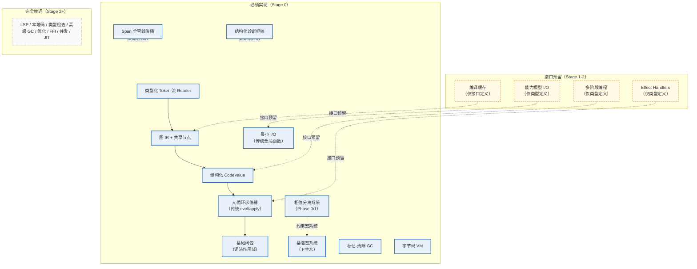
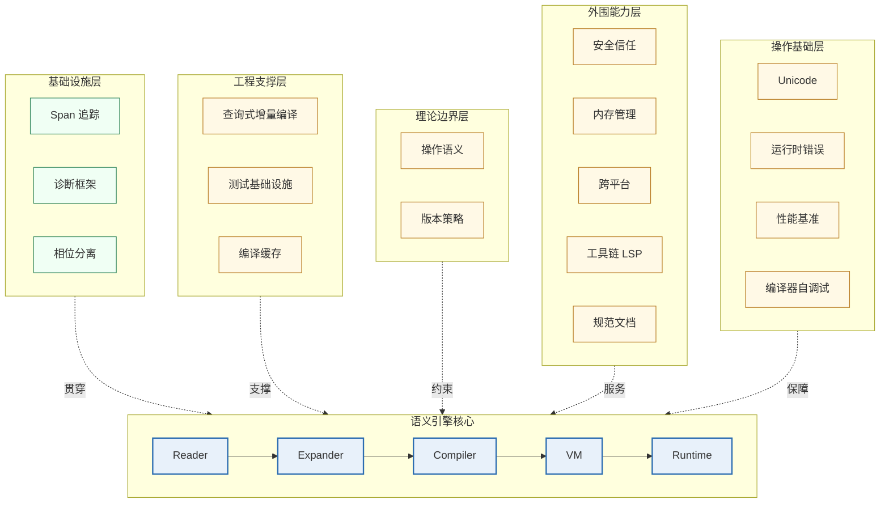

# 架构分层与各层设计总览

> **Author**: kerf-doc-agent
> **Date**: 2026-09-10（v5.2：§1.5 附「7 层 → 9 crate 映射表」+ workspace/定向裁定注记（#19））
> **Version**: v5.2
> **Status**: Active

> 本文件收录架构分层与完整总览（原 §10：能力视角总图、分层视角总图、单向依赖规则、调用关系与数据流、层级依赖规则）以及基础设施层（原 §12）、工程支撑层与理论边界层（原 §13）、外围能力层与操作基础层（原 §14）的框架设计。其中已按主题拆出的小节（Span/诊断 → [02-语法模型](./02-syntax-model.md)、相位分离 → [03-宏系统](./03-macro-system.md)、内存管理 → [05-运行时](./05-runtime.md)、工具链/基准/自调试 → [10-工具链](./10-toolchain.md)、文档流程 → [09-标准库](./09-stdlib.md)、测试 → [11-测试](./11-testing.md)、操作语义 → [06-操作语义](./06-operational-semantics.md)）在本文件保留章节导引。12 个能力模型的定义见 [13-能力矩阵](./13-capability-matrix.md)。

---

## 1. 架构分层与完整总览（原 §10）

> **本章合并了原 §8.5（架构分层与调用关系）与原 §20（完整架构总览）。** 架构从两个正交视角呈现：§1.1 是能力视角（哪些能力属于哪一层），§1.2 是分层视角（六层结构各自的职责），§1.3-§1.5 给出两视角共同遵守的依赖规则与数据流。任何新增设计必须同时通过这两个视角的一致性检查——能力归属明确、依赖方向单向。

### 1.1 能力视角总图（2026 v4.0）（原 §10.1）

下图将 [13-能力矩阵 §1.1](./13-capability-matrix.md) 三层分类矩阵转化为依赖关系图：实线为管线内的顺序依赖，虚线为横切贯穿或接口预留关系。



### 1.2 分层视角总图（原 §10.2）

下图给出六层结构的总览：语义引擎核心（Reader → Expander → Compiler → VM → Runtime）构成主管线，基础设施层（本文 §2）横向贯穿，工程支撑层与理论边界层（本文 §3）从外部支撑与约束，外围能力层与操作基础层（本文 §4）提供环境保障。



### 1.3 单向依赖规则（原 §10.3）

**单向依赖规则**：`Reader → Expander → Compiler → VM → Runtime`。

**相位分离**：Phase 0（运行时）/ Phase 1（编译时）/ Phase -1（被导入用于 Phase 1 的模块）。核心规则：一个相位的输出是下一个相位使用的代码，禁止任何直接的值传递。

**数据流分离**：编译时数据（SyntaxObject、CoreExpr）和运行时数据（Value、Pair）是不同的类型，禁止混用。

**接口契约规则**：
1. 每个接口是纯函数（无副作用，幂等）
2. 错误必须显式返回（Result 类型），禁止异常
3. 数据类型在模块间传递时不可变
4. 接口签名一旦冻结，向后兼容必须永久保持

### 1.4 调用关系与数据流（原 §10.4）

```text
单向数据流（严格禁止反向依赖）：

字符流 
  → [Reader] → Token 流（携带 Span/Scope）
    → [Parser] → Graph IR（共享节点）
      → [Macro Expander] → 展开的 Graph IR
        → [CodeValue 构造] → 结构化代码值
          → [元循环求值器] → 执行结果
            → [输出（最小 I/O）]

横向贯穿（所有阶段可用）：
  - Span 系统：查询源位置
  - 诊断框架：报告错误
  - 相位分离：区分编译时/运行时
```

### 1.5 层级依赖规则（原 §10.5）

```text
Layer 0: 最小 I/O Runtime（无依赖）
Layer 1: Span 系统 + 诊断框架（依赖 Layer 0 用于输出）
Layer 2: Token/Reader（依赖 Layer 1 用于 Span）
Layer 3: Graph IR（依赖 Layer 2 用于构造）
Layer 4: CodeValue + 宏系统（依赖 Layer 3）
Layer 5: 元循环求值器（依赖 Layer 4）
Layer 6: 相位分离系统（依赖 Layer 4-5 用于协调）
```

**规则**：上层可以依赖下层，反之禁止。同层之间通过显式接口交互。

#### 1.5.1 「7 层 → 9 crate」映射表（v5.2 补——设计层级与实现裁定的对账，deep-review R1 偏差 #19）

Stage 0 冻结实现为 Cargo Workspace 9 成员 crate（[12-路线图 §3.2](./12-roadmap.md) 目录蓝图 → 实际落地为 `crates/kerf-*`；实测 24 成员边 + 根 9 边 + 1 dev-dep，DAG 无环）。设计七层与实现 crate 的映射及裁定注记：

| 设计层级 | 实现 crate | 裁定注记 |
|---------|-----------|----------|
| L0 最小 I/O Runtime | `kerf-runtime` | **零依赖双基座之一**（堆 + GC + I/O 通道，Layer 0 无依赖裁定满足） |
| L1 Span + 诊断 | `kerf-span` | **零依赖双基座之二**（Span/Diagnostic 不依赖 runtime——诊断渲染自包含；层内「依赖 L0 用于输出」被简化为零依赖，实现更严格） |
| （横切） | `kerf-syntax` | **无层槽位**：SymbolTable/ScopeSet/Stx 是 L1-L4 的横切数据基座（符号内化与作用域集被 Reader/Expander 共同消费），不占七层任一槽位 |
| L2 Token/Reader | `kerf-reader` | 依赖 span + syntax（Span + 符号表） |
| L3 Graph IR + CoreExpr | `kerf-core` | **简化裁定：core 不依赖 reader**（CoreExpr/图 IR/CodeValue 直接消费 Stx 数据结构而非 Token 流——设计上「依赖 L2 用于构造」在实现中降为共享 syntax 数据基座，依赖图更平） |
| L4 CodeValue + 宏系统 | `kerf-expander` | 依赖 core + syntax（展开产物为 CoreExpr） |
| L5 元循环求值器 / 编译器 | `kerf-vm`（eval）+ `kerf-compiler` | compiler 依赖 core（Op 定义于 compiler，vm 为消费者）；**vm → runtime 定向裁定**：§18.5 图 L6→L7 边按 §2.4.5「Layer 0 无依赖」裁定为 kerf-vm 依赖 kerf-runtime（Op 定义权归 compiler 的附带裁定），完整论述见 [管线数据流图](../graph/pipeline/data-flow.md) |
| L6 相位分离协调 | （并入 `kerf-expander/src/phase.rs`） | 相位簿记不独立成 crate——它是 Expander/Compiler 的共享上下文（本文 §2/§2.3 横切属性的落地） |
| 管线编排 | `kerf-driver` | 全依赖汇聚点（§14.7.2 B4：reader 仅 driver 调用；四项接口预留冻结于 driver 的 reserved.rs **单文件**——设计草案的 reserved/ 目录四文件裁定为单文件收敛） |

**目录蓝图与实现的差异注记**：(1) 设计蓝图的 `src/layerN/` 单 crate 目录被裁定为 **Cargo workspace 多 crate** 结构（§8.4.6 两级结构——编译边界即接口冻结边界）；(2) `vm/`（C 实现）未落地——**Runtime/VM 以 C 为基座的口径改为「Rust 实现 + C 语义验证」**：Stage 0 全部 Rust 实现（零外部依赖），C 基座是 Stage 2+ 后端演化（[08-后端演化](./08-backend-evolution.md)）的选项而非 Stage 0 交付项；(3) `benchmarks/` 目录为空占位——实际基准载体是 CLI `bench` 子命令 + `examples/usage/`（见 [04 §4 测试锚点](./04-bytecode-vm.md)）。

---

## 2. 基础设施层：横切关注点设计（原 §12）

基础设施层的三个组件（Span、诊断、相位分离）是**横切关注点**：它们不处于编译管线的主数据流上，却被管线每个阶段消费。本章论述其架构约束；数据结构与能力模型的规范定义分别在 [02-语法模型 §2/§3/§4/§5](./02-syntax-model.md)（Span、诊断）与 [03-宏系统 §1/§3](./03-macro-system.md)（相位分离），二者构成"定义 vs 架构"的分离视图（同一文本的规范副本亦见 [13-能力矩阵 §2.6/§2.7/§2.9](./13-capability-matrix.md)——修订时三处需同步）。

- **§12.1 Span 源位置追踪系统** → 已拆分至 [02-语法模型 §4](./02-syntax-model.md)（设计原则、不可推迟的理由、管线各阶段消费方式表）
- **§12.2 诊断框架** → 已拆分至 [02-语法模型 §5](./02-syntax-model.md)（"错误是数据而非异常"的架构约束与三个直接后果）
- **§12.3 模块相位分离系统** → 已拆分至 [03-宏系统 §3](./03-macro-system.md)（横切属性：相位表作为 Expander 与 Compiler 的共享上下文）

---

## 3. 工程支撑层与理论边界层设计（原 §13）

> **本章合并了原 §11（工程支撑层）与原 §12（理论边界层）。** §13.1-§13.3 是工程支撑层——让编译器在大型代码库上保持可演化（增量编译、测试、缓存）；§13.4-§13.5 是理论边界层——为语义提供可验证的规范锚点（操作语义、版本兼容）。前者服务于"工程可行"，后者服务于"正确性可证"，二者共同构成语义引擎核心的外部约束环。

### 3.1 查询式增量编译架构（原 §13.1）

将编译过程建模为纯函数查询图（借鉴 rustc 的查询系统和 Salsa 框架）。查询是纯函数、依赖必须完整声明、失效按需传播。

### 3.2 测试基础设施（原 §13.2）

三层测试：快照测试（确定性输出）、黄金文件测试（预期输出 diff）、自举测试（两次编译自身，比较字节一致性）。已拆分至 [11-测试基础设施](./11-testing.md)（含双执行路径互查与 Stage 0 验收测试项汇总）。

### 3.3 编译缓存（原 §13.3）

与查询系统天然集成：查询缓存就是编译缓存。Stage 0 仅设计接口，Stage 1+ 实现具体的查询式缓存。

编译缓存的接口预留定义见 [13-能力矩阵 §3.1.4](./13-capability-matrix.md)；Stage 1+ 的实现应直接落地该 trait，而非另起接口。

### 3.4 操作语义形式化定义（原 §13.4）

9 个核心原语的完整小步操作语义（归约规则）、错误吸收语义、GC 不可观测性引理，以及编译正确性定理（对任意源程序 `p`，如果 `p →* v`，那么 `compile(p) →* v`）——源文档 §13.4 仅有一句承诺，v5.1 已在 [06-操作语义](./06-operational-semantics.md) 从 Stage 0 冻结实现反向提炼补齐（归约规则组 R1–R9、定理 T1 三引理证明纲要）。

### 3.5 版本兼容性策略（原 §13.5）

**核心冻结原则**：9 个核心原语的语义在整个语言生命周期内不变，所有演化通过宏系统在核心之上叠加。

---

## 4. 外围能力层与操作基础层设计（原 §14）

> **本章合并了原 §13（外围能力层）与原 §14（操作基础层）。** §14.1-§14.5 是外围能力层——服务编译器之外的信任、内存、平台与文档需求；§14.6-§14.9 是操作基础层——支撑编译器自身的运行环境（Unicode、运行时错误、基准、自调试）。这些能力全部为 Stage 0 的"最小骨架"版本：接口先行，深度实现推迟到 [13-能力矩阵 §1.1](./13-capability-matrix.md) 矩阵标注的阶段。

### 4.1 安全与信任模型（原 §14.1）

信任链形式化（Trusted/Verified/Assumed/Untrusted 四级），多样化双重编译（DDC）验证机制，宏代码的最小权限沙箱模型。

### 4.2 内存管理策略（原 §14.2）

分配器接口协议包含基础分配、屏障接口（Stage 0 为 no-op）、根集管理和 FFI 外部引用追踪。堆对象统一头格式支持从保守 GC 演进到精确/分代/增量 GC。已拆分至 [05-运行时 §3](./05-runtime.md)。

### 4.3 跨平台抽象层（原 §14.3）

目标描述语言（类似 LLVM triple 的结构化版本）和 ABI 契约定义。

### 4.4 工具链基础设施（原 §14.4）

编译器必须暴露内部 API 供 LSP 服务器、格式化器和 linter 消费。已拆分至 [10-工具链 §1](./10-toolchain.md)。

### 4.5 语言规范与文档流程（原 §14.5）

文档即代码：Scribble 风格，规范与实现使用相同语言编写。已拆分至 [09-标准库 §3](./09-stdlib.md)。

### 4.6 Unicode 基础设施（原 §14.6）

三层架构：编码层（UTF-8 解码验证）、词法层（标识符字符集、字符串字面量）、语义层（内部字符串表示）。

### 4.7 运行时错误基础设施（原 §14.7）

debug_info_table（字节码地址 → 源码位置映射，编译时生成）与堆栈追踪生成器。

### 4.8 性能基准框架（原 §14.8）

标准基准测试集：编译速度（lex/parse/expand/compile）、执行速度（fib/loop/alloc）、自举基准。已拆分至 [10-工具链 §3](./10-toolchain.md)。

### 4.9 编译器自调试工具（原 §14.9）

四层调试：IR dump 接口、阶段跟踪、编译器内省 API、交互式调试器。已拆分至 [10-工具链 §2](./10-toolchain.md)。
