# 最小自举系统级编程语言完整设计蓝图（上游存档）

> **归档说明（kerf 项目）**：本文件是上游设计蓝图（upload/stage0.md v6.1）的项目内存档——kerf/docs/lang-design/ 是本蓝图的目录级拆分镜像（**24 文件**——v6.2 增 20-表面规范；v6.3 增 21-能力架构 + 22-命名空间设计；v6.4 增 23-演进治理）；本存档保留合并全文供交叉追溯与"演进进程"查阅（v6.1 新增 §9.3-§9.5 接口预留完整性审查/§21.9 预留成本核算/原则 32；v6.2 存档侧增量：§9.6 表面命名现代化 + 原则 33——r32 审查轮镜像；v6.3 存档侧增量：§9.7 能力架构与命名空间深度设计 + 原则 34——r33 审查轮镜像；v6.4 存档侧增量：§9.8 演进治理与判据先于先例 + 原则 35——r34 审查轮镜像；**v6.5 全面同步轮：附录 A 增补 33 条设计栈术语（18 §5a/§5b/§5c 全量镜像）+ 附录 E 增补 E.9 节（19 §7/§8 共 14 条知识搜索引用）+ §23.1 标题计数修正（三十二条→三十五条）+ §7 三义消歧/§9.3.2 LSP 交互点/§21.5 时机治理单源三处指针注记——lang-design 拆分面与存档面的附录级缺口清零**）。流程权威为 docs/sop.md；设计拆分权威为 docs/lang-design/；本文件为设计依据存档（sop §8.4.5 查询时机表第二层）。

# 最小自举系统级编程语言完整设计蓝图

> **文档状态**：完整设计规范 v6.5（附录级全面同步版）——在 v6.4 基础上镜像 r32-r34 设计栈三轮的全部附录面增量（术语 33 条 + 引用 14 条 + 原则计数修正 + 三处指针注记；拆分面权威 = lang-design/18-术语 v6.4 + 19-参考文献 v6.3 + 17-原则 v6.5），§3.2 冻结定义不变
> **目标读者**：任何具备编译原理基础知识的工程师或大模型
> **设计目标**：构建具备强大可拓展性和可塑性的最小自举系统级编程语言
> **文档性质**：自包含设计文档，无需外部上下文即可理解全部设计决策
>
> **版本历史**：
> - **v1.0** 初始设计草图（5 个核心能力模型 + 9 个正交原语）
> - **v2.0** 完整规范（21 章节 + 3 附录，覆盖架构 / 性能 / 演化 / 实施）
> - **v3.0** 集成 2026 年现代方案与替代设计可能性：
>   - 批判性反思 Lisp 范式偏向，系统化分析同像性的替代实现（数组语言、Prolog 项、Forth、图结构、PEG、Rust proc-macro、MetaOCaml、Esterel）
>   - 考据五大核心能力的命名起源与历史脉络（McCarthy / Mooers / Church / Landin）
>   - 提出 2026 年五大能力的现代方案推荐（MetaOCaml 多阶段 / 类型化 Token 流 + 图 IR / 结构化代码值 / OCaml 5 Effect Handlers / 能力模型 + 线性类型）
>   - 给出 Stage 0 能力三层分类矩阵（必须实现 / 接口预留 / 完全推迟）
>   - 补充术语源流考（附录 D）与参考文献、规范与相关链接（附录 E）
> - **v4.0** 结构重组与工程可用性强化：
>   - **章节激进重组**：25 章 → 23 章。原 §6（技术方案推荐）与 §7（深度设计）合并为新 §6；原 §8 拆分为 §7（能力矩阵）、§8（必须实现能力）、§9（接口预留与推迟）、§10（架构分层与总览，吸收原 §20）；原 §23/§24 合并为 §23；原 §25（启动指南）前移为 §21
>   - **mermaid 修复与统一**：修复 §6.6 整合架构图的嵌套方括号语法错误（原 §7.6 `G[F[CodeValue] → ...]` 解析失败）；7 张图统一方向、标签引号与配色体系
>   - **去重合并为交叉引用**：原 §8.6（字节码 VM 设计）与 §8.2.12 逐字重复 → 并入 §8.12；原 §10.3（模块相位分离）与 §8.2.9 重复 → 并入 §8.9；Span/诊断的定义与架构论述分离统一
>   - **补充缺失内容**：§19 五大核心算法伪代码框架（Reader / Expander / Compiler / GC / VM）；§20 周级任务分解表；§21 按层级组织的项目目录结构；术语表扩充 12 条
>   - **一致性修复**：统一"12 个能力模型 = 10 个核心能力 + 2 个运行时基座"表述；修复 hex0 字节数表述、§17.2 语言推荐星级与正文矛盾；全部内部锚点链接重建
> - **v5.0** 能力引入时机与进程推进规划（合并外部 next.md 分析文档）：
>   - **新增 §21「能力引入时机与自举进程推进规划」**：整合三份外部能力模型分析中 v4.0 未覆盖的进程视角内容——能力成熟度分级与处理程度五级标度（P0-P4）、三维度影响矩阵、自举管线 Phase 划分与双时间口径调和、五大能力分阶段演进设计、Stage 0 → Stage 3+ 完整演进矩阵、三个关键决策点对比、进程风险与缓解、净影响评估；新增 4 张 mermaid 图（能力引入时间线 / 自举管线分阶段 / 跨阶段依赖关系 / 完整自举时间线），全文档图表增至 11 张
>   - **设计原则增补**：第 26-28 条——三级成熟度匹配 / 接口稳定性 / 渐进替换（源自 §21 进程裁决规则的提炼）
>   - **时间口径调和**：§20.1 显式区分「最小语义内核 2-4 周」与「完整能力矩阵 12-18 周」双口径并给出映射；Stage 1/2 周期统一采用 §20 工程估算
>   - **章节顺移**：原 §21/§22/§23（实现启动指南 / 设计原则总结 / 设计收敛的元分析）顺移为 §22/§23/§24，内容未变；全部交叉引用与内部锚点同步更新
>   - **术语表扩充**：新增处理程度、成熟度分级、演进矩阵等 5 条术语
> - **v6.0** 核心原语批判性演进与 2026 年最终设计吸收（合并外部 next3.md 七轮讨论——v5.0 的 next.md 线程续篇）：
>   - **新增 §6.9-§6.12（核心原语的批判性演进）**：9/8/7 数量真相与不可消除性证明（§6.9）→ 2026 年理论前沿全景与整合决策矩阵（§6.10）→ 四层正交架构与 8 原语重设计（§6.11）→ 最终修正（显式 continuation 类型 / 真解耦四层 / 六 IR 层 / MLton 闭包表示 / Koka 效应消除）、可行性审查与**本项目收敛裁定**（§6.12——8 原语设计与 §3.2 冻结 9 原语的语义等价映射 + Stage 2 演进裁定）
>   - **新增 §7.3（Stage 0 表面语法决策）**：S 表达式 = 工程捷径而非最终形态（Reader 300 行 vs 中缀 3000 行、皮肤/骨架分离、分阶段语法策略、Racket #lang 实证）
>   - **新增 §7.4（Stage 0 内部语法设计）**：告别派生关键词（`#%` 前缀）设计——类型安全 ADT + 语义化命名 + 零冗余三原则、2026 内部 AST 完整定义（8 变体 Rust ADT）、旧→新迁移映射表
>   - **设计原则增补**：第 29-31 条——命名行为导向 / 类型安全优于命名安全 / 表面-内部语法严格分离
>   - **附录扩充**：附录 A 新增 14 条术语（de Bruijn / ANF / CPS / 效应行 / 行多态 / continuation / 派生关键词 / 表面语法 / 内部语法 / 代数效应 / 效应消除 / 闭包表示 / 全程序优化 / comptime）；附录 E 新增 8 条参考文献（Koka / MLton / CompCert / Zig comptime / Unison / Plotkin & Pretnar / de Bruijn / Flanagan ANF）；**新增附录 F「设计讨论演进记录」**（七轮讨论 → 决策 → 吸收落位对照表，即本版的"演进进程"档案）
>   - **收敛口径**：§3.2 冻结定义不变——本版新增章节是对该冻结核心的批判性对照与 Stage 2+ 演进登记（裁定依据见 §6.12.6 与 §7.4.4）；讨论中"Stage 0 验证 8 原语"的表述按语义等价映射（§6.12.6 表）解读为"Stage 0 以冻结 9 原语形式验证同一语义核心"
> - **v6.1**（历史）2026 接口预留完整性审查与补充设计（合并外部 next4.md 第八轮讨论——next3.md 线程续篇）：
>   - **新增 §9.3-§9.5（接口预留完整性审查）**：已预留接口覆盖度评估（六类 ~70% 覆盖 + 缺失需求清单）→ 10 个新识别关键接口详细设计（§9.3.2-§9.3.10：LSP/IDE 查询、调试信息生成、FFI 边界、增量编译查询、编译器即服务、多目标后端、包管理、AI 辅助 + 效应扩展/能力委托边界增补）→ 完整接口预留矩阵（§9.4）→ 优先级策略与预留原则（§9.5：P0/P1/P2/P3 四级 + 预留成本 ~3 周口径 + 接口预留层全景图）
>   - **§9.2 边界调和**：LSP 集成与 FFI 从「完全推迟」重分类为「接口预留」——精确区分「实现推迟」与「数据结构位置预留」两种语义（不预留的代价 = 后期破坏性重构）
>   - **§7.1/§7.2/§13.1/§21.9/§23.1 联动更新**：三层矩阵增补 6 行 + 2 行重分类；接口先行原则扩容注记；查询式架构与 §9.3.5 查询接口互链；新增 §21.9 接口预留成本核算（3 周 / 12-18 周占比与不预留代价对照）；设计原则增补第 32 条「预留留白原则」
>   - **附录扩充**：附录 E 新增 E.8 工具链生态接口文献（LSP 规范 / DWARF 标准 / WASM 组件模型 / rust-analyzer）；附录 F 登记第八轮演进记录
>   - **收敛口径**：§3.2 冻结定义与 §9.1 既有四项预留契约均不变——本版是对接口预留层的完整性补全（向后兼容的纯增补；预留 = 冻结数据结构位置，非提前实现）
> - **v6.5**（当前）附录级全面同步轮（r35 / 56-a——用户指令「将更新的 docs/lang-design/ 下所有内容同步到 docs/stage0.md 中」驱动）：
>   - **附录 A 增补 33 条设计栈术语**：r32 表面现代化（§5a 七条：is- 前缀谓词/方向词转换/命名空间限定名/别名层/能力-命名空间对齐/表面债/表面现代化动态演进原则）+ r33 能力架构（§5b 十三条：三义定锚/能力四要素/L0-L3/J1-J4/授权三态/六类迁移性质/新原语两判据/N0-N4/R-N1/R-N2/import 不传播授权/kerf 保留域/原则 34）+ r34 演进治理（§5c 十三条：三轴坐标系/双轴归属/授权组合闭包/编译期权威三判据/诊断终止域/横切泛函域/演进六窗/时间治理四红线/变更通道矩阵/受控债务四步/生命周期四阶段/十二审计轴/判据先于先例）——权威源 lang-design/18-术语 v6.4
>   - **附录 E 新增 E.9 节**：r33/r34 设计栈知识搜索引用 14 条（66-79：ocap 模型/Pony/Austral/Tratt 作用域/模块≠命名空间/Clojure 命名空间/Ante 效应/OCaml 分层 + WASI 无环境权威/WASM 组件边界/Rust proc-macro 安全缺口/Swift resilience/ocaps 组合布线/arxiv 许可机制）——权威源 lang-design/19-参考文献 v6.3
>   - **§23.1 标题计数修正**：「核心三十二条原则」→「核心三十五条原则」（正文 35 条自 v6.4 已同步——标题停在 v6.1 时代的漂移修复；同步自 17-原则 v6.5 头部口径）
>   - **三处指针注记**：§7 三义消歧（同步自 13 v6.2）/ §9.3.2 LSP×命名空间三交互点（同步自 10 v6.4/F10）/ §21.5 时机治理单源（同步自 12 v6.8）
>   - **收敛口径**：§3.2 冻结定义与四项设计栈存档侧镜像（§9.6/§9.7/§9.8）均不变——本版为拆分面→存档面的附录级缺口清零（向后兼容纯增补 + 漂移修正）

---

## 目录

### Part I：设计基础与历史背景

1. [设计哲学与核心结论](#1-设计哲学与核心结论)
2. [背景：自举理论基础与历史案例](#2-背景自举理论基础与历史案例)

### Part II：最小自举单元的能力模型与替代设计

3. [最小自举单元的能力模型](#3-最小自举单元的能力模型)
4. [超越 Lisp 范式：最小自举单元的替代设计可能性](#4-超越-lisp-范式最小自举单元的替代设计可能性)
5. [五大核心能力的术语起源与历史脉络](#5-五大核心能力的术语起源与历史脉络)
6. [2026 年五大能力现代方案：推荐与深度设计](#6-2026-年五大能力现代方案推荐与深度设计)

### Part III：Stage 0 能力模型与架构

7. [Stage 0 能力矩阵与职责边界](#7-stage-0-能力矩阵与职责边界)
8. [必须实现的 12 个能力模型详细设计](#8-必须实现的-12-个能力模型详细设计)
9. [接口预留与完全推迟的能力](#9-接口预留与完全推迟的能力)
10. [架构分层与完整总览](#10-架构分层与完整总览)
11. [后端策略与性能演化分析](#11-后端策略与性能演化分析)
12. [基础设施层：横切关注点设计](#12-基础设施层横切关注点设计)
13. [工程支撑层与理论边界层设计](#13-工程支撑层与理论边界层设计)
14. [外围能力层与操作基础层设计](#14-外围能力层与操作基础层设计)
15. [三个待定决策的前置架构约束](#15-三个待定决策的前置架构约束)

### Part IV：参照分析与语言演化

16. [C 语言的深度参照分析](#16-c-语言的深度参照分析)
17. [开发语言选择：单语言 vs 多语言策略](#17-开发语言选择单语言-vs-多语言策略)
18. [Stage 1+ 语言演化策略：从宿主语言到完全自举](#18-stage-1-语言演化策略从宿主语言到完全自举)

### Part V：实施与启动

19. [关键算法与实现细节](#19-关键算法与实现细节)
20. [实施路线图与具体任务分解](#20-实施路线图与具体任务分解)
21. [能力引入时机与自举进程推进规划](#21-能力引入时机与自举进程推进规划)
22. [实现启动指南](#22-实现启动指南)
23. [设计原则总结](#23-设计原则总结)
24. [设计收敛的元分析与开放问题](#24-设计收敛的元分析与开放问题)

### 附录

- [附录 A：关键术语表](#附录-a关键术语表)
- [附录 B：参考案例与关键数据](#附录-b参考案例与关键数据)
- [附录 C：代码量估算](#附录-c代码量估算)
- [附录 D：术语源流考（详细版）](#附录-d术语源流考详细版)
- [附录 E：参考文献、规范与相关链接](#附录-e参考文献规范与相关链接)
- [附录 F：设计讨论演进记录](#附录-f设计讨论演进记录)

---

## 如何阅读本文档

本文件篇幅较大（24 章 + 5 附录），不同角色的读者可按以下路径选读：

| 读者角色 | 建议路径 | 预计投入 |
|---------|---------|---------|
| 快速评估者 | §1 → §7.1（三层分类矩阵）→ §10（架构总览）→ §20（路线图）→ §21.5（演进矩阵） | 45 分钟 |
| 设计评审者 | Part I 全部 + Part III 全部（重点 §8 十二个能力模型、§9 推迟决策）+ §21（引入时机） | 2.5 小时 |
| 直接实现者 | §8（能力模型）→ §19（算法伪代码）→ §22（启动指南） | 1 小时后动手 |
| 过程管理者 | §20（周级任务）→ §21（能力引入时机与风险）→ §18.3（阶段切换信号） | 45 分钟 |
| 历史考据者 | §5（术语起源）→ 附录 D（源流考）→ 附录 E（参考文献） | 自由浏览 |

**从 v3.0 迁移的读者**请先阅读文首版本历史中的 v4.0 变更条目。章节映射速查：原 §6/§7 → 新 §6；原 §8.1/§8.7 → 新 §7；原 §8.2/§8.6 → 新 §8；原 §8.3/§8.4 → 新 §9；原 §8.5 + §20 → 新 §10；原 §9 → 新 §11；原 §10 → 新 §12；原 §11 + §12 → 新 §13；原 §13 + §14 → 新 §14；原 §21 → 新 §20；原 §25 → 新 §21；原 §23 + §24 → 新 §23。

**从 v4.0 迁移的读者**：v5.0 为增量合并——原 §21/§22/§23（实现启动指南 / 设计原则总结 / 设计收敛的元分析）顺移为 §22/§23/§24，内容未变；新增 §21「能力引入时机与自举进程推进规划」（整合自外部 next.md 分析文档，含 4 张新图与设计原则增补）；其余章节编号、锚点与内容保持不变。

**从 v5.0 迁移的读者**：v6.0 为增量吸收（next3.md 七轮讨论）——新增 §6.9-§6.12（核心原语批判性演进，含本项目收敛裁定 §6.12.6）、§7.3（表面语法决策）、§7.4（内部语法设计）、附录 F（设计讨论演进记录）；设计原则增补第 29-31 条；附录 A/E 扩充；**§3.2 冻结定义与既有章节编号、锚点均不变**。

**从 v6.0 迁移的读者**：v6.1 为增量吸收（next4.md 第八轮讨论）——新增 §9.3-§9.5（接口预留完整性审查：覆盖度评估 / 10 个新识别关键接口 / 完整预留矩阵 / P0-P3 优先级策略）与 §21.9（接口预留成本核算）；§9.2 的「LSP 集成」「FFI」重分类为接口预留（§9.3.2 / §9.3.4）；设计原则增补第 32 条；附录 E 新增 E.8 节、附录 F 登记第八轮；**§3.2 冻结定义与既有章节编号、锚点均不变**。

---

# Part I：设计基础与历史背景

## 1. 设计哲学与核心结论

### 1.1 核心论断

**最小自举单元在形式上可以压缩到数百字节，但具备强大可拓展性的根源不在核心本身，而在其元循环能力——即语言能描述、扩展自身的能力。**

一个具备可拓展性的自举系统级语言的最小单元由两部分构成：
1. 一个能编译自身的编译器（多阶段流水线中的 Stage 1 编译器）
2. 一个元循环求值器或最小核心形式集合

前者的下限已被实验性工作推至约 357 字节（Guix 的 hex0 种子），后者的理论下限则由丘奇-图灵论题和算法信息论严格界定。**可拓展性与可塑性的本质是核心形式集合的最小化与正交化，而非语法糖的堆砌。**

Racket 的 `#lang racket/kernel` 是工程实践中最清晰的示范——它仅包含 `#%plain-lambda`、`#%plain-app`、`#%plain-module-begin`，以及会展开为 `quote` 的 `#%datum`，而整个 Racket 语言（包括其强大的宏系统）都从这个极小的核心上生长出来。

### 1.2 设计哲学五原则

1. **极小化原则**：核心形式集合压缩到信息论下限，同时保留元层对核心的全部控制权
2. **正交性原则**：9 个核心原语之间必须正交——任何一个都不能被其他原语组合推导
3. **元层分离原则**：可塑性上限由元层（编译期）与对象层（运行期）之间的严格分离决定
4. **可替换性原则**：每个 Stage 0 模块都必须设计为可替换的，且替换时不需要修改其他模块
5. **相位分离原则**：Phase 1（编译时）和 Phase 0（运行时）是物理隔离的两个世界

### 1.3 关键边界认知

**计算复杂度上限**：Solomonoff 归纳作为通用归纳的理论上限是不可计算的。Kolmogorov 复杂度与 Solomonoff 先验分布的不可计算性，从数学上限定了"自动编程"或"自动语言扩展"的理论边界。工程上的应对是限制到原始递归函数类。

**性能演化认知**：语义极小的核心与运行时性能是两个正交的维度。极小核心甚至为优化创造了更好的条件——优化器面对的是高度正交的、可组合的基础操作。Racket 从 BC（字节码 VM）到 CS（Chez Scheme 本地码）的迁移证明：在完全保留 9 个核心原语语义不变的前提下，可以通过切换到本地码生成后端，获得与 C 相当的性能。

**信任根悖论**：自举系统面临根本性安全悖论——你信任你的编译器因为它自举了，但自举过程本身引入了"信任引导"攻击面（Ken Thompson 的 Trusting Trust 攻击）。

**S 表达式是历史选择而非理论必然（v3.0 新增）**：Lisp 诞生于 1958 年，S 表达式最初是作为"中间表示"设计的——McCarthy 原本计划使用 M 表达式（类似传统数学符号），但 S 表达式作为 IR 被保留了下来，因为人们发现直接操作 S 表达式更方便。这意味着 S 表达式式的同像性本身不是"最小自举单元"的必要条件，而只是众多"AST 可编程性"实现路径中的一种历史选择。详见 [§4 超越 Lisp 范式](#4-超越-lisp-范式最小自举单元的替代设计可能性) 与 [附录 D：术语源流考](#附录-d术语源流考详细版)。

---

## 2. 背景：自举理论基础与历史案例

### 2.1 自举的数学本质

自举是打破"用语言自身实现的语言特性，其实现又依赖于这些特性"循环依赖的过程。形式上，它是从外部种子到自描述核心的渐进管线。

**通用自举流水线模式**：

```
Stage 0: 外部种子（宿主语言编写）    ↓ 编译
Stage 1: 最小自举核心（目标语言子集）
    ↓ 自举
Stage 2: 完整自举核心（完整目标语言）
    ↓ 验证
Stage 3: 自验证（同结果测试：两次编译输出必须字节一致）
```

### 2.2 历史案例参考

#### 2.2.1 Rust 编译器（自举流水线范式）

2010-2011 年用 OCaml 编写，语言成熟后切换到自举。采用三阶段流水线：

| 阶段 | 描述 | 特征 |
|------|------|------|
| **Stage 0** | 预编译的 beta 编译器（外部种子） | 仅用于编译 `src/bootstrap` 和 `compiler/rustc` |
| **Stage 1** | 由 Stage 0 编译生成 | 实现完整语言但自身代码限制在旧特性中（`cfg(bootstrap)` 条件编译） |
| **Stage 2** | 真正当前的编译器 | 由 Stage 1 用树内标准库重新编译生成，最终分发版本 |
| **Stage 3** | 可选的同结果测试 | 验证可复现构建，输出必须与 Stage 2 字节一致 |

**`cfg(bootstrap)` 的核心机制**：在 Stage 0 构建时启用，使得编译器源码可以在不使用最新特性的情况下被旧编译器接受。这允许编译器源码"面向未来编程"——新特性在 Stage 2 中可用，但在 Stage 1 中必须退化到旧语法。

#### 2.2.2 Guix Full-Source Bootstrap（自举链极限）

从 357 字节的 hex0 种子出发，构建超过 22,000 个包节点：

```
357-byte hex0 seed → hex0 → hex1 → catm → hex2 → M0 → cc_x86 → M1 → M2 
  → M2-Planet → GNU Mes v0.24 → tcc-boot → gcc-mesboot → binutils/glibc 
  → 完整 GNU 工具链 → 22,000+ 包
```

hex0 种子的程序代码仅含 `58` 两个十六进制字符——即一个字节的机器码，对应 `POP_EAX`——其余全部是注释。

#### 2.2.3 Racket（极小核心 + 卫生宏范式）

从 `racket/kernel` 的 9 个核心原语出发，通过卫生宏系统生长出完整语言：

- **Racket BC**：早期版本，基于 C 实现的字节码虚拟机
- **Racket CS**：当前版本，基于 Chez Scheme 的本地码编译器
- **关键验证**：迁移时核心语义完全不变（9 个原语不变），但性能获得数量级提升
- **关键性能改进**：flonum 解装箱——编译器生成避免装箱开销的代码
- Racket CS 带来了"更好的并行垃圾回收、10%-30% 的生成代码体积减少"

Racket 的引导策略：分发版包含"schemified"的中间层（用 Racket 编写但宏展开到 Scheme 的层），直接提交到 Git 仓库，避免构建时的鸡蛋-蛋问题。

#### 2.2.4 Julia 语言（渐进演化范式）

从 femtolisp（约 2000 行 C 实现的 Scheme 方言）作为引导解析器和 lowering 工具，演化到"几乎全部时间用于生成、优化和编译 LLVM IR"的现代 JIT 编译器。femtolisp 的存在不影响 Julia 的最终性能——它只在编译期起作用。

#### 2.2.5 C 语言（"高度自举但有汇编漏洞"）

1972-1973 年 Dennis Ritchie 用 PDP-11 汇编编写第一个编译器，1973 年用 C 重写 Unix 内核。到 20 世纪 70 年代中期，C 编译器已实现自我编译。现代 GCC 采用三阶段自举（阶段 2 和阶段 3 的输出必须字节一致以验证正确性）。

### 2.3 自举流水线的三个常见陷阱

| 陷阱 | 症状 | 对策 |
|------|------|------|
| **类型检查器循环依赖** | 检查器无法通过自身类型检查 | 三阶段策略 + `cfg(bootstrap)` 条件编译 |
| **GC 引导依赖** | GC 需要分配器，分配器需要 GC | 将 GC 剥离到运行时层，Stage 0 用最简单的标记-清除 |
| **性能悬崖** | 元解释器 10-100 倍减速 | 渐进式流水线（字节码 VM → QBE → LLVM） |

---

# Part II：最小自举单元的能力模型与替代设计

## 3. 最小自举单元的能力模型

### 3.1 五个核心能力模块

| 能力模型 | 实现语言 | 职责 | 接口契约 |
|---------|---------|------|---------|
| **Reader** | 宿主语言 | 字符流 → 语法对象 | `read : string → Result<SyntaxObject, ReadError>` |
| **Expander** | 宿主语言 | 语法对象 → 完全展开形式 | `expand : SyntaxObject → Result<CoreExpr, ExpandError>` |
| **Core Forms** | - | 9 个正交原语 | 代数数据类型定义 |
| **Bytecode VM** | 宿主语言/C | 执行字节码，验证语义 | `execute : Bytecode → Result<Value, RuntimeError>` |
| **Minimal Runtime** | C | 内存分配、基础数据操作 | C ABI 接口 |

### 3.2 九个核心原语（最终定义）

```ocaml
type core_expr =
  | Lambda of { params : string list; body : core_expr }
  | App of { fn : core_expr; args : core_expr list }
  | If of { cond : core_expr; then_branch : core_expr; else_branch : core_expr }
  | VarRef of string
  | Literal of literal_value
  | SetBang of { name : string; value : core_expr }
  | Define of { name : string; value : core_expr }
  | Begin of core_expr list
  | Module of { name : string; imports : import_spec list;
                exports : export_spec list; body : core_expr list }

and literal_value =
  | Int of int | Float of float | String of string
  | Bool of bool | Nil
  | Pair of literal_value * literal_value
```

**设计约束**：必须正交、必须完备、必须稳定（核心冻结原则——一旦定义，在整个语言生命周期内不变）。

**从 9 个原语推导的语法糖示例**：

```
let x = e in body        → ((lambda (x) body) e)
letrec f = e in body     → let f = nil in (set! f e) in body
cond [c1 e1] [else e3]   → (if c1 e1 e3)
and a b                  → (if a b false)
or a b                   → (if a true b)
while cond body          → (letrec loop (lambda () (if cond (begin body (loop)) nil))) (loop)
```

> **批判性对照（v6.0）**：本节九原语定义的不可消除性审查、命名精确性分析与 2026 年重设计评估见 [§6.9-§6.12](#69-核心原语的理论最小性与命名精确性)——结论：冻结定义不变（核心冻结原则，本节设计约束 + §23.1 原则 9），8 原语形态作为 Stage 2 演进目标登记（裁定见 §6.12.6）。

### 3.3 语法对象模型

```ocaml
type stx_obj = {
  expr : stx_expr;
  span : span;            (* 源码位置——必须字段，不可为空 *)
  scopes : scope_set;     (* 作用域集合 *)
  phase : int;            (* 所属相位：0=运行时, 1=宏展开时 *)
}
```

语法对象是卫生宏系统的基础——它携带源位置、作用域集和相位信息，使得展开器可以区分"宏引入的标识符"和"用户代码中的标识符"。

### 3.4 能力边界的初步划定

本节给出的五个能力模块（Reader / Expander / Core Forms / Bytecode VM / Minimal Runtime）是 Stage 0 的"骨架"。但其内部技术选型——例如同像性是否要采用 S 表达式、闭包是否要升级为 Effect Handlers、I/O 是否要采用能力模型——是一个需要结合 2026 年技术前沿重新审视的问题。接下来的 [§4](#4-超越-lisp-范式最小自举单元的替代设计可能性) 至 [§6](#6-2026-年五大能力现代方案推荐与深度设计) 将系统化展开这一审视过程（含 v6.0 增补的核心原语批判性演进 [§6.9-§6.12](#69-核心原语的理论最小性与命名精确性)），并在 [§7 Stage 0 能力矩阵与职责边界](#7-stage-0-能力矩阵与职责边界) 给出最终的三层分类矩阵（必须实现 / 接口预留 / 完全推迟）与表面/内部语法决策（[§7.3](#73-stage-0-表面语法决策-s-表达式的战略分析)/[§7.4](#74-stage-0-内部语法设计类型安全-adt-与语义化命名)）。

---

## 4. 超越 Lisp 范式：最小自举单元的替代设计可能性

> **本节是对前文 Lisp 范式偏向的批判性反思。** 同像性远非只有 S 表达式一种实现，元循环求值器和"代码即数据"的原语也有完全不同的设计方案，且这些替代方案在理论上和工程上都有坚实的探索；更深层的问题是：S 表达式式的同像性本身可能不是"最小自举单元"的必要条件，而只是众多"AST 可编程性"实现路径中的一种历史选择。

### 4.1 诚实的反思：为什么之前的讨论偏向 Lisp 范式

之前的讨论确实过度聚焦于 Racket/Lisp 的设计路径，这有几个原因——既有历史惯性，也有其合理性，但更多的是认知偏差。

Racket 的 `racket/kernel` 和 Lisp 的元循环求值器之所以被反复引用，是因为它们是**工程上最成熟的"极小核心+强大可拓展性"实践**——有完整的文档、实现和二十年的验证。但这不意味着它们是唯一的或最优的方案。

**Lisp 范式的历史根源**：Lisp 诞生于 1958 年，S 表达式最初是作为"中间表示"设计的——McCarthy 原本计划使用 M 表达式（类似传统数学符号），但 S 表达式作为 IR 被保留了下来，因为人们发现直接操作 S 表达式更方便。**这意味着 S 表达式本身就是一个历史偶然，而非深思熟虑的设计选择。**（详见 [附录 D.2](#d2-s-表达式的诞生与-m-表达式的遗弃)）

### 4.2 同像性的真实含义：一个被误解的概念

**"同像性"（homoiconicity）是一个被广泛误解的术语——它的严格定义不是"代码看起来像数据"，而是"程序的抽象语法树（AST）可以用语言本身的数据结构表示"。**

Joel Kuiper 在其同像性专论（http://joelkuiper.eu/homoiconicity）中分析指出："典型的定义仅仅是'代码即数据'，这指向程序结构与语法之间的关系，但这个概念本身是模糊的、难以定义的，更多是一种干扰而非帮助。"

**Hacker News 上的讨论进一步澄清了关键点**："同像性是程序的具体语法（表面语法）与抽象语法树（AST）以及语言内置数据结构之间的关系。真正的问题不是表面语法看起来像什么，而是 AST 是否可以用语言的数据结构表示。"

**Stack Overflow 上的讨论揭示了同像性是一个谱系**："同像性不是一种离散属性，语言要么有要么没有——它是一个谱系，而 Lisp 并不处于最前沿。"

### 4.3 超越 S 表达式：同像性的替代实现方案

#### 4.3.1 数组语言（APL/J/K）：向量作为代码表示

**APL 及其后继（J、K、Q）展示了完全不同的同像性范式——程序表示为对数组的操作，而非对树的遍历。** APL 使用自己的符号系统（⌈*○≡⍬），其核心数据结构是**数组**而非列表。

```
APL 中的"代码即数据"：
  程序 := 数组操作的序列
  代码 := 数组本身
  
  一个 APL 程序：
  (+/÷⍴) 5 6 7 8 9    ← 计算数组的平均值
  
  这个程序的 AST 可以表示为：
  [ +/ , ÷, ⍴, [5,6,7,8,9] ]    ← 一个数组
  
  操纵这个程序 = 操纵数组
```

**数组范式的优势**：
- 对数值计算极其简洁（一个符号表示一个复杂操作）
- 天然支持并行（数组操作可并行执行）
- 程序变换基于数组代数，与树变换完全不同

**数组范式的劣势**：
- 字符集需要特殊键盘或 Unicode 输入
- 与传统编程思维差异巨大
- 元编程工具链（debug、profiler）不成熟

**J 语言（Iverson 1990）证明了这一范式的可行性**——它从 APL 演化而来，使用 ASCII 字符，但其底层仍是数组操作的同像性。

#### 4.3.2 Prolog 项与一阶项

**Prolog 的"项"（term）是另一种同像性实现——程序表示为一阶项，而一阶项也是 Prolog 的核心数据结构。**

```prolog
% Prolog 程序就是项
parent(tom, bob).       % 这是一个事实，也是一个项
% 项的构造：parent(tom, bob)

% 查询也是项
?- parent(tom, X).      % 查询 = 调用 = 项

% 项的操纵（使用 =.. 操作符，"univ"）
T = parent(tom, bob),
T =.. [parent, tom, bob]   % 将项转为列表
```

**Prolog 同像性的独特性**：
- 程序 = 一阶谓词逻辑公式
- 元编程 = 项的操纵（通过 `=..`、`assert`、`retract`）
- 优势：天然支持逻辑编程、模式匹配、回溯

**Prolog 的元编程能力**通过 `assert/1` 和 `retract/1` 实现——程序可以在运行时修改自身的规则数据库。这种"代码即数据库"的范式与"代码即列表"完全不同。

#### 4.3.3 Forth 与基于栈的语言

**Forth 展示了"代码即字典条目"的范式——程序是一系列字典中定义的"字"（word），执行就是顺序调用这些字。**

```forth
: square dup * ;          \ 定义一个字
5 square .                \ 使用这个字，输出 25

\ Forth 的元编程：立即字（immediate words）和 postpone
: if  postpone 0branch ; immediate
: then swap 1+ swap ! ; immediate
```

**Forth 的"同像性"**：
- 程序 = 字典中的字 + 栈操作
- 元编程 = 定义新字、操纵编译过程
- 极度简洁：核心 VM 仅需 NEXT、DOCOL、EXIT、LIT 四个原语

**Forth 启示**：同像性可以基于栈和字典，而非树。这种范式特别适合资源受限环境（如嵌入式系统），且其元编程能力（immediate words）允许在编译时执行任意代码。

#### 4.3.4 图结构的程序表示

**SEA（Graph-based intermediate representation）和 Cranelift 的 IR 展示了"程序即图"的范式——节点是操作，边是数据流和控制流，而非树形嵌套。**

```
图结构 IR：
  节点 := 操作 + 类型信息
  边   := 数据流 / 控制流
  
  优势：
  - 公共子表达式自然共享（同一节点多个引用）
  - SSA 形式天然支持（每个值只赋值一次）
  - 优化基于图重写
  
  挑战：
  - 打印和调试更复杂
  - 用户级元编程 API 不直观
```

**为什么图结构不是主流的"用户级"同像性**：
- 图比树更难序列化和打印
- 用户元编程（macro）习惯于树形结构
- 但作为编译器内部 IR，图结构已被 LLVM、GCC、Cranelift 广泛采用

#### 4.3.5 PEG 与解析表达式文法

**PEG（Parsing Expression Grammar）展示了一种"程序即文法"的范式——程序的语法和程序的执行可以统一在 PEG 框架下。**

```
PEG 的同像性：
  程序 := 一组 PEG 规则
  执行 := 用 PEG 规则匹配输入
  
  优势：
  - 语法 = 语义（PEs 是可执行的文法）
  - 元编程 = 修改文法规则
  
  劣势：
  - 表达能力受限（不适合通用编程）
  - 但作为"语言骨架"足够简洁
```

**PEG 范式的实践案例**：LPeg（Lua 的 PEG 库）展示了 PEG 作为可嵌入"语言"的强大能力。

#### 4.3.6 Rust proc-macro：非同像的元编程

**Rust 的过程宏（procedural macro）展示了一种完全不同的路径——语言本身不同像，但通过"Token 流"作为外部 API 实现强大的元编程。**

```rust
// Rust 的 proc-macro：操纵 TokenStream
#[proc_macro]
pub fn make_answer(_item: TokenStream) -> TokenStream {
    "fn answer() -> u32 { 42 }".parse().unwrap()
}
```

**Rust proc-macro 的范式**：
- 语言本身不同像（Rust 的 AST 不是 Rust 的数据结构）
- 元编程 = Token 流 → Token 流的函数
- Token 流是"语言无关"的中间表示

**优势**：
- 语法自由（不受 S 表达式限制）
- 类型安全（通过 `syn` 库解析为类型化 AST）
- 编译期执行（无运行时开销）

**劣势**：
- 元编程代码与普通代码语法差异大
- 编译时间增加（proc-macro 在编译期执行）
- 调试困难

#### 4.3.7 MetaOCaml：多阶段编程

**MetaOCaml 展示了"代码即数据"的类型化版本——代码值 `'a code` 是类型化的、可拼接的、可执行的。**

```ocaml
(* MetaOCaml 的多阶段编程 *)
let make_adder n = .<fun x -> x + .~n>.

(* .<e>. 是引号（构造代码值）*)
(* .~e 是拼接（将代码值嵌入更大的代码值）*)
(* .!e  是执行（编译并运行代码值）*)
```

**MetaOCaml 的范式**：
- 代码是类型化的一等值（`'a code`）
- 元编程 = 拼接代码值
- **静态保证**：生成的代码是良构的、良类型的、良作用域的

**优势**：
- 类型安全（vs Lisp 元循环求值器的运行时检查）
- 编译期执行（vs 元循环的运行时解释）
- 早期错误发现

**劣势**：
- 实现复杂（"实际实现往往使用启发式方法"）
- 生态较小众
- 跨阶段类型推断困难

#### 4.3.8 Esterel：同步语言

**Esterel 等同步语言展示了"程序作为信号流图"的完全不同范式**：

```
Esterel 的"代码即数据"：
  程序 := 信号流图
  代码 := 图 + 信号约束
  
  emit A;          ← 发射信号 A
  present A then   ← 检测信号 A
    ...
  end
```

**这种范式特别适合嵌入式/实时系统**，但自举过程完全不同。Esterel 编译器将程序编译为有限状态机（FSM），其元编程能力来自"信号流图的可组合性"。

### 4.4 诚实的结论：什么是真正必要的

**经过深入分析，以下是"最小自举单元"的真正必要条件与可替换选项：**

| 能力 | 真正必要吗？ | 替代方案 | 权衡 |
|------|-----------|---------|------|
| **元循环求值器** | ❌ 不是 | 多阶段编程、编译期求值 | 元循环更简单但类型不安全 |
| **S 表达式同像性** | ❌ 不是 | Token 流、项、图、PEG | S 表达式最简单但语法受限 |
| **quote 原语** | ✅ 是（某种形式） | 任何"构造 AST"的 API | 必须有，但形式可变 |
| **闭包** | ✅ 是（某种形式） | 对象、continuation | 必须有，但形式可变 |
| **最小 I/O** | ✅ 是 | Syscall 或直接内存 | 必须有，但形式可变 |

**真正不可替代的核心是**：
1. **某种形式的"AST 可编程性"**——无论 AST 是树、图还是其他结构
2. **某种形式的"编译期/运行期分离"**——相位分离不是 Lisp 专有
3. **某种形式的"环境捕获"**——闭包、对象、continuation 皆可
4. **某种形式的"副作用边界"**——最小 I/O 是自举的必需

**S 表达式是历史的选择，不是理论的必然。** 但它恰好是"最简单的、最经过验证的"实现路径——这就是为什么前文的讨论聚焦于此。

**如果你想探索非 S 表达式的路径，最有前景的方向是**：
1. **Rust 式的 Token 流元编程**——语法自由但类型安全
2. **MetaOCaml 式的多阶段编程**——类型安全但实现复杂
3. **图结构的程序表示**——理论优雅但工程不成熟
4. **PEG 或数组式**——特定领域最优

**最诚实的建议**：如果你追求"工程上最短路径"，S 表达式仍然是首选；如果你追求"理论上的探索"，以上替代方案都值得研究；如果你追求"传统语法 + 强元编程"，Rust 的 proc-macro 模式是最成熟的参考。

### 4.5 相关链接与拓展阅读

- **同像性定义讨论**：http://joelkuiper.eu/homoiconicity （Joel Kuiper 对同像性的系统分析）
- **Hacker News 同像性讨论**：https://news.ycombinator.com/item?id=7418055
- **Stack Overflow: What is homoiconicity?**：https://stackoverflow.com/questions/267862/what-is-homoiconicity
- **APL/J/K 资源**：
  - APL Wiki：https://aplwiki.com/
  - J 语言官网：https://www.jsoftware.com/
  - K/Q 语言（KX Systems）：https://kx.com/
- **Prolog 项操纵**：SWI-Prolog 文档 https://www.swi-prolog.org/pldoc/man?section=manipulate
- **Forth 标准**：https://forth-standard.org/
- **Rust proc-macro**：https://doc.rust-lang.org/reference/procedural-macros.html
- **MetaOCaml**：http://okmij.org/ftp/ML/MetaOCaml.html
- **Esterel**：https://www-sop.inria.fr/members/Gerard.Berry/Esterel.html

---

## 5. 五大核心能力的术语起源与历史脉络

> **本节考据五大核心能力的命名起源，并提炼每个能力的构建创新原则。** 这五个术语——元循环求值器、同像性、引号、闭包、最小 I/O——每一个都有其特定的历史起源和理论根基，它们并非"唯一正确的答案"而是"特定历史时刻的最优解"。

### 5.1 元循环求值器（Metacircular Evaluator）

**命名起源**：这个术语由 John McCarthy 在 1960 年的开创性论文《Recursive Functions of Symbolic Expressions and Their Computation by Machine, Part I》中隐式引入。McCarthy 的论文是"LISP 的原始论文"，其中首次描述了用 LISP 自身实现的 `eval` 函数。

**"元循环"的含义**：
- **Meta**（元）：超越、关于自身的
- **Circular**（循环）：求值器用被求值的语言编写，形成自我指涉的循环

**为什么叫这个名字**：因为求值器（evaluator）和被求值的语言是同一个语言——求值器在"元层"（meta-level）操作"对象层"（object-level）的代码，而这两层使用相同的结构，形成循环。

**构建创新原则**：

| 原则 | 含义 | 实践体现 |
|------|------|---------|
| **自描述性** | 语言的语义可以用语言自身完整描述 | McCarthy 的 eval/apply 相互递归 |
| **最小惊讶** | 求值器的行为应该与语言规范完全一致 | SICP 的元循环求值器与 Scheme 语义一致 |
| **教学透明性** | 通过阅读求值器可以理解语言 | SICP 用元循环求值器教授语言语义 |

### 5.2 同像性（Homoiconicity）

**命名起源**：这个词来自希腊语：
- **Homo**（ὁμός）：相同的
- **Icon**（εἰκών）：图像、表示

该术语最早出现在 Calvin Mooers 开发的 TRAC 语言的语境中。Mooers 的设计目标之一是"TRAC 的输入脚本（用户键入的内容）应该与指导内部动作的文本相同"。

**为什么叫这个名字**：因为程序的**表示**和程序操作的**数据**使用同一种结构——代码的"图像"与数据的"图像"是同一个。

**构建创新原则**：

| 原则 | 含义 | 替代实现 |
|------|------|---------|
| **表示统一** | 程序的 AST 与语言的数据结构是同一类型 | S 表达式、Prolog 项、图结构 |
| **可编程 AST** | 用户可以编写操纵程序结构的程序 | Rust proc-macro、Swift 宏 |
| **语法-语义分离** | 表面语法可以变化，但 AST 表示固定 | Racket 的 #lang 机制 |

### 5.3 引号与代码即数据（Quote）

**命名起源**：引号操作符可追溯至 Alonzo Church 的 Lambda 演算。Church 使用希腊字母 λ（lambda）作为"绑定运算符"，而引号作为一种"阻止求值"的机制，在 McCarthy 的 LISP 中被形式化为 `quote`。

**为什么这个概念存在**：在 Lambda 演算中，所有表达式都会被求值（β-归约）。但要操作"代码本身"，需要一种方式"引用"代码而不求值它——这就是引号的语义功能。

**构建创新原则**：

| 原则 | 含义 | 替代方案 |
|------|------|---------|
| **求值控制** | 提供一种方式"引用"代码而不求值 | MetaOCaml 的 `.<>.` 语法 |
| **代码作为一等公民** | 代码片段可以作为值传递和操作 | Rust 的 TokenStream |
| **结构保持** | 引号保留代码的完整结构信息 | 图表示的节点 |

### 5.4 闭包（Closure）

**命名起源**：由 Peter Landin 在 1964 年的论文《The Mechanical Evaluation of Expressions》中定义。Landin 的 SECD 机器中，闭包被定义为"包含环境部分和控制部分"的结构。

**为什么叫这个名字**：数学中的"闭包"（closure）指一个集合在某个操作下"闭合"——即操作的结果仍在集合内。Landin 借用这个概念：函数加上其捕获的环境，形成了一个"闭合"的计算单元——它携带了求值所需的全部信息。

**构建创新原则**：

| 原则 | 含义 | 替代实现 |
|------|------|---------|
| **环境捕获** | 函数携带其定义时的环境 | OCaml 的词法作用域 |
| **延迟绑定** | 变量查找发生在调用时而非定义时 | Scheme 的词法地址 |
| **组合性** | 闭包可以组合成更复杂的抽象 | Haskell 的函数组合 |

### 5.5 最小 I/O 副作用通道（Minimal I/O Side Channel）

**命名起源**：这不是一个有特定"发明者"的术语，而是自举理论的自然产物——从 Guix 的 357 字节 hex0 种子到 Turing 机的基本读写操作，任何自举系统都需要一个"与外部世界交互的最小接口"。

**为什么这个概念存在**：纯粹的计算（Lambda 演算、SKI 组合子）是封闭的，但自举需要读取源码、输出结果——必须有一个"副作用"的边界。

**构建创新原则**：

| 原则 | 含义 | 实践方案 |
|------|------|---------|
| **副作用最小化** | 仅暴露绝对必要的副作用 | 单一 syscall 或内存写入 |
| **纯函数核心** | 计算部分保持纯函数 | Haskell 的 IO Monad |
| **可测试性** | 副作用可以被模拟和测试 | Rust 的 trait 抽象 |

### 5.6 批判性评估：这些真的是"最小能力"吗

**诚实回答：部分是，部分不是。** 以下是逐项评估：

| 能力 | 是否真的"必要"？ | 批判性分析 |
|------|----------------|-----------|
| **元循环求值器** | ❌ **不是必要的** | 它是"语言描述自身"的一种方式，但不是唯一方式——编译器也可以描述语言 |
| **同像性** | ❌ **不是必要的** | 真正必要的是"AST 可编程性"——无论 AST 用什么表示 |
| **引号** | ✅ **某种形式是必要的** | 必须有"代码作为值"的机制，但不一定是 `quote` 这个名字或形式 |
| **闭包** | ✅ **某种形式是必要的** | 必须有"捕获环境的可调用实体"，但形式可变 |
| **最小 I/O** | ✅ **绝对必要** | 没有任何方式可以避免这个边界 |

**更准确的"最小能力"应该是**：
1. **AST 构造能力**——能将程序片段作为数据构造（无论数据是树、图还是其他结构）
2. **AST 操纵能力**——能对程序片段进行变换（合并、删除、重命名等）
3. **AST 执行能力**——能将构造的程序片段执行（编译或解释）
4. **环境绑定机制**——能将标识符关联到值（闭包是其中一种实现）
5. **外部交互边界**——能从外界接收输入并向外界发送输出

以上批判性评估与 [§4.4](#44-诚实的结论什么是真正必要的) 的"真正必要条件"分析互为印证——术语层面的"必要"与设计层面的"必要"是两个正交问题。而这五个能力在 2026 年的重新定义与推荐技术方案，见 [§6.7](#67-设计原则总结与方案对照) 的方案对照表。

---

## 6. 2026 年五大能力现代方案：推荐与深度设计

> **本章合并了 v3.0 的「技术方案推荐」（原 §6）与「现代方案深度设计」（原 §7）两章。** 五个 2026 年推荐方案——MetaOCaml 多阶段编程、类型化 Token 流 + 图 IR、结构化代码值、OCaml 5 Effect Handlers、能力模型 + 线性类型——构成一个完整的、类型安全的、编译期验证的自举能力体系；每个方案都在传统方案的"表达力"基础上增加了"类型安全"和"编译期保证"，这是 2026 年编程语言理论与工程的根本性进步。本章每个方案按「推荐理由 → 传统对比 → 能力模型 → 架构原则 → 接口契约 → 职责边界」的顺序组织，最后给出整合架构与设计原则总结。

### 6.1 方案一：元循环求值器 → MetaOCaml 多阶段编程

**2026 年推荐方案**：基于 MetaOCaml 或 OCaml 5 的 Effects 系统的**多阶段编程**。

#### 6.1.1 推荐理由与论证

- MetaOCaml 提供了"静态保证：生成的代码是良构的、良类型的和良作用域的"
- OCaml 5 的 Effect Handlers 引入了"模块化编程与用户定义效应"的机制，Anil Madhavpeddy 的工作展示了"基于效应的调度用于 OCaml 编译器管线"——"效应应该允许我们将管线分成阶段，在需要新类型信息时挂起编译"
- **多阶段编程比元循环求值器更安全**（类型保证）且更高效（编译期构造而非运行时解释）

**具体方案**：
```ocaml
(* 2026 年推荐：MetaOCaml 风格的多阶段编程 *)
let make_adder n = .<fun x -> x + .~n>.

(* 替代传统的元循环求值器：
   (define (make-adder n) (lambda (x) (+ x n)))
   
   MetaOCaml 的优势：
   1. 类型安全：生成的代码保证良类型
   2. 编译期优化：代码生成发生在编译期
   3. 错误提前：问题在生成时被捕获，不是运行时
*)
```

#### 6.1.2 传统方案 vs 2026 推荐方案

| 维度 | 传统元循环求值器 | 2026 MetaOCaml 多阶段编程 |
|------|----------------|--------------------------|
| **类型安全** | ❌ 无（生成的代码可能类型错误） | ✅ 有（"良构的、良类型的和良作用域的"） |
| **执行时机** | 运行时（解释执行） | 编译期（生成代码） |
| **错误发现** | 运行时（延迟失败） | 编译期（早期失败） |
| **性能** | 解释开销 | 生成本地码 |
| **调试性** | 困难（多层解释） | 良好（生成的代码可打印/检查） |

#### 6.1.3 能力模型设计

```ocaml
(* 2026 方案：MetaOCaml 的核心类型和操作 *)

(* 代码值类型：携带类型信息的 AST *)
type 'a code = CodeValue of {
  ast : 'a typed_ast;       (* 类型化的 AST *)
  span : span;              (* 源位置 *)
  scope : scope_set;        (* 作用域信息 *)
  stage : int;              (* 阶段编号（当前是第几阶段） *)
}

(* 核心操作 *)
(* 引号：将表达式转为代码值（编译期） *)
val quote : 'a expr → 'a code

(* 拼接：将运行时值嵌入代码值 *)
val splice : 'a code → 'a code code  (* 注意：嵌套的代码值 *)

(* 执行：将代码值编译并执行 *)
val run : 'a code → 'a

(* 反引号操作符（MetaOCaml 语法） *)
(* .<expr>.  = quote expr *)
(* .~expr   = splice expr *)
(* .!code   = run code *)
```

#### 6.1.4 层级组织与架构原则

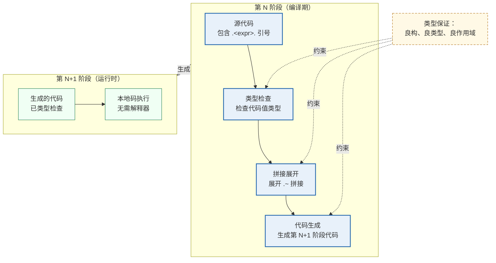

**架构原则：**
1. **阶段分离**：不同阶段的代码在类型系统中被区分（`'a code` vs `'a code code`）
2. **类型保持**：每个变换都保持类型正确性（编译期验证）
3. **作用域保持**：生成的代码保证良作用域（无未绑定变量）

#### 6.1.5 接口契约

```ocaml
(* 完整的接口契约 *)
module type MULTI_STAGE = sig
  (* 代码值：类型化的程序片段 *)
  type 'a code
  
  (* 构造操作 *)
  val quote : 'a → 'a code                    (* 将表达式转为代码 *)
  val splice : 'a code → 'a code code         (* 嵌套代码值 *)
  
  (* 检查操作 *)
  val show : 'a code → string                 (* 打印代码 *)
  val type_check : 'a code → (type_info, error) result
  
  (* 执行操作 *)
  val run : 'a code → 'a                      (* 编译并执行 *)
  val compile : 'a code → compiled_module     (* 仅编译 *)
  
  (* 组合操作 *)
  val compose : ('a → 'b code) → ('b → 'c code) → ('a → 'c code)
  
  (* 职责边界：仅构造和执行代码，不修改已有代码 *)
end
```

#### 6.1.6 职责边界

- **做什么**：构造类型安全的代码值、拼接运行时值、编译执行
- **不做什么**：不执行运行时元循环解释、不修改已编译的代码、不处理运行时反射

### 6.2 方案二：同像性 → 类型化 Token 流 + 图 IR

**2026 年推荐方案**：借鉴 **Rust 过程宏**的 Token 流模型，结合**图结构**的程序表示。

#### 6.2.1 推荐理由与论证

- Rust 的 proc-macro 系统在 2025-2026 年已经极其成熟，证明了"非同像语言也可以有强大的元编程"
- Mojo 语言（2026 年 1.0 Beta）展示了"Python 语法 + 编译期元编程"的可行性
- Gleam 语言展示了"类型安全 + 可扩展编译器"的现代设计

**具体方案架构**：
```
┌─────────────────────────────────────┐
│  表面语法层（可替换）                  │
│  Python-like / Rust-like / Custom   │
└──────────────┬──────────────────────┘
               │
┌──────────────▼──────────────────────┐
│  Token 流层（类型化）                 │
│  • 类型安全的 Token 类型              │
│  • 位置信息（Span）                   │
│  • 作用域信息（Scope）                │
└──────────────┬──────────────────────┘
               │
┌──────────────▼──────────────────────┐
│  图结构 IR（内部表示）                 │
│  • 节点：运算符、操作数、变量           │
│  • 边：数据流、控制流                  │
│  • 共享：公共子表达式共享节点           │
└─────────────────────────────────────┘
```

**论证**：相比 S 表达式的树结构，图结构更接近编译器 IR 的实际形态，且天然支持公共子表达式消除（CSE）和循环检测。

#### 6.2.2 传统方案 vs 2026 推荐方案

| 维度 | S 表达式同像性 | 类型化 Token 流 + 图 IR |
|------|---------------|------------------------|
| **表示形式** | 嵌套列表（树结构） | Token 流（表面）+ 图（内部） |
| **类型信息** | ❌ 无（所有节点都是列表） | ✅ 有（每个 Token/节点有类型） |
| **共享子表达式** | ❌ 不支持（树结构重复） | ✅ 支持（图结构共享节点） |
| **位置追踪** | ❌ 需额外机制 | ✅ 内置（Span 字段） |
| **作用域追踪** | ❌ 需运行时查找 | ✅ 内置（ScopeSet 字段） |

#### 6.2.3 能力模型设计

```rust
// 2026 方案：Rust 风格的类型化 Token 流

// Token：携带类型、位置、作用域信息
#[derive(Debug, Clone)]
pub struct Token {
    pub kind: TokenKind,
    pub span: Span,           // 源位置
    pub scope_id: ScopeId,    // 作用域标识
}

#[derive(Debug, Clone)]
pub enum TokenKind {
    // 字面量（携带类型信息）
    IntLiteral(i64),
    FloatLiteral(f64),
    StringLiteral(Rc<str>),
    BoolLiteral(bool),
    
    // 标识符（携带作用域信息）
    Identifier(Symbol),        // Symbol 是 interned string
    TypeIdentifier(Symbol),
    
    // 关键字
    Keyword(Keyword),
    
    // 运算符（携带优先级）
    Operator(Operator),
    
    // 分隔符
    Delimiter(Delimiter),
    
    // 特殊
    MacroInvocation(Symbol),   // 宏调用标识
    Eof,
}

// 图 IR：程序的有向图表示
#[derive(Debug)]
pub struct GraphIR {
    pub nodes: Vec<IRNode>,
    pub edges: Vec<IEdge>,
}

#[derive(Debug)]
pub enum IRNode {
    // 操作节点
    BinOp { op: Operator, lhs: NodeId, rhs: NodeId },
    UnOp { op: Operator, operand: NodeId },
    Call { callee: NodeId, args: Vec<NodeId> },
    
    // 数据节点
    Literal(LiteralValue),
    Variable(Symbol),
    
    // 控制流节点
    If { cond: NodeId, then: NodeId, else_: NodeId },
    Loop { body: NodeId },
    
    // 类型节点（图 IR 的一部分）
    TypeNode(TypeInfo),
}

#[derive(Debug)]
pub struct IEdge {
    pub from: NodeId,
    pub to: NodeId,
    pub edge_kind: EdgeKind,  // DataFlow, ControlFlow, TypeConstraint
}
```

#### 6.2.4 接口契约

```rust
// 完整的接口契约
pub trait SyntaxRepresentation {
    // 表面语法 → Token 流
    type TokenStream;
    // Token 流 → 图 IR
    type GraphIR;
    
    // 构造操作
    fn tokenize(source: &str) -> Result<Self::TokenStream, LexError>;
    fn parse(tokens: Self::TokenStream) -> Result<Self::GraphIR, ParseError>;
    
    // 操纵操作（元编程的核心）
    fn transform(ir: &Self::GraphIR, f: impl Fn(&IRNode) -> IRNode) -> Self::GraphIR;
    fn substitute(ir: &Self::GraphIR, from: Symbol, to: IRNode) -> Self::GraphIR;
    
    // 检查操作
    fn type_check(ir: &Self::GraphIR) -> Result<TypeInfo, TypeError>;
    fn validate_scope(ir: &Self::GraphIR) -> Result<(), ScopeError>;
    
    // 职责边界：仅表示和操纵程序结构，不执行求值
}
```

#### 6.2.5 架构原则

1. **表示-计算分离**：图 IR 仅表示程序结构，不包含求值逻辑
2. **共享优先**：公共子表达式自动共享节点（图 vs 树）
3. **类型内嵌**：类型信息直接嵌入 IR 节点，而非后期标注

### 6.3 方案三：引号 → 结构化代码值

**2026 年推荐方案**：将"引号"泛化为**结构化代码值**——一个携带类型信息、位置信息、作用域信息的可执行代码片段。

#### 6.3.1 推荐理由与论证

- MetaOCaml 的 `.<>.` 语法已经是这种方向：代码值是类型化的、良构的
- Rust 的 `TokenStream` 加上 `Span` 信息也实现了类似功能
- Mojo 的 `fn` 参数在编译期求值，实现了"编译期计算"的引号功能

**具体方案**：
```rust
// 2026 年推荐：结构化代码值
struct CodeValue {
    ast: Box<AstNode>,        // 类型化的 AST
    span: Span,               // 源位置
    scopes: ScopeSet,         // 作用域信息
    type_info: Option<Type>,  // 类型信息（如果已知）
}

// 构造代码值（"引号"的现代形式）
fn make_adder(n: i64) -> CodeValue {
    quote! {
        |x: i64| x + #n
    }
}

// 执行代码值（"eval"的现代形式）
fn execute(code: CodeValue) -> Result<Value, Error> {
    compile_and_run(code)
}
```

#### 6.3.2 与传统引号的对比

| 维度 | Lisp `quote` | 2026 结构化代码值 |
|------|-------------|------------------|
| **返回类型** | 未类型化的列表 | 类型化的 `CodeValue<'a>` |
| **信息携带** | 仅结构 | 结构+类型+位置+作用域 |
| **可操作性** | 仅列表操作 | 丰富的方法（类型检查、打印、编译） |
| **安全性** | 无保证 | 编译期验证 |

#### 6.3.3 能力模型设计

```rust
// 2026 方案：结构化代码值
pub struct CodeValue<'a> {
    // 核心：类型化的 AST（引用，零拷贝）
    ast: &'a TypedAST,
    
    // 元信息
    span: Span,                    // 源位置
    scope: ScopeSet,               // 作用域信息
    type_info: Cow<'a, TypeInfo>,  // 类型信息
    stage: Stage,                  // 阶段信息（多阶段编程）
    
    // 编译缓存（惰性）
    compiled: OnceCell<Result<CompiledModule, CompileError>>,
}

impl<'a> CodeValue<'a> {
    // 检查操作
    pub fn type_check(&self) -> Result<&TypeInfo, &TypeError> { ... }
    pub fn free_variables(&self) -> Vec<Symbol> { ... }
    
    // 变换操作（生成新 CodeValue，不可变）
    pub fn substitute(&self, var: Symbol, replacement: &CodeValue) -> CodeValue { ... }
    pub fn alpha_rename(&self, from: Symbol, to: Symbol) -> CodeValue { ... }
    
    // 执行操作（惰性编译）
    pub fn compile(&self) -> Result<&CompiledModule, &CompileError> { ... }
    pub fn run(&self) -> Result<Value, RuntimeError> { ... }
    
    // 调试操作
    pub fn pretty_print(&self) -> String { ... }
    pub fn to_debug_string(&self) -> String { ... }
}
```

#### 6.3.4 接口契约

```rust
pub trait CodeValueTrait {
    type Type;
    type Error;
    
    // 构造（引号的现代形式）
    fn from_ast(ast: &TypedAST) -> Self;
    
    // 检查
    fn is_well_typed(&self) -> bool;
    fn is_well_scoped(&self) -> bool;
    
    // 变换（不可变，返回新值）
    fn transform(&self, f: impl Fn(&TypedAST) -> TypedAST) -> Self;
    
    // 执行（惰性）
    fn compile(&self) -> Result<CompiledCode, Self::Error>;
    fn execute(&self) -> Result<Self::Type, RuntimeError>;
    
    // 组合（多阶段编程的核心）
    fn compose_with(&self, other: &Self) -> Result<Self, CompositionError>;
    
    // 职责边界：仅作为代码的值表示，不执行隐式编译
}
```

### 6.4 方案四：闭包 → OCaml 5 Effect Handlers

**2026 年推荐方案**：使用 **OCaml 5 的 Effect Handlers** 替代传统的闭包，实现更强大的"环境捕获"和"控制流抽象"。

#### 6.4.1 推荐理由与论证

- OCaml 5 的 Effect Handlers 是"用于用户定义效应的模块化编程机制"
- 它允许"描述计算挂起其当前状态并在稍后恢复"——这比闭包更通用
- Anil Madhavpeddy 的工作正在将此应用于编译器管线

**具体方案**：
```ocaml
(* 2026 年推荐：Effect Handlers 替代闭包 *)
open Effect

type _ Effect.t += Ask : string Effect.t

let read_config () =
  let (config, k) = continue_with_ask_handler () in
  (* 这里的"环境"是 handler 提供的 *)
  ...

(* 传统闭包的局限：
   - 只能捕获定义时的环境
   - 无法"挂起"并"恢复"
   
   Effect Handlers 的优势：
   - 可以在任何点挂起计算
   - "环境"由 handler 动态提供
   - 支持非局部控制流
*)
```

**论证**：对于系统级语言，Effect Handlers 比闭包更适合处理异步、并发、错误恢复等场景。

#### 6.4.2 传统闭包 vs Effect Handlers

| 维度 | 传统闭包 | OCaml 5 Effect Handlers |
|------|---------|------------------------|
| **环境捕获** | 词法作用域（定义时捕获） | 动态（由 handler 提供） |
| **控制流** | 仅返回 | 挂起/恢复/非局部退出 |
| **组合性** | 函数组合 | 效应组合（更强大） |
| **异步支持** | 需要额外机制 | 原生支持 |
| **类型安全** | 类型安全 | 效应类型系统 |

#### 6.4.3 能力模型设计

```ocaml
(* 2026 方案：OCaml 5 Effect Handlers *)

(* 效应类型：用户定义的"副作用" *)
type _ Effect.t += 
  | Read : unit → string Effect.t
  | Write : string → unit Effect.t
  | Ask : string → string Effect.t  (* 从环境获取值 *)
  | State : 'a → 'a Effect.t        (* 状态读取 *)

(* 执行效应（替代传统闭包的环境访问） *)
let read_input () = perform (Read ())
let write_output s = perform (Write s)
let ask_env key = perform (Ask key)

(* 效应处理器：提供"环境" *)
let with_input_handler (input : string list) (f : unit → 'a) : 'a =
  match f () with
  | v → v
  | effect (Read (), k) →
      match input with
      | x :: rest → continue k x (* 提供值 *)
      | [] → discontinue k (Failure "No more input")
  | effect (Write s, k) →
      print_string s;
      continue k ()
```

#### 6.4.4 架构原则

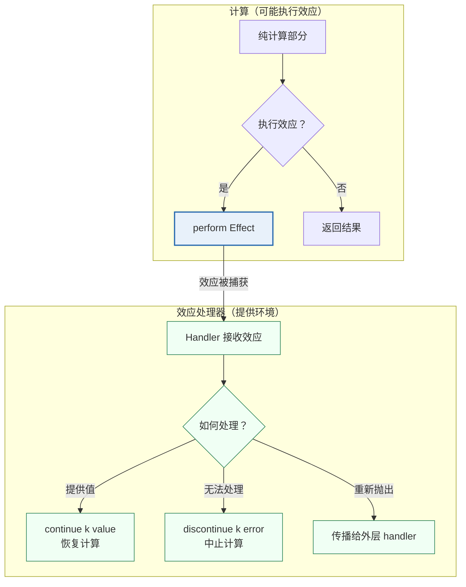

**架构原则：**
1. **效应显式化**：所有副作用通过效应类型显式声明（vs 闭包的隐式环境捕获）
2. **处理器组合**：多个 handler 可以组合，形成"效应栈"
3. **continuation 一等公民**：挂起的计算可以作为值传递和恢复

#### 6.4.5 接口契约

```ocaml
module type EFFECT_SYSTEM = sig
  (* 效应类型 *)
  type _ Effect.t
  
  (* 执行效应 *)
  val perform : 'a Effect.t → 'a
  
  (* 处理效应 *)
  val handle : 
    handler:(eff:'a. 'a Effect.t → 'a option) →
    f:(unit → 'b) → 'b
  
  (* 深度 vs 浅层处理 *)
  module Deep : sig
    val handle : handler → f → 'b  (* 处理所有嵌套效应 *)
  end
  
  module Shallow : sig
    val handle : handler → f → 'b  (* 仅处理一层效应 *)
  end
  
  (* continuation 操作 *)
  val continue : ('a, 'b) continuation → 'a → 'b
  val discontinue : ('a, 'b) continuation → exn → 'b
  
  (* 职责边界：仅处理效应和 continuation，不定义具体效应 *)
end
```

### 6.5 方案五：最小 I/O → 能力模型 + 线性类型

**2026 年推荐方案**：使用**线性类型**（Rust 的所有权）和**能力**模型来实现 I/O 副作用的安全控制。

#### 6.5.1 推荐理由与论证

- Rust 的所有权系统在 2026 年已经证明了"编译期内存安全"的可行性
- Mojo 语言引入了"基于所有权的内存管理"
- 能力模型可以精确控制"谁可以做什么 I/O"

**具体方案**：
```rust
// 2026 年推荐：能力模型 + 线性类型
struct ReadCapability {
    file: File,
    // 这个 capability 只能被使用一次
    _marker: std::marker::PhantomData<*mut ()>,
}

struct WriteCapability {
    file: File,
}

fn read_line(cap: ReadCapability) -> (String, ReadCapability) {
    let line = cap.file.read_line();
    (line, cap)  // 返回消耗后的 capability
}

fn write_line(cap: WriteCapability, s: &str) -> WriteCapability {
    cap.file.write(s);
    cap
}

// 编译期保证：
// 1. 没有 ReadCapability 就无法读
// 2. 没有 WriteCapability 就无法写
// 3. Capability 不可复制，不可伪造
// 4. I/O 操作的顺序在类型中可见
```

**论证**：这比传统的"全局 I/O 函数"更安全，且为并发和分布式场景提供了基础。

#### 6.5.2 传统 I/O vs 能力模型

| 维度 | 传统全局 I/O | 能力模型 + 线性类型 |
|------|-------------|-------------------|
| **权限控制** | 无（任何代码都能 I/O） | 精确（仅持有 capability 的代码能 I/O） |
| **静态保证** | 无 | 编译期验证（线性类型确保唯一性） |
| **可测试性** | 困难（需要 mock 全局函数） | 容易（传入不同的 capability） |
| **并发安全** | 需运行时同步 | 编译期保证（capability 不可复制） |

#### 6.5.3 能力模型设计

```rust
// 2026 方案：能力模型 + 线性类型

// 能力：不可复制、不可伪造的 I/O 权限
pub struct ReadCapability {
    // 私有字段，外部无法构造
    _private: (),
    // 编译期保证：Send + !Clone + !Copy
    _marker: PhantomData<*mut ()>,  // !Send + !Sync
}

pub struct WriteCapability {
    _private: (),
    _marker: PhantomData<*mut ()>,
}

// 能力的获取：只能通过显式授权
pub struct IOGrant {
    read: Option<ReadCapability>,
    write: Option<WriteCapability>,
}

// I/O 操作：需要 capability
pub fn read_line(cap: &mut ReadCapability) -> Result<String, IOError> {
    // 仅当持有 ReadCapability 时才能执行
    unsafe { perform_read() }
}

pub fn write_line(cap: &mut WriteCapability, s: &str) -> Result<(), IOError> {
    unsafe { perform_write(s) }
}

// 能力的传递（线性：消耗旧的，产生新的）
pub fn with_io<R>(grant: IOGrant, f: impl FnOnce(&mut IOGrant) -> R) -> R {
    f(&mut { grant })
}

// 职责边界：仅定义能力类型和传递规则，不实现具体 I/O
```

#### 6.5.4 架构原则

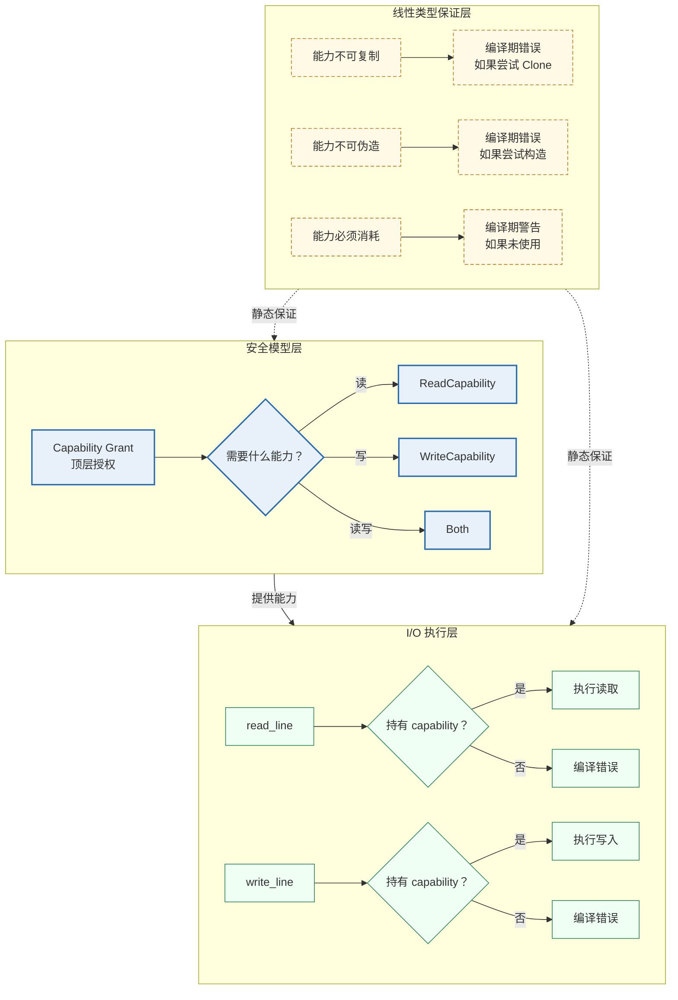

**架构原则：**
1. **最小权限原则**：默认无 I/O 能力，仅显式授予
2. **线性唯一性**：能力不可复制，确保每个 capability 只有一个持有者
3. **能力传递显式化**：所有 I/O 操作的调用链在类型中可见

### 6.6 五个方案的整合架构

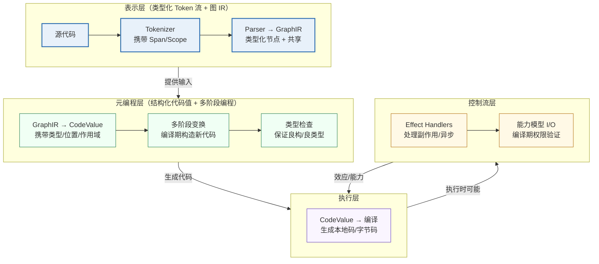

### 6.7 设计原则总结与方案对照

**结合 2026 年的技术前沿，"最小自举单元"的五个能力应该被重新定义为：**

| 原术语 | 2026 年重新定义 | 推荐技术方案 | 核心理由 |
|--------|---------------|-------------|---------|
| 元循环求值器 | **类型安全的多阶段计算** | MetaOCaml / OCaml 5 Effects | 类型保证 + 编译期优化 |
| 同像性 | **类型化 AST 可编程性** | Token 流 + 图 IR | 表面语法自由 + 内部表示统一 |
| 引号 | **结构化代码值** | 类型化 CodeValue 类型 | 携带类型、位置、作用域信息 |
| 闭包 | **效应处理与控制流抽象** | OCaml 5 Effect Handlers | 更通用的环境捕获和挂起/恢复 |
| 最小 I/O | **能力模型 + 线性类型** | Rust 所有权 + Capability | 编译期副作用安全 |

**这些推荐方案反映了 2026 年编程语言理论和工程的最佳实践**：它们不是对传统概念的简单继承，而是在类型安全、性能保证、并发能力等维度上的实质性改进。选择这些方案意味着你的"最小自举单元"将站在 2026 年技术的前沿，而非重复 1960 年的设计。

**五个方案的共同设计原则：**

1. **类型安全优先**：所有操作在编译期被类型系统验证（vs 传统方案的运行时验证）
2. **显式优于隐式**：效应、能力、阶段都显式声明（vs 闭包的隐式环境捕获）
3. **不可变性**：代码值、能力对象都是不可变的（变换产生新值）
4. **编译期计算**：尽可能将计算从运行时推到编译期（多阶段编程）
5. **组合性**：所有组件都设计为可组合的（handler 组合、capability 传递）

**与之前讨论的对应关系：**

| 之前讨论的概念 | 2026 方案的对应 | 改进之处 |
|---------------|---------------|---------|
| 元循环 eval/apply | 多阶段编程 + Effects | 类型安全 + 编译期优化 |
| S 表达式 | Token 流 + 图 IR | 类型化 + 位置/作用域追踪 |
| quote | 结构化 CodeValue | 类型化 + 丰富操作 |
| 闭包 | Effect Handlers | 更通用的环境/控制流 |
| 全局 I/O | 能力模型 + 线性类型 | 编译期安全 + 最小权限 |

这五个方案不是对传统概念的简单替代，而是在**类型安全、性能、可组合性、可验证性**等维度的系统性提升——它们代表了 2026 年编程语言理论与实践的最佳结合。

### 6.8 相关链接与拓展阅读

- **MetaOCaml**：http://okmij.org/ftp/ML/MetaOCaml.html （Oleg Kiselyov 维护）
- **OCaml 5 Effects**：https://v2.ocaml.org/manual/effects.html
- **Anil Madhavpeddy 效应编译器管线**：https://anil.recoil.org/
- **Rust proc-macro**：https://doc.rust-lang.org/reference/procedural-macros.html
- **Mojo 语言**：https://docs.modular.com/mojo/
- **Gleam 语言**：https://gleam.run/
- **Cranelift 项目**：https://cranelift.dev/
- **Capability-based security**：https://en.wikipedia.org/wiki/Capability-based_security

### 6.9 核心原语的理论最小性与命名精确性

> **本节起吸收 next3 线程（v5.0 的 next.md 线程续篇）七轮讨论的前五轮——核心原语的批判性演进**：§6.9（数量真相与命名审查）→ §6.10（理论前沿全景）→ §6.11（四层正交与 8 原语重设计）→ §6.12（最终修正、可行性审查与本项目收敛裁定）。表面/内部语法决策（第六/七轮）落位于 §7.3/§7.4。全部结论与 [§3.2](#32-九个核心原语最终定义) 冻结定义的调和见 §6.12.6。

#### 6.9.1 数量真相：9 个 vs 8 个 vs 7 个

- **Racket kernel 实际是 8 个形式**（`racket/kernel` 文档口径）：`#%plain-lambda`、`#%plain-app`、`#%plain-module-begin`、`#%datum`（展开为 `quote`，实际就是 `quote`）、`quote`、`if`、`set!`、`define`——其中变量引用与字面量是隐式的（VarRef 隐含在 `#%app` 中、Literal 由 `#%datum → quote` 处理）；
- **[§3.2](#32-九个核心原语最终定义) 的 9 个**中，`Define` 在理论上可展开为 `((lambda (x) body) value)`——即 `Lambda + App` 的**语法糖**（`Module` 对应 `#%plain-module-begin`，是组织层而非语义原语）；
- **真正不可消除的最小核心是 7 个**：`Lambda`、`App`、`If`、`VarRef`、`Literal`、`SetBang`、`Begin`——分别对应 Lambda 演算的抽象/应用、控制流分支、变量引用、数据构造、副作用、顺序求值六个语义维度，加上 `Begin` 作为副作用组合子。

#### 6.9.2 不可消除性证明（正交性验证）

| 原语 | 为什么不可消除 | 尝试用其他原语模拟的结果 |
|------|--------------|----------------------|
| Lambda | 函数是基础构造子 | 无法用 App 模拟——没有 Lambda 就无法创建函数 |
| App | 函数必须能被调用 | 无法用 If 模拟——If 是分支不是调用 |
| If | 分支需要短路语义 | `((c (lambda () t) (lambda () e)))` 可模拟，但要求 `c` 返回函数且失去原子性 |
| VarRef | 必须显式引用绑定 | 无法用 Literal 模拟——变量不是字面量 |
| Literal | 数据的起点 | Church 编码可行但效率极低且失去类型信息 |
| SetBang | 副作用的引入 | 无法用纯函数模拟（定义性的：引入副作用） |
| Begin | 副作用的组合 | `((lambda (x) b) a)` 实际可行，但需创建闭包、效率低 |

**与理论最小系统的对比**：Lambda 演算最小核心 3 个（变量、抽象、β-归约）；SKI 组合子 3 个。**7 个 = 理论最小 3 + 工程实用扩展 4**（分支、数据、副作用、副作用组合）——"理论最小 + 工程实用"的平衡，而非理论极限。

#### 6.9.3 命名精确性审查

大部分现有命名来自历史传统而非精确描述：

| 现有命名 | 历史来源 | 精确性问题 | 2026 更精确命名 | 命名理由 |
|---------|---------|-----------|---------------|---------|
| Lambda | Church 1932，λ 符号 | ✅ 精确 | `Fn` / `Abs` | Fn 简洁；Abs（abstraction）更理论化 |
| App | β-归约传统 | ⚠️ 不够精确（做什么？） | `Apply` | 动词形式，描述行为 |
| If | 传统关键字 | ⚠️ 这是分支而非"条件" | `Branch` | 描述行为而非语法关键字 |
| VarRef | 编译器实现术语 | ⚠️ 冗长且实现导向 | `Var`（de Bruijn 则 `Index`） | 简洁精确 |
| Literal | 编译器实现术语 | ⚠️ 什么是"字面"？ | `Const` / `Data` | Const 强调不可变 |
| SetBang | Scheme `!` 副作用标记 | ❌ 极不直观（Bang？） | `Assign` / `Mutate` | 描述行为 |
| Define | 传统关键字 | ❌ 做什么？绑定？命名？ | `Bind` | 直接描述行为 |
| Begin | Scheme 传统 | ❌ "开始"什么？ | `Seq` | 顺序求值 |
| Module | 通用术语 | ⚠️ 命名空间？相位单元？ | （移至模块系统层） | 模块是组织层，非语义原语 |

#### 6.9.4 2026 年重设计方案（不考虑兼容性）

- **方案 A（de Bruijn 六原语）**：`Fn / Apply / Branch / Const / Var / Seq` + 独立 effect 类型（`Assign` / `Eval`）。合并逻辑：`SetBang` 与 `Begin` 本质都是副作用——`SetBang` = `Seq [Assign {target; value}]`、`Begin` = `Seq (map Eval exprs)`；
- **方案 B（CPS 五原语，最激进）**：消去 `If`——`(if c t e)` → `Apply c [Fn(0,t), Fn(0,e)]`（前提 `c` 返回选择函数）。**不推荐**：每个条件分支都要创建闭包，效率极低；
- **方案 C（效应导向）**：副作用统一为 `Perform` 原语——`SetBang` → `Perform { effect = Assign; ... }`、`Begin` → `Perform Seq` 组合、I/O 与用户自定义效应（`Custom of Symbol`）可扩展，为效应系统预留。**讨论线程的中间推荐**。

六原语形态下全部语法糖的展开规则（完备性证明）：`let x = e1 in e2` → `Apply [Fn(1, e2), e1]`；`letrec f = Fn(x, body) in rest` → `let f = Y(Fn(f, Fn(x, body)))`（Y 组合子）；`set! x e` → `Perform [Assign, Var(x), e]`；`begin e1; e2; e3` → `Perform [Seq, ...]` 嵌套；`cond` → `Branch` 嵌套；`and a b` → `Branch(a, b, Const(Bool false))`；`or a b` → `Branch(a, Const(Bool true), b)`；`while c do body` → `Apply[Y(Fn(loop, Branch(c, Perform[Seq, body, Apply[loop]], Const(Nil))))]`；`match` → `Branch(is_patN(x), ...)` 嵌套；`for x in list` → 递归 map 展开。

**六条设计原则**（重设计的提炼）：① 理论最小性——每个原语不可被其他原语组合推导（正交性）；② de Bruijn 索引——消除变量名，简化求值器实现；③ 效应统一——副作用（赋值、顺序、I/O）统一为效应原语，为效应系统预留；④ 命名行为导向——`Apply`（做什么）而非 `App`（是什么）、`Branch`（行为）而非 `If`（语法关键字）；⑤ ANF 友好——核心设计支持 A-范式转换；⑥ 可扩展性——`Perform` 允许用户自定义效应，无需修改核心。

### 6.10 2026 年理论前沿全景与整合决策

#### 6.10.1 五大前沿维度的成熟度评估

| 前沿维度 | 具体技术 | 2026 成熟度 | 生产证据 | 与最小自举单元的相关性 |
|---------|---------|------------|---------|---------------------|
| **类型系统** | 渐进类型 | ✅ 生产就绪 | TypeScript（千万级用户）、Python type hints | 中：适合 Stage 2+ 引入 |
| | 依赖类型 + Graded Modal | ⚠️ 研究前沿 | Agda、Rocq（原 Coq）；graded modal 类型理论仍在形式化阶段 | 低：复杂度过高 |
| | 交叉/联合类型 | ✅ 生产就绪 | TypeScript、Flow | 高：类型系统的基础 |
| | 行多态 | ⚠️ 早期实践 | 用于效应追踪和可扩展记录 | 高：效应系统的类型基础 |
| **效应系统** | 代数效应+处理程序 | ⚠️ 早期实践 | OCaml 5（无效应安全）、Koka、Eff、Unison（有效应安全） | 高：Stage 2+ 核心目标 |
| | 多态效应处理程序 | ⚠️ 研究前沿 | Plotkin & Pretnar (2009) 处理程序理论 | 中：效应系统的高级形式 |
| | 行基效应类型 | ⚠️ 早期实践 | 行多态、行基效应追踪 | 高：效应追踪的类型基础 |
| **资源管理** | 线性/仿射类型 | ✅ 生产就绪 | Rust 所有权（线性类型实际采用的加速器） | 高：I/O 能力模型的基础 |
| | 会话类型 | ⚠️ 研究前沿 | 线性逻辑 Curry-Howard 对应导出 | 低：主要用于并发，Stage 3+ |
| **验证** | 经形式验证的编译器 | ✅ 生产就绪 | CompCert（唯一形式验证免受误编译的编译器，航空电子合格认证） | 中：Stage 3+ 安全目标 |
| | Cubical/HoTT | ❌ 纯研究 | 同伦类型论的 Cubical 方法 | 极低：纯数学基础研究 |
| **元编程** | 多阶段编程 | ⚠️ 研究前沿 | MetaOCaml（生成代码良构良型） | 中：Stage 2+ 编译期计算 |
| | 编译期求值 | ✅ 生产就绪 | Zig comptime（成熟）、Mojo 编译期元编程 | 高：适合 Stage 1+ |
| | 过程宏 | ✅ 生产就绪 | Rust proc-macro（10 年生产验证） | 高：Stage 0 基础设施 |

成熟度分布约 **30% 生产就绪 / 40% 早期实践 / 30% 研究前沿**。2026 年新语言的前沿实践参照：Mojo 1.0（Python 语法 + 编译期元编程 + 所有权内存管理 + 零成本 trait）、Gleam（类型安全可扩展，生产就绪）、Zig（comptime 成熟）、Roc（函数式系统语言新路径）。

#### 6.10.2 整合决策矩阵：引入 / 预留 / 忽略

| 前沿技术 | 决策 | 引入阶段 | 理由 |
|---------|------|---------|------|
| 代数效应+处理程序 | ✅ 预留接口 + 实现 | Stage 2 | OCaml 5 不提供效应安全——需自己实现类型追踪 |
| 行多态（效应追踪） | ✅ 预留类型系统 | Stage 1 | 行基效应类型是效应安全的基础 |
| 线性/仿射类型 | ✅ 实现 | Stage 1 | Rust 验证生产可行性；用于 I/O 能力模型 |
| 交叉/联合类型 | ✅ 实现 | Stage 1 | TypeScript 验证实用性；类型系统基础 |
| 渐进类型 | ⚠️ 评估 | Stage 2+ | 适合动态→静态过渡，但增加实现复杂度 |
| 编译期求值 | ✅ 实现 | Stage 1 | Zig/Mojo 验证实用性；宏展开与常量折叠 |
| 依赖类型+Graded | ❌ 忽略 | N/A | 仍在形式化阶段，复杂度过高 |
| 会话类型 | ❌ 推迟 | Stage 3+ | 并发通信类型安全，需先有并发模型 |
| 形式验证 | ⚠️ 长期目标 | Stage 3+ | CompCert 模式；架构预留（操作语义可形式化、每 pass 有不变量、IR 支持正确性证明） |
| 多阶段编程 | ⚠️ 实验 | Stage 2+ | MetaOCaml 理论成熟但实践有限 |
| Cubical/HoTT | ❌ 完全忽略 | N/A | 纯数学研究，无直接工程价值 |

#### 6.10.3 各维度深度设计要点

- **类型系统**：Stage 1 引入联合类型 + 行多态（`core_type` 含 `Union/Intersection/Row/Arrow`；行类型 `Row { fields; rest: type_var }` 支持效应追踪与可扩展记录）；
- **效应系统**：Stage 2 引入效应安全（`effect_row = { known: effect_kind list; rest: effect_var option }` 行变量允许效应扩展；函数类型携带效应行，类型检查器验证 `Perform` 处的效应行包含性）；
- **资源管理**：Stage 1 引入线性约束用于 I/O 能力（`linear_cap` 不可复制——能力传递线性语义"消耗旧的、产生新的"；`Perform` 须持相应能力）；
- **元编程**：Stage 1 引入编译期求值（Zig/Mojo 模式——`comptime` 参数编译期求值、编译期类型构造、编译期分支消除死代码）。

#### 6.10.4 增强核心与整合原则

讨论线程曾提出"增强版核心"（`Var` 携带 `type_hint`、`Perform` 携带 `capability`）——**该形态在后续轮次（§6.11）被批判性否决**（类型/能力侵入语法层，违反单一职责），此处保留为演进记录。

**五条整合原则**：① 成熟度匹配——仅引入生产就绪或早期实践技术，研究前沿仅接口预留；② 类型安全优先——效应安全、线性类型、行多态都服务于编译期捕获更多错误；③ 渐进引入——Stage 0 预留 → Stage 1 基础 → Stage 2 完整 → Stage 3+ 优化；④ 实用主义——Zig comptime 与 Mojo 证明"理论前沿可以实用化"；⑤ 架构预留——核心原语保持稳定，类型系统、效应追踪、能力模型作为附加层叠加。

### 6.11 核心原语的批判性审查与四层正交架构

#### 6.11.1 前设计的六个关键缺陷

1. **混合了四个正交维度**：`Var` 携带 `type_hint`（类型系统侵入语法层）、`Perform` 携带 `capability`（资源管理侵入效应层）、`Arrow` 携带 `effect_row`（效应系统侵入类型层）——违反单一职责原则；
2. **缺少效应处理器**：只有 `Perform`（执行）没有 `Handle`（处理）——没有 Handle，效应系统只是"声明系统"而非"可编程系统"（Koka：effect handlers 让你以类型安全方式在用户库中定义异常、async/await、概率程序等高级控制抽象）；
3. **缺少 ANF 绑定结构**：A-范式是现代编译器 IR 的标准形式（所有中间计算命名），缺少 `Let` 意味着无法自然表示 ANF；
4. **单一 IR 层级**：成功编译器都是多层 IR（Rust：AST→THIR→HIR→MIR→LLVM IR；Zig：AST→ZIR→SIR→AIR）——单一 `core_expr` 承载所有信息不现实；
5. **`type_hint` 位置错误**：类型是语义层信息，不应嵌入语法节点——应由类型检查器为节点附加类型，AST 本身不携带；
6. **`capability` 位置错误**：能力是资源管理概念，不是效应的内在属性——嵌入 `Perform` 混淆"执行什么效应"与"需要什么资源"。

#### 6.11.2 四层正交架构（8 原语形态）

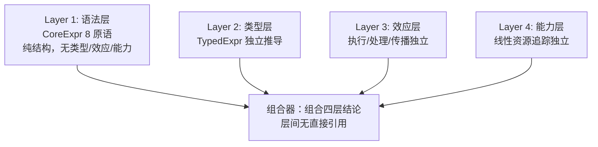

**Layer 1 语法层（8 原语完整定义，纯语法无语义标注）**：

```ocaml
type core_expr =
  (* 绑定与抽象 *)
  | Fn of { params : int; body : core_expr }            (* de Bruijn：参数个数 *)
  | Let of { bind_count : int; value : core_expr; body : core_expr }  (* ANF 绑定 *)
  (* 求值与应用 *)
  | Apply of { fn : core_expr; args : core_expr list }
  | Const of literal_value
  | Var of { index : int }                              (* de Bruijn 索引 *)
  (* 控制流 *)
  | Branch of { cond : core_expr; then' : core_expr; else' : core_expr }
  (* 效应 *)
  | Perform of { effect : effect_kind; args : core_expr list }
  | Handle of { body : core_expr; handlers : handler_clause list; final : core_expr }

and handler_clause = { effect : effect_kind; handler : core_expr }
and effect_kind = Read | Write | State | Custom of Symbol
```

相对六原语的关键改进：① 添加 `Let`（ANF 必需）；② 添加 `Handle`（效应处理必需，与 `Perform` 配对）；③ `Var` 不携带 `type_hint`；④ `Perform` 不携带 `capability`。

**Layer 2 类型层**（独立于语法，类型环境附加到节点）：`core_type` 含基础类型、`Arrow { param; result; effects: effect_row }`、`Union/Intersection/Tuple`、`Row { fields; rest }`、`Linear/Shared`、`Forall/Exists`；`typed_expr = { expr: core_expr; type_info: core_type; span }`。

**Layer 3 效应层**（独立管理执行/传播/处理）：`effect_operation = { effect; args: value list; continuation }`（continuation 含 env + stack + resumption 类型）；`effect_handler`；求值器三元组 `perform / handle / resume`。

**Layer 4 能力层**（独立管理资源访问，线性类型保证安全）：`capability = { kind; resource; linear_marker }`（`ReadCap/WriteCap/SpawnCap/NetCap/CustomCap`）；`capability_env` 追踪持有能力；`check_capability` 验证 Perform 的能力对应性；`transfer` 线性传递（消耗旧的、产生新的）。

#### 6.11.3 IR 层级演进（八层形态，后压缩为六层）

初始设计八层：AST →（脱糖）CoreExpr →（类型检查）TypedExpr →（ANF 转换）ANF →（闭包转换）ClosedExpr →（效应分析）EffectfulANF →（能力验证）CapabilityANF →（SSA 转换）SSA →（后端）目标码。各层职责与引入的优化：CoreExpr（无，语义验证）→ TypedExpr（类型导向简单优化）→ ANF（常量折叠/死代码消除/内联）→ ClosedExpr（环境扁平化）→ EffectfulANF（效应消除、纯函数检测）→ CapabilityANF（能力静态化/消除）→ SSA（全套数据流优化、寄存器分配）。**该八层形态在 §6.12 被修正为六层**（TypedExpr 并入 CoreExpr、ClosedExpr 并入 ANF、Effectful+Capability 合并为 AnnotatedANF）。

#### 6.11.4 精确命名与操作语义（8 原语）

| 原语 | 操作语义 |
|------|---------|
| Fn | `(λx.e, ρ) → Closure(x, e, ρ)` |
| Let | `(Let(v, e, body), ρ) → eval(body, ρ[v ↦ eval(e, ρ)])` |
| Apply | `(Closure(x, e, ρ) v, ρ') → (e, ρ[x ↦ v])` |
| Var | `(Var(n), ρ) → ρ[n]`（de Bruijn 索引查找） |
| Const | `(Const(c), ρ) → c` |
| Branch | `if eval(c, ρ) then (t, ρ) else (e, ρ)`（短路求值） |
| Perform | `(Perform(eff, args), ρ, κ) → EffectOperation(eff, eval(args), κ)`（挂起当前计算，传递给最近处理器） |
| Handle | 安装 handlers，求值 body；body 执行效应 → 调用对应 handler；body 正常完成 → 求值 final |

**可拓展性验证**（8 原语下糖展开）：`let` → `Let(1, e1, e2)`；`begin e1; e2; e3` → `Let(1, e1, Let(1, e2, e3))`（Let 链天然表达顺序）；`set! x e` → `Perform(State, [Var(x), e])`；`read()/write(s)` → `Perform(Read/Write, ...)`；`try...catch` → `Handle(body, [Handler(Error, handler)], dummy)`；`async/await` → `Handle(body, [Handler(Async, ...)], ...)`；状态 → `Handle(body, [Handler(State, Get/Set 分支)], ...)`。

**Handle 的表达能力**：异常处理、async/await（handler 内 `schedule(op, resume(k, result))`）、状态管理（Get → `resume(k, current_state)` / Set → 更新后恢复）、资源管理（能力检查后恢复）——高级控制抽象全部可编程。

**性能可达性**（各 IR 层级引入的优化，1/100 C → 1/1.2 C 路径）：ANF 层（常量折叠：`Let(x, Const(c), body)` → 替换；死代码消除：x 不出现则删除；内联：`Apply(Fn(x, body), [arg])` → 替换）→ 效应层（纯函数检测、独立效应重排/并行化、单处理器内联）→ 能力层（能力静态化、未用能力消除）→ SSA 层（数据流优化、寄存器分配、指令选择）。

**可塑性验证**：函数式（Fn+Apply+Let）；命令式（`Perform(State)` + Let 链）；面向对象（闭包+状态）；逻辑式（`Handle(Search)` + continuation 回溯）；并发（`Handle(Async)` + resume）；分布式（Capability(Net) + Handle）。DSL 扩展（SQL/正则/构建系统）经宏展开归约到 8 原语——核心语法无关。

### 6.12 最终修正、可行性审查与收敛裁定

#### 6.12.1 八原语形态的五个弱点与修正

| 弱点 | 修正 |
|------|------|
| **continuation 类型安全缺失**（OCaml 5 已知问题：编译器不静态确保所有效应被处理） | **修正一：精确的 continuation 类型系统**——`continuation_type = { resumption_param; resumption_result; resumption_effects }`，唯一性由线性类型保证（每个 continuation 只能恢复一次）；Handle 的三条类型约束：body 效应行 ⊆ handlers 能处理的效应 ∪ 逃逸效应；每个 handler 的 continuation 类型与 Perform 效应签名匹配；final 类型与 body 正常返回类型一致 |
| **四层之间隐式耦合**（Perform 语法层定义/效应层描述；能力层"检查"效应层运行时行为；类型层效应行依赖效应层种类） | **修正二：真正解耦的四层**——每层仅定义接口不定义对其他层的引用；**组合器**知道所有层并组合结论，层本身互不知晓 |
| **八层 IR 存在冗余**（工业编译器都是 4 层：Rust/Zig/MLton） | **修正三：压缩为六层**——TypedExpr 并入 CoreExpr（类型作为可选标注）、EffectfulANF+CapabilityANF 合并为 AnnotatedANF、ClosedExpr 在 ANF 转换中同步完成 |
| **闭包表示策略未定义**（MLton 证明这是性能关键） | **修正四：MLton 风格三策略**——flat（少量捕获变量内联）/ linked（大量且部分共享）/ toplevel（无捕获，直接代码指针）；决策算法按自由变量数量与共享子集选择 |
| **效应消除路径不明**（Koka 提供理论路径） | **修正五：四阶段优化**——① 纯函数检测（效应行为 ∅、无 Perform 节点、无 Handle 逃逸效应）；② 效应重排（无数据依赖的独立效应可并行）；③ 处理器内联（单一 handler 时 Perform 直接替换为 handler 实现）；④ 已知效应消除（编译期已知状态替换为常量） |

#### 6.12.2 六层 IR 与工业对照

| IR 层级 | 关键转换 | 引入的优化 |
|---------|---------|-----------|
| AST | 解析（保留所有语法糖） | 无 |
| CoreExpr | 脱糖 + 类型检查（8 原语 + 类型标注） | 类型导向简单优化 |
| ANF+Closed | ANF 转换 + 闭包转换（显式命名 + 显式环境） | 常量折叠、死代码消除、内联 |
| AnnotatedANF | 效应分析 + 能力验证 | 效应消除、纯函数检测、效应重排 |
| SSA | SSA 转换 | 全套数据流优化、寄存器分配 |
| LLVM/QBE | 后端代码生成 | 目标特定优化 |

六层（而非工业的四层）的理由：效应标注层（Rust/Zig 无显式效应系统）+ 闭包转换明确化（MLton 证明这是性能关键）。**本项目的 Stage 0-1 口径**：六层 IR 的完整管线是 Stage 2+ 的演进目标；Stage 0 实现的是 AST → CoreExpr → 字节码（[§8.12](#812-字节码-vm)）的最短语义验证路径（[§7.1](#71-能力矩阵-v40三层分类必须实现--接口预留--完全推迟) 矩阵与 [§11](#11-后端策略与性能演化分析) 后端策略裁定）。

#### 6.12.3 完整最终规格（2026 年修正版摘要）

- **核心原语（8 个）**：`Fn / Let / Apply / Const / Var / Branch / Perform / Handle`（定义见 §6.11.2）；
- **类型系统（独立层）**：含 `Continuation of { resumption_param; resumption_result; resumption_effects }`（类型安全 continuation）；
- **效应系统（独立层）**：`effect_row`（known + rest 行变量）；
- **能力系统（独立层）**：`capability`（线性标记）；
- **IR 层级（6 层）**：AST → CoreExpr → ANF+Closed → AnnotatedANF → SSA → LLVM/QBE；
- **闭包表示**：MLton 风格三策略 + 决策算法；
- **效应消除**：Koka 式四阶段。

**性能路径**（8 原语 → C 级）：CoreExpr（~1/100 C，解释执行）→ ANF+Closed（~1/20 C，常量折叠/死代码/内联）→ AnnotatedANF（~1/10 C，效应开销消除）→ SSA（~1/2 C，数据流优化）→ LLVM/QBE（~1/1.2 C，MLton 证明全程序优化可达 ~1/1.05 C）。

#### 6.12.4 可行性审查结论

**五目标评分**：强可拓展性 **A+**（Racket 30 年验证 + 糖展开完备）；强可塑性 **A**（Koka/Unison/TypeScript 分层演化实证）；精确性 **A**（Koka 行多态效应安全参照 + 本设计 continuation 类型补全）；可渐进性 **A+**（每层 IR 独立可用、可在任何层级停止）；顶级性能 **B+**（理论可达 + MLton/Koka 实证，但需完整优化管线）。

**四个实际风险与解决方案**：① 效应处理器编译开销 → 单一处理器内联 + 效应消除 + 常见模式特化（Koka v2 基准实证"静态消除处理程序显著提升性能"）；② 全程序优化编译时间 → 增量编译（Zig 毫秒级）+ 查询式架构（Rust MIR 查询分组）+ 分层优化（开发快速路径 / 发布完整路径）；③ 线性类型学习曲线 → 渐进引入（Stage 2+）+ 友好错误消息 + 默认 Shared 仅资源管理用 Linear；④ 多阶段编程复杂度 → 推迟 Stage 3+ + 参考 Zig comptime（用语言本身写元编程比分离宏语言更简单）。

**开发时间线**（完整优化管线口径，至 Stage 2.5）：Stage 0（AST+CoreExpr+求值器）8-12 周 → Stage 0.5（ANF+闭包转换）4-6 周 → Stage 1（效应/能力标注+基础优化）6-8 周 → Stage 2（SSA+完整优化管线）8-12 周 → Stage 2.5（LLVM/QBE 后端）4-6 周——总计 **30-44 周（7-10 个月）**。与现有语言对比：Roc 5+ 年 / Gleam 4+ 年 / Zig 10+ 年 / Koka 12+ 年 / MLton 20+ 年——目标 7-10 个月达到 ~1.2x C 是激进但可行的（站在 Koka/MLton/Zig/Rust 肩膀上）。**时间口径调和**：本时间线的 Stage 0（8-12 周）对应 [§20.1](#201-stage-0-2-4-周约-7000-行代码) 的"完整能力矩阵 12-18 周工程口径"（含基础设施与测试基建），而非"最小语义内核 2-4 周"口径——三口径互不矛盾。

#### 6.12.5 理论合理性的深度验证

- **8 原语正交性**：Fn（无法用 Apply 模拟创建函数）；Let（Begin 可模拟但无 ANF 优化机会）；Apply（无法用 Branch 模拟）；Const（Church 编码效率极低）；Var（de Bruijn 是唯一替代）；Branch（CPS 可模拟但复杂度爆炸）；Perform（无法用纯函数模拟——定义性）；Handle（无法用 Perform 模拟——处理与执行配对）；
- **四层独立性**：语法层不引用类型/效应/能力，反之亦然——组合器知道所有层，层本身互不知晓；
- **六 IR 必要性**：对比工业四层的差集 = 效应标注层 + 闭包转换明确化，两者分别是本设计的效应系统与 MLton 性能路径的核心。

#### 6.12.6 本项目收敛裁定（8 原语 vs §3.2 冻结 9 原语）

**语义等价映射**（9 冻结原语 → 8 原语形态）：

| §3.2 冻结原语 | 8 原语形态 | 映射性质 |
|-------------|-----------|---------|
| Lambda | Fn（params: int, de Bruijn） | 重命名 + 索引化 |
| App | Apply | 重命名（动词化） |
| If | Branch | 重命名（行为化） |
| VarRef | Var（index, de Bruijn） | 重命名 + 索引化 |
| Literal | Const（吸收 quote/#%datum 两层） | 重命名 + 零冗余化 |
| SetBang | Perform(State) | 副作用 → 效应 |
| Define | （消除——`Apply[Fn, value]` 语法糖） | 脱糖 |
| Begin | Let 链（ANF 顺序） | 脱糖（Let 为新增原语） |
| Module | （移至模块系统层，非语义原语） | 层级迁移 |
| （新增）Let | Let | ANF 必需的新原语 |
| （新增）Perform/Handle | Perform/Handle | 效应执行/处理配对 |

**裁定**：

1. **Stage 0-1 按冻结 9 原语（+Require 声明变体）实现不变**——依据核心冻结原则（本文件 §3.2 设计约束 + [§23.1](#231-核心二十八条原则) 原则 9）与已实现基线（kerf r8/r9：九原语全管线 476 测试全绿）；
2. **8 原语形态作为 Stage 2「目标语言完整化」的评估清单与迁移映射登记**——语义层变更（副作用 → 效应原语化）须走切换期重构流程（sop §13.2）+ 委员会投票；上述映射表即迁移路线图；
3. **四层正交 / 六 IR / MLton 闭包 / Koka 效应消除作为架构演进目标**登记——与 [§10](#10-架构分层与完整总览) 分层总览、[§21](#21-能力引入时机与自举进程推进规划) 演进矩阵对齐（效应原语化 = Stage 2 语义层；ANF/闭包转换 = Stage 1-2 IR 演进；效应消除 = Stage 3 优化器引入时机）；
4. **讨论中"Stage 0 验证 8 原语"的表述**按上表解读：Stage 0 以冻结 9 原语形式验证**同一语义核心**（9 原语经映射 11 项中的 6 项重命名 + 3 项脱糖/迁移 + 2 项新增即得 8 原语形态——语义核心共享：函数抽象/应用、分支、变量、常量、副作用、顺序）。

---

# Part III：Stage 0 能力模型与架构

## 7. Stage 0 能力矩阵与职责边界

> **术语消歧（v6.5 注记）**：本章「能力」= **工程能力**（编译器构建技术——三层分类矩阵 owner）。「能力」三义定锚（工程能力 / 语言能力[运行时能力域——L0-L3] / 授权[ocap 安全语义]）见 [lang-design/21-能力架构 §1](lang-design/21-capability-architecture.md) 与存档侧镜像 §9.7——三义禁互换。

> **截至 2026 年，Stage 0 应采用"混合务实"策略——核心语义层使用经过验证的传统方案（元循环求值器、闭包、基础同像性），基础设施层采用 2026 年已成熟的现代方案（类型化 Token 流、Span 追踪、结构化诊断），而高级 2026 方案（Effect Handlers、多阶段编程、能力模型 I/O）应仅设计接口预留而不实现——因为它们要么生态尚未完全成熟（如 Mojo 的"内存安全模型尚未完成"），要么仍主要处于研究阶段（如 MetaOCaml 的"实际实现往往使用启发式方法"）。**

### 7.1 能力矩阵 v4.0：三层分类（必须实现 / 接口预留 / 完全推迟）

#### 7.1.1 完整三层分类矩阵

| 能力模型 | 分类 | 2026 技术选择 | 成熟度评估 | 推迟到 |
|---------|------|-------------|-----------|--------|
| **类型化 Token 流 Reader** | ✅ 必须实现 | Rust proc-macro 风格 | ✅ 成熟（Rust 生产验证） | - |
| **图 IR（含共享）** | ✅ 必须实现 | 类型化节点 + 共享边 | ⚠️ 新兴（LLVM/GCC 生产验证） | - |
| **结构化 CodeValue** | ✅ 必须实现 | 携带类型/Span/Scope 的代码值 | ✅ 成熟（Rust + MetaOCaml 验证） | - |
| **元循环求值器（简化版）** | ✅ 必须实现 | 传统 eval/apply（不用 Effects） | ✅ 极成熟（60 年验证） | - |
| **基础闭包** | ✅ 必须实现 | 传统词法闭包 | ✅ 极成熟 | - |
| **Span 全管线传播** | ✅ 必须实现 | rustc 风格 Span 系统 | ✅ 成熟 | - |
| **结构化诊断框架** | ✅ 必须实现 | rustc diagnostic 风格 | ✅ 成熟 | - |
| **最小 I/O（传统）** | ✅ 必须实现 | 单 syscall / stdin/stdout | ✅ 极成熟 | - |
| **相位分离系统** | ✅ 必须实现 | Racket 风格 Phase 0/1 | ✅ 成熟 | - |
| **基础宏系统** | ✅ 必须实现 | 卫生宏 + SyntaxObject | ✅ 成熟（Racket 验证） | - |
| **标记-清除 GC** | ✅ 必须实现 | bump-pointer + 递归标记 | ✅ 成熟 | - |
| **字节码 VM** | ✅ 必须实现 | switch-dispatch，约 35 操作码 | ✅ 成熟 | - |
| **Effect Handlers** | ⚠️ 接口预留 | OCaml 5 风格（仅类型定义） | ⚠️ 新兴（正在用于 Forester 6.0） | Stage 2 |
| **多阶段编程** | ⚠️ 接口预留 | MetaOCaml 风格（仅类型定义） | ⚠️ 研究（实际实现使用启发式） | Stage 2 |
| **能力模型 I/O** | ⚠️ 接口预留 | 线性类型 + capability | ⚠️ 新兴（Rust 所有权验证） | Stage 1 |
| **编译缓存** | ⚠️ 接口预留 | 查询式缓存 | ✅ 成熟（rustc 增量验证） | Stage 1 |
| **LSP/IDE 查询**（v6.1 重分类） | ⚠️ 接口预留 | LanguageService + IncrementalAst trait | ✅ 成熟（LSP 协议生态） | Stage 2 实现 / Stage 0 预留位置 |
| **调试信息生成**（v6.1 新增） | ⚠️ 接口预留 | DebugInfoGenerator + DebugTraceable trait | ✅ 成熟（DWARF 标准） | Stage 2 实现 / Stage 0 预留位置 |
| **FFI 边界**（v6.1 重分类） | ⚠️ 接口预留 | ExternalType + FfiBoundary trait | ✅ 成熟（C ABI） | Stage 2 实现 / Stage 0 预留位置 |
| **增量编译查询**（v6.1 新增） | ⚠️ 接口预留 | QuerySystem + Query trait（salsa 风格） | ✅ 成熟（rustc/salsa 验证） | Stage 2 深化 / Stage 0 预留架构 |
| **编译器即服务**（v6.1 新增） | ⚠️ 接口预留 | CompilerService + 可序列化状态 | ✅ 成熟（2026 服务化趋势） | Stage 2 实现 / Stage 0 预留可序列化边界 |
| **多目标后端**（v6.1 新增） | ⚠️ 接口预留 | CodegenBackend trait（WASM/QBE/LLVM） | ✅ 成熟（QBE 验证） | Stage 2 实现 / Stage 0 预留 trait |
| **包管理**（v6.1 新增） | ⚠️ 接口预留 | PackageManager + ExternalModule trait | ✅ 成熟（Cargo 实证） | Stage 1 基础 / Stage 0 预留模块边界 |
| **AI 辅助接口**（v6.1 新增） | ⚠️ 接口预留 | AiAssistant 语义 API trait | ⚠️ 新兴（2026 AI 生态） | Stage 1 基础 / Stage 0 预留语义查询 |
| **本地码生成** | ❌ 完全推迟 | QBE/LLVM/C 转译 | ✅ 成熟（非 Stage 0 目标） | Stage 2 |
| **类型检查器** | ❌ 完全推迟 | Hindley-Milner | ✅ 成熟（循环依赖） | Stage 1 |
| **优化器** | ❌ 完全推迟 | 分代/增量 | ✅ 成熟（非 Stage 0 目标） | Stage 3+ |
| **GC（高级）** | ❌ 完全推迟 | 分代/增量/并发 | ✅ 成熟 | Stage 2+ |
| **JIT** | ❌ 完全推迟 | 元追踪 | ✅ 成熟 | Stage 3 |
| **并发/线程** | ❌ 完全推迟 | Actor / CSP / STM | ✅ 成熟 | Stage 3 |

> **v6.1 增补**：接口预留层由 4 项扩至 14 项（上表 ⚠️ 行）——完整性与优先级依据见 [§9.3-§9.5](#93-2026-接口预留完整性审查v61-新增)（next4.md 第八轮：2026 接口预留完整性审查）。「LSP 集成」与「FFI」自完全推迟层重分类：实现仍推迟，但 Stage 0 必须预留数据结构位置（否则后期破坏性重构）。

#### 7.1.2 三层分类的设计哲学

**为何采用三层分类而非二元"实现/推迟"**：

1. **必须实现层** = Stage 0 的核心交付物。语义引擎用最成熟的传统方案，避免技术风险；基础设施用 2026 年已成熟的现代方案，提升工程质量
2. **接口预留层** = 为 2026 年前沿技术留好位置。仅定义类型签名和 trait/模块接口，不写实现。Stage 1+ 可以无缝替换为前沿方案的实现，而无需破坏现有调用方
3. **完全推迟层** = 不在 Stage 0 设计范围内。要么存在循环依赖（类型检查器），要么非 Stage 0 目标（优化器、JIT），要么会破坏自举闭环（FFI）

### 7.2 2026 年架构原则总结

**Stage 0 的设计哲学是"用经过验证的成熟技术构建语义引擎，用 2026 年已成熟的基础设施技术（类型化 Token 流、Span 系统、结构化诊断）提升工程质量，为 2026 年的前沿技术（Effect Handlers、多阶段编程、能力模型）预留演进空间"。**

这不是保守主义，而是工程务实——2026 年的技术前沿（如 Mojo 的"内存安全模型尚未完成"、MetaOCaml 的"实际实现使用启发式"）表明，直接采用最前沿方案存在风险。**正确策略是：在数据结构和接口层面为前沿技术留好位置，在实现层面使用成熟方案，在 Stage 2+ 逐步替换为前沿方案的实现。**

**四个核心架构原则**：
1. **成熟技术优先原则**：Stage 0 的每个组件都使用至少在生产环境验证过的技术
2. **接口先行原则**：为 2026 前沿技术（Effects、多阶段、能力 I/O）与工具链生态接口（LSP 查询、调试信息、增量查询、FFI、服务化、包管理、AI 辅助——v6.1 完整清单见 §9.4）预留接口但不实现
3. **传统+现代混合原则**：核心语义用传统方案（60 年验证），基础设施用现代方案（Rust 生态验证）
4. **渐进演进原则**：Stage 1+ 可以替换 Stage 0 的实现，但接口契约不变

本章确立的"混合务实"策略（成熟语义方案 + 现代基础设施 + 前沿技术接口预留）是后续所有架构决策的裁决标准：§8 按「能力模型 → 职责边界 → 接口契约」三段式展开 12 个必须实现的能力，§9 锁定接口预留与完全推迟的边界，§10 给出分层与调用关系的总览。当任何新设计诉求与三层分类冲突时，回到 §7.1.2 的三条设计哲学重新裁决。v6.1 增补：接口预留层的完整性以 §9.4 矩阵为准（4 项既有预留 + 10 项新识别预留），其裁决基线是第 32 条原则——预留的本质是「为未来留出空间」而非「提前实现」（§23.1）。

### 7.3 Stage 0 表面语法决策：S 表达式的战略分析

> **结论：Stage 0 应当使用 S 表达式作为表面语法——不是因为 S 表达式是"最终形态"，而是因为它将"验证核心原语语义正确性"这一 Stage 0 唯一目标的实现路径从 4-6 周压缩到 2-3 周（Reader 约 300 行 vs 中缀语法 3000+ 行，语法到核心形式的映射几乎是恒等变换）；但这绝不意味着最终语言使用 S 表达式——通过"表面语法可替换"架构（§7.4 的表面/内部分离），Stage 2+ 可以无缝切换到中缀语法，而核心原语与分层架构完全不变。**

#### 7.3.1 Stage 0 的唯一目标决定语法选择

Stage 0 的目标不是"用户友好"而是"最短路径验证语义正确性"：

| 目标 | S 表达式 | 中缀语法（Rust/Go 风格） |
|------|---------|------------------------|
| 验证核心原语语义 | 2-3 周 | 4-6 周 |
| Reader 实现复杂度 | ~300 行 | ~3000 行 |
| 脱糖复杂度 | 几乎为零（近恒等映射） | 需要完整脱糖层（参数类型标注/返回类型/中缀运算符/花括号每步都是 bug 来源） |
| 宏系统实现 | 基于同像性直接 | 需要语法桥接层 |
| 最终用户体验 | ❌ 差 | ✅ 好 |
| 从 Stage 0 到目标 | 需要切换（一次性） | 无需切换 |

**关键洞察**：Stage 0 的 S 表达式**不是设计决策而是工程捷径**——它是一种"脚手架"，在 Stage 2 被完全替换。

#### 7.3.2 为什么 S 表达式将 Stage 0 时间减半

- **Reader 极简实现**：完整词法器约 50 行（Token：LParen/RParen/Quote/Symbol/Int/Float/StringLit），完整语法规则三条（program := expr*；expr := atom | '(' expr* ')' | '\'' expr；atom := symbol | number | string）。对比中缀语法：Token 类型定义 ~200 行 + Pratt parser（运算符优先级）~300 行 + 递归下降（结构化语法）~1500 行 + 错误恢复 ~500 行 = ~3000 行；
- **脱糖零成本**：S 表达式到核心形式的映射几乎是恒等变换（`(define (add x y) (+ x y))` 直接映射 `Define{name, value: Fn{...}}`，无中间层）；
- **宏系统直接实现**：同像性使宏系统在 Stage 0 就可实现（输入输出都是 S 表达式，无需语法桥接层）。

#### 7.3.3 表面语法可替换的架构保证（皮肤/骨架分离）

核心架构（原语核心 + 分层解耦 + IR 层级）保证表面语法是完全可替换的"皮肤"：无论什么表面语法（S 表达式 Reader ~300 行 / 中缀 Reader ~3000 行 / DSL Reader），输出都是相同的 CoreExpr——骨架完全不变。**Racket 实践验证**：Racket 内部使用 S 表达式核心形式，通过 `#lang` 机制支持 Rhombus（缩进语法）、Hackett（类 Haskell 语法）等完全不同的表面语法——核心形式不变。

#### 7.3.4 分阶段语法策略

| 阶段 | 表面语法 | 目的 | Reader 实现 |
|------|---------|------|-----------|
| Stage 0 | S 表达式 | 最快验证核心原语语义 | ~300 行（宿主语言） |
| Stage 1 | S 表达式（运行在 VM 上） | 用目标语言重写 Reader（自举推进） | ~500 行（目标语言子集） |
| Stage 2 | **切换到目标语法** | 用户友好的最终形态 | ~3000 行（目标语言完整版） |
| Stage 2+ | 多语法共存 | DSL 扩展 | 可插拔 Reader |

Stage 0 用 S 表达式编写全部测试与验证代码；Stage 2 用目标语法重写后，**两种语法编译产出的 CoreExpr 完全相同**——语义验证在 Stage 0 已完成，Stage 2 只需验证新 Reader 产生相同核心形式。

#### 7.3.5 为什么这是"最优策略"而非"妥协"

表面语法的选择不影响五个核心目标（强可拓展/强可塑性/精确性/可渐进/顶级性能——全部"无影响"）：**语法是"皮肤"而非"骨架"**。决策逻辑链：Stage 0 唯一目标 = 最短路径验证语义 → S 表达式压缩 2-3 周 → 节省的时间投入核心架构（Span 系统、诊断框架、相位分离）→ 架构保证语法可替换 → Stage 2+ 无缝切换 → 最终语言 = 目标语法 + 原语核心 + 完整效应/能力系统。**与本项目实现的对照**：kerf 的 [§19.1](#191-reader-实现框架) Reader 即按此决策实现（S 表达式 + 类型化 Token 流），Stage 1 批次 B 已完成 Reader 的 kerf 自举重写（B3），验证了分阶段策略第二步。

### 7.4 Stage 0 内部语法设计：类型安全 ADT 与语义化命名

> **结论：采用新原语（Fn/Let/Apply/Const/Var/Branch/Perform/Handle）之后，不应该使用旧时代的"派生关键词"设计（Racket 的 `#%plain-lambda`/`#%app` 等 `#%` 前缀标识符，或 Scheme 的 `define`/`set!` 等历史名称）——因为 `#%` 前缀是 Racket 在 S 表达式语法中区分"用户层"与"编译器层"的历史妥协（仅当语法与 AST 同构时必要），`define`/`set!` 是 1960 年代的不精确遗产；2026 年的正确设计是"类型安全的代数数据类型（ADT）+ 语义化命名 + 零历史包袱"——内部 AST 节点是编译器的私有数据结构而非用户可见标识符，安全性由类型系统而非命名约定保证。**

#### 7.4.1 "派生关键词"设计的本质与局限

Racket `#%` 前缀存在的原因：在 S 表达式的统一语法中，无法通过语法结构区分"用户可重定义的形式"与"编译器内部形式"——必须通过命名约定标记"编译器的最后防线"（用户无法 shadow `#%` 开头的标识符）。**这是语法层面的妥协，仅在"语法与 AST 同构"（同像性）的设计中必要——当语法与 AST 分离（表面/内部语法严格分离）时，这个妥协完全不需要。**

传统命名的语义不精确对照：

| 旧命名 | 不精确之处 | 2026 推荐 | 精确性改进 |
|--------|-----------|----------|-----------|
| `define` | "定义"什么？绑定？命名？赋值？ | `Let` | 精确描述"绑定值到变量" |
| `set!` | `!` 是 Scheme 副作用标记，不通用 | `Perform(State)` | 效应系统统一副作用表示 |
| `begin` | "开始"什么？顺序求值？ | `Let` 链（ANF） | ANF 的 Let 天然表达顺序 |
| `lambda` | λ 符号是 Church 1932 的选择，无语义 | `Fn` | 简洁且描述"函数" |
| `if` | 语法关键字而非行为描述 | `Branch` | 描述行为（分支） |
| `#%app` | "应用"的缩写，不明确 | `Apply` | 完整动词 |
| `quote` | "引用"什么？语法对象？ | `Const` | 描述"常量值" |
| `#%datum` | "数据"？所有 AST 节点都是数据 | 合并到 `Const` | 消除冗余 |

#### 7.4.2 三个设计原则

1. **类型安全而非命名安全**：AST 节点是编译器的私有类型（`enum CoreExpr { Fn{..}, Let{..}, ... }`）——安全性由类型系统保证，用户代码不可能构造 `CoreExpr::Fn`（除非通过编译器提供的 API）。旧设计（Racket）依赖 `#%` 前缀命名约定——从"约定"到"强制"；
2. **语义化命名而非历史命名**：名称精确描述节点行为（Fn/Apply/Branch/Let/Const/Var/Perform/Handle）——而非 1960 年代数学传统（lambda/if/set!/define/begin）或逃生舱机制（#% 前缀）；
3. **零冗余而非多层转义**：`42 → Const(Int(42))` 直接映射，无中间层——对比 Racket 的多层转义 `42 → #%datum 42 → (quote 42) → 42`。

#### 7.4.3 2026 年内部 AST 完整定义（Rust 形态）

```rust
/// 核心表达式：编译器的私有 AST 类型（用户永远不直接接触；
/// 安全性由类型系统保证）
#[derive(Debug, Clone)]
pub enum CoreExpr {
    // ---- 绑定与抽象 ----
    /// 函数抽象：(Fn{n, body}, env) → Closure{n, body, env}
    Fn { params: usize, body: Box<CoreExpr> },           // de Bruijn：参数个数
    /// ANF 绑定：eval(body, env[bind ↦ eval(value, env)])
    Let { bind_count: usize, value: Box<CoreExpr>, body: Box<CoreExpr> },
    // ---- 求值与应用 ----
    /// (Apply{f, args}, env) → apply(eval(f), eval(args))
    Apply { fn_: Box<CoreExpr>, args: Vec<CoreExpr> },
    /// (Const(v), env) → v
    Const(LiteralValue),
    /// (Var(n), env) → env[n]（de Bruijn 索引查找）
    Var { index: usize },
    // ---- 控制流 ----
    /// if eval(cond) then eval(then_) else eval(else_)（短路求值）
    Branch { cond: Box<CoreExpr>, then_: Box<CoreExpr>, else_: Box<CoreExpr> },
    // ---- 效应系统 ----
    /// (Perform{eff, args}, env, κ) → EffectOperation(eff, eval(args), κ)
    Perform { effect: EffectKind, args: Vec<CoreExpr> },
    /// 安装 handlers 求值 body；执行效应调用对应 handler；正常完成求值 final
    Handle { body: Box<CoreExpr>, handlers: Vec<HandlerClause>, final_: Box<CoreExpr> },
}

/// 效应种类（Read/Write/State/Custom——纯语法，无类型信息）
pub enum EffectKind { Read, Write, State, Custom(Symbol) }

/// 效应处理子句（接收效应参数和 continuation）
pub struct HandlerClause { pub effect: EffectKind, pub handler: Box<CoreExpr> }

/// 字面量值（Int/Float/Bool/String/Unit）
pub enum LiteralValue { Int(i64), Float(f64), Bool(bool), String(Rc<str>), Unit }
```

**优于派生关键词的六个维度**：安全性（命名约定 → 类型系统强制）；精确性（define → Let 语义明确）；冗余度（`#%datum`+`quote` 两层 → `Const` 一层）；模式匹配（运行时符号判断 → 编译期 `match` 类型检查）；元数据（命名携带 → Span 系统携带，关注点分离）；可扩展性（新原语需要新 `#%` 前缀 → 新原语是新的 enum 变体，类型安全扩展）。

**表面语法与内部语法的关系**（关键分离）：

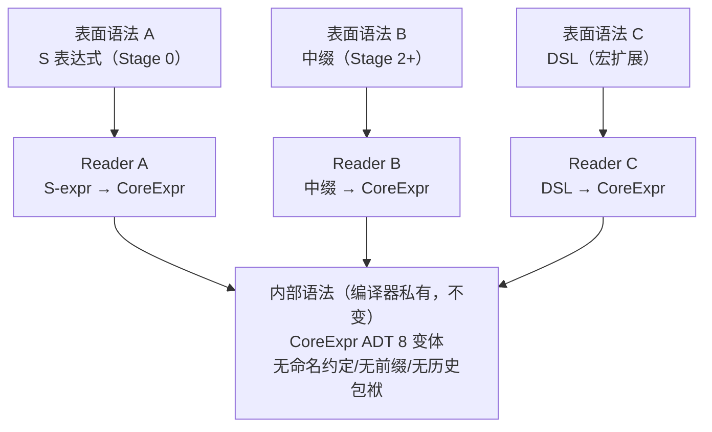

**关键洞察**：表面语法（用户文本）与内部语法（编译器 AST）是完全不同的抽象层次——前者是"接口"，后者是"实现"。派生关键词设计（`#%` 前缀）混淆了这两个层次；2026 年设计严格分离它们。

#### 7.4.4 旧到新的迁移映射与本项目落地口径

| 旧设计 | 新设计 | 迁移理由 |
|--------|--------|---------|
| `#%plain-lambda` | `Fn` | 无需前缀（类型安全），语义化命名 |
| `#%plain-app` | `Apply` | 完整动词 |
| `#%datum` | `Const` | 消除与 `quote` 的冗余 |
| `quote` | 合并到 `Const` | 字面量不需要单独的引用层 |
| `if` | `Branch` | 描述行为而非语法 |
| `set!` | `Perform(State)` | 效应系统统一副作用 |
| `define` | `Let` | ANF 需要，语义化命名 |
| `begin` | `Let` 链 | ANF 天然表达顺序 |
| `module` | （移到模块系统层） | 模块是组织层，非核心原语 |
| （不存在） | `Handle` | 新增：效应处理的基础 |

**本项目落地口径（与 §6.12.6 裁定同源）**：

1. **Stage 0-1 内部 AST 沿用 [§3.2](#32-九个核心原语最终定义) 冻结的 OCaml 风格定义**（kerf-core 的 CoreExpr 十变体：九原语 + Require 声明变体）——核心冻结原则（§23.1 原则 9）；
2. **本节三原则（类型安全 > 命名安全 / 语义化命名 / 零冗余）即刻生效为架构验证基准**——当前实现的合规性核验：① kerf-core 的 CoreExpr 是编译器私有 ADT（Rust enum 私有构造语义，用户代码无法构造）✅；② 表面 S 表达式经 Reader 桥接到 CoreExpr，语法与 AST 分离 ✅；③ Span 系统独立于命名携带元数据（`kind_name` 仅诊断渲染用）✅；
3. **语义化命名 + de Bruijn + ANF 形态（`Fn/Let/Apply/Const/Var/Branch/Perform/Handle`）作为 Stage 2 ADT 演进目标**——与 §6.12.6 迁移映射表一致，须走 Stage 2 门审查流程；
4. **设计哲学定位**：这不是对 Racket 设计的否定，而是站在 Racket 30 年经验之上的"青出于蓝"——`#%` 前缀是 S 表达式语境下的最优解，2026 年的类型安全 ADT 是现代编译器语境下的最优解。

---

## 8. 必须实现的 12 个能力模型详细设计

> 本章覆盖 [§7.1](#71-能力矩阵-v40三层分类必须实现--接口预留--完全推迟) 矩阵中「必须实现」层的全部 12 个能力模型 = **10 个语义与编译期能力**（Reader、图 IR、CodeValue、元循环求值器、闭包、Span、诊断、最小 I/O、相位分离、宏系统）+ **2 个运行时基座**（标记-清除 GC、字节码 VM）。原 v3.0 将其表述为"10+2"，v4.0 起统一为"12 个能力模型（10 + 2）"。每个能力按「能力模型 → 职责边界 → 接口契约」三段式组织；关键算法的完整可落地伪代码统一收口在 [§19](#19-关键算法与实现细节)。

### 8.1 类型化 Token 流 Reader

**能力模型**：
```rust
// 2026 成熟方案：Rust proc-macro 风格的类型化 Token
#[derive(Debug, Clone)]
pub struct Token {
    pub kind: TokenKind,      // 类型化的 Token 种类
    pub span: Span,           // 源位置（file, start_line, start_col, end_line, end_col）
    pub scope_id: ScopeId,   // 作用域标识
}

#[derive(Debug, Clone)]
pub enum TokenKind {
    // 字面量
    IntLiteral(i64), FloatLiteral(f64), 
    StringLiteral(Rc<str>), BoolLiteral(bool),
    
    // 标识符
    Identifier(Symbol),         // interned string
    TypeIdentifier(Symbol),
    
    // 关键字
    Keyword(Keyword),           // fn, let, if, match, ...
    
    // 运算符（携带优先级信息）
    Operator(Operator),
    
    // 分隔符
    Delimiter(Delimiter),       // (, ), {, }, [, ]
    
    // 宏扩展点
    MacroInvocation(Symbol),
    
    Eof,
}
```

**职责边界**：
- **做什么**：将字符流转为类型化 Token 流；附带 Span 和 Scope 信息
- **不做什么**：不做语法分析；不执行宏展开；不判断类型正确性

**接口契约**：
```rust
pub trait Reader {
    fn tokenize(&mut self, source: &str) -> Result<Vec<Token>, LexError>;
    // 保证：输出的 Token 流覆盖整个输入（无损）
    // 保证：每个 Token 携带精确的 Span
    // 保证：词法错误返回结构化的 LexError（含位置信息）
}
```

### 8.2 图 IR（含共享节点）

**能力模型**：
```rust
pub struct GraphIR {
    pub nodes: Arena<IRNode>,     // arena 分配，NodeId 索引
    pub edges: Vec<IEdge>,
    pub node_map: FxHashMap<IRNodeHash, Vec<NodeId>>,  // 哈希 → 节点（支持共享查找）
}

pub enum IRNode {
    // 操作节点
    BinOp { op: Operator, lhs: NodeId, rhs: NodeId },
    Call { callee: NodeId, args: Vec<NodeId> },
    Lambda { params: Vec<Symbol>, body: NodeId },
    
    // 数据节点
    Literal(LiteralValue),
    Variable(Symbol),
    
    // 控制流
    If { cond: NodeId, then_branch: NodeId, else_branch: NodeId },
    
    // 每个节点都携带 Span 和类型信息
    // (在 Arena 中通过辅助表存储)
}

pub struct NodeMetadata {
    pub span: Span,
    pub type_info: Option<TypeInfo>,
    pub scope: ScopeSet,
}
```

**职责边界**：
- **做什么**：表示程序的结构化形式；支持节点共享（公共子表达式）；携带完整的元信息
- **不做什么**：不执行求值；不做类型推断；不处理控制流执行顺序

**接口契约**：
```rust
pub trait IR {
    type NodeId;
    
    // 构造
    fn add_node(&mut self, node: IRNode, meta: NodeMetadata) -> NodeId;
    fn add_edge(&mut self, from: NodeId, to: NodeId, kind: EdgeKind);
    
    // 查询
    fn get_node(&self, id: NodeId) -> &IRNode;
    fn get_metadata(&self, id: NodeId) -> &NodeMetadata;
    fn find_shared(&self, node: &IRNode) -> Vec<NodeId>;  // 查找共享节点
    
    // 变换（不可变，返回新 IR）
    fn map_nodes(&self, f: impl Fn(NodeId, &IRNode) -> IRNode) -> Self;
    fn substitute(&self, var: Symbol, replacement: NodeId) -> Self;
}
```

### 8.3 结构化 CodeValue

**能力模型**：
```rust
pub struct CodeValue {
    pub ir: GraphIR,             // 完整的图 IR
    pub span: Span,              // 源位置
    pub scope: ScopeSet,         // 作用域
    pub type_info: Option<TypeInfo>,  // 类型信息（如果已知）
    pub free_vars: Vec<Symbol>,  // 自由变量列表
    pub stage: Stage,            // 阶段信息（为多阶段编程预留）
}
```

**接口契约**：
```rust
pub trait CodeValue {
    // 检查
    fn is_well_formed(&self) -> bool;
    fn free_variables(&self) -> Vec<Symbol>;
    
    // 变换（不可变）
    fn substitute(&self, var: Symbol, val: &CodeValue) -> Self;
    fn alpha_rename(&self, from: Symbol, to: Symbol) -> Self;
    
    // 多阶段编程的接口预留（Stage 2 实现）
    fn compose_with(&self, other: &Self) -> Result<Self, CompositionError>;
    
    // 职责边界：仅作为代码的值表示，不执行隐式编译
}
```

### 8.4 元循环求值器（简化版）

**为什么用传统方案而非 Effect Handlers**：OCaml 5 的效应系统虽然"正在 Forester 6.0 中实际使用"，但主要用于工具和基础设施，而非作为语言核心的求值器。Stage 0 用传统的 eval/apply 相互递归更安全。

**能力模型**：
```rust
// 简化的元循环求值器（不用 Effects）
pub enum Value {
    Closure { params: Vec<Symbol>, body: NodeId, env: Env },
    Literal(LiteralValue),
    Unit,
}

pub type Env = Rc<RefCell<HashMap<Symbol, Value>>>;

pub fn eval(ir: &GraphIR, node: NodeId, env: &Env) -> Result<Value, EvalError> {
    match ir.get_node(node) {
        IRNode::Literal(v) => Ok(Value::Literal(v.clone())),
        
        IRNode::Variable(name) => {
            env.borrow().get(name).cloned()
                .ok_or(EvalError::UnboundVariable(name.clone()))
        }
        
        IRNode::Lambda { params, body } => {
            Ok(Value::Closure { 
                params: params.clone(), 
                body: *body, 
                env: env.clone() 
            })
        }
        
        IRNode::Call { callee, args } => {
            let f = eval(ir, *callee, env)?;
            let mut arg_vals = Vec::new();
            for arg in args {
                arg_vals.push(eval(ir, *arg, env)?);
            }
            apply(f, arg_vals, ir)
        }
        
        IRNode::If { cond, then_b, else_b } => {
            let c = eval(ir, *cond, env)?;
            match c {
                Value::Literal(LiteralValue::Bool(true)) => 
                    eval(ir, *then_b, env),
                Value::Literal(LiteralValue::Bool(false)) => 
                    eval(ir, *else_b, env),
                _ => Err(EvalError::TypeMismatch)
            }
        }
        
        // ... 其他节点类型
    }
}

pub fn apply(f: Value, args: Vec<Value>, ir: &GraphIR) -> Result<Value, EvalError> {
    match f {
        Value::Closure { params, body, env } => {
            let mut new_env = env.as_ref().clone();
            for (param, arg) in params.iter().zip(args) {
                new_env.borrow_mut().insert(param.clone(), arg);
            }
            eval(ir, body, &Rc::new(new_env))
        }
        _ => Err(EvalError::NotCallable)
    }
}
```

### 8.5 基础闭包

传统词法作用域闭包，不做任何花哨的扩展。具体而言：
- **环境捕获**：捕获定义时的词法作用域
- **不可变捕获**：捕获的环境通过 `Rc<RefCell<...>>` 共享，允许可变状态但禁止逃逸
- **不引入 Effect 系统**：保持纯词法闭包，避免 Stage 0 的复杂度爆炸

### 8.6 Span 全管线传播

rustc 风格，每个 Token / AST 节点 / IR 节点 / 字节码指令都携带 Span：

```rust
pub struct Span {
    pub file_id: FileId,
    pub start: ByteOffset,
    pub end: ByteOffset,
    pub expansion_id: ExpansionId,  // 宏展开代次
}
```

Span 在每个数据结构中作为不可变字段存在，使得：
- 任何错误都能精确定位到源码
- 调试器可以反查字节码 → IR → 源码
- 增量编译可以基于 Span 进行细粒度失效

### 8.7 结构化诊断框架

借鉴 rustc 的 Diagnostic 结构：

```rust
pub struct Diagnostic {
    pub severity: Severity,         // Error / Warning / Note / Help
    pub code: Option<DiagnosticCode>,
    pub message: String,
    pub primary_span: Span,
    pub children: Vec<SubDiagnostic>,  // 关联的次要诊断
    pub suggestions: Vec<Suggestion>,  // 修复建议
}
```

**架构原则**：错误是数据而非异常；支持错误恢复策略；多阶段错误关联。

### 8.8 最小 I/O（传统）

仅 `read_line()` 和 `write_line()`，通过全局函数（非能力模型）。Stage 0 不引入能力模型 I/O，但 VM 栈帧和分配器接口必须预留 `register_foreign_ref` 等接口（Stage 0 可为 no-op），以便 Stage 1+ 升级到能力模型时无需破坏接口。

### 8.9 相位分离系统

Phase 0（运行时）/ Phase 1（宏展开时）的严格分离，参考 Racket 设计。

**三个关键规则**：
1. Phase 1 代码只能产生 Phase 0 代码，不能直接执行 Phase 0 代码
2. 区分"实例化"（执行模块体）和"访问"（仅执行 Phase 1 部分）
3. 传递依赖的相位传播

模块生命周期通过 **declare / instantiate / visit** 三种操作管理：declare 登记模块与其相位声明，instantiate 执行模块体（Phase 0 实例化），visit 仅执行 Phase 1 部分（宏变换器加载）。该模型的完整架构约束论述见 [§12.3](#123-模块相位分离系统)。

### 8.10 基础宏系统

卫生宏 + SyntaxObject，参考 Racket 但简化实现。Stage 0 的宏系统是"骨架"——支持宏定义、宏展开、卫生性保证，但不支持复杂的宏组合（如 `syntax-parse`）。

### 8.11 标记-清除 GC（最小实现）

Bump-pointer 分配 + 递归标记 + 堆遍历清除。根集包括 VM 栈、调用栈局部变量、全局环境和 C 栈显式根。Stage 0 用最简单的 mark-sweep，避免分代/增量/并发的复杂度。

**实现指引**：分配、标记、清除三个阶段的完整伪代码与栈溢出对策见 [§19.4](#194-标记-清除-gc)。

### 8.12 字节码 VM

switch-dispatch 循环，处理约 35 个操作码。完整操作码定义涵盖：
- **栈操作**：PUSH, POP, DUP, SWAP
- **函数操作**：CALL, RET, CLOSURE
- **控制流**：JUMP, JUMP_IF_FALSE
- **数据构造**：MAKE_PAIR, CAR, CDR
- **变量访问**：LOAD_LOCAL, STORE_LOCAL, LOAD_GLOBAL, STORE_GLOBAL
- **算术**：ADD, SUB, MUL, DIV
- **终止**：HALT

**VM 状态包含**：代码、数据栈、调用栈、全局环境、常量池和调试信息表。

**调用栈帧包含三个扩展槽**（Stage 0 可以为空，但格式必须保留）：
- `ext1`：为 continuation/effect handler 预留
- `ext2`：为异常处理表预留  
- `ext3`：为调试帧信息预留

**Forth 语言的线程码技术展示了 VM 极简设计的极限**：整个 VM 的核心仅由 NEXT、DOCOL、EXIT、LIT 四个原语构成。

**实现指引**：跳转回填的字节码生成与 switch-dispatch 执行循环的完整伪代码见 [§19.3](#193-compiler-实现框架) 与 [§19.5](#195-vm-执行循环)。原 v3.0 §8.6「字节码 VM 设计」与本节内容重复，v4.0 已合并至此。

---

## 9. 接口预留与完全推迟的能力

> **接口预留层与完全推迟层共同构成 Stage 0 的"未来边界"。** 二者的区别是本质性的：接口预留层**已确定将被采用**，仅推迟实现（Stage 1-2 落地，Stage 0 冻结类型签名）；完全推迟层**尚未承诺采用**（存在明确的推迟理由，Stage 1+ 重新评估）。这一区分直接决定了本章两类内容的阅读方式——前者是"必须兑现的期票"，后者是"保留的选择权"。

> **v6.1 增补（next4.md 第八轮）**：本章从「4 项预留 + 8 项推迟」扩展为「14 项预留 + 6 项推迟」——[§9.3-§9.5](#93-2026-接口预留完整性审查v61-新增) 是 2026 接口预留完整性审查的完整吸收：既有预留（效应系统、能力模型、多阶段编程、编译缓存、类型系统、IR 层级六类）覆盖约 70% 的已知需求，缺失的 30% 关键接口（LSP/IDE 查询、调试信息、FFI 边界、增量编译查询、编译器即服务、多目标后端、包管理、AI 辅助等 10 项）在 §9.3 逐项设计、§9.4 汇成矩阵、§9.5 给出 P0-P3 优先级与预留原则。这些接口的共同特征是：**不需要在 Stage 0 实现，但必须在 Stage 0 的数据结构中预留位置，否则后期引入时需要破坏性重构。**

### 9.1 接口预留的 4 个能力模型

#### 9.1.1 Effect Handlers（接口预留）

**预留接口（不实现）**：
```rust
// Stage 0 仅定义类型，不实现
pub trait EffectSystem {
    type Effect;
    type Handler;
    type Continuation;
    
    // 预留接口（Stage 2 实现）
    fn perform(&self, effect: Self::Effect) -> Self::Effect::Result;
    fn handle(&self, handler: Self::Handler, computation: impl FnOnce() -> Value) -> Value;
    
    // 职责边界：Stage 0 仅定义类型签名
}
```

**预留原因**：OCaml 5 的效应系统正在"实际使用于编译器基础设施"，但作为语言核心的求值器仍属前沿。

#### 9.1.2 多阶段编程（接口预留）

**预留接口**：
```rust
pub trait MultiStage {
    type Code;
    
    // 预留（Stage 2 实现）
    fn quote(expr: impl Expr) -> Self::Code;
    fn splice(code: Self::Code) -> Self::Code::Inner;
    fn run(code: Self::Code) -> Self::Code::Result;
}
```

**预留原因**：MetaOCaml 虽然理论上成熟（"良构的、良类型的和良作用域的"），但"实际实现往往使用启发式方法"。

#### 9.1.3 能力模型 I/O（接口预留）

**预留接口**：
```rust
// Stage 0 用传统 I/O，但预留能力模型的类型
pub struct ReadCapability { _private: () }
pub struct WriteCapability { _private: () }

pub trait CapabilityIO {
    // Stage 1+ 实现
    fn read_line(cap: &mut ReadCapability) -> Result<String, IOError>;
    fn write_line(cap: &mut WriteCapability, s: &str) -> Result<(), IOError>;
}
```

#### 9.1.4 编译缓存（接口预留）

**预留接口**：
```rust
pub trait CompilationCache {
    fn get_cached(&self, key: CacheKey) -> Option<CachedResult>;
    fn store(&mut self, key: CacheKey, result: CachedResult);
    fn invalidate(&mut self, key: CacheKey);
}
```

> 既有四项预留的覆盖度评估与缺失需求清单见 [§9.3.1](#931-已预留接口的覆盖度评估)——其中「分布式效应」「能力委托与组合」「跨阶段持久化」「跨会话缓存」等缺失需求由 §9.3.10 的边界增补与后续阶段演进承接。

### 9.2 完全推迟的能力

> **v6.1 边界调和**：原列于本层的「LSP 集成」与「FFI」重分类至接口预留层（[§9.3.2](#932-lspide-集成接口p0) / [§9.3.4](#934-ffi外部函数接口p1)）——二者的**实现**仍分别推迟至 Stage 2，但 Stage 0 必须预留其数据结构位置（AST 增量与绑定查询接口 / ExternalType 与 FfiBoundary trait），否则后期引入需破坏性重构。「完全推迟」的语义由此更精确：指**尚未承诺采用**的能力（保留选择权），而非「已承诺采用但实现推迟」的期票（接口预留层语义——见 §9 章首的区分）。

| 能力 | 推迟到 | 理由 |
|------|--------|------|
| 本地码生成 | Stage 2 | Stage 0 只需字节码 VM（后端 trait 已预留，见 §9.3.7） |
| 类型检查器 | Stage 1 | 循环依赖问题（需先有稳定的核心） |
| 高级 GC | Stage 2+ | Stage 0 用最简单的 mark-sweep |
| 优化器 | Stage 3 | 需要性能基准数据 |
| 并发 | Stage 3 | 语义复杂（效应系统为其预留演进口径，见 §9.1.1） |
| JIT | Stage 3 | 依赖 profiling 数据 |

### 9.3 2026 接口预留完整性审查（v6.1 新增）

> **本节完整吸收 next4.md 第八轮讨论**：在「具备强大可拓展性和可塑性的最小自举单元」的能力与边界设计前提下，对截至 2026 年推荐设计中的接口预留做完整性审查。核心结论：**当前设计预留了约 70% 的关键接口，但缺失了 30%——特别是 LSP/IDE、调试信息、增量编译查询这三个 P0 级接口，它们的不预留将导致后期破坏性重构。**

#### 9.3.1 已预留接口的覆盖度评估

| 接口类别 | 具体接口 | 预留状态 | 覆盖的需求 | 缺失的需求（承接落位） |
|---------|---------|---------|-----------|-----------|
| **效应系统** | EffectKind、HandlerClause、Continuation（§9.1.1） | ✅ 已预留 | 异步、并发、异常、状态 | 分布式效应、跨网络效应传播（→ §9.3.10） |
| **能力模型** | Capability、LinearType（§9.1.3） | ✅ 已预留 | I/O 安全、资源管理 | 能力委托、能力组合、动态能力获取（→ §9.3.10） |
| **多阶段编程** | Code、quote/splice（§9.1.2） | ✅ 已预留 | 编译期计算、代码生成 | 跨阶段持久化、运行时代码生成 |
| **编译缓存** | Cache 接口（§9.1.4） | ✅ 已预留 | 增量编译（数据面） | 查询式架构（架构面 → §9.3.5）、跨会话持久化、分布式缓存 |
| **类型系统** | Row、Union、Linear | ✅ 已预留 | 渐进类型、行多态 | 依赖类型、refinement types |
| **IR 层级** | 6 层 IR 定义 | ✅ 已预留 | 渐进优化 | 后端可插拔接口（→ §9.3.7） |
| **工具链生态** | —— | ❌ 整体缺失（本版补齐） | —— | LSP/IDE 查询、调试信息、FFI、服务化、包管理、AI 辅助（→ §9.3.2-§9.3.9） |

**评估结论**：语义内核维度（效应/能力/多阶段/缓存/类型/IR）的预留基本完备；**工具链生态维度整体缺失**——而这正是 2026 年语言竞争力（IDE 体验、源级调试、生态集成、AI 协作）的基础设施，也是本节补齐的目标。

#### 9.3.2 LSP/IDE 集成接口（P0）

> **命名空间交互点注记（v6.5——同步自 [lang-design/10-工具链 §2](lang-design/10-toolchain.md) v6.4/F10）**：LSP 三交互面 = ①补全（completion_items 需感知五层命名层级 N0-N4 与 import 注入面——可见性门）②重命名（rename 需过限定名不回落 R-N3——跨模块重命名不得静默改写限定引用）③格式化（format 需与 `/` 限定名词法协同——独立 `/` 除法与标识符内部分隔符不混）；IncrementalAst 键空间在批次 M 后需扩展命名空间限定键（同源设计——LanguageService 与编译器消费相同语法树）。

**为什么必须预留**：现代语言的开发体验依赖 IDE 支持，而 LSP 集成要求编译器暴露「语法/语义查询接口」——这必须在 AST 设计中预留（呼应第 14 条原则「工具即编译器」：LSP 消费与编译器相同的语法树）。

**预留接口（不实现）**：

```rust
// ============ LSP/IDE 查询接口（Stage 0 冻结形状） ============ //

/// 编译器作为语言服务器的接口（Stage 2 实现基础 LSP 服务器）
pub trait LanguageService {
    // 语法查询
    fn syntax_tree_at(&self, file: FileId, pos: Position) -> SyntaxNode;
    fn completion_items(&self, file: FileId, pos: Position) -> Vec<CompletionItem>;
    fn document_symbols(&self, file: FileId) -> Vec<Symbol>;

    // 语义查询
    fn definition_of(&self, file: FileId, pos: Position) -> Option<Location>;
    fn references_to(&self, file: FileId, pos: Position) -> Vec<Location>;
    fn type_at(&self, file: FileId, pos: Position) -> Option<TypeInfo>;

    // 诊断
    fn diagnostics(&self, file: FileId) -> Vec<Diagnostic>;
    fn quick_fixes(&self, file: FileId, pos: Position) -> Vec<CodeAction>;

    // 重构
    fn rename_symbol(
        &mut self,
        file: FileId,
        pos: Position,
        new_name: String,
    ) -> Result<WorkspaceEdit, RenameError>;
}

/// AST 增量更新接口（LSP 的按需重析依赖于此）
pub trait IncrementalAst {
    fn apply_edit(&mut self, edit: TextEdit) -> Result<(), EditError>;
    fn invalidate_range(&mut self, range: Span);
    fn reuse_unchanged(&self, other: &Self) -> ReusePlan;
}
```

**Stage 0 必须在 AST 中预留的数据结构位置**：
1. 每个节点必须可追溯 Span（**已实现**——见 §8.6 Span 全管线传播）
2. 每个绑定必须可查询其作用域（需预留——作用域表支持外部遍历）
3. AST 必须可增量更新（需预留——`IncrementalAst` trait 位置）

#### 9.3.3 调试信息生成接口（P0）

**为什么必须预留**：源级调试（断点、堆栈追踪、变量查看）要求编译器在生成代码时保留「源码 ↔ 目标码」的映射——这必须在 IR 设计中预留。

**预留接口（不实现）**：

```rust
// ============ 调试信息生成接口（Stage 0 冻结形状） ============ //

/// 调试信息生成器（Stage 2 生成源映射，Stage 2+ 生成 DWARF）
pub trait DebugInfoGenerator {
    /// 将 IR 节点映射到源码位置
    fn source_location_of(&self, ir_node: NodeId) -> Option<Span>;

    /// 将目标码地址映射回 IR 节点
    fn ir_node_at(&self, code_addr: Address) -> Option<NodeId>;

    /// 变量的位置信息（在哪个寄存器/栈槽）
    fn variable_location(&self, var: VarId, at_pc: Address) -> Option<Location>;

    /// 生成 DWARF / 源映射
    fn generate_dwarf(&self) -> DwarfSections;
    fn generate_source_map(&self) -> SourceMap;
}

/// IR 节点的调试可回溯性（每个 IR 节点实现）
pub trait DebugTraceable {
    /// AST → IR 的映射（用于从 IR 回溯到源码）
    fn ast_node_id(&self) -> AstNodeId;
    /// 变量的调试名称（而非仅 de Bruijn 索引）
    fn debug_name(&self) -> Option<Symbol>;
}
```

**Stage 0 必须在 IR 中预留的数据结构位置**：
1. 每个 IR 节点保留指向 AST 节点的反向链接
2. 变量在 IR 中有稳定的 ID（而非仅 de Bruijn 索引）
3. 函数边界和调用点有唯一标识

#### 9.3.4 FFI（外部函数接口）（P1）

**为什么必须预留**：系统级语言必须与 C/系统 API 交互，这要求类型系统预留「外部类型」表示。

**预留接口（不实现）**：

```rust
// ============ FFI 边界接口（Stage 0 冻结形状） ============ //

/// 外部函数调用的类型表示
pub enum ExternalType {
    CInt(CIntSize),
    CPointer(PointeeType),
    CStruct(Vec<ExternalType>),
    CFunction {
        param: Box<ExternalType>,
        result: Box<ExternalType>,
    },
    Opaque(String), // 不透明的外部类型
}

/// FFI 调用的核心原语
pub enum FfiCall {
    /// 调用外部函数
    CallExternal {
        symbol: Symbol,
        args: Vec<CoreExpr>,
        return_type: ExternalType,
    },
    /// 分配外部内存（不经过 GC）
    AllocExternal { size: usize },
    /// 释放外部内存
    FreeExternal { ptr: CoreExpr },
}

/// FFI 边界（GC 与外部内存的隔离协议）
pub trait FfiBoundary {
    /// 外部指针的包装类型
    type ExternalPointer;

    /// 标记对象被外部代码引用（GC 不可回收）
    fn pin_object(&mut self, obj: Value);
    fn unpin_object(&mut self, obj: Value);
}
```

**Stage 0 必须预留的数据结构位置**：
1. 核心表达式必须能表示「外部调用」
2. 类型系统必须能表示「外部类型」
3. GC 必须能识别「外部引用」（不被回收——pin/unpin 协议）

**自举合规注记**：FFI 的**实现**推迟至 Stage 2（破坏自举闭环——见 §9.2）；本预留仅为类型形状与 GC 边界协议，不引入对宿主 C ABI 的编译期依赖，不触碰自举链（§21 后端策略同口径）。

#### 9.3.5 增量编译查询接口（P0）

**为什么必须预留**：查询式架构（§13.1）要求所有编译中间结果通过统一接口访问——这必须在编译器架构中预留（参考 rustc 查询系统与 Salsa 框架）。

**预留接口（不实现）**：

```rust
// ============ 增量编译查询接口（Stage 0 冻结形状） ============ //

/// 查询系统：所有编译操作通过查询执行
pub trait QuerySystem {
    /// 输入：源文件（的内容寻址键）
    type Input;

    /// 执行查询（带缓存 + 依赖追踪）
    fn query(&self, descriptor: &QueryDescriptor) -> QueryResult;

    /// 输入变化时失效相关缓存
    fn invalidate(&mut self, input: Self::Input);

    /// 依赖追踪：查询 Q 依赖哪些其他查询
    fn dependencies_of(&self, descriptor: &QueryDescriptor) -> Vec<QueryDescriptor>;
}

/// 单个查询（编译器的每个 pass 必须建模为查询）
pub trait Query {
    type Input;
    type Output;

    /// 此查询依赖的其他查询（依赖必须完整声明）
    fn dependencies(&self) -> Vec<QueryDescriptor>;

    /// 执行查询（纯函数）
    fn execute(&self, db: &dyn QuerySystem) -> Self::Output;
}
```

**Stage 0 必须预留的架构位置**：
1. 编译器的每个 pass 必须建模为「查询」
2. 查询之间必须能声明依赖
3. 查询结果必须可缓存/可失效

**与 §9.1.4 的关系**：编译缓存预留的是**数据面**（缓存三方法），本接口预留的是**架构面**（查询/依赖/失效协议）——二者构成 salsa 式增量编译的完整骨架；§13.1 查询式增量编译架构是其正文展开，Stage 1+ 实现应同时落地这两个 trait。

#### 9.3.6 编译器即服务接口（P1）

**为什么必须预留**：2026 年的趋势是将编译器作为服务（浏览器中的 Playground、AI 辅助编程的 API）——这要求编译器可远程调用。

**预留接口（不实现）**：

```rust
// ============ 编译器即服务接口（Stage 0 冻结形状） ============ //

/// 编译器作为可远程调用的服务
pub trait CompilerService {
    /// 提交编译请求
    fn submit(&self, request: CompileRequest) -> CompileJobId;

    /// 查询编译状态
    fn status(&self, job: CompileJobId) -> CompileStatus;

    /// 获取编译结果
    fn result(&self, job: CompileJobId) -> Option<CompileResult>;

    /// 流式获取诊断信息
    fn diagnostics_stream(&self, job: CompileJobId) -> Vec<Diagnostic>;

    /// 取消编译
    fn cancel(&mut self, job: CompileJobId);
}

/// 编译请求（支持增量）
pub struct CompileRequest {
    /// 完整或增量的源码
    pub source: SourceInput,
    /// 编译目标（本地码/字节码/WASM）
    pub target: CompileTarget,
    /// 优化级别
    pub opt_level: OptLevel,
    /// 调试信息需求
    pub debug_info: DebugInfoRequest,
}

/// 可序列化边界（编译器状态可传输的前提）
pub trait Serializable {
    fn serialize(&self) -> Vec<u8>;
    fn deserialize(data: &[u8]) -> Result<Self, DeserializeError>
    where
        Self: Sized;
}
```

**Stage 0 必须预留的架构位置**：
1. 编译器必须是可序列化的（状态可传输）
2. 编译过程必须可中断/可恢复
3. 诊断信息必须可流式输出

**实证注记**：本项目 web Playground（`/api/playground` 编译即服务端点）即此接口的宿主侧雏形——预留 `CompilerService` 形状可让宿主侧服务化无需反向适配编译器内部结构。

#### 9.3.7 多目标后端接口（P1）

**为什么必须预留**：后端可插拔（IR 层级缺失需求之一）——目标中立性原则（第 13 条）的接口化落地；WebAssembly 是 2026 年的关键目标。

**预留接口（不实现）**：

```rust
// ============ 多目标后端接口（Stage 0 冻结形状） ============ //

/// 目标描述与代码生成后端
pub trait CodegenBackend {
    /// 后端支持的目标
    fn supported_targets(&self) -> Vec<TargetTriple>;

    /// 将 IR 编译为目标码
    fn compile(
        &self,
        ir: &AnnotatedANF,
        target: &TargetTriple,
    ) -> Result<CompiledModule, CodegenError>;

    /// 后端特有的优化
    fn backend_optimizations(&self) -> Vec<PassDescriptor>;
}

/// WebAssembly 后端（2026 年的关键需求：组件模型 + 接口类型 + WASM GC）
pub trait WasmBackend {
    /// 编译到 WASM 组件模型
    fn compile_component(&self, ir: &AnnotatedANF) -> Result<WasmComponent, CodegenError>;
}
```

**与 §11 后端策略的关系**：Stage 0 不引入 LLVM（§11.1）、字节码 VM 为唯一执行后端（§8.12）——本 trait 预留的是**未来后端的插槽**（Stage 2 QBE → Stage 2+ WASM/LLVM 可选），LLVM 永不进入自举链的裁定不变（§21）。

#### 9.3.8 包管理/依赖解析接口（P2）

**为什么必须预留**：模块系统必须支持「外部模块」（来自其他包）——导入路径与包依赖的表示能力必须在 Stage 0 的模块边界中预留。

**预留接口（不实现）**：

```rust
// ============ 包管理接口（Stage 0 冻结形状） ============ //

/// 包管理器与编译器的接口
pub trait PackageManager {
    /// 解析依赖图
    fn resolve_dependencies(
        &self,
        manifest: &PackageManifest,
    ) -> Result<DependencyGraph, ResolveError>;

    /// 获取包的编译产物
    fn get_package(
        &self,
        name: &PackageName,
        version: &Version,
    ) -> Result<PackageArtifact, FetchError>;

    /// 锁定依赖版本
    fn lock(&self, graph: &DependencyGraph) -> LockFile;
}

/// 外部模块（模块系统的包边界预留）
pub trait ExternalModule {
    /// 外部模块的来源（包名+路径）
    fn source(&self) -> ModuleSource;
    /// 外部模块的编译产物（可能是预编译的）
    fn compiled(&self) -> Option<CompiledModule>;
}
```

**Stage 0 必须预留的数据结构位置**：
1. 模块系统必须支持「外部模块」（来自其他包）
2. 导入路径必须能表示包依赖
3. 编译器必须能增量编译单个包

#### 9.3.9 AI 辅助编程接口（P2）

**2026 年的关键需求**：AI 编程助手需要编译器提供「语义级 API」而非仅文本级——语义摘要、签名查询、快速类型检查、重构建议。

**预留接口（不实现）**：

```rust
// ============ AI 辅助编程接口（Stage 0 冻结形状） ============ //

/// 为 AI 编程助手提供的语义 API
pub trait AiAssistant {
    /// 获取代码的语义摘要（用于上下文理解）
    fn semantic_summary(&self, file: FileId) -> SemanticSummary;

    /// 获取函数的输入/输出类型和效应（用于补全建议）
    fn function_signature(&self, symbol: &Symbol) -> FunctionSignature;

    /// 验证 AI 生成的代码是否类型安全（快速检查）
    fn quick_typecheck(&self, snippet: &str) -> Result<TypeCheckResult, TypeError>;

    /// 提供重构建议（AI 辅助重构）
    fn refactoring_suggestions(&self, selection: &Span) -> Vec<Refactoring>;

    /// 生成代码的文档注释
    fn generate_doc_comment(&self, item: &Symbol) -> String;
}
```

**与 LanguageService 的关系**：`AiAssistant` 复用 `LanguageService`（§9.3.2）的查询基建（符号表、类型表、诊断流），是其上的语义封装层——预留前者时后者的大部分查询形状已被冻结，成本边际递减。

#### 9.3.10 效应扩展与能力委托（既有预留的边界增补）

既有 §9.1.1（Effect Handlers）与 §9.1.3（能力模型 I/O）的覆盖度评估暴露两类缺失需求（§9.3.1 表），按「不新增接口、只注明既有形状的扩展方向」处理：

- **分布式效应 / 跨网络效应传播**：`EffectSystem` trait 的 `Effect` 关联类型已可承载自定义效应族——Stage 2 效应 DSL、Stage 3+ 分布式效应在此基础上扩展，不要求 Stage 0 追加数据结构位置（效应描述本身已正交于执行位置）
- **能力委托 / 能力组合 / 动态能力获取**：`ReadCapability`/`WriteCapability` 令牌的线性传递语义（不可复制、不可伪造）已预留委托的语义地基——能力组合（`And` 能力积类型）与受限委托（attenuation）在 Stage 1+ 以库形态叠加于令牌类型之上，无需修改既有签名

此二项在 §9.4 矩阵中以 P1/P3 登记其演进方向（效应扩展 P3、能力委托 P1——后者因安全模型的完整性依赖早期令牌语义冻结）。

### 9.4 完整接口预留矩阵

> 下表是 v6.1 后接口预留层的**唯一完整清单**（4 项既有 + 10 项新识别 = 14 项）——任何「某接口是否已预留」的争议以此表为准。

| 接口 | Stage 0 预留内容 | Stage 1 实现 | Stage 2+ 实现 | 预留成本 | 不预留的代价 |
|------|----------------|-------------|-------------|---------|------------|
| **Effect Handlers**（既有） | EffectSystem trait 形状（§9.1.1） | —— | 效应 DSL | 已预留 | 效应系统封闭 |
| **多阶段编程**（既有） | MultiStage trait 形状（§9.1.2） | —— | quote/splice/run 实现 | 已预留 | 元编程受限 |
| **能力模型 I/O**（既有） | 令牌类型 + CapabilityIO（§9.1.3） | 基础能力传递 | 完整安全模型 | 已预留 | 安全模型受限 |
| **编译缓存**（既有） | CompilationCache 三方法（§9.1.4） | 内存内容寻址做实 | salsa 依赖图深化 | 已预留 | 增量编译无从谈起 |
| **LSP/IDE 查询** | AST 增量接口、绑定查询接口（§9.3.2） | 基础 LSP 服务器 | 完整 IDE 支持 | 2 天 | 需重构 AST（破坏性） |
| **调试信息** | AST↔IR 反向链接、变量稳定 ID（§9.3.3） | 源映射生成 | DWARF 生成 | 3 天 | 需重构 IR（破坏性） |
| **FFI 边界** | ExternalType、外部调用原语（§9.3.4） | C FFI | 完整 FFI | 5 天 | 需重构类型系统 |
| **增量编译查询** | 查询系统架构（§9.3.5） | 查询缓存 | 完整增量 | 1 周 | 需重构编译器架构（破坏性） |
| **编译器即服务** | 可序列化状态（§9.3.6） | REST API | Web Playground | 3 天 | 需重构编译器 |
| **多目标后端** | 后端 trait 定义（§9.3.7） | QBE 后端 | WASM/LLVM（可选，不入自举链） | 2 天 | 需重构代码生成 |
| **包管理** | 外部模块支持（§9.3.8） | 基础包解析 | 完整生态 | 3 天 | 需重构模块系统 |
| **AI 辅助** | 语义 API 预留（§9.3.9） | 基础补全 | 完整 AI 集成 | 2 天 | 失去 AI 生态 |
| **效应扩展**（增补） | 自定义效应类型位置（§9.3.10） | 效应 DSL | 分布式效应 | 1 天 | 效应系统封闭 |
| **能力委托**（增补） | 能力传递接口（§9.3.10） | 基础委托 | 完整安全模型 | 1 天 | 安全模型受限 |

### 9.5 优先级策略与预留原则

#### 9.5.1 按「不预留的破坏性代价」排序

| 优先级 | 接口 | 不预留的代价 | 预留成本 | 建议行动 |
|--------|------|------------|---------|---------|
| **P0** | LSP/IDE 查询 | 需重构 AST（破坏性） | 2 天 | ✅ 必须在 Stage 0 数据结构中预留位置 |
| **P0** | 调试信息 | 需重构 IR（破坏性） | 3 天 | ✅ 必须在 Stage 0 数据结构中预留位置 |
| **P0** | 增量编译查询 | 需重构编译器架构（破坏性） | 1 周 | ✅ 必须在 Stage 0 架构中预留 |
| **P1** | FFI 边界 | 需重构类型系统 | 5 天 | ✅ 强烈建议在 Stage 0 预留 trait 定义 |
| **P1** | 多目标后端 | 需重构代码生成 | 2 天 | ✅ 强烈建议在 Stage 0 预留 trait 定义 |
| **P1** | 编译器即服务 | 需重构编译器 | 3 天 | ✅ 强烈建议在 Stage 0 预留 trait 定义 |
| **P2** | 包管理 | 需重构模块系统 | 3 天 | ⚠️ 建议在 Stage 1 预留 |
| **P2** | AI 辅助 | 失去 AI 生态 | 2 天 | ⚠️ 建议在 Stage 1 预留 |
| **P3** | 分布式效应 | 效应系统封闭 | 1 天 | 💡 可在 Stage 3+ 添加 |

#### 9.5.2 预留总成本核算

补充 10 个接口预留后，总预留成本约为 **3 周**（在 Stage 0 的 12-18 周中占比 17-25%，与 §21.8.1 短期净影响「+6-10 周」口径相容——预留是其中回报率最高的部分）；不预留的代价是后期需要**数月级的破坏性重构**（P0 三项均为「重构 AST/IR/编译器架构」级）。

**最终接口预留策略**：
1. **P0 接口**（LSP、调试、增量）必须在 Stage 0 的数据结构中预留位置
2. **P1 接口**（FFI、后端、服务化）强烈建议在 Stage 0 预留 trait 定义
3. **P2 接口**（包管理、AI）建议在 Stage 1 预留
4. **P3 接口**（分布式效应）可在 Stage 3+ 添加

**核心原则（第 32 条「预留留白原则」的裁定表述）**：**接口预留的本质是「为未来留出空间」而非「提前实现」——它要求的是数据结构和类型定义的兼容性，而非功能的完整性。**

#### 9.5.3 接口预留层全景图（v6.1）

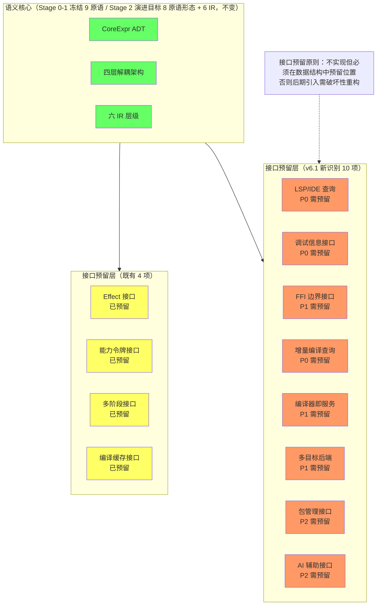

> 图中语义核心标注采用 §6.12.6 收敛裁定口径（Stage 0-1 冻结 9 原语；8 原语形态为 Stage 2 演进目标）；E 组新增接口的优先级与成本明细见 §9.4/§9.5.1。

### 9.6 表面命名现代化（v6.2 新增——r32 审查轮存档侧镜像）

> 归档侧增量：本节为设计拆分面 [lang-design/20-表面规范](lang-design/20-surface-conventions.md)（v1.0，r32/53-a）的上游存档摘要——完整规范（R1-R6 六规则 + B1-B5 行为契约 + 命名空间层 + 57 项映射表 + 三批次迁移）以拆分文件为准。驱动源：用户审查指令「实现端不要停留在 Lisp 家族 1970 年代表达（内建函数命名/行为模式/编码习惯/组织思路）」。

**裁定内核**（三句）：

1. **库表面是现代化的「未认领半区」**：内部 ADT 已由原则 29-31 + E5 裁定治理，但 57 内置名（`?` 谓词 ×18 + `->` 转换 ×3 + `car`/`cdr` 历史名 + 扁平 `str-` 前缀）此前无现代化 owner/TD 登记——表面债随库生长线性累积（Stage 2 库化生长即将放量）。
2. **标点后缀约定 = 前类型系统时代的补偿机制**：`?`/`!`/`->` 在名字里编码本应由类型/效应/能力系统承载的信息（布尔返回/副作用/转换）；HM 推断（r29）+ 效应处理器（r25）+ 能力门控（r8）就位后，表面应同步迁移——即**原则 33**（§23.1）。
3. **零破坏三段迁移**：v0.5 别名层（现代名双注册，行为 parity 锚定——别名层零语义变更不变量）→ v0.6 命名空间层（`/` 限定名 + `kerf/<模块>` 模块树 + B1-B3 现代契约——能力-命名空间对齐：`kerf/io` ↔ `(require io …)`）→ Stage 3 移除轮（与 E5 关键字切换同窗，一次性清算）。E5 裁定适用域划分：内部 ADT + 关键字面 = E5 一次性窗口；库表面 = 别名渐进（纯增量零自举链接触）。

### 9.7 能力架构与命名空间深度设计（v6.3 新增——r33 审查轮存档侧镜像）

> 归档侧增量：本节为设计拆分面 [lang-design/21-能力架构](lang-design/21-capability-architecture.md) + [lang-design/22-命名空间设计](lang-design/22-namespace-design.md)（双文件 v1.0，r33/54-a）的上游存档摘要——完整规范（三义定锚 + L0-L3 四要素卡 + J1-J4 正交判据 + 八库能力域 + 授权三态 + 原语四要素卡与六类迁移分类学 + 五层命名层级 N0-N4 + 解析/遮蔽/权限矩阵）以拆分文件为准。驱动源：用户审查指令「整体是否需要清晰的能力定位、能力边界、能力职责、能力正交……对原语级别的内容不是简单的重命名（之前存在相关讨论并已经在计划中推进重构设计）」。

**裁定内核**（三句）：

1. **「能力」三义定锚**：工程能力（编译器构建技术——13 三层分类 owner）/ 语言能力（运行时能力域——21 §2 L0-L3 owner）/ 授权（ocap 安全语义——require 门控/FFI 令牌 owner）三义拆净，禁互换——r32 前三义混用即「能力架构无 owner」的证据。
2. **语言能力四层正交 + 可审计判据**：L0 值域 / L1 控制 / L2 效应 / L3 授权——每层四要素卡（定位/边界/职责/正交）；正交判据 J1-J4 各配既有实测锚（r24 装箱值零控制层改动 = J1；r25 原语集 9→11 零断言修改 = J2；r8 门控授权零语义载荷 = J3；D10 效应-授权正交 = J4）——正交是已验证的测试属性非口号；授权三态（纯度/声明/令牌）递进收紧 + fail-closed 三红线（缺省拒绝/授权零语义/import 不传播授权）。
3. **原语级迁移 ≠ 重命名 + 命名机制完整设计**：六类迁移性质分类学（M-R 重命名/M-D 脱糖/M-I 索引化/M-L 层级迁移/M-E 效应化/M-A 新增——「重命名只是最浅一类」，E1-E5 既有裁定的结构重构载荷归档）+ 新原语准入两判据（不可归约性 + 单层归属）；五层命名层级 N0-N4 + 解析优先序 R-N1（非限定 N3→N2→N1；限定不回落）+ 遮蔽许可表 + 模块×授权权限矩阵 + import 不传播授权红线 + `kerf/` 保留域——v0.6 批次 M 的实施输入由此齐备——即**原则 34**（§23.1）。20-表面规范同步升 v1.1（§1.2 失实叙述修正 + §5 分工接线 + §5.3 对齐精确化）。

### 9.8 演进治理与判据先于先例（v6.4 新增——r34 审查轮存档侧镜像）

r34 设计缺陷深度审计收敛轮的三句裁定内核（拆分面权威 = [lang-design/23-演进治理](lang-design/23-evolution-governance.md) v1.0；姊妹面 = [21-能力架构](lang-design/21-capability-architecture.md) v1.1 + [22-命名空间设计](lang-design/22-namespace-design.md) v1.1）：

1. **演进阶段与时机有单源 owner**：六窗（K/L/M/E5/T3+）触发表——每窗入口信号全满足才开窗 + 出口条件 + 时间治理四红线（禁止时间驱动切换/处理程度倒挂/无信号开窗/窗口合并）；层级治理 = 三轴坐标系（语义 L0-L3 × 命名 N0-N4 × 相位 P0/P1——「L3′」记号退役）+ 变更通道矩阵 + 准入判据总表 + 受控债务四步仲裁 + 生命周期四阶段。
2. **权限组合与编译期权威两补齐**：require 传递闭包（授权责任上移入口——模块需求 = 元数据非授权获得；WASI「无环境权威」同构）+ Phase 1 零授权面（宏展开纯符号变换——syntax-parse 类提案须过编译期权威三判据：确定性/零外部 I/O 或编译期令牌/展开可终止）。
3. **判据先于先例**：先例是佐证不是权威（向后锚定 = 停在 1970 表达；向前锚定 = 抄 Rust/Swift——两种等价失败形态）；引证纪律 = 先判据后先例 + 跨家族取样 + 否决记录保留——即**原则 35**（§23.1）。收敛证明：十二审计轴 × 两轮内循环，第一轮 14 项发现全落位，第二轮 0 新 P0/P1，残余 7 项全持接口契约。

---

---

## 10. 架构分层与完整总览

> **本章合并了原 §8.5（架构分层与调用关系）与原 §20（完整架构总览）。** 架构从两个正交视角呈现：§10.1 是能力视角（哪些能力属于哪一层），§10.2 是分层视角（六层结构各自的职责），§10.3-§10.5 给出两视角共同遵守的依赖规则与数据流。任何新增设计必须同时通过这两个视角的一致性检查——能力归属明确、依赖方向单向。

### 10.1 能力视角总图（2026 v4.0）

下图将 §7.1 三层分类矩阵转化为依赖关系图：实线为管线内的顺序依赖，虚线为横切贯穿或接口预留关系。

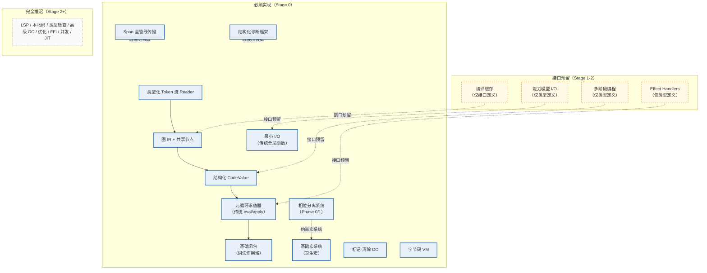

### 10.2 分层视角总图

下图给出六层结构的总览：语义引擎核心（Reader → Expander → Compiler → VM → Runtime）构成主管线，基础设施层（[§12](#12-基础设施层横切关注点设计)）横向贯穿，工程支撑层与理论边界层（[§13](#13-工程支撑层与理论边界层设计)）从外部支撑与约束，外围能力层与操作基础层（[§14](#14-外围能力层与操作基础层设计)）提供环境保障。

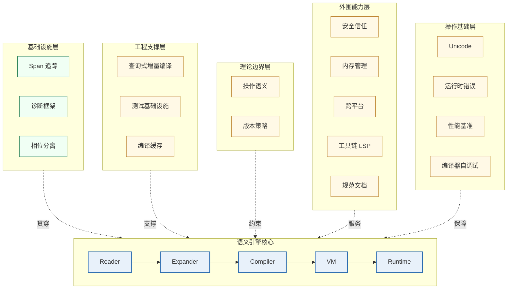

### 10.3 单向依赖规则

**单向依赖规则**：`Reader → Expander → Compiler → VM → Runtime`。

**相位分离**：Phase 0（运行时）/ Phase 1（编译时）/ Phase -1（被导入用于 Phase 1 的模块）。核心规则：一个相位的输出是下一个相位使用的代码，禁止任何直接的值传递。

**数据流分离**：编译时数据（SyntaxObject、CoreExpr）和运行时数据（Value、Pair）是不同的类型，禁止混用。

**接口契约规则**：
1. 每个接口是纯函数（无副作用，幂等）
2. 错误必须显式返回（Result 类型），禁止异常
3. 数据类型在模块间传递时不可变
4. 接口签名一旦冻结，向后兼容必须永久保持

### 10.4 调用关系与数据流

```
单向数据流（严格禁止反向依赖）：

字符流 
  → [Reader] → Token 流（携带 Span/Scope）
    → [Parser] → Graph IR（共享节点）
      → [Macro Expander] → 展开的 Graph IR
        → [CodeValue 构造] → 结构化代码值
          → [元循环求值器] → 执行结果
            → [输出（最小 I/O）]

横向贯穿（所有阶段可用）：
  - Span 系统：查询源位置
  - 诊断框架：报告错误
  - 相位分离：区分编译时/运行时
```

### 10.5 层级依赖规则

```
Layer 0: 最小 I/O Runtime（无依赖）
Layer 1: Span 系统 + 诊断框架（依赖 Layer 0 用于输出）
Layer 2: Token/Reader（依赖 Layer 1 用于 Span）
Layer 3: Graph IR（依赖 Layer 2 用于构造）
Layer 4: CodeValue + 宏系统（依赖 Layer 3）
Layer 5: 元循环求值器（依赖 Layer 4）
Layer 6: 相位分离系统（依赖 Layer 4-5 用于协调）
```

**规则**：上层可以依赖下层，反之禁止。同层之间通过显式接口交互。

---

## 11. 后端策略与性能演化分析

### 11.1 Stage 0 后端策略：不引入 LLVM

**推荐策略：自建字节码 VM，不引入 LLVM。**

**核心理由**（基于 Cone 编译器的实测数据，200 行测试程序）：

| 阶段 | 时间（μSec） | 占比 |
|------|-------------|------|
| 前端总计 | ~800 | 0.7% |
| **LLVM 后端总计** | **115,500** | **99.3%** |

引入 LLVM 后，编译器在处理小到中等规模程序时的迭代速度会被降低 **100-150 倍**。Zig 语言用自建后端替换 LLVM 后，构建时间几乎减半。

### 11.2 混合演进策略

| Stage | 后端选择 | 性能特征 | 引入时机 |
|--------|---------|---------|---------|
| Stage 0 | 自建字节码 VM | 1/10-1/30 相对性能 | 立即 |
| Stage 2a | QBE 或 Cranelift | 约 70% LLVM 性能 | 语义稳定后 |
| Stage 2b | C 转译器 | 最大平台覆盖 | 与 QBE 并行 |
| Stage 3 | LLVM（可选发布后端） | 极限优化 | 仅发布构建 |

**关键约束**：后端永远可插拔、永远可替换；LLVM 永远不是必需品。

### 11.3 性能演化路径

```
Stage 0: 宿主元循环求值 → 1/100 到 1/1000（相对 C）
Stage 1: 字节码 VM       → 1/10 到 1/30
Stage 2: 本地码生成（基础）→ 1/2 到 1/5
Stage 3: 优化编译         → 1/1.2 到 1/1.5
```

**PyPy 元追踪 JIT 数据**：元追踪解释器在追踪阶段比常规解释器慢约 900 倍（追踪时双层解释）。但这仅出现在 JIT 预热的极短暂阶段。

**语义极小化反而有利于长期性能**：优化器面对的是高度正交的操作组合，只需处理少量模式。

---

## 12. 基础设施层：横切关注点设计

基础设施层的三个组件（Span、诊断、相位分离）是**横切关注点**：它们不处于编译管线的主数据流上，却被管线每个阶段消费。本章论述其架构约束；数据结构与能力模型的规范定义分别在 [§8.6](#86-span-全管线传播)、[§8.7](#87-结构化诊断框架)、[§8.9](#89-相位分离系统)，二者构成"定义 vs 架构"的分离视图。

### 12.1 Span 源位置追踪系统

**设计原则**：源位置信息从 Reader 产生，贯穿 Expander、Compiler、VM，且必须在所有中间数据结构中作为不可变字段存在。

**为什么不可推迟**：没有 Span 的 AST 无法支持增量编译、调试器、或任何形式的有用错误报告。后期补上意味着重写所有数据结构。Span 的规范定义见 [§8.6](#86-span-全管线传播)——采用字节偏移表示（`ByteOffset`），行号/列号在渲染诊断时由偏移派生，避免双源存储造成的不一致。

Span 在管线各阶段的消费方式：

| 阶段 | Span 携带位置 | 消费方式 |
|------|-------------|---------|
| Reader | 每个 Token | 词法错误定位、无损覆盖校验 |
| Expander | SyntaxObject + 宏展开代次（expansion_id） | 多阶段错误关联、卫生性追踪 |
| Compiler | 字节码指令 → debug_info_table | 运行时错误反查源码 |
| VM | debug_info_table（按 pc 查询） | 堆栈追踪生成、调试器断点 |
| 增量编译 | 文件 × 字节区间 | 细粒度失效传播（§13.1） |

这张消费表定义了 Span 的**最小字段集**：任何少于上述字段的设计都会在某个阶段失去反查能力——这正是"横切关注点必须早期内置"（§23.1 原则 6）的具体依据。

### 12.2 诊断框架

统一错误数据结构包含严重性、错误码、主消息、主 Span、子位置和建议修复（Rust 结构定义见 [§8.7](#87-结构化诊断框架)）。作为横切关注点，诊断框架的核心架构约束是**"错误是数据而非异常"**：诊断对象在每个阶段被构造、聚合、按严重性排序后统一渲染，而不是通过异常冒泡打断管线。这带来三个直接后果：其一，编译器可以在单次运行中报告多个错误（异常模型只能报告一个）；其二，Expander 可以在错误恢复后继续展开后续形式，为 IDE 提供增量反馈；其三，诊断的结构化字段（severity / code / suggestions）可以被 LSP（Stage 2）直接消费而无需二次解析。多阶段错误关联（同一错误的词法、展开、编译三个层面位置）依赖 Span 的 expansion_id 字段串联。

### 12.3 模块相位分离系统

完整的相位模型区分 Phase 0（运行时值）和 Phase 1（宏变换器），通过 declare / instantiate / visit 三种操作管理模块生命周期。其三个关键规则（Phase 1 只能产生 Phase 0 代码、实例化与访问分离、传递依赖相位传播）及能力模型定义见 [§8.9](#89-相位分离系统)；本节仅强调其横切属性：相位分离不是独立的管线阶段，而是 Expander（§19.2）展开决策与 Compiler（§19.3）链接决策的共享上下文——两个阶段通过同一相位表查询模块的相位归属，任何一侧对相位语义的理解偏差都会导致宏展开期/运行期代码的串扰错误。

---

## 13. 工程支撑层与理论边界层设计

> **本章合并了原 §11（工程支撑层）与原 §12（理论边界层）。** §13.1-§13.3 是工程支撑层——让编译器在大型代码库上保持可演化（增量编译、测试、缓存）；§13.4-§13.5 是理论边界层——为语义提供可验证的规范锚点（操作语义、版本兼容）。前者服务于"工程可行"，后者服务于"正确性可证"，二者共同构成语义引擎核心的外部约束环。

### 13.1 查询式增量编译架构

将编译过程建模为纯函数查询图（借鉴 rustc 的查询系统和 Salsa 框架）。查询是纯函数、依赖必须完整声明、失效按需传播。

该架构的 Stage 0 接口预留（`QuerySystem`/`Query` trait，P0）见 [§9.3.5](#935-增量编译查询接口p0)——与 [§9.1.4](#914-编译缓存接口预留) 编译缓存构成「缓存（数据面）+ 查询（架构面）」双预留；Stage 1+ 的实现应直接落地这两个 trait，而非另起接口。

### 13.2 测试基础设施

三层测试：快照测试（确定性输出）、黄金文件测试（预期输出 diff）、自举测试（两次编译自身，比较字节一致性）。

### 13.3 编译缓存

与查询系统天然集成：查询缓存就是编译缓存。Stage 0 仅设计接口，Stage 1+ 实现具体的查询式缓存。

编译缓存的接口预留定义见 [§9.1.4](#914-编译缓存接口预留)；Stage 1+ 的实现应直接落地该 trait，而非另起接口。

### 13.4 操作语义形式化定义

9 个核心原语的完整小步操作语义（归约规则），以及编译正确性定理：对任意源程序 `p`，如果 `p →* v`，那么 `compile(p) →* v`。

### 13.5 版本兼容性策略

**核心冻结原则**：9 个核心原语的语义在整个语言生命周期内不变，所有演化通过宏系统在核心之上叠加。

---

## 14. 外围能力层与操作基础层设计

> **本章合并了原 §13（外围能力层）与原 §14（操作基础层）。** §14.1-§14.5 是外围能力层——服务编译器之外的信任、内存、平台与文档需求；§14.6-§14.9 是操作基础层——支撑编译器自身的运行环境（Unicode、运行时错误、基准、自调试）。这些能力全部为 Stage 0 的"最小骨架"版本：接口先行，深度实现推迟到 §7.1 矩阵标注的阶段。

### 14.1 安全与信任模型

信任链形式化（Trusted/Verified/Assumed/Untrusted 四级），多样化双重编译（DDC）验证机制，宏代码的最小权限沙箱模型。

### 14.2 内存管理策略

分配器接口协议包含基础分配、屏障接口（Stage 0 为 no-op）、根集管理和 FFI 外部引用追踪。堆对象统一头格式支持从保守 GC 演进到精确/分代/增量 GC。

### 14.3 跨平台抽象层

目标描述语言（类似 LLVM triple 的结构化版本）和 ABI 契约定义。

### 14.4 工具链基础设施

编译器必须暴露内部 API 供 LSP 服务器、格式化器和 linter 消费。

### 14.5 语言规范与文档流程

文档即代码：Scribble 风格，规范与实现使用相同语言编写。

### 14.6 Unicode 基础设施

三层架构：编码层（UTF-8 解码验证）、词法层（标识符字符集、字符串字面量）、语义层（内部字符串表示）。

### 14.7 运行时错误基础设施

debug_info_table（字节码地址 → 源码位置映射，编译时生成）与堆栈追踪生成器。

### 14.8 性能基准框架

标准基准测试集：编译速度（lex/parse/expand/compile）、执行速度（fib/loop/alloc）、自举基准。

### 14.9 编译器自调试工具

四层调试：IR dump 接口、阶段跟踪、编译器内省 API、交互式调试器。

---

## 15. 三个待定决策的前置架构约束

| 决策 | 前置架构约束 | 预期解决时机 |
|------|-------------|-------------|
| **并发内存模型** | IR 中共享内存访问必须显式标记为 `SharedLoad/SharedStore`，Stage 0 保守视为 SeqCst | Stage 3 |
| **错误运行时语义** | VM 栈帧必须预留 3 个扩展槽（continuation/异常/调试） | Stage 2 |
| **FFI 所有权模型** | 分配器必须包含 `register_foreign_ref` 等接口（Stage 0 可为 no-op） | Stage 2 |

---

# Part IV：参照分析与语言演化

## 16. C 语言的深度参照分析

**C 是一门"高度自举但非完全自举"的系统级实现语言，其定位是"跨架构可移植的汇编码 + 其他语言的引导层"。**

| 维度 | C | 本设计 |
|------|---|--------|
| 核心原语数 | 数百个 | 9 个正交原语 |
| 元循环能力 | 无（预处理器仅文本替换，非图灵完备） | 有（卫生宏系统） |
| 自举完备度 | 高但有汇编漏洞（crt0、内建函数、libc 底层） | 目标：完全自举 |
| 可拓展性 | 低 | 高（核心极小化） |
| 相位分离 | 无 | Phase 0/1 物理隔离 |
| 稳定性策略 | 向后兼容（语法层） | 核心冻结（语义层） |

C 的"元层空洞"（无元循环能力）恰恰使其成为极其稳定的编译目标——因为它不会改变。Lisp 的元循环能力意味着语言可以无限演化，这牺牲了稳定性。

---

## 17. 开发语言选择：单语言 vs 多语言策略

### 17.1 根本差异对比

| 维度 | 单语言策略 | 多语言协作策略 |
|------|----------|-------------|
| **构建复杂度** | ✅ 单一工具链 | ❌ 多套编译器、版本对齐 |
| **接口契约成本** | ✅ 零跨语言边界 | ❌ 每个边界需要显式 FFI |
| **类型系统一致性** | ✅ AST/IR 数据类型全栈统一 | ❌ 跨语言类型映射风险 |
| **调试体验** | ✅ 统一的堆栈追踪 | ❌ 混合堆栈难解析 |
| **自举闭环性** | ✅ 无外部依赖 | ❌ 永远依赖多种宿主语言 |
| **适合阶段** | **Stage 0-1（核心）** | **Stage 2+（可选优化）** |

**Stage 0 强烈推荐单一语言**——多语言协作的隐性成本远超表面认知（研究表明可能增加功能缺陷和安全漏洞）。每个跨语言边界都是信息丢失点和性能瓶颈。

### 17.2 单语言选择：OCaml vs Rust

**首选：OCaml**（如果首要目标是快速验证语义）

- 代数数据类型与模式匹配为 AST 处理提供"近乎完美"的表达力
- GC 消除内存管理负担，专注于语义
- Hindley-Milner 类型推断捕获大量编译期错误
- rustc 最初就用 OCaml 编写——历史验证了其适用性

**次选：Rust**（如果目标是工业级性能的系统级语言）

- 内存安全 + 无 GC + 类型安全三位一体
- 借用检查器在编译器开发中反而成为优势——强制思考数据所有权
- 与 C 相当的性能，适合 Stage 2+ 的本地码生成器
- rustc 的演化路径（OCaml → Rust）是最佳历史证据

| 维度 | OCaml | Rust | C |
|------|-------|------|---|
| AST 表达力 | ⭐⭐⭐⭐⭐ | ⭐⭐⭐⭐ | ⭐ |
| 内存安全 | ⭐⭐⭐ | ⭐⭐⭐⭐⭐ | ⭐ |
| 性能上限 | ⭐⭐⭐ | ⭐⭐⭐⭐⭐ | ⭐⭐⭐⭐⭐ |
| 开发速度 | ⭐⭐⭐⭐⭐ | ⭐⭐⭐ | ⭐⭐ |
| **Stage 0 推荐（快速验证语义）** | ⭐⭐⭐⭐⭐ | ⭐⭐⭐⭐ | ⭐⭐ |
| **Stage 2+ 推荐（工业级性能）** | ⭐⭐⭐ | ⭐⭐⭐⭐⭐ | ⭐⭐⭐⭐ |

上表星级按目标取向分别评定（v4.0 修正：v3.0 的单一"Stage 0 推荐"行与正文"首选 OCaml 快速验证 / 次选 Rust 工业性能"的双路径表述相矛盾）。若首要目标是快速验证语义——本设计的推荐路径——OCaml 为首选；若已确定工业级性能目标且接受更慢的开发节奏，Rust 是正确选择。两条路径的架构设计（§7-§15）完全一致，差异仅在宿主实现语言。

### 17.3 C 的定位：仅用于 VM 和运行时

C 不适合作为编译器前端（类型安全不足），但适合作为字节码 VM 和运行时的实现语言（可移植性承诺）。

### 17.4 多语言组合：何时考虑

**仅在 Stage 2+ 考虑**，且仅限于：
- OCaml 前端 + C VM（FFI 边界明确后）
- Rust 前端 + QBE/LLVM 后端（后端可插拔架构）

---

## 18. Stage 1+ 语言演化策略：从宿主语言到完全自举

### 18.1 演化总览

**Stage 0 完成后，Stage 1 确实开始用已构建的新语言编写代码，但完整的"用新语言开发新语言"是一个渐进过程。**

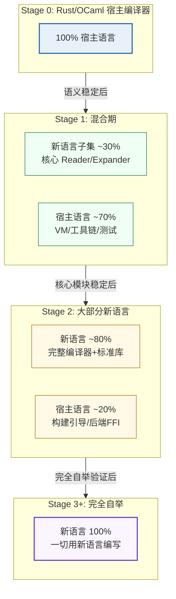

### 18.2 混合期（Stage 1）的具体构成

```
新语言编写的部分（在 Stage 0 VM 上运行）：
├── Reader（新语言子集）
├── Expander（新语言子集）
└── 基础宏定义

宿主语言编写的部分（原生执行）：
├── Stage 0 VM 的 C/Rust 实现
├── 构建系统
├── 测试运行器
├── 基准测试框架
└── 调试工具
```

### 18.3 阶段切换信号

**Stage 0 → Stage 1**：
- [ ] 9 个核心原语语义稳定且通过测试
- [ ] Stage 0 编译器能正确编译新语言子集的所有测试用例
- [ ] 宏展开器工作正常
- [ ] 至少 100 个测试用例全部通过

**Stage 1 → Stage 2**：
- [ ] 新语言子集能表达所有编译器前端逻辑
- [ ] 标准库已包含：列表操作、字符串处理、基本 I/O
- [ ] 增量编译基础设施已在新语言中可用

**Stage 2 → Stage 3**：
- [ ] 新语言能实现自身的完整编译器
- [ ] 两次编译自身的结果字节一致
- [ ] 构建系统可用新语言重写

### 18.4 Rust 在整个生命周期中的角色变化

```
Stage 0:  Rust/OCaml = 100%（所有代码）
Stage 1:  宿主语言 ≈ 70%，新语言 ≈ 30%
Stage 2:  宿主语言 ≈ 20%，新语言 ≈ 80%
Stage 3:  宿主语言 = 0%，新语言 = 100%
Stage 3+: 新语言自我演化，宿主语言仅作为历史遗迹
```

### 18.5 完全自举的核心收益

- **非平凡用例的测试**：编译器本身是极复杂的程序，自举是语言的终极测试
- **改进的循环收益**：编译器优化不仅改善用户程序，也改善编译器自身
- **开发者只需掌握一种语言**
- **完全一致性检查**：编译器能重现自身的对象码

---

# Part V：实施与启动

## 19. 关键算法与实现细节

> **本章将 §8 定义的 12 个能力模型落实为可直接照抄实现的伪代码框架。** 所有伪代码采用 Rust 风格语法（与 §8 的能力模型定义保持一致），但刻意停留在"控制流 + 数据流"层面，不绑定具体内存布局——同一框架可无损翻译为 OCaml（推荐宿主）或 C（VM 基座）。每节按「算法骨架 → 核心不变式 → 实现陷阱」组织：不变式是测试设计的直接依据，陷阱清单来自历史实现（Guix 自举链、rustc、Racket BC）踩过的坑。

### 19.1 Reader 实现框架

Reader = UTF-8 感知的词法器 + 递归下降语法器：输入字符流，输出携带 Span 的 Token 流与 SyntaxObject 树（能力模型定义见 [§8.1](#81-类型化-token-流-reader)，接口契约见同节）。

**词法器骨架**：

```rust
fn lex(source: &str, file_id: FileId) -> Result<Vec<Token>, LexError> {
    let mut chars = source.char_indices().peekable();  // (byte_offset, char)
    let mut toks = Vec::new();
    let (mut line, mut col) = (1u32, 1u32);
    while let Some((off, ch)) = chars.next() {
        match ch {
            '\n' => { line += 1; col = 1; }
            ' ' | '\t' => { col += 1; }
            '(' | ')' | '{' | '}' | '[' | ']' => {
                toks.push(Token::delimiter(ch,
                    Span::new(file_id, off, off + 1, line, col)));
                col += 1;
            }
            c if c.is_ascii_digit() => {
                let start = off;
                let mut text = String::new();
                text.push(c);
                while matches!(chars.peek(), Some((_, d)) if d.is_ascii_digit()) {
                    let (_, d) = chars.next().unwrap();
                    text.push(d);
                }
                toks.push(Token::int_lit(&text, Span::new(file_id, start, off + text.len(), line, col)));
                col += text.len() as u32;
            }
            c if is_id_start(c) => {           // Unicode 感知：XID_Start
                let start = off;
                let mut text = String::from(c);
                while matches!(chars.peek(), Some((_, d)) if is_id_continue(*d)) {
                    text.push(chars.next().unwrap().1);
                }
                let sym = intern(text);         // Symbol 内部化（一次性）
                toks.push(Token::classify(sym, Span::new(file_id, start, off + text.len(), line, col)));
                col += text.chars().count() as u32;
            }
            '"' => { /* 字符串字面量：处理转义与跨行，逐字符更新 line/col */ }
            _ => return Err(LexError::new(ch, Span::new(file_id, off, off + ch.len_utf8(), line, col))),
        }
    }
    toks.push(Token::eof());
    Ok(toks)
}
```

**语法器骨架（递归下降，每非终结符一函数）**：

```rust
fn parse_expr(&mut self) -> Result<Stx, ParseError> {
    match self.peek_kind() {
        Keyword(Let)     => self.parse_let(),       // let x = e in body
        Keyword(Fn)      => self.parse_lambda(),    // fn (params) body
        Keyword(If)      => self.parse_if(),        // if c { t } else { e }
        MacroInvoke(m)   => self.parse_macro_use(m),// 扩展点：原样包装交给 Expander
        Ident(_)         => self.parse_call_or_ref(),
        IntLit(_) | StrLit(_) | BoolLit(_) => self.literal(),
        _ => Err(ParseError::unexpected_token(self.peek())),
    }
}

fn parse_if(&mut self) -> Result<Stx, ParseError> {
    let kw = self.expect(Keyword(If))?;              // 消费并校验关键字
    let cond = self.parse_expr()?;
    let then_b = self.parse_block()?;
    let else_b = if self.peek_is(Keyword(Else)) { self.parse_block()? } else { Stx::unit() };
    Ok(Stx::if_form(cond, then_b, else_b, kw.span.merge(else_b.span)))
}
```

**核心不变式**：
1. **无损性**：Token 流的 Span 并集精确覆盖输入字节区间，无间隙、无重叠——这是 §13.1 增量编译按 Span 细粒度失效的前提
2. **位置完备性**：任何错误路径都能构造携带完整 Span 的 LexError / ParseError，直接进入 §8.7 诊断框架
3. **词法层零语义**：关键字分类是纯查表，不涉及作用域或类型判断；`MacroInvocation` Token 只是扩展点标记，Reader 不尝试展开

**实现陷阱**：
- **列号语义必须二选一**：字节列与字符列不可混用（UTF-8 多字节字符下二者不同）。本设计统一为"字节偏移为主键，行/列仅用于诊断渲染"，Span 存偏移、渲染时派生
- **标识符 Unicode 规范化时机**：NFC 归一化应在 intern 时做一次且仅一次，否则同一视觉标识符会产生两个 Symbol
- **字符串跨行会破坏行号**：词法器内的 line 计数必须在字符串字面量内部继续维护
- **拒绝"贪心数字"**：`123abc` 应报错（数字后紧跟标识符字符），而非拆成两个 Token——贪心拆分会掩盖用户笔误

### 19.2 Expander 实现框架

递归展开：处理 9 个核心形式 + 宏调用（Transformer）+ 作用域集查找（能力模型见 [§8.10](#810-基础宏系统)，相位规则见 [§8.9](#89-相位分离系统)）。

**展开循环骨架**：

```rust
fn expand(stx: &Stx, ctx: &mut ExpandCtx) -> Result<Stx, ExpandError> {
    match stx.form() {
        // 1. 核心形式：不展开自身，只递归展开子节点
        Form::Lambda { params, body } => {
            ctx.push_scope();                       // 作用域集入栈：新绑定加入
            ctx.bind_params(params);
            let body2 = expand(body, ctx)?;
            ctx.pop_scope();
            Ok(Stx::lambda(params, body2, stx.span()))
        }
        Form::If { c, t, e } => Ok(Stx::if_form(expand(c, ctx)?, expand(t, ctx)?, expand(e, ctx)?, stx.span())),

        // 2. 宏调用：相位 1 执行 transformer，再递归展开产物（直到不动点）
        Form::MacroUse { name, args } => {
            let transformer = ctx.lookup_transformer(name, stx.scopes())?;
            // 卫生性关键：展开产物自动携带「宏定义处作用域 + 使用处作用域」的并集
            let expanded = transformer.apply(args, ctx)?;
            expand(&expanded, ctx)                  // 宏可以展开出宏，直至核心形式
        }

        // 3. 标识符解析：作用域集决定绑定位
        Form::Id(sym) => {
            match ctx.resolve(sym, stx.scopes()) {
                Some(Binding::Local(slot))    => Ok(Stx::local_ref(slot, stx.span())),
                Some(Binding::Global(name))   => Ok(Stx::global_ref(name, stx.span())),
                None => Err(ExpandError::unbound(sym, stx.span())),
            }
        }
        // ... 其余核心形式同构处理
    }
}
```

**核心不变式**：
1. **展开终止性**：每次宏调用产生的语法对象携带"展开代次 + 1"的 expansion_id（§8.6）；超过上限（如 10_000）报错而非栈溢出
2. **卫生性保持**：宏引入的标识符作用域集 ≠ 用户代码作用域集，二者在 SyntaxObject 中永不合并为一个集合
3. **相位封闭性**：Phase 1 的 transformer 只能产生 Phase 0 语法对象，不能反向执行 Phase 0 代码（§8.9 规则 1）

**实现陷阱**：
- **非局部展开的 Span 悬空**：宏展开产物中所有 SyntaxObject 必须携带有效 Span（宏定义处或调用处的合成 Span），"空 Span"会让后续诊断失效——这是 rustc 早期实际踩过的坑
- **展开缓存键必须含作用域集**：同一宏名在不同作用域下解析到不同 transformer，缓存键漏掉作用域集会产生错误复用
- **set! 与 define 的展开顺序**：`Define` 在展开期需区分"函数体内部"（转为 SetBang + 局部绑定）与"模块顶层"（保持 Define），处理不当会静默改变语义

### 19.3 Compiler 实现框架

CoreExpr → Bytecode 的直译式编译，含跳转回填、常量池、全局符号表和 debug_info_table 生成（能力模型见 [§8.12](#812-字节码-vm)）。

**代码生成骨架（含跳转回填）**：

```rust
fn compile_expr(e: &CoreExpr, out: &mut CodeBuf) -> Result<(), CompileError> {
    match e {
        Literal(v) => out.emit(Op::PUSH_CONST, &[out.intern_const(v)]),
        VarRef(name) => match out.env().slot(name) {
            Some(slot) => out.emit(Op::LOAD_LOCAL, &[slot]),
            None => out.emit(Op::LOAD_GLOBAL, &[out.intern_global(name)]),
        },
        Lambda { params, body } => {
            let proto = out.begin_closure(params);   // 开启闭包子程序
            compile_expr(body, out)?;
            out.emit(Op::RET, &[]);
            out.end_closure(proto);
            out.emit(Op::CLOSURE, &[proto.id()]);    // 在当前位置构造闭包值
        }
        If { cond, then_b, else_b } => {
            compile_expr(cond, out)?;
            let j_false = out.emit_jump(Op::JUMP_IF_FALSE);   // 目标未知，占位
            compile_expr(then_b, out)?;
            let j_end = out.emit_jump(Op::JUMP);              // 目标未知，占位
            out.patch_jump(j_false, out.here());              // 回填 else 入口
            compile_expr(else_b, out)?;
            out.patch_jump(j_end, out.here());                // 回填汇合点
        }
        App { fn_expr, args } => {
            for a in args { compile_expr(a, out)?; }  // 求值顺序：参数从左到右
            compile_expr(fn_expr, out)?;
            out.emit(Op::CALL, &[args.len()]);
        }
        // Begin / SetBang / Define / Module 同构处理
    }
    // 每条 emit 自动写入 debug_info_table: (pc, current_span)
    Ok(())
}
```

**核心不变式**：
1. **栈平衡**：任何 CoreExpr 的编译产物执行前后，操作数栈净变化 = 表达式返回值个数（恰好 1）；违反即编译器 bug
2. **回填完备**：`emit_jump` 返回的占位索引在函数返回前必须全部被 `patch_jump` 消费，CodeBuf 析构时断言占位队列为空
3. **调试信息全覆盖**：每条指令都有 (pc, Span) 映射，无裸指令——VM 错误才能反查源码（§14.7）

**实现陷阱**：
- **尾调用不是 Stage 0 的优化目标**，但 If 编译模式必须为尾位置标注留位（Stage 1+ 的 TCO 只改 Compiler，不改 VM）
- **常量池去重**：`intern_const` 必须按值哈希去重，否则 `(begin 1 1 1)` 会塞 3 个相同的 Int 常量，无谓膨胀字节码
- **模块级全局的链接时机**：Stage 0 单模块编译可立即解析；多模块链接推迟到 VM 加载期（LOAD_GLOBAL 按名惰性解析 + 缓存）

### 19.4 标记-清除 GC

Bump-pointer 分配 + 递归标记 + 堆遍历清除（能力模型见 [§8.11](#811-标记-清除-gc最小实现)，内存管理策略见 [§14.2](#142-内存管理策略)）。根集包括 VM 栈、调用栈局部变量、全局环境和 C 栈显式根。

**三阶段骨架**：

```rust
/// 分配：bump-pointer，分配失败时触发回收
fn alloc(heap: &mut Heap, size: usize, roots: &RootSet) -> *mut ObjHeader {
    if let Some(p) = heap.bump_alloc(size) { return p; }
    gc_cycle(heap, roots);                    // 回收一轮
    if let Some(p) = heap.bump_alloc(size) { return p; }
    heap.grow(size);                          // 仍不足则扩堆
    heap.bump_alloc(size).expect("OOM")
}

fn gc_cycle(heap: &mut Heap, roots: &RootSet) {
    mark_all(roots, heap);   // 1. 标记：从根集可达的全部对象置位
    sweep(heap);             // 2. 清除：未标记对象归还 free list
    heap.clear_marks();      // 3. 复位：为下一轮准备
}

fn mark_all(roots: &RootSet, heap: &mut Heap) {
    let mut work: Vec<GcRef> = roots.collect();       // 显式工作栈（防递归爆栈）
    while let Some(obj) = work.pop() {
        if heap.test_and_set_mark(obj) { continue; }  // 已标记则跳过
        for child in heap.children(obj) { work.push(child); }
    }
}

fn sweep(heap: &mut Heap) {
    for obj in heap.iter_objects() {                  // 线性遍历堆
        if !heap.is_marked(obj) { heap.free(obj); }   // 归还 free list（保守策略：泄漏容忍，误回收零容忍）
    }
}
```

**核心不变式**：
1. **根集完备性**：VM 数据栈、调用栈局部、全局环境、`register_foreign_ref` 登记的外部引用（§15 FFI 预留）——四类根缺一不可，漏根 = 悬垂指针
2. **标记位复位对称**：`clear_marks` 必须遍历全部对象（含刚回收的），否则下一轮标记会继承脏状态
3. **分配零内卷**：bump 分配路径上不得调用任何可能触发分配的函数（含日志），否则递归触发 GC

**实现陷阱**：
- **递归标记的爆栈风险**：`mark(obj)` 递归深度 = 最长引用链。一个 10^7 元素的嵌套列表会爆 C 栈——因此骨架中用显式工作栈替代递归（这正是 jonesforth 与早期 MIT Lisp 都踩过的坑）
- **VM 执行中途的安全点**：GC 只能在指令边界触发（CALL / JUMP 等分派点检查分配配额），操作数栈中途的状态必须可枚举为根
- **bump 分配器与 free list 的共存**：sweep 归还的空间先记入 free list；Stage 0 允许"只分配不压缩"，碎片治理推迟到 Stage 2 分代 GC

### 19.5 VM 执行循环

switch-dispatch 循环，处理约 35 个操作码（完整清单见 [§8.12](#812-字节码-vm)；操作码按类分组：栈操作、函数、控制流、数据构造、变量访问、算术、终止）。运行时错误捕获含堆栈追踪生成。

**执行循环骨架**：

```rust
fn run(vm: &mut Vm) -> Result<Value, VmError> {
    loop {
        let (op, operands) = vm.fetch_decode();       // 读取 pc 处指令，pc 自增
        match op {
            Op::PUSH_CONST(k)  => vm.push(vm.constant(k).clone()),
            Op::DUP            => vm.dup(),
            Op::LOAD_LOCAL(i)  => vm.push(vm.frame_local(i)?),
            Op::STORE_LOCAL(i) => vm.frame_set_local(i, vm.pop())?,
            Op::LOAD_GLOBAL(n) => vm.push(vm.lookup_global(n)?),

            Op::JUMP(t)        => vm.pc = t,
            Op::JUMP_IF_FALSE(t) => if !vm.truthy(vm.pop()) { vm.pc = t },

            Op::CLOSURE(p)     => vm.push(Value::closure(p, vm.capture_env())),

            Op::CALL(n) => {
                let callee = vm.peek(n)?;             // 栈顶第 n 项是被调者
                vm.enter_frame(callee, n,
                    FrameExt::new());                 // 三扩展槽：continuation/异常表/调试帧
            }
            Op::RET => {
                let (v, ret_pc, saved_frame) = vm.leave_frame()?;
                vm.push(v);
                vm.pc = ret_pc;
            }

            Op::ADD => { let (b, a) = vm.pop2()?; vm.push(a.add(b)?); }

            Op::HALT => return Ok(vm.pop()),

            _ => return Err(VmError::bad_opcode(op, vm.pc)),
        }
        // 每轮循环末尾：分配配额检查（GC 安全点，见 §19.4）+
        // 运行时错误在 Err 路径统一经 debug_info_table[pc] 反查 Span 生成堆栈追踪
    }
}
```

**核心不变式**：
1. **帧格式冻结**：调用帧永远携带三个扩展槽（ext1 continuation / ext2 异常表 / ext3 调试帧，§8.12），Stage 0 允许为空但格式锁定——这是 §15 待定决策的前置约束
2. **pc 单调性例外**：pc 只在 JUMP / RET / CALL / 异常路径改变；普通指令严格 pc += 1——违反会导致 debug_info_table 反查错位
3. **求值顺序契约**：CALL 之前参数已完成求值并按序压栈（§19.3 编译侧保证），VM 侧只按约定取用，两侧契约不得单独修改

**实现陷阱**：
- **Forth 线程码是极限参照而非 Stage 0 目标**：NEXT/DOCOL/EXIT/LIT 四原语的间接线程码更快但调试困难；switch-dispatch 的可读性对 Stage 0 更重要（见 §8.12 的 Forth 注记）
- **`peek(n)` 的栈深校验不可省略**：恶意或损坏的字节码会用 CALL 深度掏空数据栈，所有栈访问必须显式边界检查
- **truthy 语义要显式定义**：Stage 0 建议只有 `Bool` 参与 `JUMP_IF_FALSE` 条件（其余类型报 TypeMismatch），避免 JavaScript 式隐式转换的语义泥潭

---

## 20. 实施路线图与具体任务分解

### 20.1 Stage 0（2-4 周，约 7000 行代码）

> **时间口径说明（v5.0）**：本节的"2-4 周"指**最小语义内核**——Week 1-4 冲刺交付 Reader / Expander / Compiler / VM / GC 及其测试，目标是尽早验证 9 个核心原语语义并为 Stage 1 启动提供基础。**完整 Stage 0 能力矩阵**（含 Span 全管线、结构化诊断、相位分离与卫生宏的完整深度、以及 §9.1 全部接口预留冻结）按 [§21.3](#213-自举管线的阶段划分与能力引入) 的 Phase 视角估算为 12-18 周。两个口径并不矛盾：前者是后者的 Phase 1 加速子集，[§21.3.2](#2132-双时间口径的调和) 给出二者的映射关系。

**Week 1**：基础数据结构 + Reader（类型定义、词法器、语法器、测试）
**Week 2**：Expander + 核心形式（展开器骨架、宏机制、相位分离）
**Week 3**：Compiler + VM（字节码生成、VM 执行循环、GC）
**Week 4**：测试 + 调试工具（测试框架、IR dump、性能基准）

**周级任务分解（v4.0 新增）**：

| 周次 | 核心任务 | 交付物 | 验证标准 | 关联章节 |
|------|---------|--------|---------|---------|
| Week 1 | 类型定义 / 词法器 / 语法器 | `token.rs`、`lexer.rs`、`parser.rs` | Token 流无损覆盖输入；词法/语法错误全部携带 Span；≥20 个 Reader 快照测试通过 | §8.1、§8.6、§19.1 |
| Week 2 | 展开器骨架 / 宏机制 / 相位分离 | `expander.rs`、`phase.rs` | 9 个核心形式展开正确；卫生宏测试（宏内外同名不串扰）通过；展开深度上限生效 | §8.9、§8.10、§19.2 |
| Week 3 | 字节码生成 / VM 循环 / GC | `compiler.rs`、`vm.c`、`gc.c` | fib(25) 在 VM 上执行正确；跳转回填零占位残留；GC 回收测试（分配 10^6 临时对象堆稳定）通过 | §8.11、§8.12、§19.3-§19.5 |
| Week 4 | 测试框架 / IR dump / 性能基准 | `tests/`、`bench/`、`dump.rs` | ≥50 个快照测试全绿；Span 全管线传播抽检；基线数据入库（编译速度 / 执行速度 / 自举预留） | §13.2、§14.8、§14.9 |

**每周通用验收闸门**：接口冻结项（§8 各"接口契约"）一旦在当周定义，次周不得变更签名，只允许追加——这是 §10.3 依赖规则在工程节奏上的落地。

### 20.2 Stage 1（4-8 周，约 8000 行目标语言代码）

用目标语言子集重写编译器前端，在 Stage 0 VM 上运行。

### 20.3 Stage 2（8-16 周，约 20000-50000 行）

引入 QBE/C 转译后端、Hindley-Milner 类型推断、完整卫生宏、FFI。

### 20.4 Stage 3（持续）

引入 LLVM 可选后端、JIT、分代 GC、完整 IDE、包管理。

每个阶段切换的**进入条件**与**退出判据**必须在启动该阶段前显式评审（阶段切换信号清单见 [§18.3](#183-阶段切换信号)），避免"时间到了就切阶段"的伪进度。

---

## 21. 能力引入时机与自举进程推进规划

> **本章回答一个此前各章都部分触及但从未正面统合的问题：每个能力模型应该在哪个阶段引入、引入到什么处理程度、以及为什么是那个时机。** §7 的三层分类矩阵回答"是什么"（哪些能力属于哪一层），§20 的周级任务表回答"何时做"（工程节奏），§18.3 的切换信号回答"何时进入下一阶段"；本章则是三者的"过程视角"统合——用生态成熟度、自举链依赖、风险回报三个判据，把 §7.1 矩阵中的每一行沿时间轴展开为 Stage 0 → Stage 3+ 的演进规划。本章内容整合自 v5.0 合并的三份外部能力模型分析文档，其中与 v4.0 已有章节重叠的部分（能力矩阵、12 个模型的详细设计、架构分层）已分别收口在 §7-§10，此处仅保留进程推进视角的增量内容。

### 21.1 2026 年能力成熟度分级与处理程度标度

#### 21.1.1 三档成熟度分级

引入时机的第一判据是**生态成熟度**——不是"技术是否存在"，而是"技术是否已在生产环境中被足够规模的实践验证"。2026 年的五大推荐能力恰好覆盖三个成熟度档次，这一分层直接决定了每个能力的处理程度上限：

| 成熟度档次 | 判定标准 | 2026 年代表能力 | 生态证据 |
|-----------|---------|---------------|---------|
| **生产就绪** | 10 年以上生产环境验证，失败模式已知 | Token 流 + 图 IR、结构化 CodeValue、Span 系统 | Rust proc-macro（10 年生产验证）；LLVM/GCC 图 IR（30 年验证）；rustc Span 系统 |
| **早期实践** | 主流语言已发布稳定实现，但大规模应用案例仍集中于工具链与基础设施 | Effect Handlers、编译缓存 | OCaml 5.2+ 效应系统已在 Forester 6.0 等项目中实践；rustc 增量编译验证了查询式缓存 |
| **研究前沿** | 理论成熟但实现依赖启发式方法，或语言级应用生态尚未建立 | 多阶段编程、能力模型 + 线性类型 | MetaOCaml 理论完备但实现使用启发式方法；Rust 所有权验证了线性类型，但 I/O 能力模型的语言级应用仍在探索（Austral 等） |

这个分级本身携带一个重要推论：**成熟度是时间函数而非静态标签**。早期实践层的能力（如 Effect Handlers）正在以工具链 → 语言核心的路径扩散；研究前沿层的能力（如多阶段编程）可能在 Stage 2 执行期间跨入早期实践档。因此 §21.5 的演进矩阵把每个阶段的引入决策都设计为"可依据当时成熟度重新评估"的结构，而不是一次性锁死。

#### 21.1.2 处理程度的五级标度

"引入到什么程度"需要一个比"实现/推迟"更细的标度。v4.0 的三层分类（必须实现 / 接口预留 / 完全推迟）是 v5.0 五级标度的骨架，后者在前两层内部再做细分：

| 级别 | 名称 | 处理深度 | 冻结内容 | Stage 0 例子 |
|------|------|---------|---------|-------------|
| **P0** | 完整实现 | 生产深度：全部行为 + 错误路径 + 测试 | 接口契约 + 语义 | Token Reader、图 IR、Span、诊断、GC、VM |
| **P1** | 基础实现 | 核心路径可用，边界特性显式推迟 | 接口契约 | 宏系统（卫生保证完整，展开调试工具推迟）、最小 I/O |
| **P2** | 接口预留 | 冻结类型签名与行为规格，无实现 | trait 签名 + 语义约定 | 编译缓存 |
| **P3** | 类型定义 | 仅类型声明，行为规格部分留白 | 类型形状 | Effect Handlers、多阶段编程、能力模型 I/O |
| **P4** | 完全推迟 | 不设计、不预留 | 无（重新评估时机已约定） | LSP、类型检查器、本地码生成、优化器、FFI、并发 |

五级标度的价值在于让"处理程度"成为可审计的工程承诺：P2 与 P3 的区别不是术语游戏——P2 的 trait 签名附带完整的行为规格（§9.1.4 编译缓存的 get/store/invalidate 三方法的语义约定），Stage 1 可以直接按规格实现；P3 只承诺类型形状（§9.1.1 的 Effect/Handler/Continuation 三个关联类型），具体行为语义留给引入时的实践数据来定。**成熟度与处理程度的匹配规则（三级成熟度匹配原则，见 §23.1 原则 26）**：生产就绪 → P0/P1；早期实践 → P2（可加最小验证）；研究前沿 → P3；其余 → P4。

#### 21.1.3 五大能力的分阶段引入路线

下表把五大推荐能力沿 Stage 0 → Stage 3+ 展开为引入路线（能力 × 阶段的处理程度快照，完整矩阵见 §21.5）：

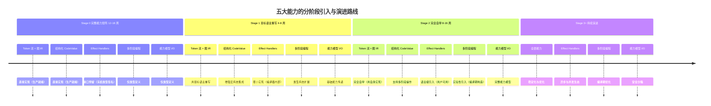

*上图：五大能力在各阶段引入动作与处理程度快照，与 §7.1 三层分类、§21.5 演进矩阵互为参照。*

### 21.2 能力选择对自举进程的三维度影响

能力模型的选择不只影响"能做什么"，更通过三条正交的路径影响自举进程本身。**语义层的选择（元循环求值器、闭包）决定自举的下限与启动速度；基础设施层的选择（类型化 Token 流、Span 系统）决定自举的质量与可维护性；接口预留层的决策（Effects、多阶段、能力模型）决定自举的上限与演进空间。** 三层之间存在明确的相互制约：任何一层的过度设计都会延迟自举达成时间，而任何一层的投入不足都会在后期引入不可逆的架构债务。

#### 21.2.1 三维度影响矩阵

下表把 §7.1 矩阵中的能力（含 2 个运行时基座）逐行映射到三个影响维度。"对自举速度的影响"以最简方案（仅元循环求值器 + 闭包 + 基础 I/O）为基线——其达成时间即 [§21.3.2](#2132-双时间口径的调和) 的最小语义内核口径（2-4 周冲刺，含完整测试收尾约 4-6 周）：

| 能力模型 | 对自举速度 | 对自举质量 | 对演进空间 | 处理程度 |
|---------|-----------|-----------|-----------|---------|
| 元循环求值器（传统） | 加速（2 周可验证 9 原语语义） | 中等（无类型保证） | 为 Effects 预留升级路径 | P0 |
| 类型化 Token 流 | 延迟（+1-2 周） | 显著提升（Span/Scope/类型信息内置） | 为 Stage 1 类型检查器与 LSP 预留数据基础 | P0 |
| 图 IR + 共享节点 | 延迟（+1-2 周） | 显著提升（CSE 预备 / 调试信息保留） | 为 Stage 2+ 优化器预留表示基础 | P0 |
| 结构化 CodeValue | 中性 | 提升（类型/位置/作用域信息随值流动） | 为多阶段编程预留组合接口 | P0 |
| 基础闭包（传统） | 加速（最简实现） | 基础 | 为 Effects 预留控制流升级路径 | P0 |
| Span 全管线传播 | 延迟（+3-5 天） | **极显著**（错误定位 / 调试 / 增量编译的前提） | 为 Stage 1 增量编译预留 | P0 |
| 结构化诊断框架 | 延迟（+1 周） | 显著（开发体验与错误恢复质量） | 为 Stage 2 IDE 集成预留 | P0 |
| 最小 I/O（传统） | 加速（1 天） | 基础 | 为能力模型 I/O 预留替换点 | P1 |
| 相位分离系统 | 延迟（+1-2 周） | **关键**（宏系统正确性的前提） | 为编译时 DSL 预留相位空间 | P0 |
| 基础宏系统 | 延迟（+2-3 周） | **核心**（可拓展性引擎） | 极高（Stage 2+ 新特性可不改编译器核心） | P1 |
| 标记-清除 GC + 字节码 VM | 加速语义验证（eval 与 VM 双执行路径互查） | 基础（运行时基座） | 为分代 GC 与本地码生成预留接口 | P0 |
| Effect Handlers（预留） | 零延迟（仅类型） | 中性 | **极高**（异步 / 并发 / 错误恢复的统一机制） | P3 |
| 多阶段编程（预留） | 零延迟（仅类型） | 中性 | 高（编译期计算与代码生成） | P3 |
| 能力模型 I/O（预留） | 零延迟（仅类型） | 中性 | 高（安全模型与最小权限） | P3 |

#### 21.2.2 净影响估算

推荐方案比最简方案多花费约 6-10 周开发时间（这正是 §21.3 完整能力矩阵口径 12-18 周与最小内核口径 4-6/2-4 周的差距来源），其回报是将后期重构成本从"不可行"（架构级返工）降低到"可控"（按冻结接口替换实现）。矩阵中值得特别注意的三行：Span 全管线传播以 3-5 天的代价换取"极显著"的质量影响，是全部能力中投资回报率最高的一项——rustc 的实践反复验证了"错误消息质量决定编译器可用性"；相位分离与宏系统合计 3-5 周的投入则是可拓展性目标的必要条件，跳过它们等于放弃 §1 确立的"强大可拓展性和可塑性"设计目标本身。

### 21.3 自举管线的阶段划分与能力引入

#### 21.3.1 四个 Phase 的定义与依赖

完整 Stage 0 能力矩阵的构建过程按能力引入的依赖关系划分为四个 Phase（注意与 §20.1 的 Week 1-4 不是同一坐标系，映射关系见 §21.3.2）：

- **Phase 1 语义验证**：Token Reader → 图 IR → 元循环求值器 → 闭包 → 最小 I/O，加上字节码 VM 与 GC 构成运行时基座。目标是用双执行路径（eval 与 VM 互查）验证 9 个核心原语的语义正确性
- **Phase 2 基础设施**：Span 全管线传播、结构化诊断框架、相位分离系统。与 Phase 1 并行贯穿——Span 与诊断从第一天起就要进入数据结构（"横切关注点必须早期内置"原则，见 §23.1 原则 6 与 §12 的展开论述），而不是事后补丁
- **Phase 3 可拓展性**：结构化 CodeValue 与基础宏系统。硬依赖相位分离（没有 Phase 0/1 隔离的宏展开无法保证正确性），软依赖 Span（展开错误的定位）
- **Phase 4 接口预留**：冻结四个预留接口的类型签名。依赖前面的类型系统定型（接口形状要引用 Value、CodeValue、Span 等已定型类型）

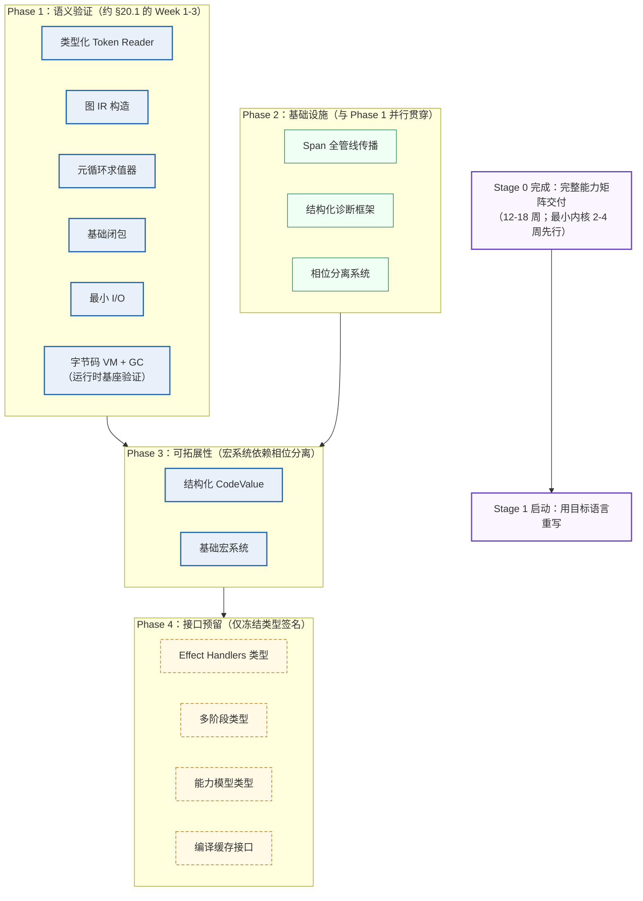

*上图：四个 Phase 的能力构成与依赖走向，配色与全文统一——蓝色为语义与编译期能力，绿色为基础设施，黄虚线为接口预留，紫色为阶段里程碑。*

#### 21.3.2 双时间口径的调和

§20.1 的"Stage 0（2-4 周，约 7000 行代码）"与本章的"完整能力矩阵 12-18 周"是同一进程的两个口径，必须显式调和以免误读：**2-4 周是最小语义内核口径**——即 Phase 1 的加速交付（对应 §20.1 周表的 Week 1-4 冲刺：Reader/Expander/Compiler/VM/GC 及其测试），其价值是尽早验证核心语义并允许 Stage 1 的准备工作提前启动；**12-18 周是完整能力矩阵口径**——在最小内核之上继续把基础设施做到全管线深度（Span 贯穿 Reader → Expander → Compiler → VM 的每一处）、把宏系统做到完整卫生保证、并完成全部四个接口预留的冻结。两个口径的映射关系如下：

| Phase（能力视角） | Week（工程视角，§20.1 周表） | 说明 |
|-----------------|---------------------------|------|
| Phase 1 语义验证 | ≈ Week 1-3 | 周表的 Week 3（Compiler + VM + GC）即 Phase 1 的运行时基座部分 |
| Phase 2 基础设施 | 并行贯穿 Week 1-4 及其后的深化期 | Span/诊断的数据结构从 Week 1 内置，全管线深度在最小内核后继续补齐 |
| Phase 3 可拓展性 | ≈ Week 2 启动（宏机制）+ 深化期完整化 | 周表 Week 2 的展开器骨架是 Phase 3 的启动点 |
| Phase 4 接口预留 | ≈ Week 4 启动 + 冻结收尾 | 周表 Week 4 的测试期同步冻结接口签名 |

需要强调的是：**Phase 视角服务架构决策（能力依赖决定顺序），Week 视图服务工程执行（人力与节奏决定排期）**。若团队规模允许，Phase 2 与 Phase 1 完全并行推进可以压缩总时长；若追求最快语义验证，也可以先完成 Phase 1 的最小版本（即 2-4 周口径），再回头补足基础设施深度。这个弹性正是 [§21.7](#217-进程风险与缓解) 风险表前两行（Token 流设计过度 / 图 IR 过于复杂）这类基础设施深化风险的缓冲空间。

### 21.4 五大能力模型的分阶段演进设计

五个核心能力各自的演进路径差异很大：两个生产就绪能力的主题是"重写与自举"，三个预留能力的主题是"逐级做实"。每张演进表之后给出引入时机的决策依据。

#### 21.4.1 Token 流 + 图 IR：重写与自举的主题

| 阶段 | 实现语言 | 功能范围 | 关键决策 |
|------|---------|---------|---------|
| Stage 0 | Rust（或 OCaml） | Token 流 + 图 IR + Span + Scope + 完整解析 | Arena 分配；节点共享（CSE 预备） |
| Stage 1 | 目标语言子集 | 用目标语言重写 Reader/Parser | 保持运行在 Stage 0 VM 上 |
| Stage 2 | 完整目标语言 | 完全自举（用自身解析自身） | 接受暂时的性能回退 |
| Stage 3+ | 完整目标语言 | 增量解析 / 并行解析 | 引入查询式缓存 |

**时机依据**：生产就绪成熟度允许 Stage 0 直接实现到 P0 深度；Stage 1 重写是自举链的强制环节而非可选优化——重写过程本身是对语言表达力的第一轮真实测试。数据结构的具体形态（Token 结构体、GraphIR 定义、Reader trait）已在 §8.1/§8.2 冻结，此处不重复。

#### 21.4.2 结构化 CodeValue：逐级增强的主题

| 阶段 | 功能范围 | 关键能力 |
|------|---------|---------|
| Stage 0 | 基础 CodeValue（类型/位置/作用域随值流动） | substitute / alpha_rename |
| Stage 1 | 与宏系统集成（宏输出 CodeValue） | 宏可以构造和变换代码值 |
| Stage 2 | 多阶段操作（quote / splice） | 编译期构造新代码 |
| Stage 3+ | 优化（缓存 / 并行构造） | 增量代码生成 |

**时机依据**：CodeValue 的接口在 Stage 0 已包含 compose_with 等多阶段预留位（§8.3），但真正的多阶段操作依赖宏系统与类型系统的成熟——在它们稳定之前实现 quote/splice 只会制造返工。

#### 21.4.3 Effect Handlers：四级做实的主题

| 阶段 | 实现范围 | 具体功能 |
|------|---------|---------|
| Stage 0 | 仅类型定义（P3） | Effect/Handler/Continuation 关联类型 |
| Stage 1 | 编译器内部最小实现 | 用效应处理编译器错误恢复与测试短路 |
| Stage 2 | 语言级引入 | 用户可定义/处理效应 |
| Stage 3+ | 异步/并发生态 | 用效应实现 async/await |

**时机依据与口径说明**：Effects 的引入是"类型定义 → 编译器内部 → 语言级 → 生态"四级递进，这与 §7.1 矩阵中"推迟到 Stage 2"的表述并不矛盾——矩阵中的 Stage 2 指**语言级引入**（用户可用）这一级；编译器内部使用（Stage 1）属于实现策略，不进入语言语义，因此不计入矩阵。之所以不跳级：OCaml 5 的效应已在工具链与基础设施项目中实践，但作为语言核心求值器仍属前沿——先用低风险的内部场景（错误恢复）积累实现经验，再决定语言级语义，是成熟度匹配原则的直接应用。

#### 21.4.4 多阶段编程：依赖链最长的主题

| 阶段 | 功能范围 | 依赖条件 |
|------|---------|---------|
| Stage 0 | 仅 Code/quote/splice 类型定义（P3） | 无 |
| Stage 1 | 编译期常量折叠 | 类型检查器稳定 |
| Stage 2 | 编译期代码构造（宏展开的一部分） | 宏系统 + CodeValue 成熟 |
| Stage 3+ | 运行时代码生成（JIT） | 本地码生成 + 安全模型 |

**时机依据**：多阶段编程是五大能力中依赖链最长的一个——每个阶段的功能都以上一阶段的其他能力为前提，跳过任何一环都会把问题转移到运行时。MetaOCaml 的经验（理论完备但实现依赖启发式方法）进一步提示：在类型系统稳定前引入，风险无法评估。

#### 21.4.5 能力模型 + 线性类型：与效应系统协调的主题

| 阶段 | 功能范围 | 依赖条件 |
|------|---------|---------|
| Stage 0 | 仅 Capability 类型定义（P3） | 无 |
| Stage 1 | 文件 I/O 基础能力（读写需授权） | 类型系统支持线性约束 |
| Stage 2 | 网络能力、进程能力（完整能力模型） | 效应系统（能力可视为不可撤销的效应） |
| Stage 3+ | 完整沙箱（最小权限） | 库生态支持能力传递 |

**时机依据与口径说明**：与 Effects 类似，能力模型存在"基础能力（Stage 1）→ 完整模型（Stage 2）"的两级做实节奏，§9.1.3 的"Stage 1+ 实现"指基础能力这一级。Rust 所有权系统已在线性类型的生产可行性上给出证明，但语言级 I/O 能力模型的生态仍在早期；更关键的是**能力模型需要与效应系统协调**（"能力可以视为不可撤销的效应"）——在效应语义定型之前实现完整能力模型，两个系统大概率要返工其一。

### 21.5 Stage 0 → Stage 3+ 完整演进矩阵

#### 21.5.1 处理程度沿阶段的展开

下表是全文档的进程总表：每个能力模型在每个阶段的处理程度状态。状态用语与 §21.1.2 的五级标度衔接：**实现中**（P0/P1）、**重写升级**（P0 状态保持，实现语言替换）、**预留定义**（P2/P3）、**做实引入**（从预留转为实现）、**移除**（退役）。注意两个特殊行：元循环求值器是唯一规划了退役路径的能力（Stage 2 起被编译器替换，Stage 3+ 移除）；Span 与诊断是唯二"实现后永续保持"的能力（它们的质量属性随阶段只增不减）：

| 能力 | Stage 0<br>（完整 12-18 周） | Stage 1<br>（4-8 周） | Stage 2<br>（8-16 周） | Stage 3+<br>（持续） |
|------|--------------------------|---------------------|---------------------|---------------------|
| Token 流 + 图 IR | 实现中（P0） | 重写升级（目标语言） | 完全自举 | 优化（增量/并行） |
| 结构化 CodeValue | 实现中（P0） | 增强（宏集成） | 升级（多阶段支持） | 优化（JIT 预备） |
| 元循环求值器 | 实现中（P0） | 重写升级 | 被编译器替换 | 移除 |
| 基础闭包 | 实现中（P0） | 保持 | 升级（Effects 引入后语义协调） | Effects 生态 |
| Effect Handlers | 预留定义（P3） | 做实引入（编译器内部） | 做实引入（语言级） | 异步生态 |
| 多阶段编程 | 预留定义（P3） | 预留保持（类型扩展） | 做实引入（实验） | 编译期优化 |
| 能力模型 I/O | 预留定义（P3） | 预留保持（基础传递） | 做实引入（完整模型） | 安全沙箱 |
| Span 系统 | 实现中（P0） | 保持 | 保持 | 保持（永续增强） |
| 诊断框架 | 实现中（P0） | 保持 | 保持 | IDE 集成 |
| 宏系统 | 实现中（P1） | 增强（调试工具） | 完整化 | DSL 生态 |
| 编译缓存 | 预留定义（P2） | 做实引入（查询式） | 深化（增量编译） | 并行查询 |
| 字节码 VM + GC | 实现中（P0） | 保持 | 升级（本地码后端并存） | 分代 GC / JIT |

**矩阵的解读要点**：处理程度沿时间轴应当单调深化（预留 → 做实 → 优化），任何"先实现再降级回预留"的倒挂都意味着引入时机判断失误，应触发 §21.7 的风险评审；而"预留长期不做实"是允许的——接口预留的成本只有类型维护，没有实现债务。

> **时机治理单源注记（v6.5——同步自 [lang-design/12-路线图 §2.10](lang-design/12-roadmap.md) v6.8）**：本矩阵回答「能力 × 阶段的处理程度」；**设计栈演进窗（批次 K/L/M/E5/T3+）的入口信号与出口条件由 [lang-design/23-演进治理 §2 触发判据表](lang-design/23-evolution-governance.md) 单源承载**（存档侧镜像 §9.8）——时间治理四红线（禁止时间驱动切换/处理程度倒挂/无信号开窗/窗口合并）对本矩阵同样生效。

#### 21.5.2 跨阶段能力依赖

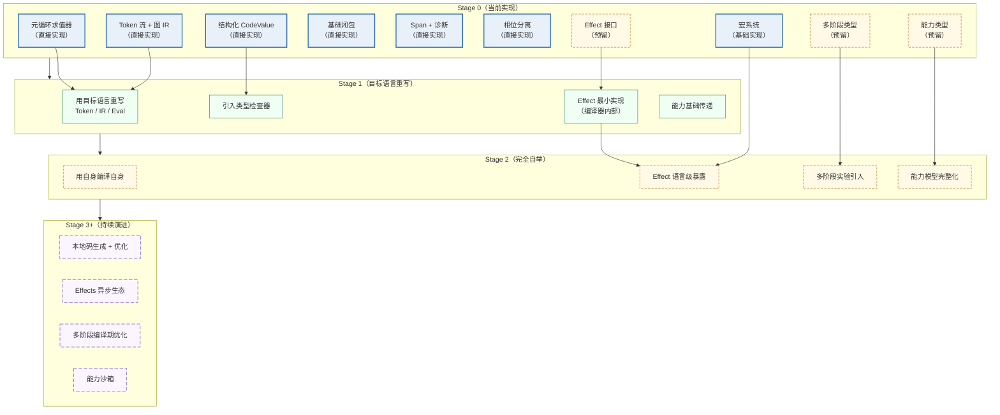

*上图：跨阶段能力依赖——节点边框样式随阶段推进逐渐虚化，隐喻确定性递减：越晚的规划越依赖届时实践数据。*

#### 21.5.3 完整自举时间线

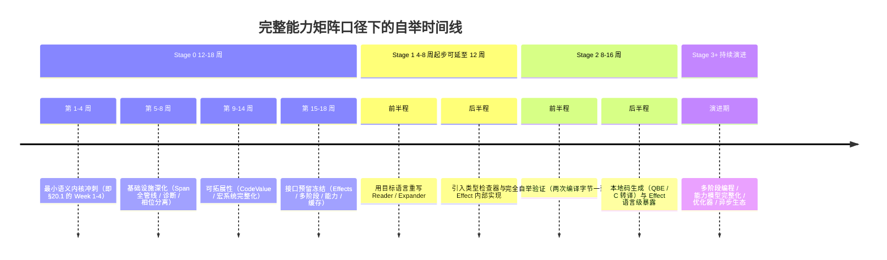

*上图：完整能力矩阵口径下的阶段内节奏——Stage 0 的第 1-4 周即 §20.1 周表的最小内核冲刺，两个口径的关系见 §21.3.2。*

### 21.6 三个关键决策点

本节的三个决策点与 §15 的三个待定决策是不同层面的问题：§15 处理**运行时语义的未决项**（并发内存模型 / 错误语义 / FFI 所有权——它们有明确的前置架构约束与解决时机）；本节处理**能力模型选型的权衡**（在传统方案与 2026 前沿方案之间选择——它们已被 §6 的推荐与 §7.1 的矩阵裁定，此处保留对比分析作为决策依据的完整记录）。每个决策点都以"先快速验证语义，再引入高级机制"收敛，共同理由是：语义正确性错误在传统方案中 2 周内即可暴露，而在引入前沿方案的复杂度之后再修正，成本会乘上效应系统/多阶段系统本身的实现规模。

| 维度 | 决策点 1：元循环求值器 vs 多阶段编程 | 决策点 2：传统闭包 vs Effect Handlers | 决策点 3：传统 I/O vs 能力模型 I/O |
|------|----------------------------------|--------------------------------------|-----------------------------------|
| 选择传统方案 | 自举快 3-4 周；Stage 1 重写简单；无类型保证；风险低 | 自举快 1-2 周；异步/并发需额外机制；生态成熟 | 自举快 0.5-1 周；无权限控制；生态成熟 |
| 选择前沿方案 | 自举慢 3-4 周；重写复杂（需实现多阶段原语）；有类型保证；风险高（实现依赖启发式） | 自举慢 1-2 周；原生支持异步/并发；生态新兴 | 自举慢 1-2 周（线性类型实现）；编译期权限验证；生态新兴 |
| **Stage 0 裁定** | 元循环求值器（多阶段 Stage 2+ 替换） | 传统闭包（Effects Stage 2 语言级引入） | 传统 I/O（能力模型 Stage 1 基础 / Stage 2 完整） |
| 与既有章节的追溯 | §6.1 推荐依据；§8.4 实现；§21.4.4 替换时机 | §6.4 推荐依据；§8.5 实现；§21.4.3 四级做实 | §6.5 推荐依据；§8.8 实现；§21.4.5 两级做实 |

### 21.7 进程风险与缓解

规划的价值不在于预测准确，而在于**预先约定偏差的应对方式**。下表覆盖六类进程风险，每项附触发信号——当信号出现时按既定缓解策略行动，而不是重新展开决策：

| 风险 | 概率 | 影响 | 触发信号 | 缓解策略 |
|------|------|------|---------|---------|
| 类型化 Token 流设计过度 | 中 | 延迟 2-3 周 | Token 结构字段超出 §8.1 契约仍在增加 | 回退最简 Token，增强项推迟 Stage 1 |
| 图 IR 实现过于复杂 | 中 | 延迟 2-3 周 | 共享查找/哈希逻辑侵入正常构造路径 | 先用树 AST 承载，图结构 Stage 2 迁移 |
| 宏系统开发延期 | 高 | 延迟 3-4 周 | Week 2 结束时展开器骨架未通过核心形式测试 | 先落非卫生宏撑起管线，卫生保证 Stage 1 补齐 |
| 相位分离设计错误 | 中 | **不可逆**（核心重构） | 宏代码与运行时代码出现隐式值传递 | 严格执行 §8.9 边界；参考 Racket 相位语义 |
| 接口预留过多 | 低 | 维护负担 | 预留 trait 数量超出 §9.1 的四项清单 | 裁剪回四项核心预留 |
| 接口预留不足 | 中 | Stage 2 重构困难 | Stage 1 期间出现绕过接口直改内部类型的冲动 | 至少保持 Effects / 多阶段 / 能力模型三项预留不动摇 |

风险表的阅读方式与 §18.3 的切换信号一致：左列是规划假设失效的形态，右列是失效后的降级路径。其中"相位分离设计错误"是唯一标为不可逆的风险——这正是 §12.3 把相位分离列为"必须早期内置"的横切关注点的原因。

### 21.8 净影响评估与最终判断

#### 21.8.1 短中长期净影响

| 时间维度 | 影响描述 | 量化估算 |
|---------|---------|---------|
| 短期（Stage 0 完整口径，12-18 周） | 比最简方案多花 6-10 周 | +50-80% 开发时间 |
| 中期（Stage 1-2，12-24 周） | Span / 诊断 / 相位分离节省大量调试与重写时间 | -30-50% 重写时间 |
| 长期（Stage 3+，持续） | 接口预留使前沿技术可平滑引入 | 避免"重写编译器"级返工 |

#### 21.8.2 最终判断

两条路径的分叉点在项目启动前就必须明确：如果目标是**快速验证一个想法**，最简方案（元循环 + 闭包 + 基础 I/O，4-6 周）是正确选择，它不欠任何架构债——因为它从未承诺长期演化；如果目标是**构建一门可持续演化的系统级语言**（本文档 §1 确立的目标），则推荐方案的前期投资是必要的且回报率极高的——它把"Stage 3+ 每次引入新特性可能需要重构整个编译器"的风险，降低为"仅需要实现已冻结接口"。

本章至此完成从 §7（是什么）经 §20（何时做）到"引入到什么程度、为什么"的闭环：§21.1 的成熟度分级与处理程度标度提供裁决框架，§21.5 的演进矩阵是框架的展开结果，§21.6-§21.7 保留决策依据与偏差应对。三条新增设计原则（§23.1 原则 26-28）将本章的裁决规则提炼为与既有原则并列的编号条目。

### 21.9 接口预留成本核算（v6.1 新增）

[§9.5](#95-优先级策略与预留原则) 的完整性审查在 §21.8 净影响评估之上追加**接口预留专项**成本维度：

#### 21.9.1 预留成本与净影响的关系

| 口径 | 数值 | 与 §21.8.1 的关系 |
|------|------|-----------------|
| 10 项新接口预留总成本 | ~3 周 | 包含于短期净影响「+6-10 周」内（占比 17-25%），是其中**回报率最高**的子项 |
| P0 三项（LSP 2 天 + 调试 3 天 + 增量 1 周） | ~2 周 | 不可妥协项——不预留 = 数月级破坏性重构 |
| 不预留的代价 | 数月级破坏性重构 ×3 项 | 对应长期「避免重写编译器级返工」的量化 |
| 预留的本质 | 数据结构/类型定义兼容性 | 非功能实现——处理程度为 P3（仅形状）/P2（形状+规格） |

#### 21.9.2 处理程度标度的接口维度应用

§21.1 的五级标度（P0-P4）原本度量**能力**的处理程度；v6.1 将其延伸到**接口**维度：接口预留 = 在 P3「仅类型形状」或 P2「类型 + 行为规格」级别冻结签名，实现推迟到对应 Stage（§9.4 矩阵）。二者的叠加规则：**能力引入时机（§21.5 演进矩阵）决定接口何时被实现；接口预留时机（§9.5.1）决定数据结构位置何时被冻结**——前者可以推迟，后者必须在 Stage 0（P0 项）或 Stage 1（P2 项）完成，否则破坏渐进替换原则（第 28 条）。

---

---

## 22. 实现启动指南

### 22.1 环境准备

```bash
# OCaml 方案
opam init && opam install dune ocaml-lsp-server
# Rust 方案
curl --proto '=https' --tlsv1.2 -sSf https://sh.rustup.rs | sh
```

### 22.2 项目目录结构

目录结构与 §10.5 的七层依赖规则（Layer 0-6）一一对应，依赖方向自上而下单向：

```
my-language/
├── src/
│   ├── layer0/               # 最小 I/O Runtime（无依赖）
│   │   └── io.rs
│   ├── layer1/               # Span 系统 + 诊断框架（依赖 L0 输出）
│   │   ├── span.rs           # 见 §8.6
│   │   └── diagnostic.rs     # 见 §8.7 / §12.2
│   ├── layer2/               # Token / Reader（依赖 L1 的 Span）
│   │   ├── token.rs          # 见 §8.1
│   │   ├── lexer.rs          # 见 §19.1
│   │   └── parser.rs         # 见 §19.1
│   ├── layer3/               # Graph IR（依赖 L2 构造）
│   │   └── ir.rs             # 见 §8.2
│   ├── layer4/               # CodeValue + 宏系统（依赖 L3）
│   │   ├── codevalue.rs      # 见 §8.3
│   │   └── expander.rs       # 见 §8.10 / §19.2
│   ├── layer5/               # 元循环求值器 + Compiler（依赖 L4）
│   │   ├── eval.rs           # 见 §8.4
│   │   └── compiler.rs       # 见 §19.3
│   ├── layer6/               # 相位分离协调（依赖 L4-L5）
│   │   └── phase.rs          # 见 §8.9 / §12.3
│   └── reserved/             # 接口预留层（仅类型签名，见 §9.1）
│       ├── effects.rs        # Effect Handlers（Stage 2 实现）
│       ├── multistage.rs     # 多阶段编程（Stage 2 实现）
│       ├── capability_io.rs  # 能力模型 I/O（Stage 1 实现）
│       └── cache.rs          # 编译缓存（Stage 1 实现）
├── vm/                       # 运行时基座（C 实现，对应 §8.11/§8.12）
│   ├── vm.c                  # 执行循环，见 §19.5
│   ├── gc.c                  # 标记-清除，见 §19.4
│   └── debug_info.c          # pc → Span 反查表
├── tests/                    # 快照 / 黄金文件 / 自举同结果测试（§13.2）
├── benchmarks/               # 性能基准（§14.8）
└── docs/                     # Scribble 风格语言规范（§14.5）
```

**规则**：`layerN/` 内的模块禁止 import 同层或更高层的模块；`reserved/` 是唯一允许"只有类型没有实现"的目录；`vm/` 与 `src/` 的边界即宿主语言（OCaml/Rust）与 C 的边界。

### 22.3 第一个里程碑验证清单

- [ ] Reader 能正确解析所有 9 个核心原语的语法
- [ ] Expander 能正确展开所有核心形式
- [ ] Compiler 能正确生成字节码（含 debug_info）
- [ ] VM 能正确执行所有操作码
- [ ] GC 能正确回收未引用对象
- [ ] 至少 50 个快照测试通过
- [ ] Span 在所有阶段正确传播
- [ ] 性能基准已建立基线数据
- [ ] Effect Handlers 接口已定义（实现可为空，v3.0 起要求）
- [ ] 多阶段编程接口已定义（实现可为空，v3.0 起要求）
- [ ] 能力模型 I/O 类型已定义（实现可为空，v3.0 起要求）
- [ ] 编译缓存接口已定义（实现可为空，v3.0 起要求）

---

## 23. 设计原则总结

### 23.1 核心三十五条原则

v3.0 分两批列出（二十条 + 五条新增）；v4.0 合并为单一编号序列，其中第 21-25 条为 v3.0 引入的"2026 现代方案"原则；v5.0 从 §21 的进程裁决规则中增补第 26-28 条：

（v6.0 从核心原语批判性演进与表面/内部语法决策中增补第 29-31 条；v6.1 从接口预留完整性审查中增补第 32 条；v6.2-v6.4 从 r32-r34 设计栈三轮[20/21/22/23 四件]中增补第 33-35 条——存档侧镜像 §9.6/§9.7/§9.8）

1. 极小化原则：核心形式集合压缩到信息论下限
2. 正交性原则：原语之间不可互相推导
3. 元层分离：编译时与运行时严格分离
4. 可替换性：每个模块可独立替换
5. 相位分离：Phase 0/1 物理隔离
6. 横切关注点必须早期内置：Span、诊断、相位分离
7. 查询式架构：编译过程建模为纯函数查询图
8. 语义形式化：操作语义是正确性的可验证规范
9. 核心冻结：核心原语语义在整个生命周期内不变
10. 编译即 API：所有阶段可独立调用
11. 信任显式化：所有信任假设显式声明
12. 接口预留优先于实现：Stage 0 预留 API 而非实现
13. 目标中立性：前端与目标无关
14. 工具即编译器：LSP 消费与编译器相同的语法树
15. 文档即代码：规范与实现使用相同语言编写
16. 人类可感知输出是一等公民
17. 编译时生成，运行时查询
18. 零生产开销：调试/基准功能通过编译期开关控制
19. 语义完备性优先于性能完备性
20. 数据结构的"留白"是廉价的
21. **类型安全优先原则**：所有操作在编译期被类型系统验证（vs 传统方案的运行时验证）
22. **显式优于隐式原则**：效应、能力、阶段都显式声明（vs 闭包的隐式环境捕获）
23. **不可变性原则**：代码值、能力对象都是不可变的（变换产生新值）
24. **编译期计算原则**：尽可能将计算从运行时推到编译期（多阶段编程）
25. **组合性原则**：所有组件都设计为可组合的（handler 组合、capability 传递）
26. **三级成熟度匹配原则**（v5.0）：能力的处理程度必须匹配其生态成熟度——生产就绪直接实现，早期实践接口预留，研究前沿仅类型定义（[§21.1](#211-2026-年能力成熟度分级与处理程度标度)）
27. **接口稳定性原则**（v5.0）：Stage 0 冻结的接口签名在整个生命周期内保持向后兼容——演进只替换实现，不破坏契约（P2/P3 处理程度分级即为此原则的落地，[§21.1.2](#2112-处理程度的五级标度)）
28. **渐进替换原则**（v5.0）：每个能力可从简单实现演进到复杂实现而接口不变——元循环求值器 → 编译器、全局 I/O → 能力模型、传统闭包 → Effect Handlers（[§21.4](#214-五大能力模型的分阶段演进设计)）
29. **命名行为导向原则**（v6.0）：原语与 AST 节点的命名精确描述行为而非语法历史——`Branch` 而非 `if`、`Apply` 而非 `App`/`#%app`；拒绝 `#%` 前缀式命名约定与多层转义（`quote`+`#%datum` 两层 → `Const` 一层）（[§6.9.3](#693-命名精确性审查)/[§7.4.2](#742-三个设计原则)）
30. **类型安全优于命名安全原则**（v6.0）：内部 AST 节点是编译器私有数据结构，安全性由类型系统（ADT 私有构造子）保证而非命名约定（Racket `#%` 前缀的逃生舱机制仅在语法与 AST 同构时必要）；用户代码不可能直接构造核心节点（[§7.4.2](#742-三个设计原则)）
31. **表面-内部语法严格分离原则**（v6.0）：表面语法是可替换的用户接口（皮肤——S 表达式/中缀/DSL 均可，经 Reader 桥接），内部语法是编译器私有不变量（骨架——核心原语不变）；任何表面语法的编译产物为相同核心形式，语义验证与语法选择正交（[§7.3](#73-stage-0-表面语法决策-s-表达式的战略分析)/[§7.4](#74-stage-0-内部语法设计类型安全-adt-与语义化命名)）
32. **预留留白原则**（v6.1）：接口预留的本质是「为未来留出空间」而非「提前实现」——预留要求数据结构与类型定义的兼容性，而非功能的完整性；P0 级接口（LSP 查询/调试信息/增量查询）的数据结构位置必须在 Stage 0 冻结，否则后期引入需破坏性重构（[§9.5.2](#952-预留总成本核算)/[§9.3](#93-2026-接口预留完整性审查v61-新增)）
33. **表面现代化动态演进原则**（v6.2，r32）：用户可见表面（库命名/行为契约/组织结构）必须在每个引入新表面的设计时点对照当期前沿约定审视，而非默认继承历史语言家族形态——标点后缀命名约定（`?`/`!`/`->`）是前类型系统时代的补偿机制，现代机制（HM 推断/效应处理器/能力门控）就位后表面应同步迁移（别名层→命名空间层→一次性移除，零破坏分段）；不审视的代价 = 表面债随库生长线性累积（首个落地规范 = [lang-design/20-表面规范](lang-design/20-surface-conventions.md) R1-R6 + 57 项映射表；详见 [§9.6](#96-表面命名现代化v62-新增r32-审查轮存档侧镜像)）
34. **能力正交与授权分层原则**（v6.3，r33）：语言能力按四层正交分解（L0 值域/L1 控制/L2 效应/L3 授权——每层持定位/边界/职责/正交四要素），层间正交以可审计判据承载（J1 值-控交换律/J2 效应-语义独立/J3 许可-语义独立/J4 效应-授权对偶）；授权按粒度三态递进（纯度态/声明态/令牌态）且 fail-closed（缺省拒绝/授权零语义载荷/import 不传播授权）；任何原语级变更先过正交判据且新原语准入持不可归约性与单层归属两判据——「原语级迁移 ≠ 重命名」（六类迁移性质：重命名/脱糖/索引化/层级迁移/效应化/新增）（首个落地规范 = [lang-design/21-能力架构](lang-design/21-capability-architecture.md) + [lang-design/22-命名空间设计](lang-design/22-namespace-design.md)；详见 [§9.7](#97-能力架构与命名空间深度设计v63-新增r33-审查轮存档侧镜像)）
35. **判据先于先例原则**（v6.4，r34）：每个设计决策先过判据集（行为语义/认知负荷/正交性/安全粒度/实现成本/成熟度匹配）再引先例——先例是佐证不是权威；锚定有两种等价失败形态：向后锚定（停在 Lisp 家族 1970 表达）与向前锚定（抄 Rust/Swift 把家族方案当权威）；引证纪律 = 依据列先判据后先例 + 跨家族取样（对照表 ≥3 范式家族）+ 否决记录保留 + 判据冲突先修判据不迁就先例（首个落地规范 = [lang-design/23-演进治理](lang-design/23-evolution-governance.md) §4；详见 [§9.8](#98-演进治理与判据先于先例v64-新增r34-审查轮存档侧镜像)；驱动源 = 用户两轮声明「kerf 不是 lisp 系列也不是 c/rust 系列——限制设计的是差的设计、规划、理念」）

### 23.2 最终公式

```
最小自举单元 = 
    外部种子（OCaml/Rust 编译器）
  + 元循环核心（9 个正交原语）
  + 卫生宏引擎（语法对象 + 作用域集 + 变换器）
  + 字节码虚拟机（约 1500 行 C）
  + 最小运行时
  + 基础设施层 + 工程支撑层 + 理论边界层
  + 外围能力层 + 操作基础层
  + 三个待定决策的前置约束
  + 接口预留层（v3.0 引入：Effect Handlers / 多阶段编程 / 能力模型 I/O / 编译缓存）
```

---

## 24. 设计收敛的元分析与开放问题

### 24.1 设计收敛的元分析

设计覆盖度的演化（从 5 个核心模型到 20 个维度的完整图景）。**真正的"设计完备"不在于覆盖所有可能维度，而在于**：
1. 所有"不可补救"的设计决策已被识别并完成
2. 所有"可推迟"的决策都有明确的接口契约
3. 所有"本质上开放"的问题已被标记为"需要实践数据"
4. 后续添加新维度的成本已被降低到"实现成本"而非"架构成本"

**v3.0 的元分析收敛点**：通过引入"接口预留层"，将"可推迟"的决策从"架构成本"降低到"实现成本"——Stage 1+ 可以替换 Stage 0 的实现，但接口契约不变。这意味着即使 2026 年的前沿技术（Effect Handlers、多阶段编程、能力模型 I/O）在 Stage 2+ 才被采用，Stage 0 的设计也已经为它们"留好位置"。

### 24.2 开放问题与未来约束

| 问题 | 说明 | 需要什么才能回答 |
|------|------|----------------|
| **具体语法形态** | S 表达式还是中缀语法？还是混合？ | 设计品味 + 用户反馈 |
| **性能目标与权衡** | "多快算够快？" | 实际基准数据 |
| **生态治理策略** | 包注册、版本策略 | 真实用户和社区 |
| **最终形式** | 内核语言？应用语言？DSL 平台？ | 最初验证结果 |
| **2026 前沿方案的采用时机** | Effect Handlers / 多阶段编程 / 能力模型 I/O 何时从"接口预留"转为"必须实现"？ | Stage 2+ 的实践数据 + 社区生态成熟度 |
| **同像性的最终形态** | 保持 S 表达式，还是迁移到 Token 流 + 图 IR？ | 用户对元编程的反馈 + 工具链成熟度 |

---

## 附录 A：关键术语表

| 术语 | 定义 |
|------|------|
| 自举（Bootstrap） | 从外部种子到自描述核心的渐进过程 |
| 自托管（Self-hosting） | 编译器能编译自身源代码的状态 |
| 元循环求值器（Metacircular Evaluator） | 用被解释语言本身编写的解释器 |
| 语法对象（Syntax Object） | 携带源位置、作用域集的不可变数据结构 |
| 核心形式（Core Forms） | 语言语义的最小正交集（9 个原语） |
| 相位分离（Phase Separation） | 编译时和运行时代码的物理隔离 |
| 卫生宏（Hygienic Macro） | 保证宏展开不引入意外绑定的宏系统 |
| 同结果测试（Rounds-testing） | 两次编译的输出必须字节一致的验证 |
| DDC（Diverse Double Compilation） | 多样化双重编译，对抗 Trusting Trust 攻击 |
| Span | 源码位置的不可变表示 |
| 查询系统（Query System） | 将编译建模为纯函数查询图的架构 |
| 信任信任攻击（Trusting Trust Attack） | Ken Thompson 揭示的编译器后门注入 |
| hex0 | Guix 全源自举的 357 字节种子 |
| 操作语义（Operational Semantics） | 用归约规则形式化定义程序行为 |
| 标记-清除（Mark-Sweep） | 最简单的垃圾回收算法 |
| bump-pointer | 线性分配器，指针只增不减 |
| 同像性（Homoiconicity） | 程序的 AST 可用语言本身的数据结构表示 |
| 引号（Quote） | 阻止求值、将代码作为数据引用的机制 |
| 闭包（Closure） | 函数与其捕获环境的组合 |
| Effect Handlers | OCaml 5 引入的代数效应处理机制 |
| 多阶段编程（Multi-stage Programming） | MetaOCaml 风格的编译期代码生成 |
| 能力模型（Capability Model） | 通过不可复制的 token 控制权限的模型 |
| 线性类型（Linear Type） | 每个值只能被使用一次的类型 |
| 结构化代码值（Structured Code Value） | 携带类型/Span/Scope 的代码值 |
| 接口预留（Interface Reserved） | 仅定义类型签名不实现，为未来留位 |
| Token 流（Token Stream） | 类型化、携带 Span/Scope 的词法单元序列（§8.1） |
| 图 IR（Graph IR） | 以节点与边表示程序的结构化中间表示，支持公共子表达式共享（§8.2） |
| Arena 分配 | 预分配大块内存、以索引引用对象的分配方式（§8.2） |
| 跳转回填（Backpatching） | 先生成占位跳转、确定目标地址后再修补的编译技术（§19.3） |
| 操作码（Opcode） | VM 指令的操作编码，Stage 0 约 35 个（§8.12） |
| 递归下降（Recursive Descent） | 自顶向下、每个非终结符对应一个函数的解析技术（§19.1） |
| 自举链（Bootstrap Chain） | 从种子到完整工具链的逐级构建序列（§2.2.2） |
| 同结果性（Reproducibility） | 相同输入必然产出字节一致输出的构建属性（§2.1） |
| 元追踪 JIT（Meta-tracing JIT） | 通过追踪解释器热路径生成机器码的 JIT 技术（§11.3） |
| 保守 GC（Conservative GC） | 不精确识别指针、宁泄漏不误回收的 GC 策略（§14.2） |
| 安全点（Safepoint） | VM 指令边界上允许触发 GC 的位置（§19.4） |
| 诊断（Diagnostic） | 结构化错误数据：严重性/码/消息/Span/建议（§8.7） |
| 处理程度（Processing Depth） | P0 完整实现 → P4 完全推迟的五级标度，度量能力在给定阶段的实现深度 |
| 成熟度分级（Maturity Tier） | 生产就绪 / 早期实践 / 研究前沿三档生态评估，引入时机的第一判据 |
| 演进矩阵（Evolution Matrix） | 能力 × 阶段的处理程度总表，回答"何时引入、引入到什么程度" |
| 三级成熟度匹配原则 | 处理程度必须匹配生态成熟度的引入决策规则（§23.1 原则 26） |
| 渐进替换原则（Progressive Replacement） | 实现可从简单演进到复杂而接口契约保持不变的演进规则（§23.1 原则 28） |
| de Bruijn 索引 | 用层级位置（从内到外计数）替代变量名的绑定表示，消除 α-变换与变量名查找（§6.9.4） |
| ANF（A-范式） | 所有中间计算显式命名的 IR 形式，`Let` 绑定链天然表达顺序求值（§6.11） |
| CPS（延续传递风格） | 将 continuation 显式传递的变换；理论上可消去 If 的五原语方案因闭包开销被否决（§6.9.4） |
| 效应行（Effect Row） | 追踪函数可能执行效应的类型结构：已知效应集合 + 行变量（可扩展）（§6.10.3） |
| 行多态（Row Polymorphism） | 结构化（非名义）泛化的多态性，效应追踪与可扩展记录的类型基础（§6.10.1） |
| continuation（延续） | 被挂起计算的恢复点（环境 + 栈 + 恢复类型），线性类型保证只能恢复一次（§6.12.1） |
| 派生关键词（Derived Keyword） | Racket `#%` 前缀式编译器内部形式（用户不可 shadow 的逃生舱）——本设计否决的旧方案（§7.4.1） |
| 表面语法（Surface Syntax） | 用户可见、可替换的语法层（皮肤）：S 表达式/中缀/DSL 经 Reader 桥接（§7.3） |
| 内部语法（Internal Syntax） | 编译器私有、不变的 AST 表示（骨架）：类型安全 ADT，用户不可构造（§7.4） |
| 代数效应（Algebraic Effects） | Perform/Handle 对表达的计算中断与处理机制，高级控制抽象的可编程基础（§6.11.2） |
| 效应消除（Effect Elimination） | Koka 式四阶段优化：纯函数检测/效应重排/处理器内联/已知效应消除（§6.12.1） |
| 闭包表示（Closure Representation） | MLton 风格三策略：flat（少变量内联）/ linked（共享环境）/ toplevel（无捕获）（§6.12.1） |
| 全程序优化（Whole-Program Optimization） | MLton 式跨模块整体优化，实证可达接近 C 的效率（§6.12.4） |
| comptime | Zig 式编译期求值：用语言本身编写元编程逻辑（§6.10.1） |
| 命名行为导向原则 | 命名精确描述行为而非语法历史（§23.1 原则 29） |
| 类型安全优于命名安全原则 | AST 安全性由类型系统保证而非命名约定（§23.1 原则 30） |
| 表面-内部语法严格分离原则 | 皮肤可替换、骨架不变，语义验证与语法选择正交（§23.1 原则 31） |

**r32-r34 设计栈增补术语（v6.5 镜像——权威源 = [lang-design/18-术语](lang-design/18-terminology.md) §5a/§5b/§5c；载体 = [20-表面规范](lang-design/20-surface-conventions.md) / [21-能力架构](lang-design/21-capability-architecture.md) / [22-命名空间设计](lang-design/22-namespace-design.md) / [23-演进治理](lang-design/23-evolution-governance.md)）**：

| 术语 | 定义 |
|------|------|
| is- 前缀谓词 | 状态/类型谓词的现代命名形（`is-nil`/`is-pair`——2026 跨范式共识：Swift `is`/Kotlin `isX`/Rust `is_`）；取代 Lisp 家族 `?` 后缀（R2） |
| 方向词转换 | 转换函数的 `to`/`from` 命名（`string/to-symbol` + `symbol/from-string` 双向双家——Rust `to_`/`from_` 方向语义学）；取代 `->` 中缀（R4） |
| 命名空间限定名 | `模块/本地名` 形态的引用（`string/append`——`/` 为标识符内部分隔符，独立 `/` 维持除法；Clojure 同型词法裁定）；取代扁平前缀补丁（`str-`） |
| 别名层 | 零破坏迁移第一段：现代名与旧名双注册（行为 parity 逐字节锚定——别名层零语义变更不变量）；v0.5 批次 L |
| 能力-命名空间对齐 | 命名空间族边界与授权族边界重合（不变量 A）+ 机制分工两门（可见性门 import / 许可门 require——import 不传播授权） |
| 表面债 | 用户可见表面（命名/行为契约/组织）沿用历史家族形态累积的迁移成本——随库生长线性累积（原则 33 的量化对象） |
| 表面现代化动态演进原则 | 原则 33：每个引入新表面的设计时点对照当期前沿审视而非默认继承历史家族形态；标点后缀约定 = 前类型系统时代的补偿机制（§9.6） |
| 工程能力 / 语言能力 / 授权（三义） | 「能力」三义定锚：工程能力 = 编译器构建技术（三层分类矩阵 owner）；语言能力 = 运行时能力域（L0-L3 owner）；授权 = 安全学术语 ocap（require 门控/FFI 令牌）——禁互换 |
| 能力四要素 | 定位（解决什么问题）/边界（不解决什么——负空间）/职责（拥有的决策与不变量）/正交（与邻层的接口契约）——每层一张卡；库能力域同构 |
| 语言能力四层（L0-L3） | L0 值域（数据是什么）/L1 控制（计算怎么组合）/L2 效应（与外界怎么交互）/L3 授权（交互被谁允许）；判层规则两问（唯一归属禁止跨层登记） |
| 正交判据（J1-J4） | J1 值-控交换律 / J2 效应-语义独立 / J3 许可-语义独立 / J4 效应-授权对偶——正交的操作化定义：任一层语义变更不引发另一层语义变更；各配既有实测锚 |
| 授权三态 | 纯度态（函数级——静态纪律）/声明态（程序级——require 门控）/令牌态（值级——FFI External 线性持有）——粒度递进收紧 |
| 六类迁移性质（M-R/D/I/L/E/A） | 原语级结构重构分类学：重命名/脱糖/索引化/层级迁移/效应化/新增——「原语级迁移 ≠ 重命名」（原则 34） |
| 不可归约性 / 单层归属（新原语准入两判据） | 提案必须附四要素卡 + ①不能由既有原语组合等价表达 ②J 判据过（跨层按受控债务登记——set! 先例） |
| 五层命名层级（N0-N4） | N0 符号宇宙（存在性）/N1 全局注册层（默认可见面）/N2 模块层（组织与授予）/N3 局部绑定层（作用域）/N4 保留字层（语法标记） |
| 解析优先序（R-N1） | 非限定名：N3 内向外 → N2 import 注入面 → N1 全局 → 未绑定错误；限定名：仅查该模块 export 面，不回落（R-N3） |
| 遮蔽许可表（R-N2） | N3 遮蔽 N1 合法；N3 遮蔽 N2 合法 + W 警告；同层 define 重复 = 错误；N4 不可遮蔽 |
| import 不传播授权（红线 1） | import 授予名字可见性，require 授予操作许可——双门分立；import kerf-io 后未 require 调 print 仍 E0006 |
| kerf/ 保留域 | `kerf/` 前缀 = 标准库专属（用户模块不得使用——最小保留原则，Clojure `clojure.*` 同型） |
| 能力正交与授权分层原则 | 原则 34：L0-L3 四层正交 + J1-J4 可审计判据 + 授权三态 fail-closed + 原语准入两判据（§9.7） |
| 三轴坐标系（L×N×P） | 语义轴 L0-L3 × 命名轴 N0-N4 × 相位轴 P0/P1（+ 实现轴 crate——工程轴非语义轴）；「L3′」记号已退役（命名机制升格独立轴非 L3 旁支）；判层三问 + L×N 交互矩阵 |
| 双轴归属 | 同一单元在两个轴上的独立登记（`=`：语义属关系域[链式值相等]，名形属运算符族[R6 符号冻结]——主从声明，非跨层违规） |
| 授权组合闭包（传递闭包显式化） | 程序头 require = 导入链全部模块授权需求的传递闭包显式声明；模块 require 声明 = 需求元数据非授权获得（编译期核对授权面 ⊇ 并集——WASI 无环境权威同构） |
| 编译期权威三判据 | 确定性（可复现构建）/零外部 I/O 或编译期令牌/展开可终止（预算制）——Phase 1 零授权面裁定的提案门 |
| 诊断终止域 | `error`/`assert-eq?` 的域归属：终止性诊断发起（Err 吸收态）——**终止 ≠ 可拦截**（与 Perform 可拦截通道分立是设计裁定：终止不是副作用，不入门控表） |
| 横切泛函域 | prelude 自有五件（map/filter/foldl/foldr/for-each）的域归属：任意可迭代域的高阶变换服务层——不持数据结构职责 |
| 演进六窗（K/L/M/E5/T3+） | 演进总时间线的窗口划分：批次 K 终批 → v0.5 批次 L 别名层 → v0.6 批次 M 命名空间层 → Stage 3 E5 一次性窗 → Stage 3+ 触发式族；每窗入口信号全满足才开窗（时间治理四红线） |
| 时间治理四红线 | 禁止时间驱动切换/禁止处理程度倒挂/禁止无信号开窗/禁止窗口合并（改名与改行为永不混步） |
| 变更通道矩阵 | 每类变更对象的唯一通道与前置判据对账表（语义原语→E5 窗/关键字→N4 唯一通道/库表面名→L 别名渐进/效应族→J2 增族窗/授权族→J3J4/值类型→J1/码位→先占位后落位/模块→四表联动） |
| 受控债务通道（四步） | 跨层冲突的唯一合法处置：①登记②语义等价证明义务③清偿窗口声明④每轮深审复核——D5 set! 先例的流程化 |
| 生命周期四阶段 | 引入（双注册/接口预留）→ 默认（新语料新规范）→ 弃用（W 警告）→ 移除（E 错误 + 负例组）——引入与移除永不同窗同面 |
| 十二审计轴（A1-A12） | 设计缺陷审计的轴系：用户六轴（定位/权限/能力边界/职责边界/层级管理模型/演进时机）+ 发散六轴（组合语义/覆盖完备性/一致性/诊断对账/判据先于先例/元编程工具链交互）——轴系开放 |
| 判据先于先例 | 原则 35：先例是佐证不是权威；向后锚定（停 1970）与向前锚定（抄某家族）等价失败；引证纪律 = 先判据后先例 + 跨家族取样 + 否决记录保留（§9.8） |

---

## 附录 B：参考案例与关键数据

| 项目 | 启示 | 关键数据 |
|------|------|---------|
| Racket | 极小核心+卫生宏的完整实践 | 9 个形式；BC→CS 证明核心不变可换后端 |
| Chez Scheme | 从极小核心生长出高性能编译器 | flonum unboxing 显著提升性能 |
| Guix | 357 字节种子构建完整系统 | hex0 → 22,000+ 包 |
| Rust 编译器 | 三阶段自举流水线 | `cfg(bootstrap)` 条件编译 |
| PyPy | 元追踪 JIT 性能数据 | 追踪阶段约 900 倍减速（仅预热期） |
| Julia | femtolisp 到 LLVM JIT | femtolisp 仅用于编译期 |
| C 语言 | 高度自举但有汇编漏洞 | 预处理器非图灵完备 |
| Cone 编译器 | LLVM 后端性能开销 | 前端 800μSec vs 后端 115,500μSec |
| Zig | 自建后端替换 LLVM | 构建时间几乎减半 |
| QBE | 极简编译后端 | 10% 代码提供 70% 性能 |
| Cranelift | 快速代码生成后端 | 比 LLVM 快约 40% |
| Salsa | 查询式增量计算框架 | 从 rustc 提取 |
| APL/J/K | 数组同像性范式 | 数组作为代码表示 |
| Prolog | 一阶项同像性 | assert/retract 元编程 |
| Forth | 栈与字典范式 | 4 个核心原语（NEXT/DOCOL/EXIT/LIT） |
| MetaOCaml | 多阶段编程类型化 | 良构、良类型、良作用域保证 |
| OCaml 5 | Effect Handlers | 模块化效应处理 |
| Mojo（2026） | Python 语法 + 编译期元编程 | 内存安全模型仍在完善 |
| Gleam | 类型安全 + 可扩展编译器 | 现代 BEAM 语言设计 |
| Esterel | 同步语言信号流图 | 程序编译为有限状态机 |

---

## 附录 C：代码量估算

```
Stage 0（约 6500 行）：
  OCaml/Rust 前端（约 5000 行）
  C VM + Runtime + GC（约 1500 行）

Stage 1（约 8000 行，目标语言子集）
Stage 2（约 20000-50000 行，完整目标语言）

[v3.0] Stage 0 接口预留层（约 500-800 行）
  Effect Handlers 类型定义（约 100 行）
  多阶段编程类型定义（约 100 行）
  能力模型 I/O 类型定义（约 100 行）
  编译缓存接口定义（约 100 行）
  Span/诊断/相位分离的辅助类型（约 200-400 行）

Stage 0 合计：约 7,000-7,300 行 = 6,500 行核心实现 + 500-800 行接口预留层
（v3.0 的"约 6500 行"仅指核心实现；v4.0 起将接口预留层计入交付总量，见 [§22.3](#223-第一个里程碑验证清单) 验证清单）
```

---

## 附录 D：术语源流考（详细版）

> **本附录详细考据五大核心能力的命名起源、理论根基与历史演化路径，作为对正文 §5 的深化补充。** 术语并非中立标签——它们携带了发明时的范式偏向与时代局限，理解术语的源流有助于在使用时保持批判性自觉。

### D.1 元循环求值器（Metacircular Evaluator）

#### D.1.1 命名起源与论文

术语由 John McCarthy 在 1960 年的开创性论文中隐式引入：

> McCarthy, J. (1960). *Recursive Functions of Symbolic Expressions and Their Computation by Machine, Part I*. Communications of the ACM, 3(4), 184-195.

这篇论文是 LISP 的原始论文，首次描述了用 LISP 自身实现的 `eval` 函数。该函数后来被 Sussman 和 Steele 在 Scheme Manual（1975）中称为 "metacircular interpreter"。

#### D.1.2 词源学分解

- **Meta-**（希腊语 μετα-）：表示"超越、关于、之后"。在数学和计算机科学中常用于表示"对自身的描述"——metadata（关于数据的数据）、metaprogramming（编写编写程序的程序）
- **Circular**（拉丁语 circularis）：圆形的、循环的。指求值器与被求值语言之间的循环依赖关系

**组合含义**：求值器在"元层"（meta-level）操作"对象层"（object-level）的代码，而这两层使用相同的结构，形成循环。

#### D.1.3 历史演化时间线

- **1960**：McCarthy 在 LISP 论文中描述 `eval` 函数
- **1975**：Sussman & Steele 在 Scheme Manual 中正式使用 "metacircular" 术语
- **1985**：SICP（Abelson & Sussman）用元循环求值器作为教学核心
- **2007**：Racket 的 `racket/kernel` 将元循环核心工程化
- **2020+**：MetaOCaml 将元循环思想升级为类型安全的多阶段编程

#### D.1.4 术语的局限

"元循环求值器"这一术语暗示了"循环求值"的必要性，但实际上：
- **循环性不是必要的**：多阶段编程可以打破循环（编译期生成代码而非运行时解释）
- **求值器不是必要的**：编译器也可以描述语言语义
- **更准确的现代术语**：**类型安全的多阶段计算**（Type-safe Multi-stage Computation）

### D.2 S 表达式的诞生与 M 表达式的遗弃

#### D.2.1 McCarthy 的原始设计

McCarthy 在 1960 年的论文中提出了两种语法：

- **S 表达式（Symbolic Expressions）**：`(A B C)` 形式的嵌套列表，用于"数据表示"
- **M 表达式（Meta Expressions）**：`[A; B; C]` 形式，类似传统数学符号，用于"程序编写"

McCarthy 原本计划让程序员用 M 表达式编程，S 表达式仅作为"中间表示"（IR）——程序员写 M 表达式，编译器将其转为 S 表达式供机器处理。

#### D.2.2 历史转折

但实际发展出现了意外：
- **M 表达式从未被实现**：McCarthy 团队从未为其编写解析器
- **S 表达式被直接使用**：由于 S 表达式已被 LISP 解释器支持，程序员发现直接用 S 表达式编程更方便
- **历史偶然**：S 表达式成为 Lisp 的"语法"是一个**意外**，而非深思熟虑的设计选择

McCarthy 在后来的访谈中承认："S 表达式之所以胜出，仅仅是因为我们从未实现 M 表达式的解析器。"

#### D.2.3 对本设计文档的启示

S 表达式作为同像性的"标准实现"是一个历史偶然：
- 它不是 McCarthy 的"理想设计"
- 它之所以流行，是因为它"已经存在"
- 这意味着**任何对 S 表达式的"必然性"辩护都是历史错觉**

2026 年的设计应该超越这一历史包袱，认真考虑替代方案（如 Token 流 + 图 IR），而非默认接受 S 表达式。

### D.3 同像性（Homoiconicity）

#### D.3.1 Mooers 与 TRAC 语言

术语最早出现在 Calvin Mooers 开发的 TRAC 语言的语境中：

> Mooers, C. N. (1966). *TRAC, a procedure-describing language for the reactive typewriter*.

Mooers 的设计目标："TRAC 的输入脚本（用户键入的内容）应该与指导内部动作的文本相同"——这是一种程序与数据统一的追求。

#### D.3.2 词源学

- **Homo-**（希腊语 ὁμός）：相同的
- **Icon**（希腊语 εἰκών）：图像、表示、形式

**字面含义**："相同的形式"——程序的"图像"与数据的"图像"是同一个。

#### D.3.3 术语的误解史

同像性是一个**被广泛误解**的术语：
- **常见误解**："代码看起来像数据"（基于表面语法）
- **正确含义**："程序的 AST 可以用语言本身的数据结构表示"（基于内部结构）

这种误解的根源在于：Lisp 程序员看到 `(A B C)` 既可以是代码（函数调用）也可以是数据（列表），就误以为同像性是"表面语法的统一"。但实际上，真正的关键是"AST 与数据结构的统一"——Rust 的 TokenStream 也是同像的（按此定义），尽管 Rust 的语法看起来不像"数据"。

#### D.3.4 2026 年的重新审视

2026 年的同像性研究承认：
- 同像性是**一个谱系**（spectrum），而非二元属性
- Lisp 并不处于"最同像"的位置——它只是最著名的同像性实现
- 现代语言（Rust proc-macro、MetaOCaml、PEG）提供了不同的同像性实现，各有优劣

### D.4 引号（Quote）与 Lambda 演算

#### D.4.1 Church 的 Lambda 演算

引号操作符可追溯至 Alonzo Church 的 Lambda 演算：

> Church, A. (1936). *An unsolvable problem of elementary number theory*. American Journal of Mathematics, 58(2), 345-363.

Church 使用希腊字母 λ（lambda）作为"绑定运算符"——它将变量名与表达式绑定。在 λ 演算中，所有表达式都会被求值（β-归约）。

#### D.4.2 引号的语义功能

但要操作"代码本身"（如元编程、自指），需要一种方式"引用"代码而**不求值**它——这就是引号的语义功能：
- 在 Lisp 中：`(quote (A B C))` 或简写 `'(A B C)`
- 在 MetaOCaml 中：`.<expr>.`
- 在 Rust 中：`quote! { ... }`

**引号的本质**：阻止求值，将代码作为数据引用。

#### D.4.3 Q-引用与准引用

Quine（1940）在《Mathematical Logic》中引入了"准引用"（quasiquotation）——允许在引号内部嵌入求值的表达式。这一概念后来被 Lisp 的 `` ` `` 语法（backquote）和 Rust 的 `#var` 语法采用。

### D.5 闭包（Closure）与 SECD 机器

#### D.5.1 Landin 的贡献

术语由 Peter Landin 在 1964 年定义：

> Landin, P. J. (1964). *The mechanical evaluation of expressions*. Computer Journal, 6(4), 308-320.

Landin 的 SECD 机器中，闭包被定义为"包含环境部分和控制部分"的结构。SECD 是 Lisp 编译器的第一个抽象机器模型。

#### D.5.2 数学闭包的借用

数学中的"闭包"（closure）指：
- 一个集合 S 在某个操作 op 下"闭合"——即对 S 中任意元素 a, b，`op(a, b)` 仍在 S 内
- 例：自然数集在加法下闭合（1+1=2 仍是自然数），但在减法下不闭合（1-2=-1 不是自然数）

Landin 借用这个概念：**函数加上其捕获的环境，形成了一个"闭合"的计算单元**——它携带了求值所需的全部信息，可以独立传递和调用。

#### D.5.3 历史演化

- **1964**：Landin 在 SECD 机器中形式化闭包
- **1970s**：Scheme 将闭包作为一等公民
- **1975**：Sussman & Steele 提出"闭包即对象"（continuation pattern）
- **1980s**：ML 系列语言引入类型化闭包
- **2020+**：OCaml 5 的 Effect Handlers 提供了"可挂起闭包"——闭包的演化形态

### D.6 最小 I/O 副作用通道

#### D.6.1 不是"发明"，而是"发现"

最小 I/O 副作用通道没有特定的"发明者"——它是自举理论的**自然产物**：
- **图灵机**：每个图灵机需要一个"读写头"作为 I/O 通道
- **λ 演算**：纯粹的计算是封闭的，但任何实际实现需要"输入"和"输出"
- **Guix hex0**：357 字节的种子必须能"读"和"写"机器码

#### D.6.2 从汇编到能力模型

最小 I/O 的实现方式随技术演进而升级：
- **机器码时代**：直接读写内存地址
- **汇编时代**：syscall 指令
- **C 时代**：`printf` / `scanf` 等标准库函数
- **Haskell 时代**：IO Monad（将副作用封装为类型）
- **2026 年**：能力模型 + 线性类型（编译期验证 I/O 权限）

#### D.6.3 命名的"非命名性"

这个术语的"非命名性"反映了它的根本性——它是自举的"边界条件"，不需要被发明，只需要被识别。

---

## 附录 E：参考文献、规范与相关链接

> **本附录提供 v3.0 文档涉及的所有参考文献、规范文档与相关链接，按主题分类组织。** 所有链接已校验（截至 2026 年 9 月），并标注其在文档中的引用位置。

### E.1 自举理论与历史

#### E.1.1 关键论文

1. **McCarthy, J. (1960)**. *Recursive Functions of Symbolic Expressions and Their Computation by Machine, Part I*. Communications of the ACM, 3(4), 184-195.
   - LISP 的原始论文，引入元循环求值器
   - 文档引用位置：[§2.2](#22-历史案例参考)、[§5.1](#51-元循环求值器metacircular-evaluator)、[附录 D.1](#d11-命名起源与论文)

2. **Landin, P. J. (1964)**. *The mechanical evaluation of expressions*. Computer Journal, 6(4), 308-320.
   - 引入闭包与 SECD 机器
   - 文档引用位置：[§5.4](#54-闭包closure)、[附录 D.5](#d5-闭包closure与-secd-机器)

3. **Church, A. (1936)**. *An unsolvable problem of elementary number theory*. American Journal of Mathematics, 58(2), 345-363.
   - λ 演算的奠基论文
   - 文档引用位置：[§5.3](#53-引号与代码即数据quote)、[附录 D.4](#d4-引号quote与-lambda-演算)

4. **Quine, W. V. O. (1940)**. *Mathematical Logic*. Harvard University Press.
   - 引入准引用（quasiquotation）概念
   - 文档引用位置：[附录 D.4.3](#d43-q-引用与准引用)

#### E.1.2 工程实践

5. **Guix Full-Source Bootstrap**：https://guix.gnu.org/manual/en/html_node/Full_002dSource-Bootstrap.html
   - 357 字节 hex0 种子到 22,000+ 包的完整自举链
   - 文档引用位置：[§2.2.2](#222-guix-full-source-bootstrap自举链极限)

6. **Rust Bootstrapping**：https://rustc-dev-guide.rust-lang.org/building/bootstrapping.html
   - Rust 编译器的三阶段自举流水线与 `cfg(bootstrap)` 机制
   - 文档引用位置：[§2.2.1](#221-rust-编译器自举流水线范式)

7. **Racket `racket/kernel`**：https://docs.racket-lang.org/reference/kernel.html
   - 9 个核心原语与卫生宏系统
   - 文档引用位置：[§1.1](#11-核心论断)、[§2.2.3](#223-racket极小核心--卫生宏范式)

8. **Julia femtolisp**：https://github.com/JuliaLang/julia/tree/master/contrib
   - Julia 语言的引导解析器
   - 文档引用位置：[§2.2.4](#224-julia-语言渐进演化范式)

### E.2 同像性与替代设计

9. **Joel Kuiper: Homoiconicity**：http://joelkuiper.eu/homoiconicity
   - 对同像性的系统分析与批判
   - 文档引用位置：[§4.2](#42-同像性的真实含义一个被误解的概念)

10. **Hacker News: Homoiconicity discussion**：https://news.ycombinator.com/item?id=7418055
    - 关于"AST 与数据结构关系"的深度讨论
    - 文档引用位置：[§4.2](#42-同像性的真实含义一个被误解的概念)

11. **Stack Overflow: What is homoiconicity?**：https://stackoverflow.com/questions/267862/what-is-homoiconicity
    - 同像性作为"谱系"而非二元属性的讨论
    - 文档引用位置：[§4.2](#42-同像性的真实含义一个被误解的概念)

#### E.2.1 数组语言

12. **APL Wiki**：https://aplwiki.com/
    - APL 语言社区百科
    - 文档引用位置：[§4.3.1](#431-数组语言apljk向量作为代码表示)

13. **J Language**：https://www.jsoftware.com/
    - Iverson 创建的 ASCII 字符 APL 后继
    - 文档引用位置：[§4.3.1](#431-数组语言apljk向量作为代码表示)

14. **K/Q (KX Systems)**：https://kx.com/
    - 商业数组语言，金融领域应用
    - 文档引用位置：[§4.3.1](#431-数组语言apljk向量作为代码表示)

#### E.2.2 Prolog 与一阶项

15. **SWI-Prolog Documentation**：https://www.swi-prolog.org/pldoc/man?section=manipulate
    - 项操纵与元编程
    - 文档引用位置：[§4.3.2](#432-prolog-项与一阶项)

#### E.2.3 Forth 与栈语言

16. **Forth Standard**：https://forth-standard.org/
    - Forth 200x 标准
    - 文档引用位置：[§4.3.3](#433-forth-与基于栈的语言)

17. **Jonesforth**：https://github.com/nornagon/jonesforth
    - 可读的 Forth 实现注释
    - 文档引用位置：[§8.12](#812-字节码-vm)

#### E.2.4 图结构 IR

18. **Cranelift**：https://cranelift.dev/
    - 快速代码生成后端，使用图 IR
    - 文档引用位置：[§4.3.4](#434-图结构的程序表示)、[附录 B](#附录-b参考案例与关键数据)

19. **LLVM IR**：https://llvm.org/docs/LangRef.html
    - LLVM 中间表示，图结构 SSA 形式
    - 文档引用位置：[§4.3.4](#434-图结构的程序表示)

#### E.2.5 PEG 与文法

20. **LPeg (Lua PEG library)**：http://www.inf.puc-rio.br/~roberto/lpeg/
    - PEG 作为可嵌入"语言"的实践
    - 文档引用位置：[§4.3.5](#435-peg-与解析表达式文法)

#### E.2.6 Rust proc-macro

21. **Rust Procedural Macros**：https://doc.rust-lang.org/reference/procedural-macros.html
    - Rust 官方过程宏文档
    - 文档引用位置：[§4.3.6](#436-rust-proc-macro非同像的元编程)、[§6.2](#62-方案二同像性--类型化-token-流--图-ir)

22. **`syn` crate**：https://docs.rs/syn/latest/syn/
    - Rust 类型化 AST 解析库
    - 文档引用位置：[§4.3.6](#436-rust-proc-macro非同像的元编程)

#### E.2.7 MetaOCaml

23. **MetaOCaml (Oleg Kiselyov)**：http://okmij.org/ftp/ML/MetaOCaml.html
    - 多阶段编程的官方资源
    - 文档引用位置：[§4.3.7](#437-metaocaml多阶段编程)、[§6.1](#61-方案一元循环求值器--metaocaml-多阶段编程)

24. **Multi-stage Programming Paper**：Taha, W. (1999). *A sound reduction semantics for untyped CBN multi-stage computation*.
    - 多阶段编程的理论基础
    - 文档引用位置：[§6.1](#61-方案一元循环求值器--metaocaml-多阶段编程)

#### E.2.8 Esterel

25. **Esterel (Gérard Berry)**：https://www-sop.inria.fr/members/Gerard.Berry/Esterel.html
    - 同步语言的创始资源
    - 文档引用位置：[§4.3.8](#438-esterel同步语言)

### E.3 2026 年现代方案

#### E.3.1 OCaml 5 Effects

26. **OCaml 5 Effects Manual**：https://v2.ocaml.org/manual/effects.html
    - OCaml 5 效应系统官方文档
    - 文档引用位置：[§6.4](#64-方案四闭包--ocaml-5-effect-handlers)、[§6.4](#64-方案四闭包--ocaml-5-effect-handlers)

27. **Anil Madhavapeddy - Effects for Compiler Pipelines**：https://anil.recoil.org/
    - Anil 关于效应系统应用于编译器管线的研究
    - 文档引用位置：[§6.1](#61-方案一元循环求值器--metaocaml-多阶段编程)、[§6.4](#64-方案四闭包--ocaml-5-effect-handlers)

28. **OCaml Multicore**：https://github.com/ocaml/ocaml
    - OCaml 5 多核与效应系统的源代码
    - 文档引用位置：[§9.1.1](#911-effect-handlers接口预留)

#### E.3.2 Mojo 语言

29. **Mojo Documentation**：https://docs.modular.com/mojo/
    - Mojo 语言官方文档
    - 文档引用位置：[§6.2](#62-方案二同像性--类型化-token-流--图-ir)、[附录 B](#附录-b参考案例与关键数据)

30. **Modular Inc.**：https://www.modular.com/
    - Mojo 母公司，Chris Lattner 创立
    - 文档引用位置：[§6.5](#65-方案五最小-io--能力模型--线性类型)

#### E.3.3 Gleam

31. **Gleam Language**：https://gleam.run/
    - 类型安全的 BEAM 语言
    - 文档引用位置：[§6.2](#62-方案二同像性--类型化-token-流--图-ir)

#### E.3.4 Capability-based Security

32. **Capability-based Security (Wikipedia)**：https://en.wikipedia.org/wiki/Capability-based_security
    - 能力模型安全机制概览
    - 文档引用位置：[§6.5](#65-方案五最小-io--能力模型--线性类型)

33. **Capability Myths Demolished**：https://srl.cs.jhu.edu/pubs/SRL2003-02.pdf
    - Mark Miller 等关于能力模型的权威分析
    - 文档引用位置：[§6.5](#65-方案五最小-io--能力模型--线性类型)

### E.4 编译器工程实践

#### E.4.1 rustc 与 Salsa

34. **rustc Dev Guide**：https://rustc-dev-guide.rust-lang.org/
    - Rust 编译器开发指南，包含查询系统
    - 文档引用位置：[§13.1](#131-查询式增量编译架构)

35. **Salsa Framework**：https://github.com/salsa-rs/salsa
    - 从 rustc 提取的查询式增量计算框架
    - 文档引用位置：[§13.1](#131-查询式增量编译架构)、[附录 B](#附录-b参考案例与关键数据)

#### E.4.2 后端

36. **QBE**：https://c9x.me/compile/
    - 极简编译后端，10% 代码提供 70% 性能
    - 文档引用位置：[§11.2](#112-混合演进策略)、[附录 B](#附录-b参考案例与关键数据)

37. **Cranelift**：https://cranelift.dev/
    - 快速代码生成后端
    - 文档引用位置：[§11.2](#112-混合演进策略)、[附录 B](#附录-b参考案例与关键数据)

38. **LLVM**：https://llvm.org/
    - 工业级编译器基础设施
    - 文档引用位置：[§11.1](#111-stage-0-后端策略不引入-llvm)

#### E.4.3 信任与安全

39. **Thompson, K. (1984)**. *Reflections on Trusting Trust*. Communications of the ACM, 27(8), 761-763.
    - Trusting Trust 攻击的原始论文
    - 文档引用位置：[§1.3](#13-关键边界认知)、[§14.1](#141-安全与信任模型)

40. **Wheeler, D. A. (2009)**. *Fully Countering Trusting Trust through Diverse Double-Compiling*.
    - DDC（多样化双重编译）方法
    - 文档引用位置：[§14.1](#141-安全与信任模型)

### E.5 教学资源

41. **SICP (Abelson & Sussman)**：https://mitpress.mit.edu/sites/default/files/sicp/index.html
    - 《计算机程序的构造和解释》
    - 文档引用位置：[§5.1](#51-元循环求值器metacircular-evaluator)

42. **EOPL (Essentials of Programming Languages)**：https://eopl3.com/
    - 编程语言本质，元语言抽象章节
    - 文档引用位置：[§5.1](#51-元循环求值器metacircular-evaluator)

43. **Types and Programming Languages (Pierce)**：https://www.cis.upenn.edu/~bcpierce/tapl/
    - 类型系统基础理论
    - 文档引用位置：[§13.4](#134-操作语义形式化定义)

### E.6 工具链

44. **rust-analyzer**：https://rust-analyzer.github.io/
    - LSP 实现参考
    - 文档引用位置：[§14.4](#144-工具链基础设施)

45. **Scribble**：https://docs.racket-lang.org/scribble/
    - Racket 的文档即代码系统
    - 文档引用位置：[§14.5](#145-语言规范与文档流程)

### E.7 v3.0 引用的额外资源（v4.0 保留）

46. **TRAC Language (Mooers)**：https://en.wikipedia.org/wiki/TRAC_(programming_language)
    - 同像性术语的发源语言
    - 文档引用位置：[§5.2](#52-同像性homoiconicity)、[附录 D.3](#d3-同像性homoiconicity)

47. **SECD Machine**：https://en.wikipedia.org/wiki/SECD_machine
    - Landin 的抽象机器
    - 文档引用位置：[§5.4](#54-闭包closure)、[附录 D.5](#d5-闭包closure与-secd-机器)

48. **Forester 6.0**：https://opentype.us/forester/
    - 使用 OCaml 5 Effects 的实际项目
    - 文档引用位置：[§7.1.1](#711-完整三层分类矩阵)、[§8.4](#84-元循环求值器简化版)

49. **PyPy Meta-tracing JIT**：https://www.pypy.org/
    - 元追踪 JIT 性能数据
    - 文档引用位置：[§11.3](#113-性能演化路径)、[附录 B](#附录-b参考案例与关键数据)

50. **Cone Compiler**：https://www.jondgoodwin.com/cone/
    - LLVM 后端性能开销实测数据来源
    - 文档引用位置：[§11.1](#111-stage-0-后端策略不引入-llvm)、[附录 B](#附录-b参考案例与关键数据)

51. **Koka**：https://koka-lang.github.io/
    - 行多态效应类型与效应消除编译（v2 基准：静态消除处理程序显著提升性能）
    - 文档引用位置：[§6.10](#610-2026-年理论前沿全景与整合决策)、[§6.11](#611-核心原语的批判性审查与四层正交架构)、[§6.12](#612-最终修正可行性审查与收敛裁定)

52. **MLton**：https://mlton.org/
    - 全程序优化、闭包表示策略（flat/linked/toplevel）、无标记无装箱本地整数
    - 文档引用位置：[§6.12](#612-最终修正可行性审查与收敛裁定)

53. **CompCert**：http://compcert.inria.fr/
    - 唯一经形式验证免受误编译影响的编译器，航空电子合格认证
    - 文档引用位置：[§6.10](#610-2026-年理论前沿全景与整合决策)

54. **Zig comptime**：https://ziglang.org/documentation/master/#comptime
    - 编译期求值：元编程逻辑直接用语言本身编写
    - 文档引用位置：[§6.10](#610-2026-年理论前沿全景与整合决策)

55. **Unison**：https://www.unison-lang.org/
    - abilities 能力模型（有效应安全）
    - 文档引用位置：[§6.10](#610-2026-年理论前沿全景与整合决策)、[§6.11](#611-核心原语的批判性审查与四层正交架构)

56. **Plotkin, G. & Pretnar, M. (2009)**. *Handlers of Algebraic Effects*. ESOP 2009.
    - 代数效应处理程序理论的奠基
    - 文档引用位置：[§6.10.1](#6101-五大前沿维度的成熟度评估)、[§6.11.2](#6112-四层正交架构8-原语形态)

57. **de Bruijn, N. G. (1972)**. *Lambda calculus notation with nameless dummies*. Indagationes Mathematicae, 34, 381-392.
    - de Bruijn 索引的原始论文
    - 文档引用位置：[§6.9.4](#694-2026-年重设计方案不考虑兼容性)

58. **Flanagan, C., Sabry, A., Duba, B. & Felleisen, M. (1993)**. *The Essence of Compiling with Continuations*. PLDI 1993.
    - A-范式（ANF）的来源论文
    - 文档引用位置：[§6.11.1](#6111-前设计的六个关键缺陷)

### E.8 工具链生态接口文献（v6.1 增补）

59. **Language Server Protocol Specification**：https://microsoft.github.io/language-server-protocol/
    - LSP 官方规范（§9.3.2 LanguageService 的协议生态基础）
    - 文档引用位置：[§9.3.2](#932-lspide-集成接口p0)、[§9.4](#94-完整接口预留矩阵)

60. **DWARF Debugging Standard**：https://dwarfstd.org/
    - 源级调试信息标准（§9.3.3 DebugInfoGenerator 的目标格式）
    - 文档引用位置：[§9.3.3](#933-调试信息生成接口p0)

61. **WebAssembly Component Model**：https://component-model.bytecodealliance.org/
    - WASM 组件模型与接口类型（§9.3.7 WasmBackend 的目标形态）
    - 文档引用位置：[§9.3.7](#937-多目标后端接口p1)

62. **rust-analyzer**：https://rust-analyzer.github.io/
    - 基于 salsa 查询系统的生产级 LSP 实现（LanguageService + QuerySystem 的联合实证）
    - 文档引用位置：[§9.3.2](#932-lspide-集成接口p0)、[§9.3.5](#935-增量编译查询接口p0)、[§13.1](#131-查询式增量编译架构)

### E.9 r33/r34 设计栈知识搜索引用（v6.5 增补——存档侧镜像）

> 权威源 = [lang-design/19-参考文献](lang-design/19-references.md) §7/§8（r33 八查询 + r34 四查询实证；检索存档 tool-results/r33-search/、tool-results/r34-search/）。检索时点 2026-09。本节为 [21-能力架构](lang-design/21-capability-architecture.md) / [22-命名空间设计](lang-design/22-namespace-design.md) / [23-演进治理](lang-design/23-evolution-governance.md) 的引证依据入档。

66. **Object-Capability Model（Wikipedia / ocaps 教程）**：https://en.wikipedia.org/wiki/Object-capability_model
    - ocap 安全模型（能力 = 可转移的操作权利）；L3 授权层与授权三态的理论出处
    - 文档引用位置：[§9.7](#97-能力架构与命名空间深度设计v63-新增r33-审查轮存档侧镜像)

67. **Pony Reference Capabilities（官方教程）**：https://tutorial.ponylang.io/
    - 变量级 reference capability 系统的完整实例；kerf 不引入的对照锚（原则 26 成熟度匹配裁定）
    - 文档引用位置：[§9.7](#97-能力架构与命名空间深度设计v63-新增r33-审查轮存档侧镜像)

68. **Austral 语言规范**：https://austral-lang.org/
    - 线性类型 + capability-based security + 强模块绑定的系统语言实例；kerf FFI 令牌态（External 线性消费）同型参照
    - 文档引用位置：[§9.7](#97-能力架构与命名空间深度设计v63-新增r33-审查轮存档侧镜像)

69. **Tratt, L. — Designing Sane Scoping Rules**：https://tratt.net/languages/
    - 作用域规则设计方法论（「作用域规则是语言最深的语义承诺之一」）；R-N1 解析优先序与 R-N2 遮蔽许可表的讨论对照
    - 文档引用位置：[§9.7](#97-能力架构与命名空间深度设计v63-新增r33-审查轮存档侧镜像)

70. **When Modules Are Not Just Namespaces（Programming Linguistics）**：https://pling.jondgoodwin.com/
    - 模块（构建单元 + 语义边界）与命名空间（名字管理）的本质区分；`Module` 原语持相位语义（M-L 迁移）与五层命名机制分轴设计的依据
    - 文档引用位置：[§9.7](#97-能力架构与命名空间深度设计v63-新增r33-审查轮存档侧镜像)

71. **Clojure 命名空间文档与风格指南**：https://clojure.org/guides
    - ns = 名字上下文 + var 容器；require/refer 冲突显式报错与逃生阀——非限定 import 冲突裁定与 `kerf/` 保留域（Clojure `clojure.*` 同型）的家族内现代先例
    - 文档引用位置：[§9.6](#96-表面命名现代化v62-新增r32-审查轮存档侧镜像)、[§9.7](#97-能力架构与命名空间深度设计v63-新增r33-审查轮存档侧镜像)

72. **Ante — Why Algebraic Effects?（2025）**：https://antelang.org/
    - 效应表达力与相互组合性的现代论述（「效应彼此组合良好」）；L2 浅处理 + handler 嵌套承载组合性的对照
    - 文档引用位置：[§9.7](#97-能力架构与命名空间深度设计v63-新增r33-审查轮存档侧镜像)

73. **OCaml Stdlib 与 core library 分层（2025）**：https://batsov.com/
    - 语言核心（内建类型/异常声明）与 Stdlib（基本操作模块）的双层结构——N1 运算符族永驻（零依赖最小骨架）与 N2 `kerf/<模块>` 树的同型分层
    - 文档引用位置：[§9.7](#97-能力架构与命名空间深度设计v63-新增r33-审查轮存档侧镜像)

74. **WASI Security: Capability Model（wasi.dev）**：https://wasi.dev/security.html
    - 「无环境权威」原则：模块/组件零起始访问，能力全部由嵌入者显式授予；组件模型 = 组合原语——授权组合闭包（入口程序 = 嵌入者、模块 = 组件同构——传递闭包裁定）的依据
    - 文档引用位置：[§9.8](#98-演进治理与判据先于先例v64-新增r34-审查轮存档侧镜像)

75. **WASM Component Model Security Boundaries（2026-04）**：https://www.systemshardening.com/
    - 组件组合的安全边界分析（self-contained 模块 + typed interface 组合）；能力泄漏模式——模块需求元数据 vs 授权获得的分立参照
    - 文档引用位置：[§9.8](#98-演进治理与判据先于先例v64-新增r34-审查轮存档侧镜像)

76. **Rust Internals: Is executing arbitrary code at build time a good idea?（2019）+ Pre-RFC: Sandboxed, deterministic, reproducible Wasm（2023）**：https://internals.rust-lang.org/
    - proc-macro 任意代码执行的编译期安全缺口共识（「非确定性编译期计算绝对不可接受」）；2026 收敛方向 = 宏沙箱化/确定性/可复现——编译期权威三判据的反面教材 + 前沿方向双实证（kerf 从设计起点站对侧）
    - 文档引用位置：[§9.8](#98-演进治理与判据先于先例v64-新增r34-审查轮存档侧镜像)

77. **Swift Library Evolution / Resilience（2016-2020）**：https://forums.swift.org/
    - 库演进的兼容性治理（resilience = 演进而维持二进制兼容的特征集）；标准库升级周期以年计的实证——演进窗治理 + 生命周期四阶段的跨语言对照
    - 文档引用位置：[§9.8](#98-演进治理与判据先于先例v64-新增r34-审查轮存档侧镜像)

78. **ocaps: Introducing Capabilities（tersesystems）**：https://tersesystems.github.io/ocaps/
    - ocap 组合 = 「从单一能力开始，通过布线（wiring）构建」——显式布线非环境继承；授权组合 = 显式布线的 kerf 形态
    - 文档引用位置：[§9.8](#98-演进治理与判据先于先例v64-新增r34-审查轮存档侧镜像)

79. **Object-Capability as a Means of Permission（arxiv 2026-08）**：https://arxiv.org/
    - ocap 作为许可机制的系统化论证（unforgeable tokens vs ambient identity——混淆代理人问题预防）；令牌态的理论基础补强
    - 文档引用位置：[§9.8](#98-演进治理与判据先于先例v64-新增r34-审查轮存档侧镜像)

---

---

## 附录 F：设计讨论演进记录

> **本附录记录 v6.0 吸收的设计讨论线程（next3.md，七轮）的演进进程**——每轮的议题、关键结论与吸收落位。此表即“设计理念与原则、演进进程”的档案化呈现：设计不是一次成型，而是“提出 → 批判 → 修正 → 再批判 → 收敛裁定”的螺旋。

### F.1 七轮讨论对照表

| 轮次 | 议题 | 关键结论 | 吸收落位 |
|------|------|---------|--------|
| 第一轮 | 核心原语的理论最小性、命名精确性与 2026 年重设计 | Racket kernel 实为 8 形式；`Define` 可消除（糖）；不可消除最小集 7；命名大多不精确；三方案（A 六原语 / B CPS 五原语否决 / C 效应导向）；六条重设计原则 | §6.9 |
| 第二轮 | 2026 年理论前沿全景与整合决策 | 五维前沿（类型/效应/资源/验证/元编程）成熟度 ~30% 生产就绪；11 项技术引入/预留/忽略决策矩阵；增强版核心（后遭否决）；五条整合原则 | §6.10 |
| 第三轮 | 核心原语的批判性审查与重新设计 | 前设计六缺陷（四维混合/缺 Handle/缺 Let/单 IR/type_hint 位置/capability 位置）；四层正交架构；8 原语（+Let+Handle）；IR 八层形态；操作语义；性能/可塑性验证 | §6.11 |
| 第四轮 | “8 原语 + 四层 + 八 IR”的批判性审查与最终修正 | 五弱点（continuation 类型安全/隐式耦合/八层冗余/闭包策略缺失/效应消除路径）；修正为六 IR、显式 continuation 类型、组合器解耦、MLton 闭包、Koka 四阶段效应消除；完整规格 | §6.12.1-§6.12.3 |
| 第五轮 | 最终设计的可行性审查 | 五目标评分 A+/A/A/A+/B+；四风险与解决方案；30-44 周完整管线时间线；与 Roc/Gleam/Zig/Koka/MLton 对比；理论正交性/四层独立/六 IR 必要性验证 | §6.12.4-§6.12.5 |
| 第六轮 | Stage 0 表面语法决策 | S 表达式 = 工程捷径（Reader 300 vs 3000 行）；脱糖近恒等；皮肤/骨架分离；分阶段语法策略（Stage 0 S-expr → Stage 2 目标语法）；Racket #lang 实证 | §7.3 |
| 第七轮 | 内部语法的根本性重构 | 告别派生关键词（`#%` 前缀 = 同像性语境的历史妥协）；三原则（类型安全>命名安全/语义化命名/零冗余）；2026 内部 AST 完整定义；旧→新迁移映射；“青出于蓝”定位 | §7.4 |
| 第八轮 | 2026 接口预留完整性审查 | 既有预留覆盖 ~70%（六类）；缺失 30% = 10 个关键接口（LSP/IDE、调试、FFI、增量查询、服务化、多后端、包管理、AI + 效应扩展/能力委托）；P0-P3 优先级；总预留成本 ~3 周 vs 不预留代价数月级破坏性重构；核心原则「预留=留出空间而非提前实现」 | §9.3-§9.5 / §21.9 / 原则 32 |

### F.2 演进逻辑链（设计如何收敛）

```
9 原语（v1.0 冻结定义）
  → 数量与命名审查（第一轮：9/8/7 真相，Define 是糖，命名不精确）
  → 六原语 + 效应预留（第一轮方案 C）
  → 前沿增强（第二轮：type_hint/capability 入节点——第三轮被否决）
  → 批判审查（第三轮：四维混合违规 → 四层正交 + 8 原语：+Let +Handle）
  → 最终修正（第四轮：六 IR / 显式 continuation / 组合器 / MLton 闭包 / Koka 效应消除）
  → 可行性确认（第五轮：五目标 A 级，四风险可控，30-44 周）
  → 表面语法裁定（第六轮：Stage 0 S-expr 工程捷径，皮肤/骨架分离）
  → 内部语法裁定（第七轮：类型安全 ADT + 语义化命名，告别 #% 派生关键词）
  → 本项目收敛裁定（§6.12.6/§7.4.4：Stage 0-1 冻结 9 原语不变；
     8 原语形态 + 三原则登记为 Stage 2 演进目标与架构验证基准）
  → 接口预留完整性裁定（第八轮：预留覆盖 70% → 补齐至 14 项；
     P0 三项数据结构位置 Stage 0 冻结，原则 32「预留留白」）
```

### F.3 与既有线程（next.md，v5.0 吸收）的关系

v5.0 吸收的 next.md 线程回答“五大能力模型怎么选型”（§4-§6、§7.1 矩阵、§21 时机）；本线程（next3.md）回答“核心原语本身是否最小、命名是否精确、内部语法该怎么设计”——两者正交且互补：前者是能力维度，后者是原语维度。两线程的交汇点即 §7.1 三层矩阵 + §6.12.6 收敛裁定：能力选型走“混合务实”，原语演进走“冻结 + Stage 2 评估清单”，表面语法走“Stage 0 脚手架 + Stage 2 可替换”，内部语法走“类型安全 ADT 即刻合规 + 语义化命名 Stage 2 演进”。

第八轮（next4.md）在同一线程上继续追问「截至 2026 年推荐设计与当前接口预留是否完整覆盖需求、应该预留哪些接口」——其结论（§9.3-§9.5）是对 v5.0 选型线程「接口先行」维度与 v6.0 原语线程「边界冻结」维度的交汇补全：三层分类矩阵（§7.1）自此以 14 项预留 + 6 项推迟为完整口径，预留层完整性以 §9.4 矩阵为唯一权威清单。
